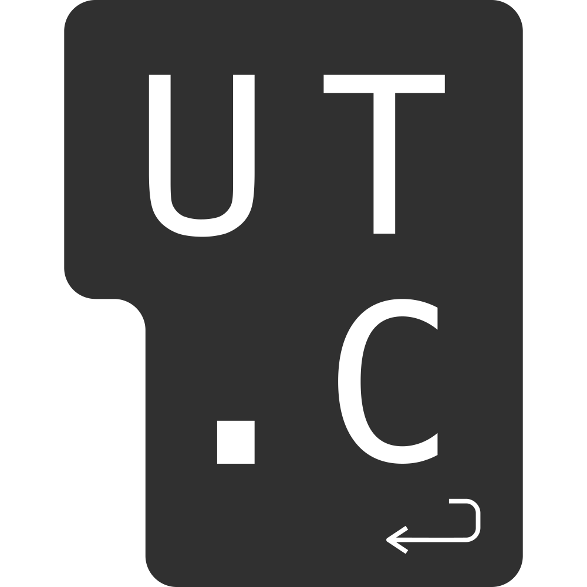

# ut.code(); Learn



[](https://mdxjs.com/)
[](https://github.com/prettier/prettier)


[English README is here.](./README-en.md)

ut.code(); Learn は、ut.code(); によって作られた Web 技術の学習教材です。[Docusaurus](https://docusaurus.io/) を用いて作られています。

## 目次

- [概要](#概要)
- [使い方](#使い方)
- [開発](#開発)
  - [要件](#要件)
  - [環境構築](#環境構築)
  - [開発用サーバーの起動](#開発用サーバーの起動)
  - [ディレクトリ構成](#ディレクトリ構成)
  - [カスタムコンポーネント](#カスタムコンポーネント)
  - [コミットの前に](#コミットの前に)
- [貢献](#貢献)

## 概要

ut.code(); Learn は、ut.code(); によって作られた Web 技術の学習教材です。
様々な Web に関する技術について学ぶことができます。

## 使い方

[https://learn.utcode.net/](https://learn.utcode.net/) にアクセスすれば、内容を見ることができます。

## 開発

### 要件

- [Node.js](https://nodejs.org/ja/)
- [npm](https://www.npmjs.com/)

### 環境構築

npm モジュールをインストールするために、次のコマンドをターミナルで実行してください。

```shell
npm ci
```

### 開発用サーバーの起動

次のコマンドを実行することで、開発用のサーバーが起動できます。また、ブラウザが自動で立ち上がり変更した内容をリアルタイムでプレビューできます。

```shell
npm start
```

### ディレクトリ構成

`docs` フォルダ下に作られたファイルは自動でホスティングされます。
`index.mdx` というファイルを編集することで、変更ができます。編集したい階層にある `index.mdx` ファイルを選んで編集してください。
`index.mdx` は Markdown を拡張した MDX という非常に簡単な形式で書かれています。

### カスタムコンポーネント

ut.code(); Learn では、次のカスタムコンポーネントが定義されています。

- Term - 用語にポップアップの説明を付ける
- Answer - 解答例を折りたたんで隠す
- ViewSource - GitHub と CodeSandbox で解答例を表示するボタンを表示する
- ExternalVideoPlayer - 動画プレイヤーを表示する

### コミットの前に

コミットの前に、

```shell
npm run format
```

でフォーマットして、

```shell
npm run build
```

でビルドが通ることを確認してください。

## ライセンス

ut.code(); Learn は [MIT license](https://github.com/ut-code/utcode-learn/blob/master/LICENSE) でライセンスされています。
Copyright © 2023 ut.code();.

## 貢献

Issue や Pull request などはいつでもお待ちしています。

## リリースについて

GitHub の Release を作成すると GitHub Pages にデプロイされます。
