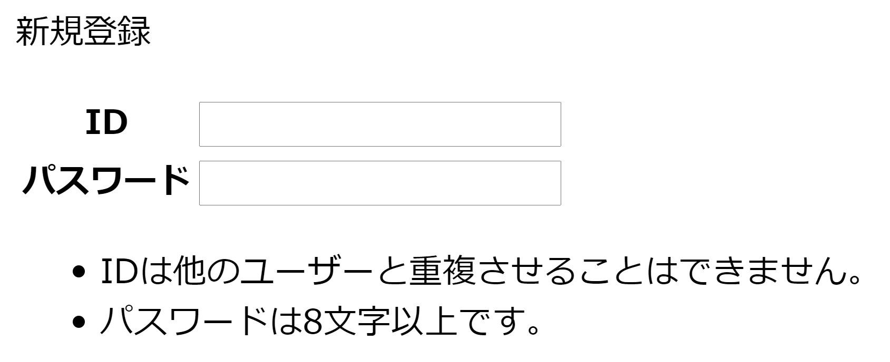

import Term from "@site/src/components/Term";
import ViewSource from "@site/src/components/ViewSource";
import createFileVideo from "./create-file.mp4";
import openInBrowserVideo from "./open-in-browser.mp4";
import showFileExtensionsVideo from "./show-file-extensions.mp4";
import reloadBrowserVideo from "./reload-browser.mp4";

Web 開発に必ず用いられる言語があります。<Term type="html" strong>HTML</Term> と CSS、そして JavaScript です。これらは互いに異なる役割をもっています。まずは最も基本となる <Term type="html">HTML</Term> から学んでいきましょう。


## <Term type="html">HTML</Term> を書き始める

VS Code の画面左端には、ファイル一覧が表示されています。新しいファイルを作成して、`index.html` と名付けましょう。ファイルの中身を次のようにした後、保存します。保存にはショートカットキー ( `command / Ctrl + S` ) を用いてください。

```html title="index.html"
<!doctype html>
<html lang="ja">
  <head>
    <meta charset="utf-8" />
    <title>Title</title>
  </head>
  <body>
    Hello <strong>World</strong>!
  </body>
</html>
```

<video src={createFileVideo} controls />

## ブラウザで <Term type="html">HTML</Term> ファイルを開く

前頁で作成したフォルダを開き、`index.html` が作成されていることを確認しましょう。このファイルをダブルクリックして開きます。`Hello World!` (`World`の部分だけ太字) が表示されましたか？

<video src={openInBrowserVideo} controls />

:::info 拡張子

VS Code 上で作成したファイルは `index.html` でした。しかしながら、Windows でフォルダの中身を見ると `index` しか表示されません（Mac の場合は正しく表示されます）。なぜでしょうか？

ファイル名の `.` (ピリオド) 以降の部分は<Term type="fileExtension" strong>拡張子</Term>と呼ばれ、ファイルの種類を識別するために用いられることが多いです。先ほど `index.html` という名前のファイルを作成したのは、<Term type="html">HTML</Term>ファイルであることを明示するためです。

実は Windows では、拡張子は標準で表示されません。下の動画を参考に、拡張子を表示する設定に変更しておきましょう。

<video src={showFileExtensionsVideo} controls />

:::

## <Term type="html">HTML</Term> の構造

それでは、先ほどのファイルの中身を見ていきましょう。

`<strong>World</strong>` の部分に注目してください。

<p><Term type="html">HTML</Term> ファイルは、文書に意味を持たせるために、<Term strong type="tag">タグ</Term>と呼ばれる構造を持つことができます。<Term type="tag">タグ</Term>は、<code>&lt;tag&gt;</code> のような、<code>&lt;</code>と<code>&gt;</code>で囲まれた英数字のまとまりです。</p>

<p><Term type="tag">タグ</Term>は、 <code>&lt;tag&gt;内容&lt;/tag&gt;</code> のように、<Term type="tag">タグ</Term>名の先頭にスラッシュを付けるか否かの区別により<Term strong type="startTag">開始タグ</Term>と<Term strong type="endTag">終了タグ</Term>に分かれ、内部にテキストや別のタグを挟み込むことができます。<Term type="startTag">開始タグ</Term>から<Term type="endTag">終了タグ</Term>までのまとまりを<Term strong type="element">要素</Term>といいます。</p>

`body` 要素の中身を書き換え、次のようにしてみましょう。

<!-- prettier-ignore -->
```html title="index.html"
<!doctype html>
<html lang="ja">
  <head>
    <meta charset="utf-8" />
    <title>Title</title>
  </head>
  <body>
    Hello <a href="https://www.google.com/"><strong>World</strong></a>!
  </body>
</html>
```

繰り返しになりますが、<Term type="html">HTML</Term> を編集したら、`command / Ctrl + S` キーを押してファイルを保存します。ファイル名の横に表示されている丸い記号が消えたら保存が完了しています。


:::tip ショートカットキー

ショートカットキーがうまく押せませんか？ `command / Ctrl + S` はよく、「`command (macOS)` または `Ctrl (Windows)` キーと `S` キーを同時に押す」と言われますが、実は同時に押すと半分くらいの確率で失敗します。`command / Ctrl` キーを押した後、キーから指を離す前に `S` キーを押しましょう。

ショートカットキーを使いこなせるようになると、パソコンの操作速度が飛躍的に上昇します。慣れている人がパソコンを操作しているのを見たら、ぜひ後ろから覗き込んでみましょう。便利そうなショートカットキーを使っている人がいたら身に着けるようにすると良いです。

:::

保存したら、ブラウザの更新ボタンを押して、ページを再読み込みします。

<video src={reloadBrowserVideo} autoPlay muted loop controls />

`<a href="https://www.google.com/">～</a>` は **a <Term type="element">要素</Term>** です。<Term type="startTag">開始タグ</Term>の中に `href="https://www.google.com/"` という部分があります。これが<Term strong type="attribute">属性</Term>です。<Term type="attribute">属性</Term>は、<Term type="startTag">開始タグ</Term> の中に `属性名="値"` のように記述され、<Term type="element">要素</Term>の特徴を表します。`a` <Term type="element">要素</Term>の **href <Term type="attribute">属性</Term>**は、ハイパーリンクのリンク先を表す<Term type="attribute">属性</Term>です。

これにより、ハイパーリンクが設定されます。この例では `a` <Term type="element">要素</Term>の中に `strong` <Term type="element">要素</Term>が含まれています。このように、HTML タグは<Term strong type="htmlNest">ネスト</Term>させることにより、効果を重ね掛けすることができます。


## <Term type="html">HTML</Term> の文法

それでは、作成した <Term type="html">HTML</Term> をもう一度見直してみましょう。

すべての <Term type="html">HTML</Term> ファイルは、

```html title="index.html"
<!doctype html>
```

という、「このファイルは <Term type="html">HTML</Term> ファイルだ！」と宣言する定型句から始まります。

続けて記述されるのは `<html lang="ja">` 、つまり **html <Term type="element">要素</Term>** です。<Term type="html">HTML</Term> は、この html <Term type="element">要素</Term>を根とした木構造になっています。このため、html <Term type="tag">タグ</Term>の閉じ<Term type="tag">タグ</Term>はファイルの末尾に現れます。

html <Term type="element">要素</Term>の直属の子<Term type="element">要素</Term>は、**head <Term type="element">要素</Term>**と**body <Term type="element">要素</Term>**の二つだけです。このうち、後者 (body <Term type="element">要素</Term>) が実際にブラウザの表示領域上に表示されることになります。


:::info

ブラウザの画面内に表示される情報を表すのは `body` <Term type="element">要素</Term>中だけなので、<Term type="html">HTML</Term> ファイルの編集は通常 `body` <Term type="element">要素</Term>内部が中心となります。このドキュメントでも、これ以降掲載する <Term type="html">HTML</Term> のサンプルコードは `body` <Term type="element">要素</Term>内部のみを記述することとします。

:::

## 課題 (時間が余った場合)

単一の HTML ファイルのみを使用して、下のようなフォームを作成してみましょう。いきなり飛躍した感がありますが、やることは単純で、ひたすら HTML タグを並べるのみです。



### ヒント

- `ID` や `パスワード` といった文字が表形式に並んでいます。`table` タグで実現できます。
- テキストボックスは `input` タグで作成できます。
- 最後の箇条書きには `ul` タグや `li` タグを使用しています。

### 解答例

<ViewSource url={import.meta.url} path="_samples/form" />
