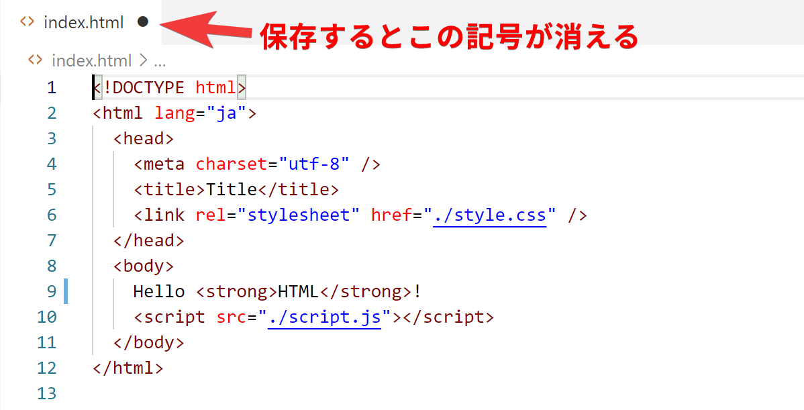
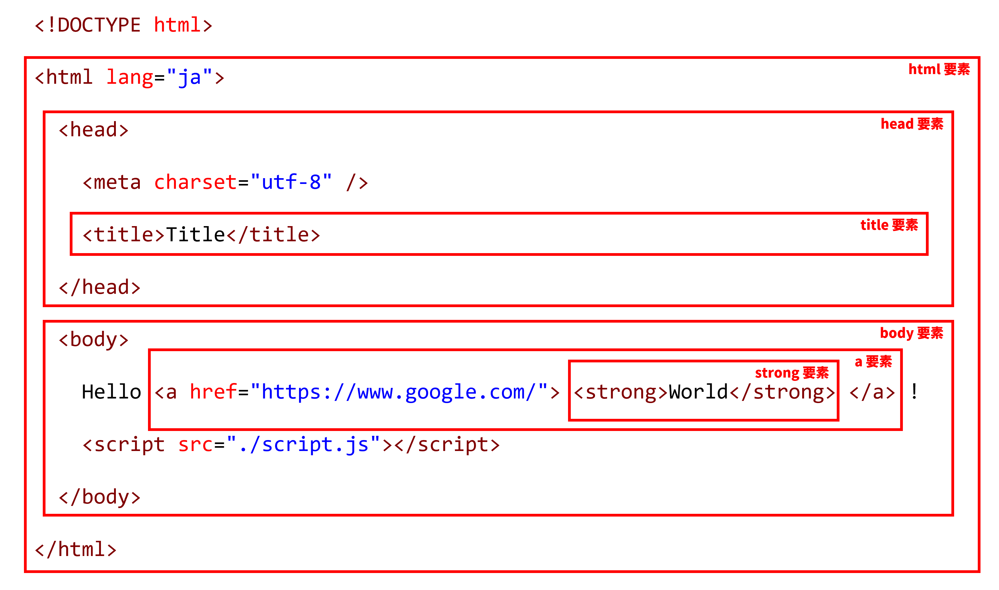
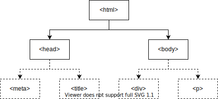
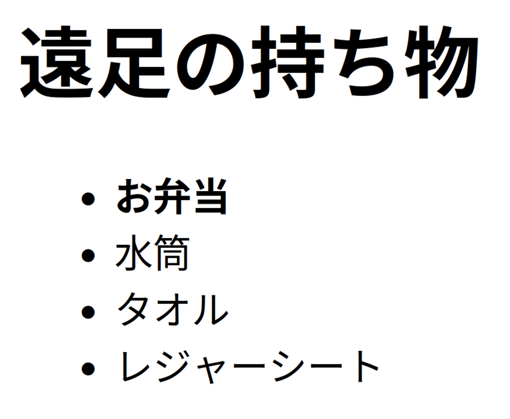
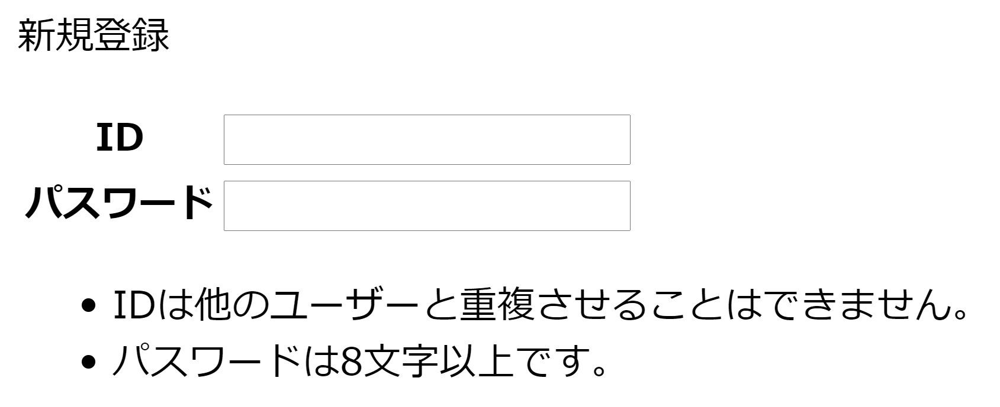

import createFileVideo from "./create-file.mp4";
import openInBrowserVideo from "./open-in-browser.mp4";
import showFileExtensionsVideo from "./show-file-extensions.mp4";
import reloadBrowserVideo from "./reload-browser.mp4";

Web 開発に必ず用いられる言語があります。<Term>**HTML**</Term> と CSS、そして JavaScript です。これらは互いに異なる役割をもっています。まずは最も基本となる <Term>HTML</Term> から学んでいきましょう。


## <Term>HTML</Term> を書き始める

VS Code の画面左端には、ファイル一覧が表示されています。新しいファイルを作成して、`index.html` と名付けましょう。ファイルの中身を次のようにした後、保存します。保存にはショートカットキー (<kbd>command</kbd> + <kbd>S</kbd> (macOS) / <kbd>Ctrl</kbd> + <kbd>S</kbd> (Windows) ) を用いてください。

```html title="index.html"
<!doctype html>
<html lang="ja">
  <head>
    <meta charset="utf-8" />
    <title>Title</title>
  </head>
  <body>
    Hello <strong>World</strong>!
  </body>
</html>
```

<video src={createFileVideo} controls />

## ブラウザで <Term>HTML</Term> ファイルを開く

前頁で作成したフォルダを開き、`index.html` が作成されていることを確認しましょう。このファイルをダブルクリックして開きます。`Hello World!` (`World` の部分だけ太字) が表示されましたか？

<video src={openInBrowserVideo} controls />

:::info[拡張子]

VS Code 上で作成したファイルは `index.html` でした。しかしながら、Windows でフォルダの中身を見ると `index` しか表示されません (macOS の場合は正しく表示されます)。なぜでしょうか？

ファイル名の `.` (ピリオド) 以降の部分は<Term>**拡張子**</Term>と呼ばれ、ファイルの種類を識別するために用いられることが多いです。先ほど `index.html` という名前のファイルを作成したのは、<Term>HTML</Term> ファイルであることを明示するためです。

実は Windows では、拡張子は標準で表示されません。下の動画を参考に、拡張子を表示する設定に変更しておきましょう。

<video src={showFileExtensionsVideo} controls />

:::

## <Term>HTML</Term> の構造

それでは、先ほどのファイルの中身を見ていきましょう。

`<strong>World</strong>` の部分に注目してください。

<Term>HTML</Term> ファイルは、文書に意味を持たせるために、<Term>**タグ**</Term>と呼ばれる構造を持つことができます。<Term>タグ</Term>は、`<tag>` のような、`<` と `>` で囲まれた英数字のまとまりです。

{/* prettier-ignore */}
<Term>タグ</Term>は、`<tag>内容</tag>` のように、<Term>タグ</Term>名の先頭にスラッシュを付けるか否かの区別により<Term>**開始タグ**</Term>と<Term>**終了タグ**</Term>に分かれ、内部にテキストや別のタグを挟み込むことができます。
<Term>開始タグ</Term>から<Term>終了タグ</Term>までのまとまりを<Term>**要素**</Term>といいます。

`body` 要素の中身を書き換え、次のようにしてみましょう。

{/* prettier-ignore */}
```html title="index.html"
<!doctype html>
<html lang="ja">
  <head>
    <meta charset="utf-8" />
    <title>Title</title>
  </head>
  <body>
    Hello <a href="https://www.google.com/"><strong>World</strong></a>!
  </body>
</html>
```

繰り返しになりますが、<Term>HTML</Term> を編集したら、<kbd>command</kbd> + <kbd>S</kbd> (macOS) / <kbd>Ctrl</kbd> + <kbd>S</kbd> (Windows) キーを押してファイルを保存します。ファイル名の横に表示されている丸い記号が消えたら保存が完了しています。



:::tip[ショートカットキー]

ショートカットキーがうまく押せませんか？<kbd>command</kbd> + <kbd>S</kbd> (macOS) / <kbd>Ctrl</kbd> + <kbd>S</kbd> (Windows) はよく、「<kbd>command</kbd> (macOS) または <kbd>Ctrl</kbd> (Windows) キーと <kbd>S</kbd> キーを同時に押す」と言われますが、実は同時に押すと半分くらいの確率で失敗します。<kbd>command</kbd> (macOS) / <kbd>Ctrl</kbd> (Windows) キーを押した後、キーから指を離す前に <kbd>S</kbd> キーを押しましょう。

ショートカットキーを使いこなせるようになると、パソコンの操作速度が飛躍的に上昇します。慣れている人がパソコンを操作しているのを見たら、ぜひ後ろから覗き込んでみましょう。便利そうなショートカットキーを使っている人がいたら身に付けるようにすると良いです。

:::

保存したら、ブラウザの更新ボタンを押して、ページを再読み込みします。

<video src={reloadBrowserVideo} muted controls />

`<a href="https://www.google.com/">～</a>` は **`a` <Term>要素</Term>** です。<Term>開始タグ</Term>の中に `href="https://www.google.com/"` という部分があります。これが<Term>**属性**</Term>です。<Term>属性</Term>は、<Term>開始タグ</Term> の中に `属性名="値"` のように記述され、<Term>要素</Term>の特徴を表します。`a` <Term>要素</Term>の **`href` <Term>属性</Term>** は、ハイパーリンクのリンク先を表す<Term>属性</Term>です。

これにより、ハイパーリンクが設定されます。この例では `a` <Term>要素</Term>の中に `strong` <Term>要素</Term>が含まれています。このように、HTML タグは<Term type="htmlNest">**ネスト**</Term>させることにより、効果を重ね掛けすることができます。



## <Term>HTML</Term> の文法

それでは、作成した <Term>HTML</Term> をもう一度見直してみましょう。

すべての <Term>HTML</Term> ファイルは、

```html title="index.html"
<!doctype html>
```

という、「このファイルは <Term>HTML</Term> ファイルだ！」と宣言する定型句から始まります。

続けて記述されるのは `<html lang="ja">`、つまり **`html` <Term>要素</Term>** です。<Term>HTML</Term> は、この `html` <Term>要素</Term>を根とした木構造になっています。このため、`html` <Term>タグ</Term>の閉じ<Term>タグ</Term>はファイルの末尾に現れます。

`html` <Term>要素</Term>の直属の子<Term>要素</Term>は、 **`head` <Term>要素</Term>** と **`body` <Term>要素</Term>** の二つだけです。このうち、後者 (`body` <Term>要素</Term>) が実際にブラウザの表示領域上に表示されることになります。



:::info

ブラウザの画面内に表示される情報を表すのは `body` <Term>要素</Term>中だけなので、<Term>HTML</Term> ファイルの編集は通常 `body` <Term>要素</Term>内部が中心となります。このドキュメントでも、これ以降掲載する <Term>HTML</Term> のサンプルコードは `body` <Term>要素</Term>内部のみを記述することとします。

:::

## 演習問題

### 問題 1

単一の HTML ファイルのみを使用して、下のような遠足の持ち物リストを作成してみましょう。お弁当は何よりも重要なので太字にしましょう。



:::info[ヒント]

- 「遠足の持ち物」という見出しがあります。`h1` タグについて調べてみてください。
- 箇条書きを表現するには、単に先頭に「・」と書くのではなく箇条書きを表すタグを用います。`ul` タグと `li` タグについて調べてみてください。

:::

<Answer title="遠足の持ち物リスト">

```html
<!doctype html>
<html lang="ja">
  <head>
    <meta charset="utf-8" />
    <title>遠足の持ち物リスト</title>
  </head>
  <body>
    <h1>遠足の持ち物</h1>
    <ul>
      <li><strong>お弁当</strong></li>
      <li>水筒</li>
      <li>タオル</li>
      <li>レジャーシート</li>
    </ul>
  </body>
</html>
```

<ViewSource url={import.meta.url} path="_samples/excursion" />

</Answer>

### 問題 2 (時間が余った場合)

下のようなフォームを作成してみましょう。いきなり飛躍した感がありますが、やることは単純で、ひたすら HTML タグを並べるのみです。



:::info[ヒント]

- `ID` や `パスワード` といった文字が表形式に並んでいます。`table` タグで実現できます。
- テキストボックスは `input` タグで作成できます。
- 最後の箇条書きには `ul` タグや `li` タグを使用しています。

:::

<Answer title="新規登録フォーム">

```html
<!doctype html>
<html lang="ja">
  <head>
    <meta charset="utf-8" />
    <title>新規登録</title>
  </head>
  <body>
    <p>新規登録</p>
    <table>
      <tr>
        <th>ID</th>
        <td><input type="text" /></td>
      </tr>
      <tr>
        <th>パスワード</th>
        <td><input type="password" /></td>
      </tr>
    </table>
    <ul>
      <li>IDは他のユーザーと重複させることはできません。</li>
      <li>パスワードは8文字以上です。</li>
    </ul>
  </body>
</html>
```

<ViewSource url={import.meta.url} path="_samples/form" />

</Answer>
