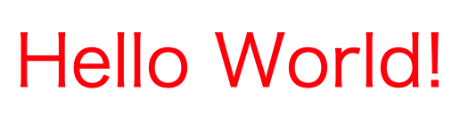
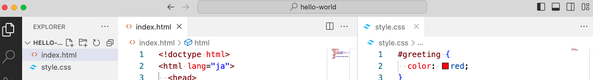
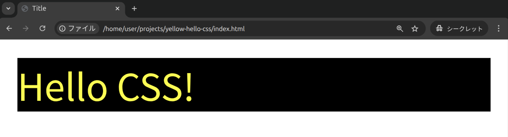
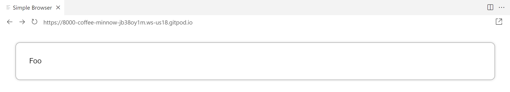

import yellowHelloCssHtml from "!!raw-loader!./_samples/yellow-hello-css/index.html";
import yellowHelloCssCss from "!!raw-loader!./_samples/yellow-hello-css/style.css";
import fooHtml from "!!raw-loader!./_samples/foo/index.html";
import fooCss from "!!raw-loader!./_samples/foo/style.css";

この節では、Web開発で用いられるもう一つの言語である、CSSについて学びます。CSSはWebサイトの「見た目」をつかさどる言語です。多くの<Term>HTML要素</Term>は、<Term>CSS</Term>を用いることで、その見た目を細かくカスタマイズすることができます。


## `style`属性

{/* prettier-ignore */}
<Term>**`style`属性**</Term>は、全ての<Term>HTML要素</Term>に対して定義されている、<Term>CSS</Term>を記述するための属性です。次の例では、`div`要素の`style`属性に<Term>CSS</Term>を指定して、文字色を赤色にしています。

```html title="index.html"
<div style="color: red; font-size: 24px;">Hello World!</div>
```



{/* prettier-ignore */}
<Term>`style`属性</Term>には、<Term type="cssProperty">**プロパティ**</Term>と呼ばれるスタイルの種類と、その値を、コロン記号で繋いだ形式で記述します。また、複数のプロパティを指定する場合は、セミコロンで区切ります。

この例では、`color`という<Term type="cssProperty">プロパティ</Term>に`red`という値を設定し、`font-size`という<Term type="cssProperty">プロパティ</Term>に`24px`という値を設定しています。これにより、`Hello World!`という文字列が、赤色で、24ピクセルの大きさで表示されます。

:::tip[`div`要素]

[`div`要素](https://developer.mozilla.org/ja/docs/Web/HTML/Element/div)はそれ単体では特に意味を持たず、囲った範囲を要素としてまとめるために使われます。

:::

## 構造とスタイルの分離

{/* prettier-ignore */}
<Term>`style`属性</Term>を用いて<Term>CSS</Term>を記述する方法は簡単ですが、<Term>CSS</Term>を必要とする要素が増えるにつれ、管理が難しくなってきます。<Term>CSS</Term>を<Term>HTML</Term>から分離し、見た目と構造を分離して記述することで、この負担を軽減することができます。

{/* prettier-ignore */}
<Term>HTML</Term>ファイルから独立して<Term>CSS</Term>ファイルを作成する場合、拡張子として`.css`を指定することが一般的です。`index.html`に加えて、`style.css`を作成しましょう。次の例では、`Hello World!`を赤色にしています。



```html title="index.html"
<!doctype html>
<html lang="ja">
  <head>
    <meta charset="utf-8" />
    <link rel="stylesheet" href="./style.css" />
    <title>Title</title>
  </head>
  <body>
    <div id="greeting">Hello World!</div>
  </body>
</html>
```

```css title="style.css"
#greeting {
  color: red;
}
```

### `link`要素

```html title="index.html"
<link rel="stylesheet" href="./style.css" />
```

`link`要素を使用すると、HTMLファイルと外部のCSSファイルが結び付けられ、ブラウザは、HTMLファイルを表示する際に、指定されたCSSファイルに記述されたスタイルを適用します。`link`要素は、`head`要素の中に記述します。

### セレクタとID

HTMLファイルとCSSファイルを分けて作成する場合、`style`属性を用いる場合とは異なり、どのスタイルを、どの要素に設定するのかを紐づけるための情報が必要です。

{/* prettier-ignore */}
<Term>HTML要素</Term>の`id`属性は、ひとつのHTML要素を、同じファイル内で一意に識別するための値を指定する属性で、CSSからHTML要素を探す際によく用いられます。`id`属性の値は、別の要素間で重複させることはできません。

**セレクタ**は、CSSを記述する際に、スタイルが適用するHTML要素の条件を指定するための構文です。この例では、`style.css`の1行目の`#greeting`がセレクタで、「`id`属性が`greeting`である要素」を示しています。


`id`属性と似た使い方ができる属性として、`class`属性があります。この属性は、`id`属性と異なり、複数の要素に同じ値を持たせることができます。

| セレクタ   | 意味                                 |
| ---------- | ------------------------------------ |
| `#element` | `id`属性が`element`である要素        |
| `.element` | `class`属性に`element`が含まれる要素 |
| `element`  | タグ名が`element`である要素          |

:::info[高度なセレクタ]

セレクタをスペースで区切ると子孫要素、`>`で区切ると直属の子要素を表すことができます。そのまま繋げばand条件とみなされます。

| セレクタ         | 意味                                                                     |
| ---------------- | ------------------------------------------------------------------------ |
| `div.element`    | `class`属性に`element`が含まれる`div`要素                                |
| `#parent .child` | `id`属性が`parent`である要素の子孫の、`class`属性に`child`が含まれる要素 |
| `#parent > div`  | `id`属性が`parent`である要素の直属の子の`div`要素                        |

セレクタを上手に活用すると、変更に強くて柔軟なCSSを作成することができます。

:::

## 演習問題1

下のような、文字色が黄色、背景色が好きな色 (この例では黒) の`Hello CSS!`をブラウザで表示してみましょう。使用するプロパティは`color`、`background-color`です。`style`属性を用いる方法と、CSSファイルを用いる方法の両方で試してみましょう。



<Answer title="Hello CSS!">

```html title="index.html"
<!doctype html>
<html lang="ja">
  <head>
    <meta charset="utf-8" />
    <link rel="stylesheet" href="./style.css" />
    <title>Title</title>
  </head>
  <body>
    <div style="color: yellow; background-color: black">Hello CSS!</div>
  </body>
</html>
```

<Sandpack
  template="static"
  files={{
    "/index.html": yellowHelloCssHtml,
    "/style.css": yellowHelloCssCss,
  }}
  options={{
    activeFile: "/style.css",
  }}
/>
</Answer>

## 演習問題2

次のような条件を満たす要素を選択するセレクタは何でしょうか。

1. `id`属性が`foo`の要素
2. `class`属性に`bar`が含まれる要素の子孫の要素のうち、`button`要素であるもの

<Answer title="セレクタ">

1. `#foo`
2. `.bar button`

</Answer>

## 演習問題3（発展）

画像のようなシンプルなボックスを作ってみましょう。



シンプルで、よく見かけるデザインですが、様々な指定が必要であることが分かります。次のような点に注意してデザインしてみてください。

- グレーの枠線が付いています (border)
- 枠線は角丸になっています (border-radius)
- 枠線の外側に余白があります (margin)
- 枠線の内側にも余白があります (padding)
- ボックスに影がついています (box-shadow)

<Answer title="シンプルなボックス">

```html title="index.html"
<!doctype html>
<html lang="ja">
  <head>
    <meta charset="utf-8" />
    <link rel="stylesheet" href="./style.css" />
    <title>Title</title>
  </head>
  <body>
    <div id="foo">Foo</div>
  </body>
</html>
```

```css title="style.css"
#foo {
  border: 1px solid #aaa;
  border-radius: 10px;
  margin: 30px;
  padding: 30px;
  box-shadow: 0px 0px 2px 1px #aaa;
}
```

<Sandpack
  template="static"
  files={{
    "/index.html": fooHtml,
    "/style.css": fooCss,
  }}
  options={{
    activeFile: "/style.css",
  }}
/>

</Answer>
