## <Term>論理値</Term>

{/* prettier-ignore */}
<Term>JavaScript</Term> で利用できる「<Term>値</Term>」として、これまで<Term>文字列</Term>と<Term>数値</Term>を扱いました。
JavaScript ではこの他に、<Term>**論理値**</Term>と呼ばれる、「正しいか、正しくないか」を表すための<Term>値</Term>が存在します。

{/* prettier-ignore */}
<Term>論理値</Term>は、`true`（真）または `false`（偽）の 2 つだけです。ダブルクォーテーション `"` は必要ありません。通常の<Term>値</Term>ですので、<Term>変数</Term>に<Term>代入</Term>したり、計算に使ったりすることができます。



## 論理<Term>演算子</Term>

{/* prettier-ignore */}
<Term>論理値</Term>に対して適用できる<Term>演算子</Term>が存在します。

```javascript
const isMonsterBig = true;
const isMonsterSmall = !true; // false
const isHunterStrong = false;
const shouldEscape = !isHunterStrong && isMonsterBig; // true
const shouldFight = isHunterStrong || isMonsterSmall; // false
```

詳細は以下の通りです。`!` のみが作用する対象を 1 つしかとらないことに注意してください。

| 演算子 | 意味       | 詳細                                                                |
| ------ | ---------- | ------------------------------------------------------------------- |
| `!`    | ～ではない | `true` ならば `false`、`false` ならば `true`                        |
| `&&`   | かつ       | 両方 `true` ならば `true`、どちらか 1 つでも `false` ならば `false` |
| `\|\|` | または     | 両方 `false` ならば `false`、どちらか 1 つでも `true` ならば `true` |

## 比較<Term>演算子</Term>

比較<Term>演算子</Term>は、複数の<Term>値</Term>を比較して、単一の<Term>論理値</Term>を得ます。

```javascript
const age = 15;
const height = 155;
const isFourteen = age === 14; // false
const isNotFourteen = age !== 14; // true
const isChild = age < 20; // true
const canRideRollerCoasters = age >= 10 && height >= 140; // true
```

各<Term>演算子</Term>の詳細は、次の通りです。

| 演算子 | 意味       | 詳細                            |
| ------ | ---------- | ------------------------------- |
| `===`  | 等しい     |                                 |
| `!==`  | 等しくない |                                 |
| `<`    | 小なり     | 左辺が右辺より小さければ `true` |
| `<=`   | 以下       | 左辺が右辺以下ならば `true`     |
| `>`    | 大なり     | 左辺が右辺より大きければ `true` |
| `>=`   | 以上       | 左辺が右辺以上ならば `true`     |

`&&` や `||` よりも比較<Term>演算子</Term>の方が<Term type="javascriptOperatorPriority">優先順位</Term>が高いため、最後の例のように複数の条件を「かつ」「または」などで組み合わせることは容易です。

## 課題

次のコードは何を表示するでしょうか。そしてそれはなぜでしょうか。

{/* prettier-ignore */}
```javascript
let takaoHeight = 599;
let everestHeight = 8849;
let fujiHeight = 3776;
document.write(takaoHeight < everestHeight < fujiHeight);
document.write(takaoHeight = everestHeight);
```

<ViewSource url={import.meta.url} path="_samples/weird-comparison" />

- JavaScript で、数値と論理値に比較<Term>演算子</Term>を適用すると、`true` は `1` として、`false` は `0` として比較されます。
- `=` は代入演算子です。代入<Term>演算子</Term>の<Term>式</Term>が<Term>評価</Term>されると、右辺の<Term>値</Term>になります。
