import quizShowHtml from "!!raw-loader!./_samples/quiz-show/index.html";
import quizShowJs from "!!raw-loader!./_samples/quiz-show/script.js";

## <Term>論理値</Term>

{/* prettier-ignore */}
<Term>JavaScript</Term>で利用できる「<Term>値</Term>」として、これまで<Term>文字列</Term>と<Term>数値</Term>を扱いました。JavaScriptではこの他に、<Term>**論理値**</Term>と呼ばれる、「正しいか、正しくないか」を表すための<Term>値</Term>が存在します。

{/* prettier-ignore */}
<Term>論理値</Term>は、`true`（真）または`false`（偽）の2つだけです。ダブルクォーテーション`"`は必要ありません。通常の<Term>値</Term>ですので、<Term>変数</Term>に<Term>代入</Term>したり、計算に使ったりすることができます。



## 論理<Term>演算子</Term>

{/* prettier-ignore */}
<Term>論理値</Term>に対して適用できる<Term>演算子</Term>が存在します。

```javascript
document.write(true); // true
document.write(!false); // true
document.write(true && false); // false
document.write(true || false); // true
```

各<Term>演算子</Term>の意味は次の通りです。`!`のみが作用する対象を1つしかとらないことに注意してください。

| 演算子 | 意味       | 詳細                                                        |
| ------ | ---------- | ----------------------------------------------------------- |
| `!`    | ～ではない | `true`ならば`false`、`false`ならば`true`                    |
| `&&`   | かつ       | 両方`true`ならば`true`、どちらか1つでも`false`ならば`false` |
| `\|\|` | または     | 両方`false`ならば`false`、どちらか1つでも`true`ならば`true` |

具体的な使用例を考えてみましょう。

モンスターが大きいかどうかを表す<Term>変数</Term>`isMonsterBig`と、ハンターが強いかどうかを表す<Term>変数</Term>`isHunterStrong`が用意されています。このとき、ハンターがモンスターと戦うべきかどうかを表す<Term>変数</Term>`shouldFight`を作りたいとします。ハンターは自分が強いときかモンスターが小さいときに戦うべきだとしたら、<Term>変数</Term>`shouldFight`は次のようになるでしょう。

```javascript
const isMonsterBig = true;
const isHunterStrong = false;
const shouldFight = isHunterStrong || !isMonsterBig; // false
```

## 比較<Term>演算子</Term>

比較<Term>演算子</Term>は、複数の<Term>値</Term>を比較して、単一の<Term>論理値</Term>を得ます。

年齢を判定するプログラムを考えましょう。

```javascript showLineNumbers
const age = 14;
document.write(age === 15); // false
document.write(age === 14); // true
```

`===`は左辺と右辺が等しいかどうか判定する比較<Term>演算子</Term>です。2行目では`age`と15とは等しくないので`false`が、3行目では`age`と14とは等しいので`true`が表示されます。

各<Term>演算子</Term>の意味は次の通りです。

| 演算子 | 意味       | 詳細                           |
| ------ | ---------- | ------------------------------ |
| `===`  | 等しい     | 左辺と右辺が等しければ`true`   |
| `!==`  | 等しくない | 左辺と右辺が等しければ`false`  |
| `<`    | 小なり     | 左辺が右辺より小さければ`true` |
| `<=`   | 以下       | 左辺が右辺以下ならば`true`     |
| `>`    | 大なり     | 左辺が右辺より大きければ`true` |
| `>=`   | 以上       | 左辺が右辺以上ならば`true`     |

さらに具体的な使用例を考えてみましょう。

ジェットコースターに乗れるかどうかを表す変数`canRideRollerCoasters`を考えます。年齢を表す変数`age`と身長を表す変数`height`が与えられたとして、10歳以上かつ身長が120cm以上でないと乗れないとしたら以下のようになるでしょう。

```javascript
const age = 15;
const height = 155;
const canRideRollerCoasters = age >= 10 && height >= 120; // true
```

`&&`や`||`よりも比較<Term>演算子</Term>の方が<Term type="javascriptOperatorPriority">優先順位</Term>が高いため、複数の条件を「かつ」「または」などで組み合わせることは容易です。

:::info

次のコードは何を表示するでしょうか。そしてそれはなぜでしょうか。

{/* prettier-ignore */}
```javascript
let takaoHeight = 599;
let everestHeight = 8849;
let fujiHeight = 3776;
document.write(takaoHeight < everestHeight < fujiHeight);
document.write(takaoHeight = everestHeight);
```

<ViewSource url={import.meta.url} path="_samples/weird-comparison" />

- JavaScript で、数値と論理値に比較<Term>演算子</Term>を適用すると、`true`は`1`として、`false`は`0`として比較されます。
- `=`は代入演算子です。代入<Term>演算子</Term>の<Term>式</Term>が<Term>評価</Term>されると、右辺の<Term>値</Term>になります。

:::

## 演習問題

クイズ番組で田中さんと佐藤さんが戦っています。田中さんの点数が`tanakaScore`で、佐藤さんの点数が`satoScore`で用意されています。

点数が100点以上で、かつ相手より20点以上高い点数の場合に勝ちとします。田中さんが勝ちかどうかを表す変数`isTanakaWinner`を作成してください。

```javascript
const tanakaScore = 120;
const satoScore = 80;
const isTanakaWinner = /* ここに式を書いてください */;
document.write(isTanakaWinner); // true
```

:::tip

`+`, `-`, `*`, `/`などの算術演算子は、比較演算子よりも<Term type="javascriptOperatorPriority">優先順位</Term>が高いです。

```javascript
const isBig = 10 + 5 > 10 - 3; // 15 > 7 なので true
```

:::

<Answer title="クイズ番組">

```javascript
const tanakaScore = 120;
const satoScore = 80;
const isTanakaWinner = tanakaScore >= 100 && tanakaScore - satoScore >= 20;
document.write(isTanakaWinner); // true
```

<Sandpack
  template="static"
  files={{
    "/index.html": quizShowHtml,
    "/script.js": quizShowJs,
  }}
  options={{
    activeFile: "/script.js",
  }}
/>

</Answer>
