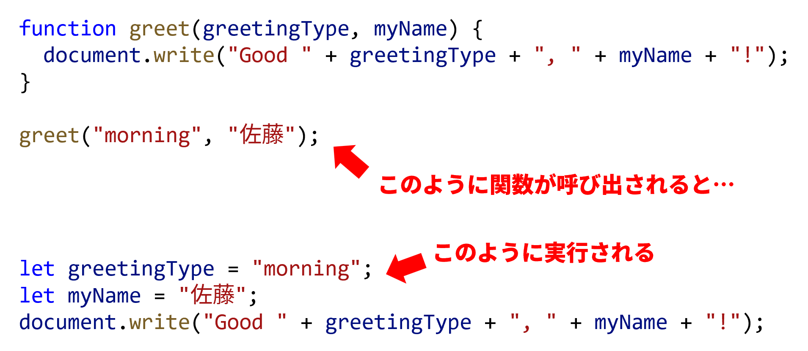

import Term from "@site/src/components/Term";
import Answer from "@site/src/components/Answer";
import ViewSource from "@site/src/components/ViewSource";
import returnValueVideo from "./return-value.mp4";

## 処理の共通化

数学における関数は、数と数の関係のようなものですが、<Term type="javascript">JavaScript</Term> をはじめとしたプログラミング言語の文脈における<Term strong type="javascriptFunction">関数</Term>は、基本的には<Term type="javascriptStatement">文</Term>のまとまりに名前を付けたものです。

```javascript
// 関数を定義しておけば
function greet() {
  document.write("Hello World!");
}

// 後から呼び出すことができる
greet();
greet();
```

上のプログラムにおいて、`function` キーワードから始まる部分は<Term type="javascriptFunction">関数</Term>を定義するための<Term type="javascriptControlFlow">制御構文</Term>です。<Term type="javascriptFunction">関数</Term>定義では、 `function` キーワードに続けて<Term type="javascriptFunction">関数</Term>名、かっこを記述します。この後、<Term type="javascriptFunction">関数</Term>内で実行したい処理を波かっこの中に記述していきます。

<p><Term type="javascriptFunction">関数</Term>を定義すると、<Term type="javascriptFunction">関数</Term>名に続けてかっこを記述することにより、その<Term type="javascriptFunction">関数</Term>を実行できるようになります。</p>

このプログラムでは、 `greet` <Term type="javascriptFunction">関数</Term>が 2 回呼び出されているので、ブラウザに `Hello World!` が 2 つ表示されます。

## <Term strong type="javascriptParameter">引数</Term>

<p><Term type="javascriptFunction">関数</Term>の振る舞いを呼び出し時に変更するため、<Term type="javascriptFunction">関数</Term>に<Term strong type="javascriptParameter">引数</Term>を与えることができます。<Term type="javascriptParameter">引数</Term>には任意の<Term type="javascriptValue">値</Term>が指定できます。</p>

```javascript
function greet(greetingType, myName) {
  document.write("Good " + greetingType + ", " + myName + "!");
}

greet("morning", "佐藤");
```

<p><Term type="javascriptFunction">関数</Term>定義では、<Term type="javascriptFunction">関数</Term>名直後のかっこ内に<Term type="javascriptParameter">引数</Term>名をコンマ区切りで設定できます。上のプログラムで <code>greet</code> <Term type="javascriptFunction">関数</Term>は、 <code>greetingType</code> や <code>myName</code> という名前の<Term type="javascriptParameter">引数</Term>をとります。<Term type="javascriptFunction">関数</Term>定義の中では、これらは<Term type="javascriptVariable">変数</Term>のように振舞います。</p>

呼び出し側では、括弧の中に<Term type="javascriptFunction">関数</Term>に<Term type="javascriptPass">渡す</Term><Term type="javascriptParameter">引数</Term>を指定します。このプログラムを実行すると、ブラウザに `Good morning, 佐藤!` が表示されるでしょう。



## <Term type="javascriptReturnValue">戻り値</Term>

<p><Term type="javascriptFunction">関数</Term>呼び出しは<Term type="javascriptExpression">式</Term>の一種です。<Term type="javascriptFunction">関数</Term>定義内で <strong>return 文</strong> を用いると、<Term type="javascriptFunction">関数</Term>の実行が停止され、<Term type="javascriptFunction">関数</Term>呼び出し<Term type="javascriptExpression">式</Term>の<Term type="javascriptEvaluation">評価</Term>結果が確定します。この値を<Term strong type="javascriptReturnValue">戻り値</Term>と呼びます。ある<Term type="javascriptValue">値</Term>を<Term type="javascriptReturnValue">戻り値</Term>として設定して<Term type="javascriptFunction">関数</Term>の実行を終了することを、<Term type="javascriptFunction">関数</Term>がその<Term type="javascriptValue">値</Term>を<Term strong type="javascriptReturn">返す</Term>と表現します。</p>

```javascript
function add(a, b) {
  const sum = a + b;
  return sum;
}

document.write(add(3, 4));
```

上の例の 6 行目で、<Term type="javascriptExpression">式</Term> `add(3, 4)` が<Term type="javascriptEvaluation">評価</Term>されると、 `a = 3, b = 4` として `add` <Term type="javascriptFunction">関数</Term>が実行されます。`add`<Term type="javascript">関数</Term>の中で<Term type="javascriptStatement">文</Term> `const sum = a + b;` が実行されると、<Term type="javascriptExpression">式</Term> `a + b` が<Term type="javascriptEvaluation">評価</Term>され、`7` になります。これにより、`sum` に`7`が代入されます。
次の行 `return sum;` で `add` <Term type="javascriptFunction">関数</Term>は <Term type="javascriptVariable">変数</Term> `sum` を<Term type="javascriptEvaluation">評価</Term>した結果である、`7` を<Term type="javascriptReturn">返します。</Term>
そして<Term type="javascriptExpression">式</Term> `add(3, 4)` の<Term type="javascriptEvaluation">評価</Term>結果が `7` となります。

<video src={returnValueVideo} controls autoPlay muted loop />

:::tip
**return 文** が実行された時点で<Term type="javascriptFunction">関数</Term>の処理が終了するため、次のように書くことで [if ~ else 文](../if-statement/#if--else) や [&& (AND) 演算子](../boolean/#論理演算子)の繰り返しを避けつつ、複数の条件のついた処理を実行することができます。

```javascript
let age = 21;
let hasDriverLicense = true;
let isDrunk = true;
function tryToDrive() {
  // if 文で実行する式が一行だけの場合、{} を省略できます。
  if (age < 18) return;
  if (!hasDriverLicense) return;
  if (isDrunk) return;
  document.write("車を運転できます。");
}
```

:::

## <Term type="javascriptVariable">変数</Term>の<Term type="javascriptScope">スコープ</Term>

<p><Term type="javascriptFunction">関数</Term>内で<Term type="javascriptDeclaration">宣言</Term>された<Term type="javascriptVariable">変数</Term>は、<Term type="javascriptFunction">関数</Term>内でのみ有効です。<Term type="javascriptVariable">変数</Term>が有効な範囲のことを、その<Term type="javascriptVariable">変数</Term>の<Term type="javascriptScope" strong>スコープ</Term>と呼んでいます。</p>

<p><Term type="javascriptFunction">関数</Term>外で<Term type="javascriptDeclaration">宣言</Term>された<Term type="javascriptVariable">変数</Term>は<Term type="javascriptFunction">関数</Term>内でも利用できます。</p>

```javascript
let guestCount = 0;

function greet() {
  guestCount += 1;
  document.write("あなたは" + guestCount + "人目のお客様です。");
}

greet();
greet();
```

この例における、`greet` <Term type="javascriptFunction">関数</Term>は、呼び出されるたびに `guestCount` に 1 を加えています。

:::caution <Term type="javascriptVariable">変数</Term>の<Term type="javascriptScope" strong>スコープ</Term>

<p><Term type="javascriptScope">スコープ</Term>が終わった<Term type="javascriptVariable">変数</Term>は、その時点で破棄されます。</p>

```javascript
let outer = 0;

function increment() {
  let inner = 0;
  outer += 1;
  inner += 1;
  document.write(outer); // 1ずつ増える
  document.write(inner); // 常に1
}

increment();
increment();
```

:::

## パーツに分割する

複雑な操作を複数の <Term type="javascriptFunction">関数</Term> ブロックに分解することで、コードの可読性を上げることができます。この操作を <Term strong type="javascriptModularization">モジュール化</Term> と呼びます。
パーツに分割すると、次のようなメリットがあります。

- ブロックあたりのコードが短くなるので、読みやすい
- パーツごとにテストができるので、デバッグがしやすい
- 汎用性のあるパーツなら、使いまわしができる

以下の例では、階段を表示する操作の中の、文字列を繰り返す操作を `repeat` 関数というパーツに分けています。

```javascript
const stringToRepeat = "☆";
for (let i = 0; i < 10; i += 1) {
  let result = "";
  for (let j = 0; j < i; j += 1) {
    result += stringToRepeat;
  }
  document.write(result);
  document.write("<br>");
}
```

```javascript
function repeat(stringToRepeat, count) {
  let result = "";
  for (let j = 0; j < count; j += 1) {
    result += stringToRepeat;
  }
  return result;
}

for (let i = 0; i < 10; i += 1) {
  document.write(repeat("☆", i));
  document.write("<br>");
}
```

---

## 基礎課題

### 最大値

<p><Term type="javascriptParameter">引数</Term>を 2 つとり、そのうち大きい数を<Term type="javascriptReturn">返す</Term><Term type="javascriptFunction">関数</Term> <code>max</code> を定義してください。</p>

:::tip

<p><Term type="javascriptIfStatement">if 文</Term>を使って、<code>a</code> が大きい場合と <code>b</code> が大きい場合で処理を書き分けます。</p>
:::

<Answer>

```javascript
function max(a, b) {
  if (a > b) {
    return a;
  } else {
    return b;
  }
}
```

<ViewSource url={import.meta.url} path="_samples/max" />

:::note

`a > b` が `true` の場合、if 文内部の `return` で関数実行が中断されるため、`else` キーワードは必ずしも必要ではありません。そのため、次のように書くこともできます。

```javascript
function max(a, b) {
  if (a > b) {
    return a;
  }
  return b;
}
```

<ViewSource url={import.meta.url} path="_samples/max-no-else" />

:::

</Answer>

## 中級課題

### 携帯電話料金

携帯電話料金を計算する<Term type="javascriptFunction">関数</Term>を作ってみましょう。

```javascript
function calculateCost(monthlyDataUsage) {
  // ここに処理を書く
}

document.write(calculateCost(3.5));
```

`calculateCost` は、<Term type="javascriptParameter">引数</Term>に月間転送量 `monthlyDataUsage` を取り、その月の携帯電話料金を<Term type="javascriptReturnValue">戻り値</Term>として<Term type="javascriptReturn">返す</Term><Term type="javascriptFunction">関数</Term>です。携帯電話料金は、下のルールで決定されるとします。

> - 月間転送量 < 5.0 (GB) のとき、携帯電話料金は 月間転送量 × 600 (円/GB)
> - 月間転送量 >= 5.0 (GB) のとき、携帯電話料金は 3000 (円)

<Answer>

```javascript
function calculateCost(monthlyDataUsage) {
  if (monthlyDataUsage < 5.0) {
    return monthlyDataUsage * 600;
  }
  return 3000;
}

document.write(calculateCost(3.5));
```

<ViewSource url={import.meta.url} path="_samples/mobile-phone-bill" />

</Answer>
