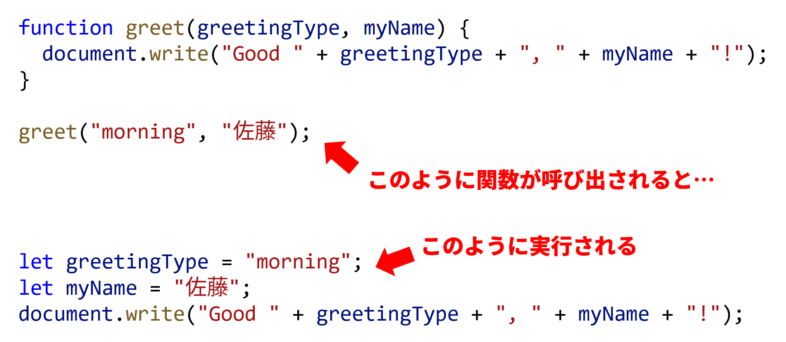

import returnValueVideo from "./return-value.mp4";
import multiplyHtml from "!!raw-loader!./_samples/multiply/index.html";
import multiplyJs from "!!raw-loader!./_samples/multiply/script.js";
import maxHtml from "!!raw-loader!./_samples/max/index.html";
import maxJs from "!!raw-loader!./_samples/max/script.js";
import mobilePhoneBillHtml from "!!raw-loader!./_samples/mobile-phone-bill/index.html";
import mobilePhoneBillJs from "!!raw-loader!./_samples/mobile-phone-bill/script.js";

## 処理の共通化

数学における関数は、数と数の関係のようなものですが、<Term>JavaScript</Term>をはじめとしたプログラミング言語の文脈における<Term>**関数**</Term>は、基本的には<Term>文</Term>のまとまりに名前を付けたものです。

```javascript
// 関数を定義しておけば
function greet() {
  document.write("Hello World!");
}

// 後から呼び出すことができる
greet();
greet();
```

上のプログラムにおいて、`function`キーワードから始まる部分は<Term>関数</Term>を定義するための<Term>制御構文</Term>です。<Term>関数</Term>定義では、`function`キーワードに続けて<Term>関数</Term>名、かっこを記述します。この後、<Term>関数</Term>内で実行したい処理を波かっこの中に記述していきます。

{/* prettier-ignore */}
<Term>関数</Term>を定義すると、<Term>関数</Term>名に続けてかっこを記述することにより、その<Term>関数</Term>を実行できるようになります。

このプログラムでは、`greet`<Term>関数</Term>が2回呼び出されているので、ブラウザに`Hello World!`が2つ表示されます。

## <Term>**引数**</Term>

{/* prettier-ignore */}
<Term>関数</Term>の振る舞いを呼び出し時に変更するため、<Term>関数</Term>に<Term>**引数**</Term>を与えることができます。<Term>引数</Term>には任意の<Term>値</Term>が指定できます。

```javascript
function greet(greetingType, myName) {
  document.write("Good " + greetingType + ", " + myName + "!");
}

greet("morning", "佐藤");
```

{/* prettier-ignore */}
<Term>関数</Term>定義では、<Term>関数</Term>名直後のかっこ内に<Term>引数</Term>名をコンマ区切りで設定できます。上のプログラムで`greet`<Term>関数</Term>は、`greetingType`や`myName`という名前の<Term>引数</Term>をとります。<Term>関数</Term>定義の中では、これらは<Term>変数</Term>のように振舞います。

呼び出し側では、括弧の中に<Term>関数</Term>に<Term>渡す</Term><Term>引数</Term>を指定します。このプログラムを実行すると、ブラウザに`Good morning, 佐藤!`が表示されるでしょう。



## <Term>戻り値</Term>

{/* prettier-ignore */}
<Term>関数</Term>呼び出しは<Term>式</Term>の一種です。<Term>関数</Term>定義内で**return文**を用いると、<Term>関数</Term>の実行が停止され、<Term>関数</Term>呼び出し<Term>式</Term>の<Term>評価</Term>結果が確定します。この値を<Term>**戻り値**</Term>と呼びます。ある<Term>値</Term>を<Term>戻り値</Term>として設定して<Term>関数</Term>の実行を終了することを、<Term>関数</Term>がその<Term>値</Term>を<Term>**返す**</Term>と表現します。

```javascript
function add(a, b) {
  const sum = a + b;
  return sum;
}

document.write(add(3, 4));
```

上の例の6行目で、<Term>式</Term>`add(3, 4)`が<Term>評価</Term>されると、`a = 3, b = 4`として`add`<Term>関数</Term>が実行されます。`add`<Term>関数</Term>の中で<Term>文</Term>`const sum = a + b;`が実行されると、<Term>式</Term>`a + b`が<Term>評価</Term>され、`7`になります。これにより、`sum`に`7`が代入されます。次の行`return sum;`で`add`<Term>関数</Term>は<Term>変数</Term>`sum`を<Term>評価</Term>した結果である、`7`を<Term>返し</Term>ます。そして<Term>式</Term>`add(3, 4)`の<Term>評価</Term>結果が`7`となります。

<video src={returnValueVideo} controls muted />

:::tip
**return文**が実行された時点で<Term>関数</Term>の処理が終了するため、次のように書くことで[if〜else文](../if-statement/#ifelse)や[&& (AND) 演算子](../boolean/#論理演算子)の繰り返しを避けつつ、複数の条件のついた処理を実行することができます。

```javascript
let age = 21;
let hasDriverLicense = true;
let isDrunk = true;
function tryToDrive() {
  // if 文で実行する式が一行だけの場合、{} を省略できます。
  if (age < 18) return;
  if (!hasDriverLicense) return;
  if (isDrunk) return;
  document.write("車を運転できます。");
}
```

:::

### 確認問題

引数を2つとり、その積を<Term>戻り値</Term>として<Term>返す</Term><Term>関数</Term>`multiply`を定義してください。

<Answer title="2つの積">

```javascript
function multiply(a, b) {
  const result = a * b;
  return result;
}

document.write(multiply(3, 4));
```

<Sandpack
  template="static"
  files={{
    "/index.html": multiplyHtml,
    "/script.js": multiplyJs,
  }}
  options={{
    activeFile: "/script.js",
  }}
/>

</Answer>

## <Term>変数</Term>の<Term>スコープ</Term>

{/* prettier-ignore */}
<Term>関数</Term>内で<Term>宣言</Term>された<Term>変数</Term>は、<Term>関数</Term>内でのみ有効です。<Term>変数</Term>が有効な範囲のことを、その<Term>変数</Term>の<Term>**スコープ**</Term>と呼んでいます。

{/* prettier-ignore */}
<Term>関数</Term>外で<Term>宣言</Term>された<Term>変数</Term>は<Term>関数</Term>内でも利用できます。

```javascript
let guestCount = 0;

function greet() {
  guestCount += 1;
  document.write("あなたは" + guestCount + "人目のお客様です。");
}

greet(); // あなたは1人目のお客様です。
greet(); // あなたは2人目のお客様です。
```

この例における、`greet`<Term>関数</Term>は、呼び出されるたびに`guestCount`に1を加えています。

:::tip[複合代入演算子]

[**複合代入演算子**](https://developer.mozilla.org/ja/docs/Web/JavaScript/Guide/Expressions_and_Operators#%E4%BB%A3%E5%85%A5%E6%BC%94%E7%AE%97%E5%AD%90) は、計算と代入を同時に行うことができる演算子です。

`x += y`は、`x = x + y`という意味になります。他にも`-=`や`*=`などの演算子が定義されています。`x -= y`は`x = x - y`、`x *= y`は`x = x * y`という意味になります。

```javascript
guestCount += 1;
```

は以下の文のように読み替えられます。

```javascript
guestCount = guestCount + 1;
```

:::

:::warning[<Term>変数</Term>の<Term>**スコープ**</Term>]

{/* prettier-ignore */}
<Term>スコープ</Term>が終わった<Term>変数</Term>は、その時点で破棄されます。

```javascript
let outer = 0;

function increment() {
  let inner = 0;
  outer += 1;
  inner += 1;
  document.write(outer); // 1ずつ増える
  document.write(inner); // 常に1
}

increment();
increment();
```

:::

## 演習問題1

{/* prettier-ignore */}
<Term>引数</Term>を2つとり、そのうち大きい数を<Term>返す</Term><Term>関数</Term>`max`を定義してください。

:::tip

{/* prettier-ignore */}
<Term>if文</Term>を使って、`a`が大きい場合と`b`が大きい場合で処理を書き分けます。

:::

<Answer title="大きい数">

```javascript
function max(a, b) {
  if (a > b) {
    return a;
  } else {
    return b;
  }
}
```

<Sandpack
  template="static"
  files={{
    "/index.html": maxHtml,
    "/script.js": maxJs,
  }}
  options={{
    activeFile: "/script.js",
  }}
/>

:::note

`a > b`が`true`の場合、if文内部の`return`で関数実行が中断されるため、`else`キーワードは必ずしも必要ではありません。そのため、次のように書くこともできます。

```javascript
function max(a, b) {
  if (a > b) {
    return a;
  }
  return b;
}
```

:::

</Answer>

## 演習問題2（発展）

携帯電話料金を計算する<Term>関数</Term>を作ってみましょう。

```javascript
function calculateCost(monthlyDataUsage) {
  // ここに処理を書く
}

document.write(calculateCost(3.5));
```

`calculateCost`は、<Term>引数</Term>に月間転送量`monthlyDataUsage`を取り、その月の携帯電話料金を<Term>戻り値</Term>として<Term>返す</Term><Term>関数</Term>です。携帯電話料金は、下のルールで決定されるとします。

> - 月間転送量 < 5.0 (GB) のとき、携帯電話料金は 月間転送量 × 600 (円 / GB)
> - 月間転送量 >= 5.0 (GB) のとき、携帯電話料金は 3000 (円)

<Answer title="携帯電話料金">

```javascript
function calculateCost(monthlyDataUsage) {
  if (monthlyDataUsage < 5.0) {
    return monthlyDataUsage * 600;
  }
  return 3000;
}

document.write(calculateCost(3.5));
```

<Sandpack
  template="static"
  files={{
    "/index.html": mobilePhoneBillHtml,
    "/script.js": mobilePhoneBillJs,
  }}
  options={{
    activeFile: "/script.js",
  }}
/>

</Answer>
