import whileLoopVideo from "./while-loop.mp4";

## while 文

while 文を用いると、ある条件が満たされている間実行され続けるプログラムを記述することができます。次のプログラムを実行すると、画面には `01234` のように表示されます。

```javascript
let i = 0;
while (i < 5) {
  document.write(i);
  i = i + 1;
}
document.write("終了");
```

プログラムの実行の流れを確認してみましょう。

<video src={whileLoopVideo} controls muted />

while 文は、次のように記述します。

```javascript
while (条件式) {
  処理;
}
```

`while` 文の実行に差し掛かると、まずは条件式が評価されます。この結果が `true` であれば、波括弧内の処理が実行され、`false` であれば終了します。波括弧内の処理が終わると、再び条件式が評価されます。以上の繰り返しです。

これをフローチャートの形式で表すと、次のようになります。



### 確認問題

1 から 10 までの整数の合計を計算するプログラムを作ってみましょう。

:::tip

`1` から `10` まで順番に増えていく変数 `i` と、合計値を保存しておく変数 `sum` を用意しましょう。

:::

<Answer>

```javascript
let i = 1;
let sum = 0;
while (i <= 10) {
  sum = sum + i;
  i = i + 1;
}
document.write(sum);
```

<ViewSource url={import.meta.url} path="_samples/answer-while" />

</Answer>

## for 文

`for` 文は、`while` 文にほんの少しだけ機能を追加したものになります。

先ほどのプログラムは、 `for` 文によって次のように書き換えられます。

```javascript
for (let i = 0; i < 5; i += 1) {
  document.write(i);
}
document.write("終了");
```

`for` 文の文法は次の通りです。

```javascript
for (初期化; 条件式; 更新式) {
  処理;
}
```

`while` 文と構造が似ていますが、`条件式`のほかに`初期化`と`更新式`が加えられています。通常、繰り返しを扱うプログラムでは、`while` 文の例における変数 `i` のように、一番はじめに現在の繰り返し回数を表す変数を用意し、ループの終わりでその変数を更新します。

これらをより便利に記述できるのが `for` 文、というわけです。



### 確認問題

前項で書いた 1 から 10 までの整数の合計を計算するプログラムを for 文を用いて書き換えてみましょう。

<Answer>

```javascript
let sum = 0;
for (let i = 1; i <= 10; i += 1) {
  sum += i;
}
document.write(sum);
```

<ViewSource url={import.meta.url} path="_samples/answer-for" />

</Answer>

## ネストされたループ

`for` 文や `while` 文は、ネストして使用することができます。次のプログラムは、`(x, y) = (0, 0)` から始まって `(x, y) = (4, 4)` まで画面に表示します。

```javascript
for (let x = 0; x < 5; x += 1) {
  for (let y = 0; y < 5; y += 1) {
    document.write(`(x, y) = (${x}, ${y})<br>`);
  }
}
```

<ViewSource url={import.meta.url} path="_samples/nested-loop" />

:::tip[テンプレートリテラル]

テンプレートリテラルは、文字列をプログラム中に記述する方法の一種です。ただ、文字列中に別の式を埋め込めるという特徴があります。

```javascript
const string1 = "10から2を引くと" + (10 - 2) + "です。";
const string2 = `10から2を引くと${10 - 2}です。`;
```

通常の文字列は `"` (ダブルクォーテーション) で囲って記述するのに対し、テンプレートリテラルでは <code>`</code> (バッククォーテーション) を用います。


:::

---

## 基礎演習

### 1 ~ 10 の積

`1` から `10` までの数の積を求めて画面に表示する、 `for` 文を含むコードを書いてみましょう。

<Answer title="10の階乗">

```javascript
let product = 1;
for (let i = 1; i <= 10; i = i + 1) {
  product = product * i;
}
document.write(product);
```

<ViewSource url={import.meta.url} path="_samples/product" />

### 別解

複合代入演算子を使うと次のようにも書けます。

```javascript
let product = 1;
for (let i = 1; i <= 10; i += 1) {
  product *= i;
}
document.write(product);
```

<ViewSource url={import.meta.url} path="_samples/product-alt" />

</Answer>

## 中級演習

### 素数判定

ある整数の変数 `n` が与えられたとき、その値が素数であるかどうか判定するプログラムを作成してください。

:::info
素数の定義は「1より大きい自然数のうち、1とその数以外で割り切れないもの」でしたね。

`範囲内の全ての自然数 i に対して〇〇である` はどうやって評価すればよいでしょうか？
:::

:::tip[豆知識]
自然数`n`を`i`で割ったあまりは `n % i`で求められます。
:::

<Answer title="素数判定">

関数の、`return` 文が実行されたときに終了する性質を利用します。

```js
function checkPrime(n) {
  if (n <= 1) {
    // nが1以下のときは素数ではない
    return false;
  }
  for (let i = 2; i < n; i += 1) {
    if (n % i === 0) {
      // nはiで割り切れる
      return false;
    }
  }
  return true;
}

document.write(checkPrime(7)); // true
document.write(checkPrime(57)); // false
document.write(checkPrime(-1)); // false
```

<ViewSource url={import.meta.url} path="_samples/is-prime" />

</Answer>
