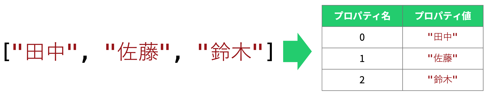

import CodeBlock from '@theme/CodeBlock';
import Term from "@site/src/components/Term";
import ViewSource from "@site/src/components/ViewSource";
import Answer from "@site/src/components/Answer";

## 配列

JavaScript における配列は、複数の値を並べて一つにまとめたオブジェクトです。`[` から `]` で囲まれた部分は配列を生成する式になります。

```javascript
const studentNames = ["田中", "佐藤", "鈴木"];
```

これで、3 つの文字列値 `"田中"`, `"佐藤"`, `"鈴木"` が順番に並んで格納された配列が作成され、変数 `studentNames` に格納されました。

配列を使用するには、配列を生成する際と同じく `[`, `]` 記号を用います。この括弧に囲まれた部分に数値（**インデックス**）を指定すると、配列の要素にアクセスできます。

```javascript
document.write(studentNames[0]); // 田中
document.write(studentNames[2]); // 鈴木
studentNames[1] = "内藤";
```

:::caution 配列のインデックス

配列のインデックスは `0` から始まります。このため、`2` 番目の要素のインデックスは `1` で、`n` 番目の要素のインデックスは `n - 1` になります。

また、長さが `N` の配列の最後の要素のインデックスは `N - 1` になります。

:::

`[` 〜 `]` の中には非負整数値になる任意の式を記述できます。変数を使用することも可能です。

```javascript
const six = 6;
document.write(studentNames[six / 2 - 1]); // 鈴木
```

### 課題

次のプログラムを実行すると何と表示されるでしょうか。

```javascript
document.write([3, 2, 1][0]);
```

<Answer>

`[3, 2, 1]` で配列が生成され、`[0]` で 0 番目の要素が指定されているので、`3` と表示されます。

<ViewSource url={import.meta.url} path="_samples/array" />

</Answer>

## for 〜 of 文

`for 〜 of` 文を用いると、配列の要素を順番に取り出す処理を簡単に記述できます。

```javascript
const studentNames = ["田中", "佐藤", "鈴木"];
for (const studentName of studentNames) {
  document.write(studentName);
}
```

このプログラムを実行すると、 `田中佐藤鈴木` と表示されます。

`for 〜 of` 文の構造は次の通りです。

```javascript
for (変数の宣言/変数名 of 配列) {
  処理;
}
```

配列の要素を順番に取り出し、 `of` の左側に指定された変数に設定してから、内部の処理を実行していきます。

## 配列のプリセット変数/関数

JavaScript の配列には、便利な変数や関数が定義されています。正確にはオブジェクトとクラスの回でそれぞれ扱う`プロパティ`、`メソッド`というものですが、今のところは特殊な書き方をする変数や関数であると考えればよいでしょう。

### `配列.length` 変数

`配列.length` [(MDN)](https://developer.mozilla.org/ja/docs/Web/JavaScript/Reference/Global_Objects/Array/length)という変数には、指定した配列の長さが自動的に反映されます。

```javascript
const studentNames = ["田中", "佐藤", "鈴木"];
document.write(studentNames.length); // 3
studentNames.push("内藤");
document.write(studentNames.length); // 4
```

### `配列.push` 関数

`関数.push`関数 [(MDN)](https://developer.mozilla.org/ja/docs/Web/JavaScript/Reference/Global_Objects/Array/push)は、指定した配列の末尾に新しい値を追加する関数です。

```javascript
const studentNames = ["田中", "佐藤", "鈴木"];
studentNames.push("内藤");
document.write(studentNames); // 田中,佐藤,鈴木,内藤
```

---

## 基礎課題

### 連続表示

- 引数に与えられた配列の要素を順番に表示する関数を、通常のfor文を使って作ってみましょう。

:::tip
変数 `i` を 0 から `(作成した配列の長さ) - 1` まで順番に増やしながら、配列の `i` インデックスの要素を表示しましょう。
:::

<Answer>

```javascript
function printArray(array) {
  for (let i = 0; i < array.length; i += 1) {
    document.write(array[i]);
  }
}
```

<ViewSource url={import.meta.url} path="_samples/array-printer" />

</Answer>

## 中級課題

### 最大値

引数にひとつの配列が与えられたとき、その配列の最大値を求める関数 `arrayMax` を作成しましょう。

:::note

テスト用に、ランダムに生成された以下の配列を使ってよいものとします。<p />

```javascript
const array1 = [3, 6, 8, 5, 0];
const array2 = [-8, -7, -3, -1, -5];
const array3 = [5986, 7202, 9347, 3593, 8166, 662, 2235, 9323, 2240, 943];
const array4 = [-878, -40, -324, -410, -592, -610, -880, -65, -423, -32];
```

:::

:::info

今までのように仮の初期値を置く方法では、配列の各値が非常に大きな負の値であった場合に仮の初期値が返ってきてしまいます。

どうすればいいでしょうか？

:::

<Answer>

配列の最初の値を初期値に設定することで解消します。

```javascript
function arrayMax(array) {
  if (array == []) return; //空配列をエスケープ
  let maxValue = array[0];
  for (let i = 0; i < array.length; i += 1) {
    if (array[i] > maxValue) maxValue = array[i];
  }
  return maxValue;
}
```

:::danger
配列の長さにかかわらず配列の最初の値を使うような処理をする場合は、長さが0である空の配列を渡された時にエスケープすることを忘れないでください！
:::

<ViewSource url={import.meta.url} path="_samples/array-max" />

---

:::info 別解 (参考)

[`array.reduce` メソッド](https://developer.mozilla.org/ja/docs/Web/JavaScript/Reference/Global_Objects/Array/reduce) を使ってこのように書くこともできます。

```javascript
function max(a, b) {
  if (a > b) return a;
  else return b;
}

function arrayMax(array) {
  if (array == []) return; //空配列をエスケープ
  return array.reduce(max, array[0]);
}
```

:::
</Answer>

<!--- 修正前 ...6-/1-/に移動

## 中級課題 フィボナッチ数列

- `配列.push` 関数を用いて、フィボナッチ数列の配列を作ってみましょう。
- 作成した配列の各要素を `for ～ of` 文を用いて出力してみましょう。
- 作成した配列の各要素を、通常の `for` 文と `配列.length` 変数を用いて出力してみましょう。


<Answer>

```javascript
// f.push 関数を用いて、フィボナッチ数列の配列を作成
const f = [1, 1];
for (let i = 0; i < 100; i += 1) {
  f.push(f[f.length - 1] + f[f.length - 2]);
}
// 作成した配列の各要素を for ～ of 文を用いて出力
for (const item of f) {
  document.write(item);
}
// 作成した配列の各要素を、通常の for 文と f.length 変数を用いて出力
for (let i = 0; i < f.length; i += 1) {
  document.write(f[i]);
}
```

<ViewSource url={import.meta.url} path="_samples/Array-class" />

</Answer>

-->

<!-- オブジェクトはまだ扱っていないためコメントアウト
## 配列とオブジェクト

配列はオブジェクトの一種です。しかしながら、JavaScript のオブジェクトとは、[オブジェクトの節](../../1-trial-session/11-object/index.md)で扱ったように、プロパティ名とプロパティ値の組み合わせでした。

配列もこの原則に従って動作しています。次の図に示すように、配列とは、各要素のインデックスがプロパティ名になっているオブジェクトだと考えることができるのです。



逆に、その他のオブジェクトも配列と同じように使用することができます。この記法を**ブラケット記法**と呼び、プログラムの動作に応じて使用したいプロパティを切り替えるのに役立ちます。

```javascript
const subject = "math"; // ここを変えると表示される教科が変わる
const scores = { math: 90, science: 80 };
document.write(`${subject} の点数は ${scores[subject]} です。`); // math の点数は 90 です。
```

:::tip オブジェクトのプロパティ

オブジェクトのプロパティに数値は使用できません。それではなぜ、配列の場合は `studentNames[2]` のように記述できるのでしょうか。

答えは単純で、文字列に変換されているからです。このため、次のプログラムは全く問題なく動作します。

```javascript
const studentNames = ["田中", "佐藤", "鈴木"];
document.write(studentNames["0"]); // 田中
```

:::
-->
