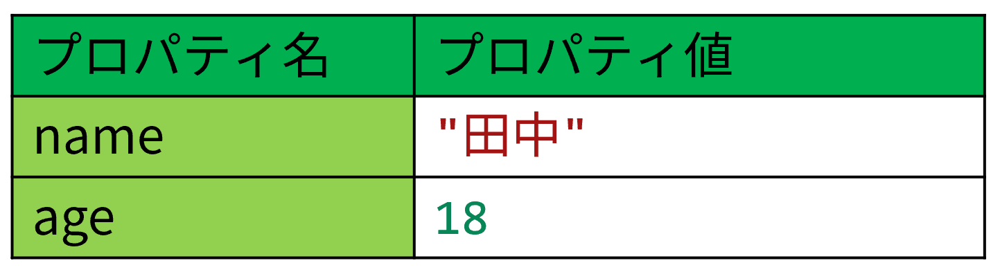
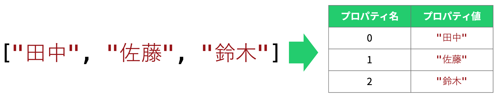

## <Term>オブジェクト</Term>

JavaScript で扱うことのできる<Term>値</Term>の種類として、これまで<Term>数値</Term>、<Term>文字列</Term>、<Term>論理値</Term>を扱ってきました。<Term>**オブジェクト**</Term>もまた、<Term>JavaScript</Term> の<Term>値</Term>ですが、今まで扱ってきた<Term>値</Term>とは少し性質が異なります。

{/* prettier-ignore */}
<Term>オブジェクト</Term>を用いると、これまで扱ってきたような単純な<Term>値</Term>を複数まとめて一つの<Term>値</Term>として扱うことができます。

## <Term>オブジェクト</Term>の作成

{/* prettier-ignore */}
<Term>オブジェクト</Term>は、複数の<Term>**プロパティ**</Term>と呼ばれる<Term>値</Term>を持ちます。
<Term>プロパティ</Term>にはそれぞれ名前がついています。
<Term>プロパティ</Term>の名前には文字列しか指定できませんが、<Term>プロパティ</Term>の<Term>値</Term>としては <Term>JavaScript</Term> で使用できるすべての<Term>値</Term>が使用可能です。

```javascript
const person = { name: "田中", age: 18 };
```



:::tip[ほかの言語の経験者へ]

JavaScript の<Term>オブジェクト</Term>は、ほかの言語でいう**辞書**や**連想配列**、**Map** に近いものです。ただ、こういったものと比べ、JavaScript の<Term>オブジェクト</Term>は使用頻度が非常に高いです。

:::

{/* prettier-ignore */}
<Term>オブジェクト</Term>の中に<Term>オブジェクト</Term>を入れることもできます。

```javascript
const person = {
  name: "田中",
  age: 18,
  scores: { math: 80, science: 90 },
};
```

## <Term>オブジェクト</Term>の<Term>プロパティ</Term>を取得・変更する

ドット記号を用いることで、<Term>オブジェクト</Term>の<Term>プロパティ</Term>を取得・変更できます。通常の<Term>変数</Term>のように扱えます。

```javascript
document.write(person.age); // 18

person.age = 19;
document.write(person.age); // 19
```

:::tip[プロパティの追加]
プロパティは取得や変更のほかに、追加もできます。

```javascript
person.favoriteFood = "餃子";
document.write(person.favoriteFood); // 餃子
```

:::

:::note[<Term>オブジェクト</Term>とプリミティブ]

この章よりも前に扱ってきたような「それ以上分解できない」<Term>値</Term>のことを<Term>**プリミティブ**</Term>といい、<Term>プリミティブ</Term>でない値はすべて<Term>オブジェクト</Term>です。



:::

## 配列とオブジェクト

上で説明したように、配列はプリミティブではないのでオブジェクトの一種です。JavaScript のオブジェクトとは、プロパティ名とプロパティ値の組の集合でした。

配列もこの原則に従って動作しています。次の図に示すように、配列とは、各要素のインデックスがプロパティ名になっているオブジェクトだと考えることができるのです。



逆に、オブジェクトも配列と同じように使用することができます。この記法を**ブラケット記法**と呼び、プログラムの動作に応じて使用したいプロパティを切り替えるのに役立ちます。

```javascript
const subject = "math"; // ここを変えると表示される教科が変わる
const scores = { math: 90, science: 80 };
document.write(`${subject} の点数は ${scores[subject]} です。`); // math の点数は 90 です。
```

:::tip[オブジェクトのプロパティ名]

オブジェクトのプロパティ名に数値は使用できません。それではなぜ、配列の場合は `studentNames[2]` のように記述できるのでしょうか。

答えは単純で、文字列に変換されているからです。このため、次のプログラムは全く問題なく動作します。

```javascript
const studentNames = ["田中", "佐藤", "鈴木"];
document.write(studentNames["0"]); // 田中
```

:::

## 課題

### 初級課題

田中さんを表すオブジェクトを定義します。

```javascript
const tanaka = {
  name: "田中",
  scores: { math: 90, science: 80 },
};
```

1. 田中さんの算数の点数を表示してみましょう。

2. `scores` に国語の点数を追加して、表示してみましょう。

<Answer title="成績表示">

```javascript title="1の解答"
document.write(tanaka.scores.math);
```

<ViewSource url={import.meta.url} path="_samples/view-math-score" />

```javascript title="2の解答"
tanaka.scores.japanese = 50;
document.write(tanaka.scores.japanese);
```

<ViewSource url={import.meta.url} path="_samples/add-and-view-Japanese-score" />

2 では、プロパティを自分で追加しています。

</Answer>

### 中級課題

{/* prettier-ignore */}
<Term>オブジェクト</Term>も<Term>値</Term>の一種なので、<Term>関数</Term>の<Term>引数</Term>や<Term>戻り値</Term>として使用できます。

`age` <Term>プロパティ</Term>に 1 を加えた<Term>オブジェクト</Term>を返す関数 `incrementAge` を定義してみましょう。

```javascript
function incrementAge(person) {
  // ここに書く
}

const tanaka = { name: "田中", age: 18 };
const sato = { name: "佐藤", age: 22 };
const nextYearTanaka = incrementAge(tanaka);
const nextYearSato = incrementAge(sato);
// 19 歳、23 歳 と表示されてほしい
document.write(
  `田中は ${nextYearTanaka.age} 歳、佐藤は ${nextYearSato.age} 歳`,
);
```

<Answer title="年齢を増やす">

```javascript
function incrementAge(person) {
  person.age += 1;
  return person;
}

const tanaka = { name: "田中", age: 18 };
const sato = { name: "佐藤", age: 22 };
const nextYearTanaka = incrementAge(tanaka);
const nextYearSato = incrementAge(sato);
document.write(
  `田中は ${nextYearTanaka.age} 歳、佐藤は ${nextYearSato.age} 歳`,
);
```

<ViewSource url={import.meta.url} path="_samples/incrementAge" />

</Answer>
