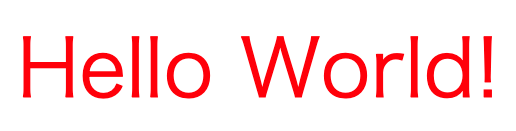

今までは HTML と JavaScript を勉強してきました。今回は Web 開発で用いられるもう一つの言語、CSS について学びましょう。CSS は Web サイトの「見た目」をつかさどる言語です。多くの <Term>HTML 要素</Term> は、<Term>CSS</Term> を用いることで、その見た目を細かくカスタマイズすることができます。


CSS の書き方を学び、「World」の文字を赤くしてみましょう。



## <Term>CSS</Term> ファイルを作成する

CSS ファイルの拡張子は通常 `.css` です。今回は `index.html` と併せて `style.css` を作成しました。


次の例では、`Hello World` の `World` の部分を赤色にしています。

```html title="index.html"
<!doctype html>
<html lang="ja">
  <head>
    <meta charset="utf-8" />
    <link rel="stylesheet" href="./style.css" />
    <title>Title</title>
  </head>
  <body>
    Hello <strong id="world">World</strong>!
  </body>
</html>
```

```css title="style.css"
#world {
  color: red;
}
```

<ViewSource url={import.meta.url} path="_samples/red-hello-world" />

## `link` 要素

```html title="index.html"
<link rel="stylesheet" href="./style.css" />
```

まず注目すべきは `link` 要素です。HTML で、`link` 要素を用いることにより、外部の CSS ファイルを読み込ませることができます。

## セレクタとID

CSS を記述する際には、まずスタイルを適用する対象となる HTML 要素を指定する必要があります。このために用いることができるのが、HTML 要素の `id` 属性です。(上の例では、`index.html` の 9行目)


そして、CSS 側に書くのが**セレクタ**です。上の例では、`style.css` の 1 行目の `#world` がセレクタで、「`id` 属性が `world` である要素」を示します。

`id` 属性は、全ての HTML 要素に対して開発者が自由に設定できますが、ひとつの HTML 内に同じ `id` 属性を持つ要素が複数存在してはならない、というルールがあります。

また、`id` 属性と似た使い方ができる属性として、`class` 属性があります。この属性は、開発者が好きな値を設定できるのは同じですが、複数の要素が同じ値を持つことが許されています。また、スペース区切りで複数の値を設定することもできます。

| セレクタ   | 意味                                    |
| ---------- | --------------------------------------- |
| `#element` | `id` 属性が `element` である要素        |
| `.element` | `class` 属性に `element` が含まれる要素 |
| `element`  | タグ名が `element` である要素           |

:::info[高度なセレクタ]

また、セレクタをスペースで区切ると子孫要素、`>` で区切ると直属の子要素を表すことができます。そのまま繋げば and 条件とみなされます。

| セレクタ         | 意味                                                                           |
| ---------------- | ------------------------------------------------------------------------------ |
| `div.element`    | `class` 属性に `element` が含まれる `div` 要素                                 |
| `#parent .child` | `id` 属性が `parent` である要素の子孫の、`class` 属性に `child` が含まれる要素 |
| `#parent > div`  | `id` 属性が `parent` である要素の直属の子の `div` 要素                         |

セレクタを上手に活用すると、変更に強くて柔軟な CSS を作成することができます。

:::

## <Term type="cssProperty">プロパティ</Term>とプロパティ値

いよいよ仕上げです。

```css title="style.css"
#world {
  color: red;
}
```

CSS の `{` から `}` で囲まれたブロックの中に、<Term type="cssProperty">**プロパティ**</Term>と呼ばれるスタイルの種類と、「プロパティ値」と呼ばれるプロパティに指定できる外観を、コロン記号で区切って記述します。

上の例では、`color` という<Term type="cssProperty">プロパティ</Term>に、`red` というプロパティ値を設定することで、文字色を赤色に設定するよう指示しています。

これで、`Hello World!` の `World` の文字が赤くなりました。

:::note

{/* prettier-ignore */}
<Term>CSS</Term> の<Term type="cssProperty">プロパティ</Term>は、<Term>オブジェクト</Term>における<Term>プロパティ</Term>と似ているものの、全く異なるものです。文脈により何を意味しているのかが変わるので注意してください。

:::

:::tip[HTMLの <Term>`style` 属性</Term>]
`style.css` を作らずとも、HTML 内に直接 CSS を指定することもできます。例えば、`p` <Term>要素</Term> の <Term>`style` 属性</Term>に `color: red;` を指定するとどうなるでしょうか。

```html title="index.html"
<p style="color: red">Hello CSS!</p>
```

<ViewSource url={import.meta.url} path="_samples/first-css" />

このプログラムを実行すると、<Term>style 属性</Term>を指定した<Term>要素</Term>内のテキストが赤色で表示されます。

しかし、`style` 属性を用いて HTML と CSS を 1 つのファイルに混合するよりも、「構造」のファイル (HTML)、「スタイル」のファイル (CSS) と役割をはっきり分離させたほうが、コードの可読性が上がり、後から修正するのも簡単です。このため、通常 CSS ファイルは HTML ファイルとは別に用意されます。
:::

## 複数のプロパティ

```css title="style.css"
#element {
  color: red;
  font-size: 30px;
}
```

複数の<Term type="cssProperty">プロパティ</Term>を指定する場合には、上のように `プロパティ: プロパティ値;` の組を並べて記述します。セミコロンの指定が必要であることに注意してください。

CSS の<Term type="cssProperty">プロパティ</Term>には `color` (文字色) や `font-size` (文字サイズ) だけでなく、`background-color` (背景色)、`text-decoration` (文字装飾) 等、数えきれないほどの種類が定義されています。

:::tip[どうやって調べたらいいの？]

プログラミングを始めたての間は、分からないことがあったときにどのように調べたら良いのか戸惑うことが多いと思います。そんなときは、次のような手順で調べてみましょう。例として、「文字を赤くする方法」を調べてみます。

#### 1. タスクを細かく分割する

現在持ち合わせている知識をもとに、やりたいことを可能な限り細かく分割します。「文字を赤くする」であれば、見た目に関することなので CSS を使えばいいのだろうと想像がつきます。加えて、色の指定方法について調べてみるとよいでしょう。

#### 2. Google で検索してみる

「CSS 文字色」「CSS 色指定」などと調べてみましょう。課題が十分に細かく分割できていれば、これで直接的な回答が得られるはずです。うまく答えが見つからない場合は、慣れている人に聞いてみてください。 Slack でどんどん質問しましょう。

#### 3. 周辺知識を信頼できる情報源で調べる

見つかったウェブサイトに掲載されているコードをもとに、信頼できる情報源を読みなおします。HTML、CSS、JavaScript の場合は、[MDN](https://developer.mozilla.org/ja/) が便利でしょう。例えば「CSS 文字色」と調べて紹介されるのは `color` <Term type="cssProperty">プロパティ</Term>なので、MDN でこの<Term type="cssProperty">プロパティ</Term>について調べておきましょう。

:::

## 課題

### 基礎課題1 (セレクタ)

次のような条件を満たす要素を選択するセレクタは何でしょうか。

1. `id` 属性が `foo` の要素
2. `class` 属性に `bar` が含まれる要素の子孫の要素のうち、`button` 要素であるもの

<Answer title="セレクタ">

1. `#foo`
2. `.bar button`

</Answer>

### 基礎課題2 (Hello CSS!)

下のような、文字色が黄色、背景色が好きな色 (この例では黒) の `Hello CSS!` をブラウザで表示してみましょう。


使用するプロパティは `color`、`background-color` です。

<Answer title="Hello CSS!">

```html title="index.html"
<!doctype html>
<html lang="ja">
  <head>
    <meta charset="utf-8" />
    <link rel="stylesheet" href="./style.css" />
    <title>Title</title>
  </head>
  <body>
    <div id="greeting">Hello CSS!</div>
  </body>
</html>
```

```css title="style.css"
#greeting {
  color: yellow;
  background-color: black;
}
```

<ViewSource url={import.meta.url} path="_samples/yellow-hello-css" />

</Answer>

### 中級課題

画像のようなシンプルなボックスを作ってみましょう。


シンプルで、よく見かけるデザインですが、様々な指定が必要であることが分かります。次のような点に注意してデザインしてみてください。

- グレーの枠線が付いています (border)
- 枠線は角丸になっています (border-radius)
- 枠線の外側に余白があります (margin)
- 枠線の内側にも余白があります (padding)
- ボックスに影がついています (box-shadow)

<Answer title="シンプルなボックス">

```html title="index.html"
<!doctype html>
<html lang="ja">
  <head>
    <meta charset="utf-8" />
    <link rel="stylesheet" href="./style.css" />
    <title>Title</title>
  </head>
  <body>
    <div id="foo">Foo</div>
  </body>
</html>
```

```css title="style.css"
#foo {
  border: 1px solid #aaa;
  border-radius: 10px;
  margin: 30px;
  padding: 30px;
  box-shadow: 0px 0px 2px 1px #aaa;
}
```

<ViewSource url={import.meta.url} path="_samples/foo" />

</Answer>
