## オブジェクト

JavaScriptで利用することができる<Term>値</Term>の種類として、これまで<Term>数値</Term>と<Term>文字列</Term>、<Term>論理値</Term>を扱いました。<Term>数値</Term>や<Term>文字列</Term>、<Term>論理値</Term>などの「それ以上分解できない」<Term>値</Term>のことを**プリミティブ**と呼びます。JavaScriptには、この他にも、**オブジェクト**と呼ばれる<Term>値</Term>が存在します。JavaScriptにおいて、<Term>プリミティブ</Term>でない<Term>値</Term>はすべてオブジェクトです。


オブジェクトを用いると、関連する<Term>値</Term>をまとめて1つの<Term>値</Term>として扱うことができます。これにより、事物をプログラム上でより現実世界に近い形で表現することができます。

たとえば、学生を例に考えてみましょう。学生には、名前や年齢、メールアドレスなどの情報があります。これをオブジェクトとして表現すると、次のようになります。このように、オブジェクトを使うことで、複数の情報をまとめて扱い現実の1人の学生をプログラム上でも1つの<Term>値</Term>として扱うことができます。

```javascript
{
  name: "山田太郎",
  age: 15,
  email: "yamada.taro@example.com",
}
```

## オブジェクトの作成

オブジェクトは、次のようにして作成します。

```javascript
const student = {
  name: "山田太郎",
  age: 15,
  email: "yamada.taro@example.com",
};
```

ここでは、学生には、名前と年齢、メールアドレスの3つの情報があります。これらは、オブジェクトの**プロパティ**と呼ばれます。<Term type="javascriptProperty">プロパティ</Term>は、**プロパティ名**と**プロパティ値**の組で表されます。この例では、`name`や`age`、`email`が<Term>プロパティ名</Term>であり、`"山田太郎"`や`15`、`"yamada.taro@example.com"`が<Term>プロパティ値</Term>です。<Term>プロパティ名</Term>には文字列しか指定できませんが、<Term>プロパティ値</Term>には、JavaScriptで使用できるすべての<Term>値</Term>が指定可能です。

| プロパティ名 | プロパティ値                |
| ------------ | --------------------------- |
| `name`       | `"山田太郎"`                |
| `age`        | `15`                        |
| `email`      | `"yamada.taro@example.com"` |

:::tip[ほかの言語の経験者へ]

JavaScriptのオブジェクトは、ほかの言語でいう辞書や連想配列、Mapに近いものです。ただ、こういったものと比べ、JavaScriptのオブジェクトは使用頻度が非常に高いです。

:::

### 確認問題

次のような情報を持つユーザーを表すオブジェクト`user`を作成してください。

- `name`: `"山田花子"`
- `bio`: `"プログラミングを勉強しています。"`

<Answer>

```javascript
const user = {
  name: "山田花子",
  bio: "プログラミングを勉強しています。",
};
```

<ViewSource url={import.meta.url} path="_samples/create-user-object" />

</Answer>

## プロパティの取得

オブジェクトの<Term>プロパティ</Term>を取得するには、次のようにドット記号（`.`）を使います。

```javascript
document.write(student.name); // 山田太郎
document.write(student.age); // 15
```

## プロパティの変更

オブジェクトの<Term>プロパティ</Term>を変更するには、次のようにします。

```javascript
document.write(student.email); // yamada.taro@example.com
student.email = "yamada.taro@example.jp";
document.write(student.email); // yamada.taro@example.jp
```

### 確認問題

次のようなユーザーを表すオブジェクト`user`があります。ユーザーのプロフィールを表示し、プロフィールの内容を`"JavaScriptでWebアプリを作っています。"`に変更してから、もう一度表示してください。

```javascript
const user = {
  name: "山田花子",
  bio: "プログラミングを勉強しています。",
};
```

<Answer>

```javascript
document.write(user.bio); // プログラミングを勉強しています。
user.bio = "JavaScriptでWebアプリを作っています。";
document.write(user.bio); // JavaScriptでWebアプリを作っています。
```

<ViewSource url={import.meta.url} path="_samples/change-bio-property" />

</Answer>

## オブジェクトのネスト

さきほど<Term>プロパティ値</Term>には、すべての<Term>値</Term>が指定可能であると説明しました。オブジェクトも<Term>値</Term>の一種であるため、次のようにオブジェクトの<Term>プロパティ値</Term>にオブジェクトを指定する（<Term>ネスト</Term>する）こともできます。

```javascript
const student = {
  name: "山田太郎",
  age: 15,
  email: "yamada.taro@example.com",
  scores: {
    japanese: 90,
    math: 70,
    english: 80,
  },
};
```

{/* prettier-ignore */}
<Term>ネスト</Term>されたオブジェクトの<Term>プロパティ</Term>は、次のようにして取得、変更できます。

```javascript
document.write(student.scores.math); // 70
student.scores.math = 100;
document.write(student.scores.math); // 100
```

### 確認問題

次のようなユーザーを表すオブジェクト`user`があります。言語設定を変更することになりました。言語設定を表示し、`"English"`に変更してから、もう一度表示してください。

```javascript
const user = {
  name: "山田花子",
  bio: "JavaScriptでWebアプリを作っています。",
  settings: {
    isNotificationsEnabled: true,
    language: "日本語",
  },
};
```

<Answer>

```javascript
document.write(user.settings.language); // 日本語
user.settings.language = "English";
document.write(user.settings.language); // English
```

<ViewSource url={import.meta.url} path="_samples/change-language-property" />

</Answer>

## 配列とオブジェクト

さきほどJavaScriptにおいて<Term>プリミティブ</Term>でない<Term>値</Term>はすべてオブジェクトであると説明しました。<Term>配列</Term>はプリミティブではないので、オブジェクトの一種です。



JavaScriptのオブジェクトは、<Term>プロパティ名</Term>と<Term>プロパティ値</Term>の組によって構成されていました。<Term>配列</Term>はオブジェクトの一種であるため、この原則に従って動作します。次の図に示すように、配列とは、各要素のインデックスが<Term>プロパティ名</Term>になっているオブジェクトです。


逆に、オブジェクトも<Term>配列</Term>と同じように使用することができます。この記法をブラケット記法と呼び、プログラムの動作に応じて使用したい<Term>プロパティ</Term>を切り替えるのに役立ちます。

```javascript
const subject = "english"; // ここを変えると表示される教科が変わる。
const scores = {
  japanese: 90,
  math: 70,
  english: 80,
};
document.write(`${subject}の点数は${scores[subject]}点です。`); // englishの点数は80点です。
```

:::tip[オブジェクトのプロパティ名]

オブジェクトの<Term>プロパティ名</Term>に<Term>数値</Term>は使用できません。それではなぜ、<Term>配列</Term>の場合は`studentNames[0]`のようにプロパティ名に<Term>数値</Term>を使用できるのでしょうか。

答えは単純で、<Term>数値</Term>が<Term>文字列</Term>に変換されているためです。そのため、`studentNames[0]`は`studentNames["0"]`と同じ意味になります。

```javascript
const studentNames = ["田中", "佐藤", "鈴木"];
document.write(studentNames["0"]); // 田中
```

:::

## 演習問題

次のような学生を表すオブジェクトがあります。この学生の国語と算数、英語の3教科の平均点を計算して、表示してください。

```javascript
const student = {
  name: "山田太郎",
  age: 15,
  email: "yamada.taro@example.com",
  scores: {
    japanese: 90,
    math: 70,
    english: 80,
  },
};
```

<Answer>

```javascript
const averageScore =
  (student.scores.japanese + student.scores.math + student.scores.english) / 3;
document.write(`平均点は${averageScore}点です。`);
```

<ViewSource url={import.meta.url} path="_samples/average-score" />

</Answer>
