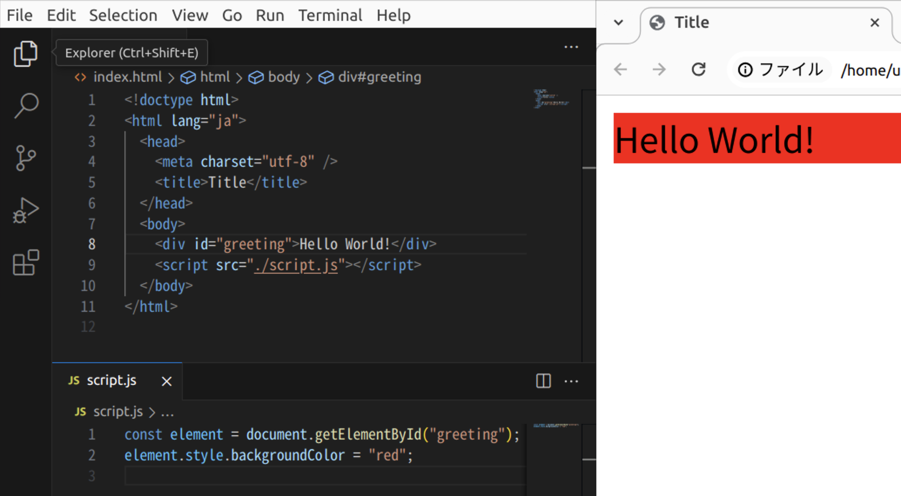

## <Term type="html">HTML</Term> 要素を <Term type="javascript">JavaScript</Term> で取得する

<p><Term strong type="dom">DOM</Term>（Document Object Model）は、<Term type="html">HTML</Term> 構造を <Term type="javascript">JavaScript</Term> の<Term type="javascriptObject">オブジェクト</Term>として扱うための枠組みです。<Term type="html">HTML</Term> と <Term type="css">CSS</Term> のほとんどの機能は <Term type="javascript">JavaScript</Term> から制御することができます。</p>

`document.getElementById` <Term type="javascriptFunction">関数</Term>は、<Term type="javascriptParameter">引数</Term>として <Term type="element">HTML 要素</Term>の `id` <Term type="attribute">属性</Term>に指定された値を<Term type="javascriptString">文字列</Term>として<Term type="javascriptPass">渡す</Term>ことで、その<Term type="element">要素</Term>を表す<Term type="javascriptObject">オブジェクト</Term>を<Term type="javascriptReturn">返し</Term>ます。

```html title="index.html"
<div id="greeting">Hello World</div>
```

```js title="script.js"
const element = document.getElementById("greeting");
element.textContent = "Hello DOM";
```

<ViewSource url={import.meta.url} path="_samples/get-element-by-id" />

<p><Term type="javascriptVariable">変数</Term> <code>element</code> には、<code>index.html</code> に記述された <code>div</code> <Term type="element">要素</Term>に対応する<Term type="javascriptObject">オブジェクト</Term>が<Term type="javascriptAssignment">代入</Term>されています。</p>


`document.getElementById` が<Term type="javascriptReturn">返す</Term><Term type="javascriptObject">オブジェクト</Term>には、取得した HTML <Term type="element">要素</Term>の特徴を表す、たくさんの<Term type="javascriptProperty">プロパティ</Term>が含まれています。下はその一部分です。

| プロパティ    | 説明                                                 |
| ------------- | ---------------------------------------------------- |
| `textContent` | <Term type="element">要素</Term>内部のテキスト       |
| `innerHTML`   | <Term type="element">要素</Term>内部の HTML          |
| `tagName`     | <Term type="tag">タグ</Term>の名前                   |
| `style`       | <Term type="element">要素</Term>に設定されたスタイル |

`textContent` <Term type="javascriptProperty">プロパティ</Term>は、<Term type="element">HTML 要素</Term>の内部のテキストを表します。<Term type="javascriptObject">オブジェクト</Term>の<Term type="javascriptProperty">プロパティ</Term>は通常の<Term type="javascriptVariable">変数</Term>のように取得や<Term type="javascriptAssignment">代入</Term>が可能で、上の例では `textContent` <Term type="javascriptProperty">プロパティ</Term>に対して `"Hello DOM"` という<Term type="javascriptString">文字列</Term>を代入することで、`div` <Term type="element">要素</Term>の内部のテキストを変更しています。

## <Term type="element">HTML 要素</Term>のスタイルを変更する

`document.getElementById` <Term type="javascriptFunction">関数</Term>が返す<Term type="javascriptObject">オブジェクト</Term>の `style` <Term type="javascriptProperty">プロパティ</Term>は、その要素の <Term type="styleAttribute">`style` 属性</Term>と対応します。**`style` <Term type="javascriptProperty">プロパティ</Term>に格納されている<Term type="javascriptValue">値</Term>自体も<Term type="javascriptObject">オブジェクト</Term>**となっており、その各<Term type="javascriptProperty">プロパティ</Term>が CSS の<Term type="cssProperty">プロパティ</Term>に対応します。

```js title="script.js"
element.style.backgroundColor = "red";
```

このプログラムは、取得した<Term type="element">要素</Term>の背景色を赤色に変更します。



<p><Term type="css">CSS</Term> の<Term type="cssProperty">プロパティ</Term>名である <code>background-color</code> は、内部にハイフンが含まれているため、<code>element.style.background-color</code>のように指定してしまうと、ハイフンが減算<Term type="javascriptOperator">演算子</Term>として解釈されてしまいます。<code>style</code> <Term type="javascriptProperty">プロパティ</Term>では、<Term type="css">CSS</Term> の<Term type="cssProperty">プロパティ</Term>名は<Term type="camelCase">キャメルケース</Term>として指定する必要があることに注意してください。</p>

## DOM に関連する便利な関数

### `element.appendChild` 関数

`DOM` 要素の後に `.appendChild` と続けて書く関数があります(正確には[クラスの章](/docs/browser-apps/class/)で説明する<Term type="javascriptMethod">メソッド</Term>というものです)。
この関数の引数に別の `DOM` オブジェクトを渡すと、渡した `DOM` 要素を親の要素の子要素にすることができます。

### `document.createElement` 関数

`document.createElement` 関数に要素の種類を表す文字列を渡すと、新しい `HTML` 要素を作ることができます。
新しく作った要素は文字(`textContent`)もなければ親要素も決まっていないので、作ったあとに指定する必要があります。

例:

```html title="HTML"
<ul id="ul"></ul>
```

```js title="JavaScript"
const list = document.getElementById("ul"); // id が ul であるものを取得する

const item = document.createElement("li"); // li 要素を作る
item.textContent = "ut.code(); Learn"; // li 要素の表示する文字を指定する
list.appendChild(li); // 上で作った要素を ul の子要素に指定する
```

## 初級課題

### 買い物リストの改ざん

次の HTML ファイルから読み込んでいる JavaScript ファイルを書き換えて、「トマト」「レモン」「バジル」と表示されるようにしてみましょう。

```html title="index.html"
<!doctype html>
<html lang="ja">
  <head>
    <meta charset="utf-8" />
    <title>買い物リスト</title>
  </head>
  <body>
    <ul>
      <li id="element1">トマト</li>
      <li id="element2">ナス</li>
      <li id="element3">バジル</li>
    </ul>
    <script src="script.js"></script>
  </body>
</html>
```

<Answer title="買い物リストの改ざん">

```js title="script.js"
const pear = document.getElementById("element2");

pear.textContent = "レモン";
```

<ViewSource url={import.meta.url} path="_samples/falsify-shopping-memo" />

</Answer>

## 中級課題

### 配列をリストとして表示する

配列があります。配列の中身を、順番にHTMLに表示してみましょう。

<Answer title="配列のリスト表示">

```html title="index.html"
<!doctype html>
<html lang="ja">
  <head>
    <meta charset="utf-8" />
    <title>Title</title>
    <script src="script.js"></script>
  </head>
  <body>
    <ul id="wrapper"></ul>
  </body>
</html>
```

```js title="script.js"
const listWrapper = document.getElementById("wrapper");
const list = ["トマト", "レモン", "バジル"];

for (const item of list) {
  const element = document.createElement("li");
  element.textContent = item;
  listWrapper.appendChild(element);
}
```

<ViewSource url={import.meta.url} path="_samples/array-to-list" />

</Answer>
