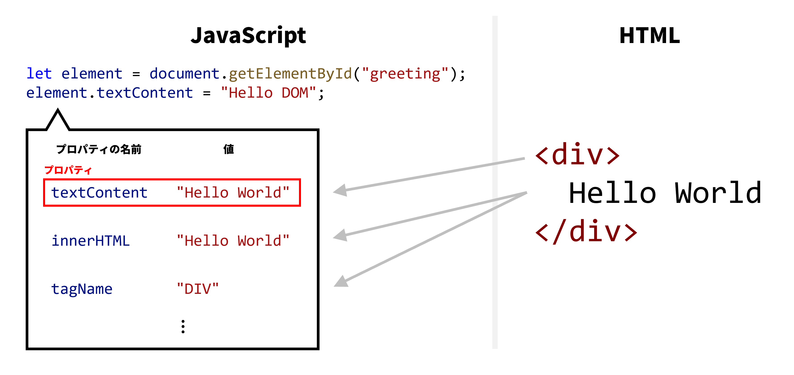
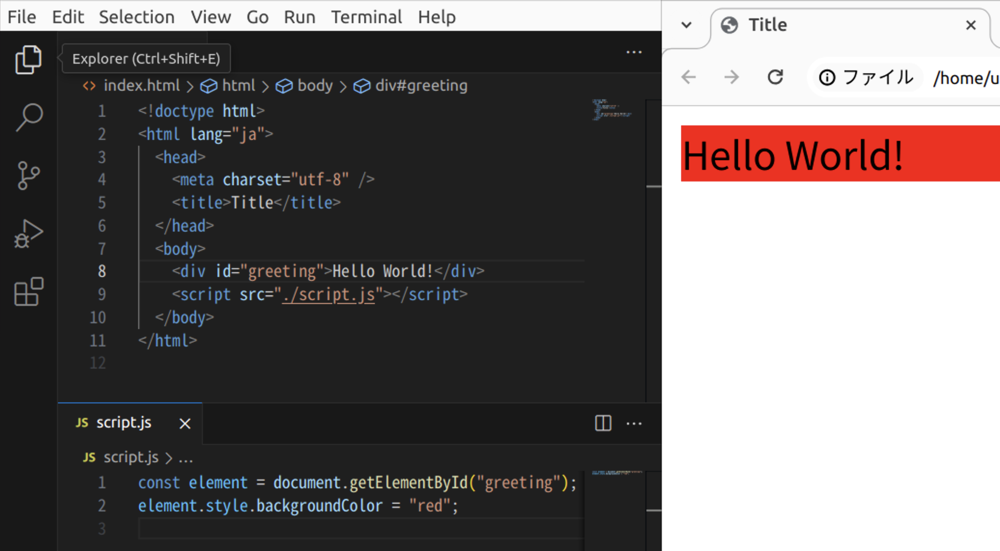

## <Term>HTML</Term> 要素を <Term>JavaScript</Term> で取得する

{/* prettier-ignore */}
<Term>**DOM**</Term> (Document Object Model) は、<Term>HTML</Term> 構造を <Term>JavaScript</Term> の<Term>オブジェクト</Term>として扱うための枠組みです。
<Term>HTML</Term> と <Term>CSS</Term> のほとんどの機能は <Term>JavaScript</Term> から制御することができます。

`document.getElementById` <Term>関数</Term>は、<Term>引数</Term>として <Term>HTML 要素</Term>の `id` <Term>属性</Term>に指定された値を<Term>文字列</Term>として<Term>渡す</Term>ことで、その<Term>要素</Term>を表す<Term>オブジェクト</Term>を<Term>返し</Term>ます。

```html title="index.html"
<div id="greeting">Hello World</div>
```

```js title="script.js"
const element = document.getElementById("greeting");
element.textContent = "Hello DOM";
```

<ViewSource url={import.meta.url} path="_samples/get-element-by-id" />

{/* prettier-ignore */}
<Term>変数</Term> `element` には、`index.html` に記述された `div` <Term>要素</Term>に対応する<Term>オブジェクト</Term>が<Term>代入</Term>されています。



`document.getElementById` が<Term>返す</Term><Term>オブジェクト</Term>には、取得した HTML <Term>要素</Term>の特徴を表す、たくさんの<Term>プロパティ</Term>が含まれています。下はその一部分です。

| プロパティ    | 説明                                  |
| ------------- | ------------------------------------- |
| `textContent` | <Term>要素</Term>内部のテキスト       |
| `innerHTML`   | <Term>要素</Term>内部の HTML          |
| `tagName`     | <Term>タグ</Term>の名前               |
| `style`       | <Term>要素</Term>に設定されたスタイル |

`textContent` <Term>プロパティ</Term>は、<Term>HTML 要素</Term>の内部のテキストを表します。<Term>オブジェクト</Term>の<Term>プロパティ</Term>は通常の<Term>変数</Term>のように取得や<Term>代入</Term>が可能で、上の例では `textContent` <Term>プロパティ</Term>に対して `"Hello DOM"` という<Term>文字列</Term>を代入することで、`div` <Term>要素</Term>の内部のテキストを変更しています。

## <Term>HTML 要素</Term>のスタイルを変更する

`document.getElementById` <Term>関数</Term>が返す<Term>オブジェクト</Term>の `style` <Term>プロパティ</Term>は、その要素の <Term>`style` 属性</Term>と対応します。 **`style` <Term>プロパティ</Term>に格納されている<Term>値</Term>自体も<Term>オブジェクト</Term>** となっており、その各<Term>プロパティ</Term>が CSS の<Term type="cssProperty">プロパティ</Term>に対応します。

```js title="script.js"
element.style.backgroundColor = "red";
```

このプログラムは、取得した<Term>要素</Term>の背景色を赤色に変更します。



{/* prettier-ignore */}
<Term>CSS</Term> の<Term type="cssProperty">プロパティ</Term>名である `background-color` は、内部にハイフンが含まれているため、`element.style.background-color` のように指定してしまうと、ハイフンが減算<Term>演算子</Term>として解釈されてしまいます。
`style` <Term>プロパティ</Term>では、<Term>CSS</Term> の<Term type="cssProperty">プロパティ</Term>名は<Term>キャメルケース</Term>として指定する必要があることに注意してください。

## DOM を用いて要素を追加する

`document.createElement` 関数は、引数に要素の種類を表す文字列を取り、その種類の新しい HTML 要素を作る関数です。
`document.createElement` 関数の戻り値は、新しく作った HTML 要素に対応するオブジェクトです。
下の例では、新しい `span` 要素を作っています。

中身のない空の要素が作成されるので、`textContent` を `Hello World!` に設定してみましょう。

```js title="script.js"
const newSpan = document.createElement("span");
newSpan.textContent = "Hello World!";
```

そして、`要素1.appendChild(要素2)` とすることで、要素 1 の子要素に要素 2 を追加し、画面に表示することができます。
今回は、`div` 要素の子要素にしてみましょう。

```html title="index.html"
<div id="parent-element"></div>
```

```js title="script.js"
const parent = document.getElementById("parent-element");

const newSpan = document.createElement("span");
newSpan.textContent = "Hello World!";

parent.appendChild(newSpan);
```

これで、既存の `div` 要素の子要素に新しい `span` 要素が追加され、画面に `Hello World!` と表示されます。

## 初級課題

### 買い物リストの書き換え

次の HTML ファイルから読み込んでいる JavaScript ファイルを書き換えて、「トマト」「レモン」「バジル」と表示されるようにしてみましょう。

```html title="index.html"
<ul>
  <li id="item1">トマト</li>
  <li id="item2">ナス</li>
  <li id="item3">バジル</li>
</ul>
```

<Answer title="買い物リストの書き換え">

```js title="script.js"
const targetItem = document.getElementById("item2");

targetItem.textContent = "レモン";
```

<ViewSource url={import.meta.url} path="_samples/change-shopping-memo" />

</Answer>

## 中級課題

### フルーツバスケット

購入する予定の果物を表す文字列が格納された配列が次のように用意されています。

```js
const fruits = ["イチゴ", "スイカ", "バナナ"];
```

`createElement` 関数や `appendChild` 関数を用い、`ul` 要素の中に各果物に対応する `li` 要素を作成することで、箇条書きを完成させましょう。
ただし、HTML ファイルには次のように記述されているものとします。

```html title="index.html"
<ul id="fruit-basket"></ul>
```

<Answer title="フルーツバスケット">

```js title="script.js"
const basket = document.getElementById("fruit-basket");
const fruits = ["イチゴ", "スイカ", "バナナ"];

for (const fruit of fruits) {
  const item = document.createElement("li");
  item.textContent = fruit;
  basket.appendChild(item);
}
```

<ViewSource url={import.meta.url} path="_samples/fruit-basket" />

</Answer>
