import CodeBlock from '@theme/CodeBlock';
import Term from "@site/src/components/Term";
import ViewSource from "@site/src/components/ViewSource";
import Answer from "@site/src/components/Answer";

## 定数

これまで、変数の宣言には `let` キーワードを使用してきました。ところが、JavaScript の変数は、大抵初回代入以降は再代入が行われません。

再代入が行われない変数は `const` を用いて宣言することができます。このようにして宣言された変数を定数と呼び、定数への代入は宣言時にしか行えません。

```javascript
// let で宣言した変数は再代入できる
let variable = 1;
variable = 2;

const constant = 1;
// const で宣言した変数に再代入しようとするとエラー
// constant = 2;
```

:::tip `let` と `const`
ほとんどの場合、`const` が用いられたプログラムは `let` に書き換えても動作します。それでは、あえて `const` を用いる理由は何なのでしょうか。

JavaScript において、それはコードを読んだ際に読みやすいからです。`const` で定義されている変数なら、宣言文さえ見れば変数の中に入っている値を知ることができます。`const` が使用できる場所では、基本的に全て `const` を用いるようにしましょう。
:::

:::info オブジェクトと `const`
`const` による宣言で禁止されるのはその変数への代入だけであり、オブジェクトのプロパティへの代入はこれにあたりません。

```javascript
const person = { name: "田中", age: 18 };
person.name = "佐藤"; // OK
```

:::

## 参照

[オブジェクト](../../1-trial-session/10-object/index.md)で扱ったように、JavaScript の値はオブジェクトとプリミティブに分けられます。前回は、プリミティブを「それ以上分解できない値」のように説明しました。もう少し詳しくみてみましょう。


次のコードを実行してみてください。

```javascript
const object1 = { name: "田中", age: 18 };
const object2 = object1;
object2.age = 19;
document.write(object1.age);
```

<ViewSource url={import.meta.url} path="_samples/reference" />

このプログラムの実行結果は `19` になります。なぜでしょうか。

実は、オブジェクトを生成する式 `{ name: "田中", age: 18 }` は、オブジェクトを生成こそするものの、**式自体の評価結果は、オブジェクトそのものでなく、コンピューターのメモリ上のどこかに存在するオブジェクトの本体の場所を指し示す値になります**。

言い換えれば、JavaScript において、**オブジェクトそのものは値ではありません**。JavaScript の**値として有効なのは、オブジェクトへの参照**なのです。



これを踏まえて先ほどのコードを見直してみましょう。JavaScript で値として扱えるのは参照のみなので、1 行目で `object1` に代入されるのは、その本体への参照です。

2 行目では、変数 `object1` に代入されている参照が `object2` にコピーされます。これにより、同じオブジェクトを参照する変数が 2 つできます。よって、`object1.age` と `object2.age` は同じものになるのです。

## ネストされたオブジェクト

オブジェクトの中に別のオブジェクトが格納されている場合を考えてみましょう。

```javascript
const person = {
  name: "田中",
  scores: { math: 80, science: 90 },
};
```

[以前](../../1-trial-session/10-object/index.md)にも記載した通り、オブジェクトのプロパティ名として使用可能なのは文字列のみですが、プロパティの値としては任意の JavaScript の値が使用できるのでした。

オブジェクトがネストされている場合、次のようにプロパティの値として別のオブジェクトへの参照が格納されていると考えることができます。



## 課題

参照の仕組みが特に問題になってくる場合として、オブジェクトの参照先が別の関数によって書き換えられる場合があります。次のコードを実行してみましょう。

```javascript
function incrementAge(person) {
  person.age = person.age + 1;
  return person;
}

const tanaka = { name: "田中", age: 18 };
const nextYearTanaka = incrementAge(tanaka);
document.write(nextYearTanaka.age);

// 19 と表示されてしまう
document.write(tanaka.age);
```

<ViewSource url={import.meta.url} path="_samples/object-mutated-by-function" />

このコードは、[オブジェクト](../../1-trial-session/10-object/index.md)の項で扱った課題でした。実はこのコードには問題があり、`tanaka` に対して `incrementAge` を適用すると、関数が適用された `tanaka` にも影響が及んでしまいます。これは、関数に渡される値はオブジェクトへの参照で、このオブジェクトは呼び出し元の変数が参照するものと同一のものだからです。

`incrementAge` 関数の実装を変更し、関数に渡したオブジェクトが書き換えられないようにしてください。

:::tip
オブジェクトが書き換えられないようにするためには、オブジェクトを新しく作り直す必要があります。
:::

<Answer>

オブジェクトを新しく生成して、生成したオブジェクトを返しましょう。

```javascript
function incrementAge(person) {
  return { name: person.name, age: person.age + 1 };
}
const tanaka = { name: "田中", age: 18 };
const nextYearTanaka = incrementAge(tanaka);
document.write(nextYearTanaka.age);
// 18
document.write(tanaka.age);
```

<ViewSource url={import.meta.url} path="_samples/answer" />

</Answer>
