## 参照

[オブジェクト](/docs/trial-session/object/)で扱ったように、JavaScriptの値はオブジェクトとプリミティブに分けられます。前回は、プリミティブを「それ以上分解できない値」のように説明しました。もう少し詳しくみてみましょう。



次のコードを実行してみてください。

```javascript
const object1 = { name: "田中", age: 18 };
const object2 = object1;
object2.age = 19;
document.write(object1.age);
```

<ViewSource url={import.meta.url} path="_samples/reference" />

このプログラムの実行結果は`19`になります。なぜでしょうか。

実は、オブジェクトを生成する式`{ name: "田中", age: 18 }`は、オブジェクトを生成こそするものの、**式自体の評価結果は、オブジェクトそのものでなく、コンピューターのメモリ上のどこかに存在するオブジェクトの本体の場所を指し示す値になります**。

言い換えれば、JavaScriptにおいて、**オブジェクトそのものは値ではありません**。JavaScriptの**値として有効なのは、オブジェクトへの参照**なのです。



これを踏まえて先ほどのコードを見直してみましょう。JavaScriptで値として扱えるのは参照のみなので、1行目で`object1`に代入されるのは、その本体への参照です。

2行目では、変数`object1`に代入されている参照が`object2`にコピーされます。これにより、同じオブジェクトを参照する変数が2つできます。よって、`object1.age`と`object2.age`は同じものになるのです。

:::tip
上で説明したように、オブジェクトを変数に代入するとき、実際に代入されているのはオブジェクトの**参照**です。

`const`による宣言で禁止されるのはその変数への再代入だけであり、オブジェクトのプロパティの変更は参照を変えないためこれにあたりません。
そのため、`const`で宣言しても、そのプロパティを書き換えることができてしまうので注意しましょう。

```js
const tanaka = { name: "田中", age: 18 };
tanaka.age = 19; // エラーにならず、代入できてしまう
document.write(tanaka.age); // 19 と表示される
```

:::

## ネストされたオブジェクト

オブジェクトの中に別のオブジェクトが格納されている場合を考えてみましょう。

```javascript
const person = {
  name: "田中",
  scores: { math: 80, science: 90 },
};
```

[以前](/docs/trial-session/object/)にも記載した通り、オブジェクトのプロパティ名として使用可能なのは文字列のみですが、プロパティの値としては任意のJavaScriptの値が使用できるのでした。

オブジェクトがネストされている場合、次のようにプロパティの値として別のオブジェクトへの参照が格納されていると考えることができます。



## 演習

参照の仕組みが特に問題になってくる場合として、オブジェクトの参照先が別の関数によって書き換えられる場合があります。次のコードを実行してみましょう。

```javascript
function incrementAge(person) {
  person.age += 1;
  return person;
}

const tanaka = { name: "田中", age: 18 };
const nextYearTanaka = incrementAge(tanaka);
document.write(nextYearTanaka.age);
document.write(tanaka.age); // 19 と表示されてしまう
```

<ViewSource url={import.meta.url} path="_samples/object-mutated-by-function" />

このコードは、[オブジェクト](/docs/trial-session/object/)の項で扱った演習でした。実はこのコードには問題があり、`tanaka`に対して`incrementAge`を適用すると、関数が適用された`tanaka`にも影響が及んでしまいます。これは、関数に渡される値はオブジェクトへの参照で、このオブジェクトは呼び出し元の変数が参照するものと同一のものだからです。

`incrementAge`関数の実装を変更し、関数に渡したオブジェクトが書き換えられないようにしてください。

:::tip

オブジェクトが書き換えられないようにするためには、オブジェクトを新しく作り直す必要があります。

:::

<Answer>

オブジェクトを新しく生成して、生成したオブジェクトを返しましょう。

```javascript
function incrementAge(person) {
  return { name: person.name, age: person.age + 1 };
}

const tanaka = { name: "田中", age: 18 };
const nextYearTanaka = incrementAge(tanaka);
document.write(nextYearTanaka.age);
document.write(tanaka.age); // 18
```

<ViewSource url={import.meta.url} path="_samples/answer" />

</Answer>
