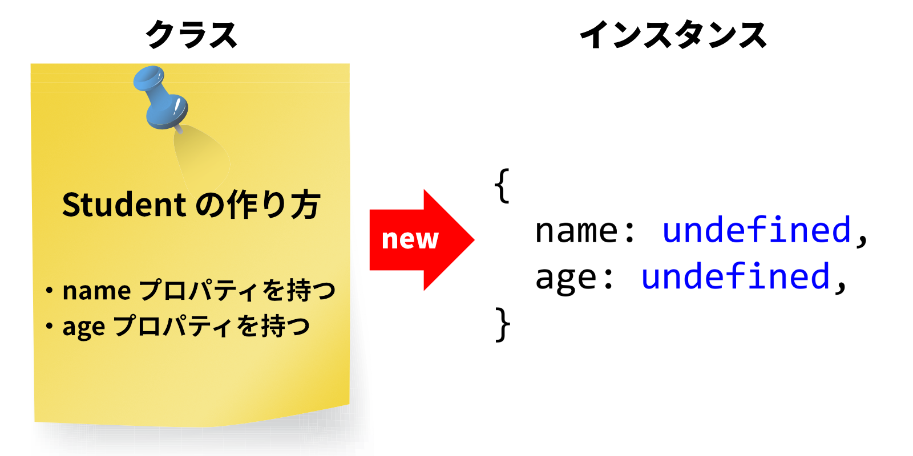

import CodeBlock from '@theme/CodeBlock';
import Term from "@site/src/components/Term";
import OpenInCodeSandbox from "@site/src/components/OpenInCodeSandbox";

## クラスとインスタンス

オブジェクトを使うと、複数の値をひとまとまりに扱うことができました。実世界においては、同じ形（＝同じプロパティを持つ）のオブジェクトを多く扱う場合が多いです。例えば、学生をオブジェクトとして表すことを考えてみましょう。学生には必ず名前と年齢があるはずなので、ひとまず `name` と `age` をプロパティに持つとしましょう。

```javascript
const tanaka = {
  name: "田中",
  age: 18,
};
```

同じ形をしたオブジェクトを統一的に扱うための仕組みが **クラス** です。クラスは、オブジェクトの設計図になります。

次のコードでは、先ほど作った `tanaka` のように `name` や `age` というプロパティを持つオブジェクトの設計図として、クラス `Student` を定義しています。

```javascript
class Student {
  name; // name プロパティを作成する
  age = 18; // age プロパティのデフォルト値として `18` を使用する
}
```

:::info
クラスの名前は、通常の<Term type="camelCase">キャメルケース</Term>の最初の文字だけを大文字にした<Term type="pascalCase">パスカルケース</Term>で記述するのが普通です。
:::

`new` 演算子をクラスに対して適用すると、設計図に基づいてオブジェクトが作成されます。こうしてできたオブジェクトを、もとになったクラスの**インスタンス**と呼びます。

```javascript
const tanaka = new Student(); // Student クラスをもとにオブジェクトを作成する

tanaka.name = "田中"; // name プロパティに代入
document.write(tanaka.age); // age プロパティのデフォルト値は 18
```



:::tip `undefined` という値
上で定義した `Student` クラスには、デフォルト値の指定されていないプロパティ `name` が存在します。`new Student` をした直後のオブジェクトの `name` プロパティの値はどうなっているのでしょうか。

実は、JavaScript には、未定義であることを表す特殊な値 `undefined` が存在しています。これまで、JavaScript の値には数値、文字列、論理値、オブジェクトがあるとしてきましたが、これらとはまた別の値です。

存在しないプロパティの値、値を返さない関数の戻り値などは、すべて `undefined` となります。

```javascript
const emptyObject = {};
function emptyFunction() {}

document.write(emptyObject.unknownProperty); // 存在しないプロパティは undefined
document.write(emptyFunction()); // 値を返さない関数の戻り値は undefined
```
:::

### 課題
`weight` と `cost` をプロパティとして持ち、 `weight` のデフォルト値が `"1t"` であるクラス `Car` を作成し、 `cost` に好きな値を代入してみましょう。

## メソッド

同じ形をしたオブジェクトに対しては、同じような処理を行うことが多いです。例えば、学生はたいてい最初の授業で自己紹介をします。

オブジェクトに対して定義されている関数を**メソッド**と呼びます。メソッドの定義はクラス定義の中で行われますが、関数と異なり、`function` キーワードを必要としません。

```javascript
class Student {
  name;
  age;

  // メソッド introduceSelf を定義する
  introduceSelf() {
    // this は作成されたインスタンスを指す
    document.write(`私の名前は${this.name}です。${this.age}歳です。`);
  }
}
```

メソッド自体は単なる設計図でしかないため、実際のオブジェクトが存在するわけではありません。そこで、メソッド内では、設計図から作成されたインスタンス自身を指す特殊な変数 `this` が使用できます。

メソッドを使用するには、プロパティへのアクセス時と同じく、インスタンスに対して `.`（ドット）記号を用います。

```javascript
const tanaka = new Student();
tanaka.name = "田中";
tanaka.age = 18;

// introduceSelf メソッド内では this は tanaka に格納されたオブジェクトになる
tanaka.introduceSelf();
```

:::tip メソッドやプロパティの表記と `prototype`
多くの言語で、クラス `Class` のメソッドやプロパティ `method` を、`#` 記号を用いて `Class#method` と表記します。本資料では他言語の慣習に習い、この表記を用いるものとします。たとえば、上の例で定義されているメソッドは `Student#introduceSelf` メソッドです。

ただし、JavaScript においては `prototype` という語を用いて `Class.prototype.method` とされる場合があります。これはより厳密な表記です。外部の資料を読む場合は注意してください。
:::

### 課題

自分自身の年齢を 1 増やすメソッド `incrementAge` を定義して、実行してみてください。

<details>
  <summary>解答</summary>
  <div>
    <CodeBlock language="javascript">{`
class Student {
  name;
  age = 18;
  introduceSelf() {
    document.write(\`私の名前は\${this.name}です。\`);
    document.write(\`\${this.age}歳です\`);
  }
  incrementAge() {
    this.age += 1;
  }
}\n
const tanaka = new Student();
tanaka.name = "田中";
tanaka.age = 19;
tanaka.introduceSelf();
tanaka.incrementAge();
tanaka.introduceSelf();
    `.trim()}</CodeBlock>
    <OpenInCodeSandbox path="/docs/2-browser-apps/04-class/samples/method" />
  </div>
</details>


## コンストラクタ

**コンストラクタ**は、インスタンスを作成するタイミング（`new` 演算子をクラスに適用するタイミング）で実行される特殊なメソッドです。コンストラクタとなるメソッドは `constructor` という名前で定義する必要があります。

```javascript
class Student {
  name;
  age;

  // コンストラクタを定義する
  constructor(name, yearOfBirth, currentYear) {
    this.name = name;
    this.age = currentYear - yearOfBirth;
  }

  introduceSelf() {
    document.write(`私の名前は${this.name}です。${this.age}歳です。`);
  }
}

const tanaka = new Student("田中", 2004, 2022);
tanaka.introduceSelf();
```

## 継承

クラス定義の際に `extends` キーワードを用いて別のクラスを指定すると、指定されたクラスのプロパティとメソッドを全て受け継いだ新たなクラスを定義することができます。

```javascript
class Student {
  name;
  age;

  constructor(name, age) {
    this.name = name;
    this.age = age;
  }

  introduceSelf() {
    document.write(`私の名前は${this.name}です。${this.age}歳です。`);
  }
}

// Student を継承したクラス FreshmanStudent を定義
class FreshmanStudent extends Student {
  selectedLanguage;

  constructor(name, age, selectedLanguage) {
    // コンストラクタ内では super キーワードで親クラスのコンストラクタを呼ぶ必要がある
    super(name, age);
    this.selectedLanguage = selectedLanguage;
  }

  // 継承元のクラスと同じ名前のメソッドを定義（オーバーライド）すると、継承元のクラスのメソッドは覆い隠されてしまう
  introduceSelf() {
    // super キーワードを使えば覆い隠された同名のメソッドを呼び出せる
    super.introduceSelf();
    document.write(`${this.selectedLanguage}選択です。`);
  }
}

const tanaka = new FreshmanStudent("田中", "18", "ドイツ語");
tanaka.introduceSelf(); // 私の名前は田中です。18歳です。ドイツ語選択です。
```

### 課題

`Student` クラスを継承して `SeniorStudent` クラスを作ってみましょう。`SeniorStudent` クラスのインスタンスは `researchQuestion` プロパティを持ち、`introduceSelf` メソッドを実行すると自分の名前を出力した後に自分の研究内容を紹介するようにしてみましょう。

<details>
  <summary>解答</summary>
  <div>
    <CodeBlock language="javascript">{`
class Student {
  name;
  age;
  introduceSelf() {
    document.write(\`私の名前は\${this.name}です。\${this.age}歳です。\`);
  }
}\n
class SeniorStudent extends Student {
  researchQuestion;
  introduceSelf() {
    super.introduceSelf();
    document.write(\`研究テーマは\${this.researchQuestion}です。\`);
  }
}\n
const tanaka = new SeniorStudent();
tanaka.age = 22;
tanaka.name = "田中";
tanaka.researchQuestion = "量子力学";
tanaka.introduceSelf();
    `.trim()}</CodeBlock>
    <OpenInCodeSandbox path="/docs/2-browser-apps/04-class/samples/inheritance" />
  </div>
</details>


## `Date` クラス

[`Date` クラス](https://developer.mozilla.org/ja/docs/Web/JavaScript/Reference/Global_Objects/Date)は、JavaScript に標準で用意されている、日付や時刻を扱うためのクラスです。このように、JavaScript では、開発者が定義しなくても最初から使用可能なクラスが数多く用意されています。

```javascript
const myBirthDay = new Date("2014-05-06"); // Dateクラスをインスタンス化
document.write(myBirthDay.getFullYear()); // 2014
```

`Date` クラスのコンストラクタは、引数として日時を表す文字列をひとつとります。省略された場合には現在の日時を用います。

`getFullYear` メソッドは、年となる数値を返すメソッドです。

:::tip `Object` クラス
JavaScript では、**全てのオブジェクトは[`Object` クラス](https://developer.mozilla.org/ja/docs/Web/JavaScript/Reference/Global_Objects/Object)を自動的に継承します**。このため、全てのオブジェクトは `Object` クラスのメソッドを使用することができます。また、プリミティブな値でも、メソッドを呼び出すと自動的にオブジェクトに変換されます。

`toString` メソッドはその一つで、オブジェクトの文字列表記を返します。このメソッドはオーバーライド可能で、たとえば `Date` クラスではこのメソッドがオーバーライドされています。

```javascript
// 通常のオブジェクトの toString メソッドは "[object Object]" を返す
document.write({ name: "田中" }.toString()); // [object Object]

// Date クラスは toString メソッドをオーバーライドしている
document.write(new Date().toString()); // Fri Apr 01 2022 10:00:00 GMT+0900 (Japan Standard Time)

// 関数もオブジェクトの一種なのでやはり Object クラスを継承している
function add(a, b) {
  return a + b;
}
document.write(add.toString()); // function add(a, b) { return a + b; }

// 数値や文字列、論理値はメソッドを呼び出すときに自動的にオブジェクトに変換される
document.write((123).toString()); // 123
document.write("Hello World!".toString()); // Hello World!
document.write(false.toString()); // false
```
:::

### 課題

`document.getElementById` 関数で `div` 要素を取得すると、[`HTMLDivElement` クラス](https://developer.mozilla.org/ja/docs/Web/API/HTMLDivElement)のインスタンスが返されます。このクラスは [`HTMLElement` クラス](https://developer.mozilla.org/ja/docs/Web/API/HTMLElement) を継承しており、さらに `HTMLElement` クラスは [`Element` クラス](https://developer.mozilla.org/ja/docs/Web/API/Element)を、`Element` クラスは [`Node` クラス](https://developer.mozilla.org/ja/docs/Web/API/Node)を継承しています。


実は、[DOM](./../../1-trial-session/11-dom/index.md) の節で使用した `textContent` プロパティは、この `Node` クラスで定義されています。

`HTMLDivElement` クラスを自分でインスタンス化し、`textContent` プロパティに適当な値を代入して、`document.body.appendChild` 関数を用いて、作成した `div` 要素を `body` 要素の中に追加しましょう。

※ `HTMLDivElement` クラスをインスタンス化する際には `new HTMLDivElement` ではなく `document.createElement("div")` とします。

(発展) `document.body` は何のクラスのインスタンスなのでしょうか。`appendChild` メソッドはどのクラスに定義されているのでしょうか。
