import responsiveCardsVideo from "./responsive-cards.mp4";
import responsiveCenterCardsVideo from "./responsive-center-cards.mp4";
import responsiveHeaderVideo from "./responsive-header.mp4";

この節では、CSSを使用してHTML要素のレイアウトを調整する方法を学びます。

例として、次のような料金プランを表すカードを作ることを目標に進めていきます。

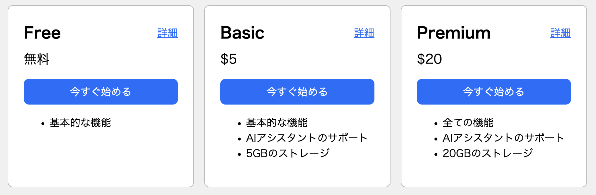

まずは、HTMLとCSSで料金プランのカードを作り始めてみます。

```html title="index.html"
<!doctype html>
<html lang="ja">
  <head>
    <meta charset="utf-8" />
    <title>料金プラン</title>
    <link rel="stylesheet" href="./style.css" />
  </head>
  <body>
    <div id="container">
      <div class="card">
        <div class="plan">Free</div>
        <div class="price">無料</div>
        <button type="button" class="button">今すぐ始める</button>
        <ul>
          <li>基本的な機能</li>
        </ul>
      </div>
      <div class="card">
        <div class="plan">Basic</div>
        <div class="price">$5</div>
        <button type="button" class="button">今すぐ始める</button>
        <ul>
          <li>基本的な機能</li>
          <li>AIアシスタントのサポート</li>
          <li>5GBのストレージ</li>
        </ul>
      </div>
      <div class="card">
        <div class="plan">Premium</div>
        <div class="price">$20</div>
        <button type="button" class="button">今すぐ始める</button>
        <ul>
          <li>全ての機能</li>
          <li>AIアシスタントのサポート</li>
          <li>20GBのストレージ</li>
        </ul>
      </div>
    </div>
  </body>
</html>
```

```css title="style.css"
body {
  background-color: #f0f0f0;
}

.card {
  background-color: #fff;
}

.plan {
  font-weight: bold; /* 太字にする */
  font-size: 24px;
}

.price {
  font-size: 20px;
}

.button {
  background-color: #0d6efd;
  color: #fff;
  font-size: 16px;
}
```

:::tip[16進数カラーコード]
`#f0f0f0`や`#0d6efd`のように、6桁の英数字で色を指定する記法を16進数カラーコードと呼びます。左から順に2桁ずつが、それぞれ赤・緑・青の成分を16進数で表しています。

また、省略形として3桁で指定することもできます。例えば、`#1da`は`#11ddaa`と同じ意味になります。
:::

## 幅と高さ

今のところ、カードの幅が画面いっぱいに広がってしまっています。

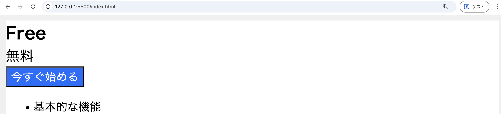

`width`プロパティで要素の幅を設定することができます。カードに適切な幅を設定するには、次のようにします。

```css
.card {
  background-color: #fff;
  // highlight-next-line
  width: 240px;
}
```

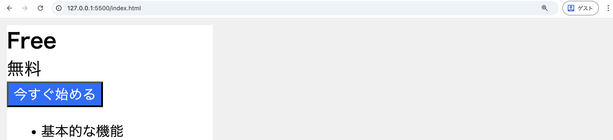

なお、`width`プロパティで幅を設定したのと同様に、高さを設定したい場合は`height`プロパティを使うことができます。

<ViewSource url={import.meta.url} path="_samples/width" />

`width`プロパティや`height`プロパティの値には、親要素などに占める割合を表すパーセント値を指定することもできます。ボタンの幅がその親要素であるカードいっぱいに広がるようにするには、次のようにします。

```css
.button {
  background-color: #0d6efd;
  color: #fff;
  font-size: 16px;
  // highlight-next-line
  width: 100%;
}
```

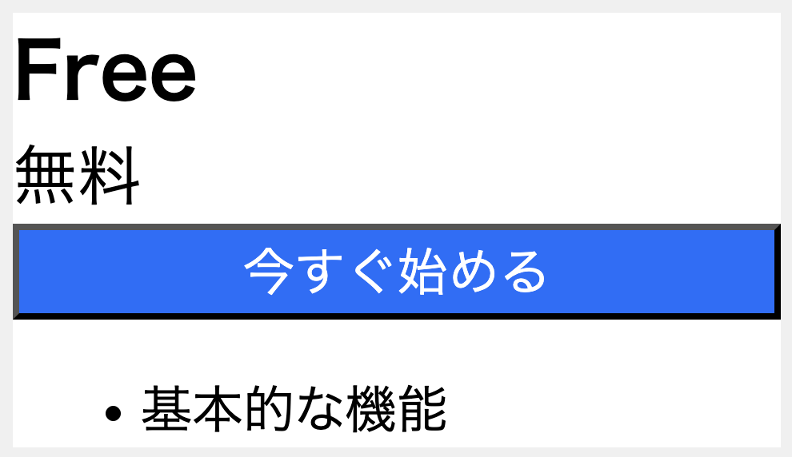

<ViewSource url={import.meta.url} path="_samples/width-percent" />

:::tip[ブロック要素とインライン要素]

HTML要素は、それらが表示される際のデフォルトの振る舞いにおいて分類することができます。

`div`や`h1`、`p`などの要素は一般にブロック要素と呼ばれます。これらは新しい行から始まり、`width`プロパティや`height`プロパティが設定できます。`width`プロパティを設定しない場合は親要素いっぱいに広がります。

`span`や`a`、`strong`などの要素は一般にインライン要素と呼ばれます。これらは新しい行から始まらず、`width`プロパティや`height`プロパティも設定できず、内容に応じた幅・高さになります。
:::

## ボーダー

`border`プロパティを使って、ボーダーと呼ばれる境界線を設定することができます。次の例では、カードにボーダーを追加しています。

```css
.card {
  background-color: #fff;
  width: 240px;
  // highlight-next-line
  border: 1px solid #bbb;
}
```

`border`プロパティに3つの値を指定する場合、それらの値はボーダーの幅・種類・色を表します。

また、`border`プロパティに`none`を指定するとボーダーは表示されなくなります。次の例では、ボタンに付いていたデフォルトのボーダーを消しています。

```css
.button {
  background-color: #0d6efd;
  color: #fff;
  font-size: 16px;
  width: 100%;
  // highlight-next-line
  border: none;
}
```


<ViewSource url={import.meta.url} path="_samples/border" />

`border-radius`プロパティで角を丸めることができます。指定する値は半径の大きさです。次の例では、カードの角とボタンの角を丸くしています。

```css
.card {
  background-color: #fff;
  width: 240px;
  border: 1px solid #bbb;
  // highlight-next-line
  border-radius: 8px;
}
```

```css
.button {
  background-color: #0d6efd;
  color: #fff;
  font-size: 16px;
  width: 100%;
  border: none;
  // highlight-next-line
  border-radius: 8px;
}
```

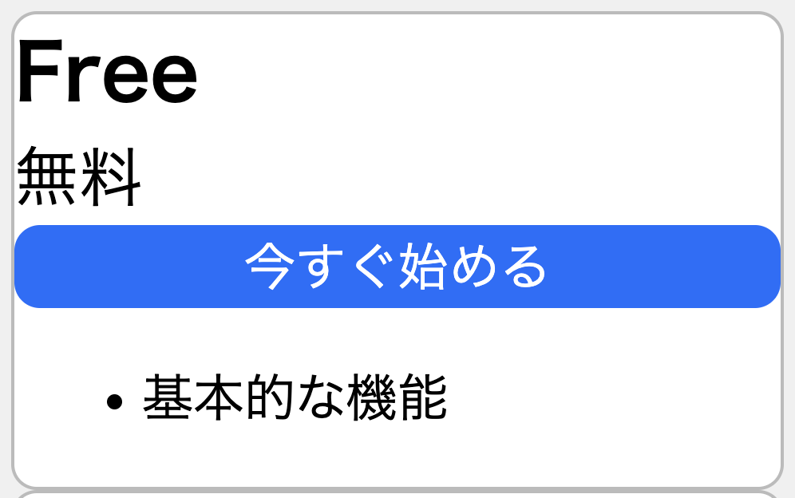

<ViewSource url={import.meta.url} path="_samples/border-radius" />

## マージン

`margin`プロパティを使って、マージンと呼ばれる余白を設定することができます。マージンはボーダーの外側の余白です。次の例では、カードの外側に適切なマージンを設定しています。

```css
.card {
  background-color: #fff;
  width: 240px;
  border: 1px solid #bbb;
  border-radius: 8px;
  // highlight-next-line
  margin: 8px;
}
```

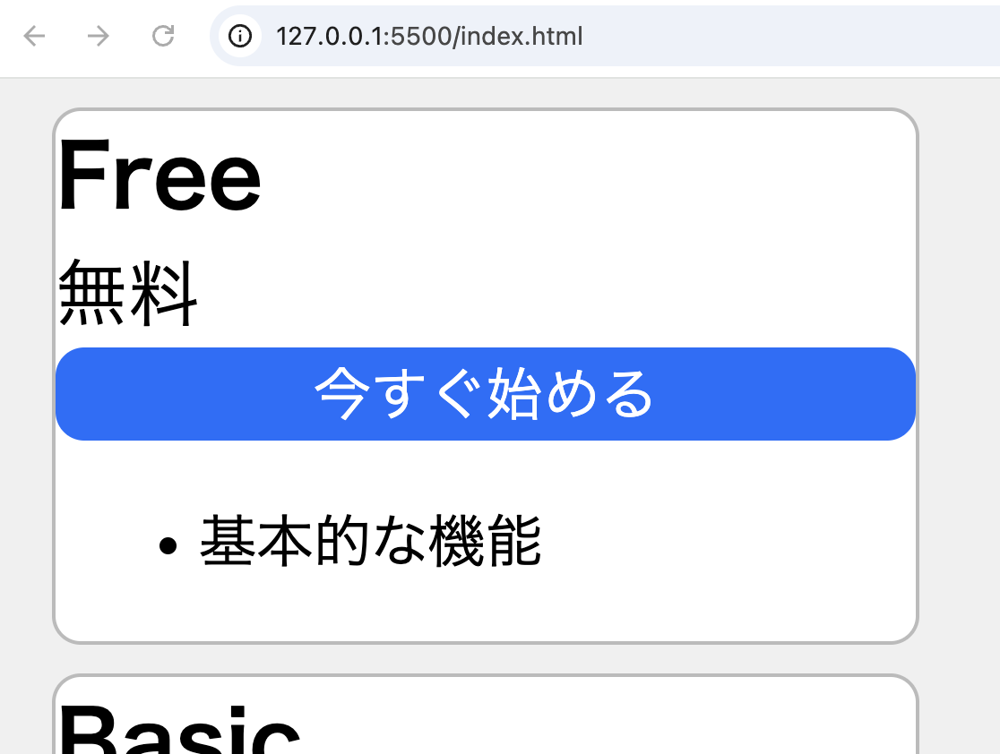

<ViewSource url={import.meta.url} path="_samples/margin" />

上下左右の全てではなく、特定の方向のみにマージンを設定したい場合はどうでしょうか。

上側だけにマージンを設定したい場合は、`margin-top`プロパティを使用します。次の例では、価格表示の上側とボタンの上側にマージンを設定しています。

```css
.price {
  font-size: 20px;
  // highlight-next-line
  margin-top: 8px;
}

.button {
  background-color: #0d6efd;
  color: #fff;
  font-size: 16px;
  width: 100%;
  border: none;
  border-radius: 8px;
  // highlight-next-line
  margin-top: 16px;
}
```

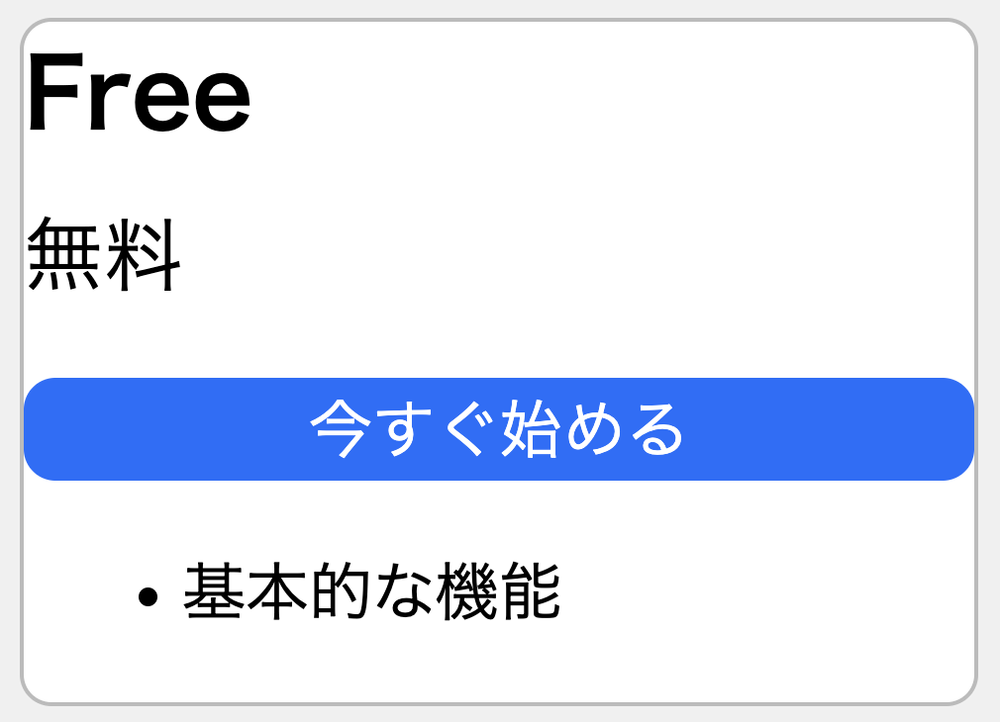

<ViewSource url={import.meta.url} path="_samples/margin-top" />

同様に、`margin-bottom`, `margin-left`, `margin-right`プロパティを使用すると、それぞれ下側・左側・右側のみにマージンを設定することができます。

`margin`のみならず、`padding`や`border`などについても同様です。

## パディング

`padding`プロパティを使って、パディングと呼ばれる余白を設定することができます。パディングはボーダーの内側の余白です。

次の例では、カードの内側とボタンの内側にパディングを設定しています。

```css
.card {
  background-color: #fff;
  width: 240px;
  border: 1px solid #bbb;
  border-radius: 8px;
  margin: 8px;
  // highlight-next-line
  padding: 24px;
}
```

```css
.button {
  background-color: #0d6efd;
  color: #fff;
  font-size: 16px;
  width: 100%;
  border: none;
  border-radius: 8px;
  margin-top: 16px;
  // highlight-next-line
  padding: 8px;
}
```

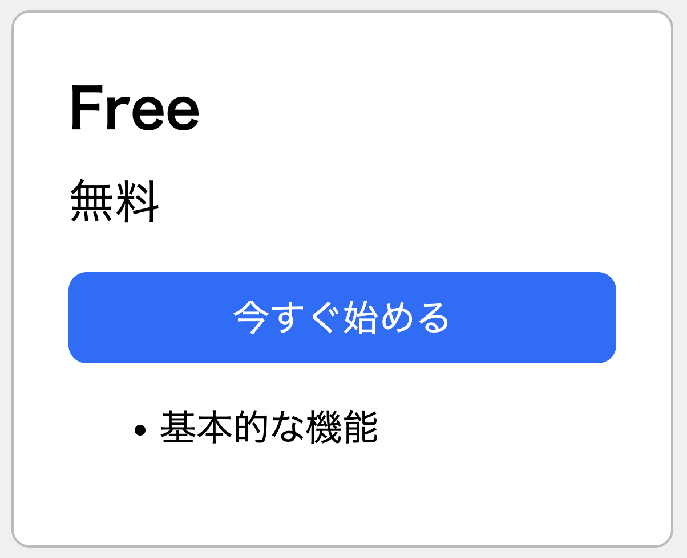

<ViewSource url={import.meta.url} path="_samples/padding" />

## フレックスボックス

現在は3枚のカードが縦に並んでいますが、これを横に並ぶようにすることを考えます。

フレックスボックスを使用すると、要素を柔軟にレイアウトすることができます。フレックスボックスを使用するには、レイアウトしたい要素の親要素の`display`プロパティに`flex`を指定します。フレックスボックスでレイアウトされた要素は、デフォルトで横並びになります。

次の例では、カードの親要素の`display`プロパティに`flex`を指定し、カードが横並びになるようにしています。

```css
// highlight-start
#container {
  display: flex;
}
// highlight-end
```

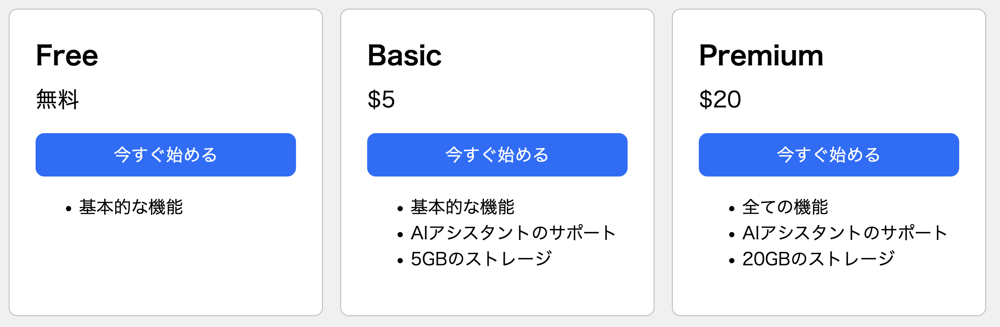

<ViewSource url={import.meta.url} path="_samples/flexbox" />

これまでは、カードどうしの間隔を空けるために各カードにマージンを設定していました。しかし、フレックスボックスを使う場合は、この目的により適した`gap`プロパティを利用できます。`gap`プロパティは、子要素であるカード側ではなく、親要素のコンテナ側で設定します。このプロパティを使うと、要素と要素の間にのみ間隔が作られ、端の要素の外側には余白がつきません。

次の例では、カードの`margin`プロパティを削除し、親要素に`gap`プロパティを指定しています。

```css
.card {
  background-color: #fff;
  width: 240px;
  border: 1px solid #bbb;
  border-radius: 8px;
  // highlight-next-line
  /* margin: 8px; を削除 */
  padding: 24px;
}
```

```css
#container {
  display: flex;
  // highlight-next-line
  gap: 16px;
}
```

<ViewSource url={import.meta.url} path="_samples/flexbox-gap" />

### `flex-direction`プロパティ

フレックスボックスによるレイアウトの方向を変更するには、`flex-direction`プロパティを使用します。`row`を指定すれば水平に、`column`を指定すれば垂直にレイアウトされます。

先ほど、`display: flex;`を指定しただけでカードが横並びになったのは、このプロパティのデフォルト値が`row`であるためです。

実際に親要素の`flex-direction`プロパティを`column`に指定すると、カードが縦に並ぶことが確認できます。

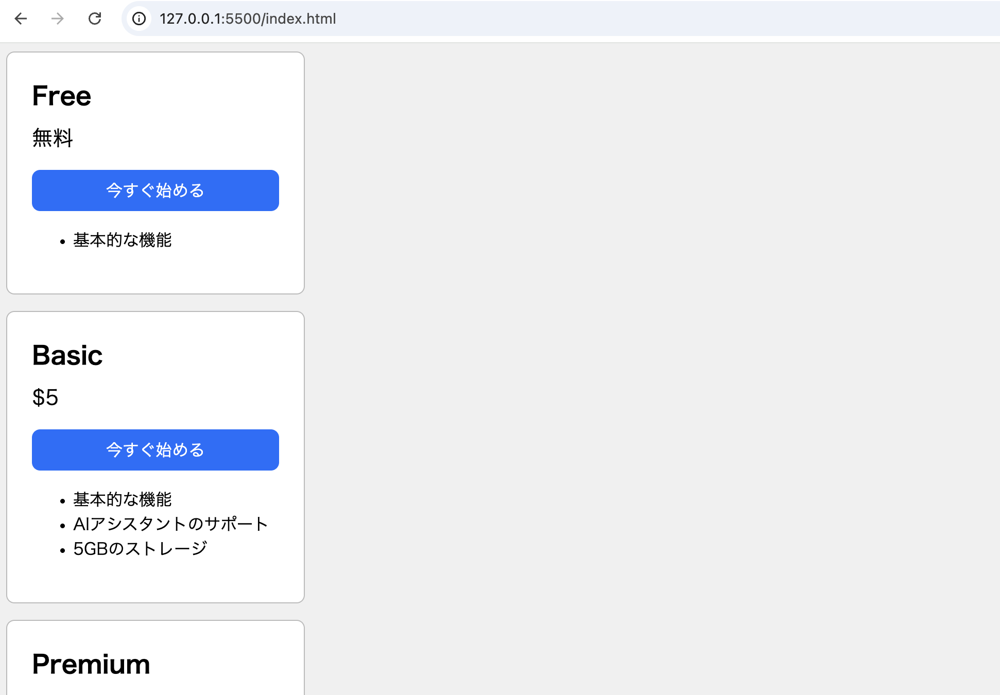

### `justify-content`プロパティ

フレックスボックスでは、`justify-content`プロパティを使うことで、`flex-direction`プロパティで指定した方向のレイアウトを制御することができます。

次の例では、`justify-content`プロパティを`center`に指定することで、カードを水平方向の中央に配置しています。

```css
#container {
  display: flex;
  gap: 16px;
  // highlight-next-line
  justify-content: center;
}
```

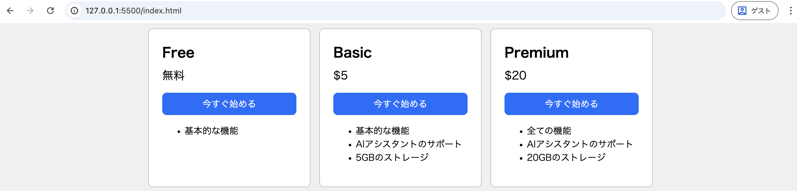

<ViewSource url={import.meta.url} path="_samples/justify-center" />

他のレイアウト方法も試してみましょう。

準備として、カードのプラン名の横に「詳細」のリンクを設置します。`<div class="plan">Free</div>`のようになっていた部分を次のように変更し、リンクにはボタンと同じ色を適用します。

```html
<div class="card-header">
  <div class="plan">Free</div>
  <a href="" class="detail">詳細</a>
</div>
```

```css
// highlight-start
.detail {
  color: #0d6efd;
}
// highlight-end
```

次の例では、`justify-content`プロパティを`space-between`に指定することで、プラン名とリンクを水平方向の両端に配置しています。

```css
// highlight-start
.card-header {
  display: flex;
  justify-content: space-between;
}
// highlight-end
```

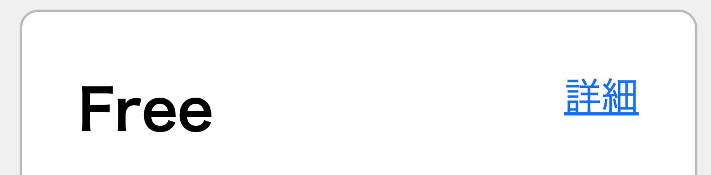

<ViewSource url={import.meta.url} path="_samples/justify-space-between" />

### `align-items`プロパティ

`align-items`プロパティを使うことで、`flex-direction`プロパティで指定した方向と交差する方向のレイアウトを制御できます。

次の例では、`align-items`プロパティを`center`に指定することで、プラン名とリンクを垂直方向の中央に配置しています。

```css
.card-header {
  display: flex;
  justify-content: space-between;
  // highlight-next-line
  align-items: center;
}
```

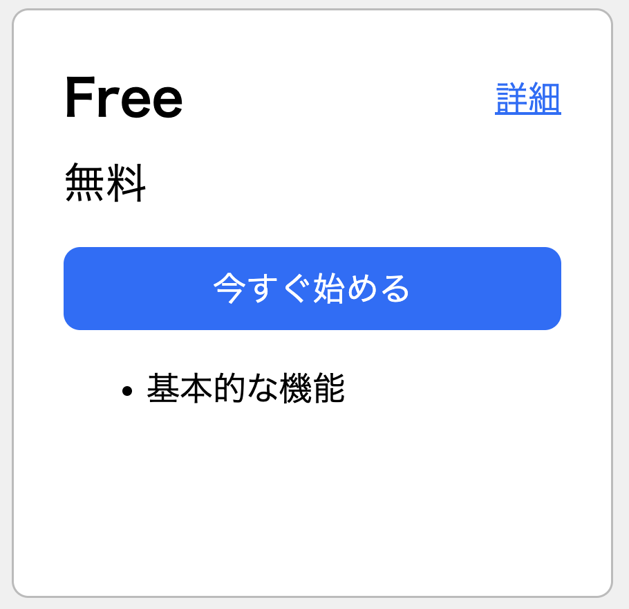

<ViewSource url={import.meta.url} path="_samples/align-center" />

## レスポンシブデザイン

先ほどはフレックスボックスを使ってカードを横並びにすることができましたが、スマートフォンのような画面の幅が狭い端末では、カードを縦に並べた方が見やすくなります。そこで、画面の幅が一定より小さい場合は、カードが縦並びになるようにしていきましょう。

このように、さまざまな画面サイズの端末に対応するデザイン手法はレスポンシブデザインと呼ばれます。

レスポンシブデザインを行っていく準備として、HTMLの`head`要素内に次の`meta`要素を記述し、スマートフォンなどの端末でも本来の画面サイズで表示が行われるようにしましょう。

```html title="index.htmlのhead要素内"
<meta name="viewport" content="width=device-width, initial-scale=1.0" />
```

レスポンシブデザインを実現するための仕組みとして、メディアクエリがあります。メディアクエリを使用すると、画面の幅などの条件によって適用するCSSを切り替えることができます。次のような構文で記述します。

```css
@media (条件) {
  /* 条件が真の場合に適用されるスタイル */
}
```

`条件`の部分には、例えば「画面幅が800px以下の場合」としたいならば`max-width: 800px`のように指定します。

メディアクエリを使って、画面幅が一定より小さい場合に`flex-direction`プロパティの値が`column`となるようにすることで、カードを縦並びにすることができます。

```css
// highlight-start
@media (max-width: 1024px) {
  #container {
    flex-direction: column;
  }
}
// highlight-end
```

<video src={responsiveCardsVideo} controls />

<ViewSource url={import.meta.url} path="_samples/media-query" />

縦並びになった場合も、カードが左右中央に表示されるようにしましょう。

この際は、`flex-direction`プロパティの値が`column`となり垂直方向にレイアウトされているため、水平方向のレイアウトを制御するためには`justify-content`プロパティではなく`align-items`プロパティを使用する必要があります。

次の例では、`align-items`プロパティを`center`に指定することで、カードを水平方向の中央に配置しています。

```css
@media (max-width: 1024px) {
  #container {
    flex-direction: column;
    // highlight-next-line
    align-items: center;
  }
}
```

<video src={responsiveCenterCardsVideo} controls />

<ViewSource url={import.meta.url} path="_samples/media-query-align-center" />

## 演習問題

CSSを使って、次のようなウェブサイトのヘッダーを作成しましょう。

<video src={responsiveHeaderVideo} controls />

- 画面幅が広い場合は、ナビゲーションメニューが表示されます。
- 画面幅が狭い場合は、ナビゲーションメニューの代わりにハンバーガーアイコンが表示されるようにします。

HTMLは次のものを使用してください。

```html title="index.html"
<!doctype html>
<html lang="ja">
  <head>
    <meta charset="utf-8" />
    <meta name="viewport" content="width=device-width, initial-scale=1.0" />
    <title>My Site</title>
    <link rel="stylesheet" href="./style.css" />
  </head>
  <body>
    <header>
      <div class="container">
        <div id="logo">MySite</div>
        <button id="hamburger">
          
        </button>
        <nav>
          <ul id="menu">
            <li><a href="">HOME</a></li>
            <li><a href="">ABOUT</a></li>
            <li><a href="">WORKS</a></li>
            <li><a href="">CONTACT</a></li>
          </ul>
        </nav>
      </div>
    </header>
  </body>
</html>
```

CSSは次のものをベースに、必要な箇所を記述してください。

```css title="style.css"
body {
  margin: 0;
  background-color: #fff;
}

header ul {
  margin: 0;
  padding: 0;
  list-style: none; /* リストのマーカー（•など）を非表示にする */
}

#menu a {
  text-decoration: none; /* リンクの下線を消す */
  color: #777;
  font-size: 14px;
}

#logo {
  font-weight: bold; /* 太字にする */
  font-size: 24px;
}

#hamburger {
  display: none;
  width: 40px;
  height: 40px;
  border: none;
  background: none;
  padding: 0;
  cursor: pointer; /* マウスカーソルをポインタにする */
}

/* ここから下を変更してください。 */

header {
  background-color: #fff;
  /* ここで適切な境界線を設定する */
}

.container {
  display: flex;
  /* ここで適切なレイアウトを設定する */
}

#menu {
  display: flex;
  /* ここで適切なレイアウトを設定する */
}

@media (max-width: 768px) {
  #hamburger {
    display: flex;
  }
  /* ここで適切な設定を行う */
}
```

:::tip

`display`プロパティに`none`を指定すると、要素が表示されなくなります。

:::

<Answer>

```css title="style.css"
body {
  margin: 0;
  background-color: #fff;
}

header ul {
  margin: 0;
  padding: 0;
  list-style: none;
}

#menu a {
  text-decoration: none;
  color: #777;
  font-size: 14px;
}

#logo {
  font-weight: bold;
  font-size: 24px;
}

#hamburger {
  display: none;
  width: 40px;
  height: 40px;
  border: none;
  background: none;
  padding: 0;
  cursor: pointer;
}

header {
  background-color: #fff;
  border-bottom: 1px solid #eee;
}

.container {
  display: flex;
  justify-content: space-between;
  align-items: center;
  padding: 16px 24px;
}

#menu {
  display: flex;
  gap: 32px;
}

@media (max-width: 768px) {
  #hamburger {
    display: flex;
  }

  nav {
    display: none;
  }
}
```

<ViewSource url={import.meta.url} path="_samples/responsive-header" />

</Answer>
