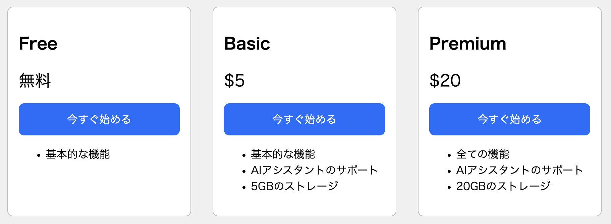
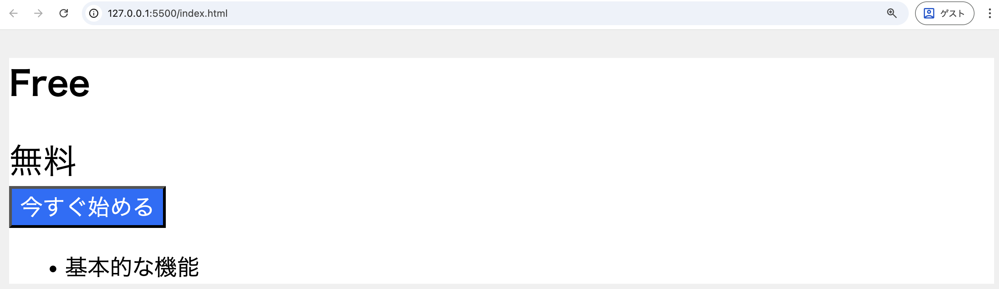
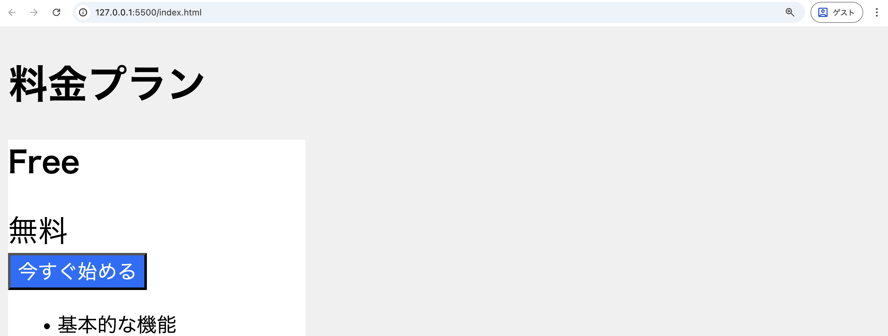
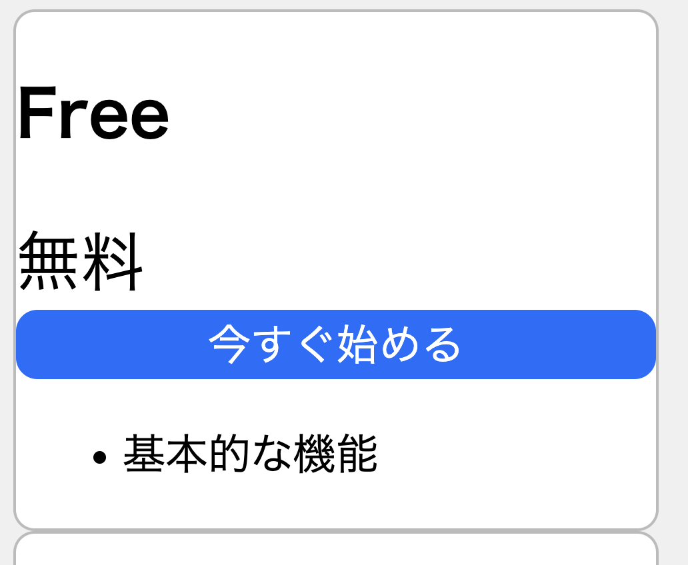
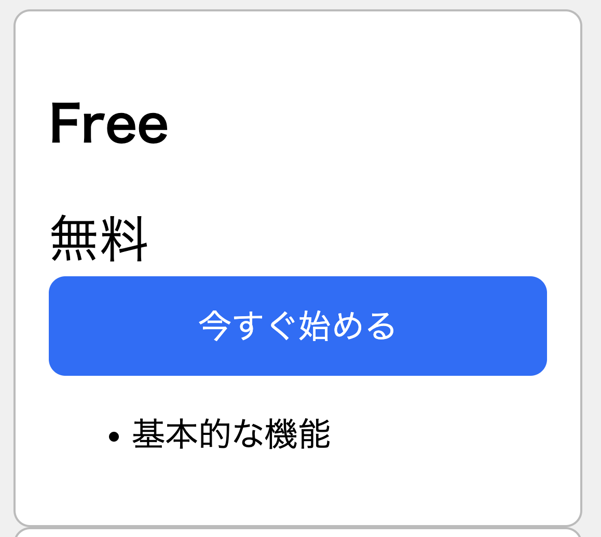
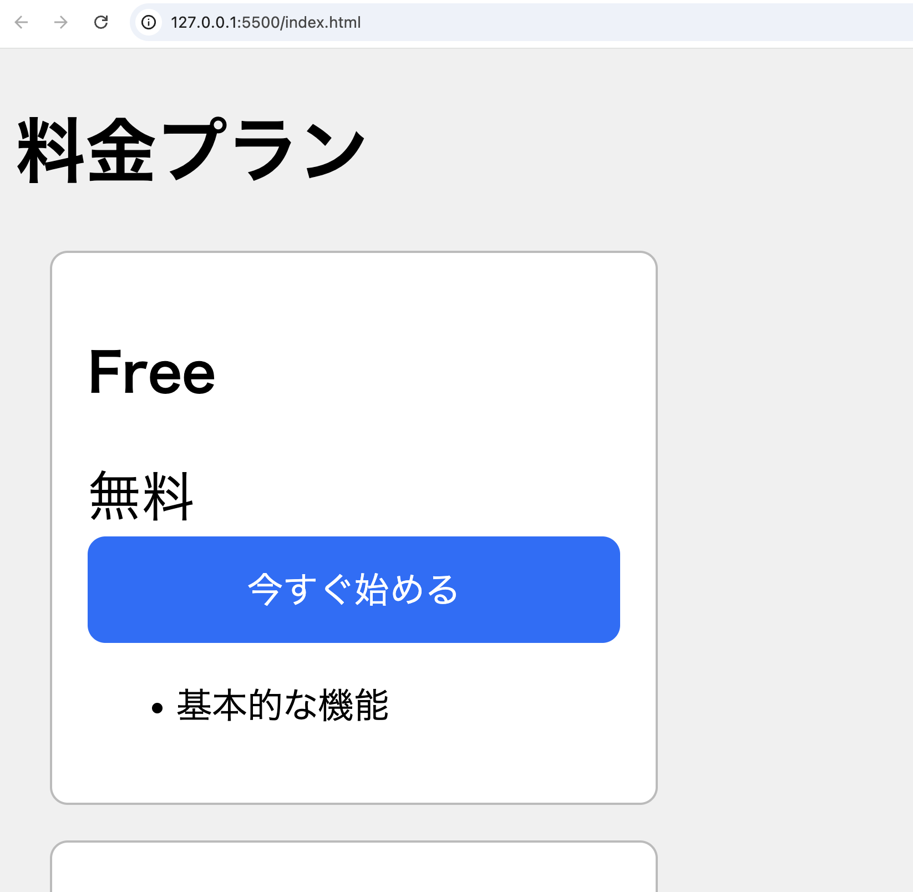
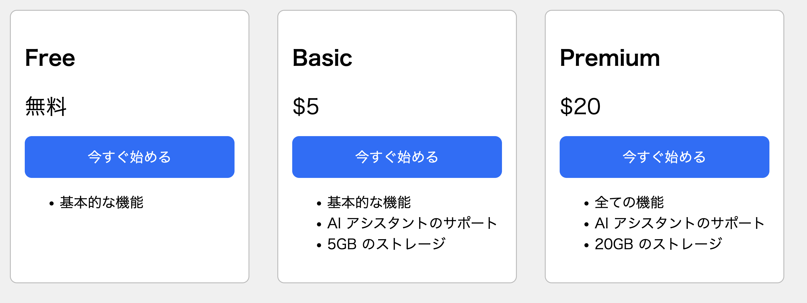

import responsiveCardsVideo from "./cards-responsive.mp4";

この節では、CSSを使用してHTML要素のレイアウトを調整する方法を学びます。

例として、次のような料金プランを表すカードを作ることを目標に進めていきます。



まずは、HTMLとCSSで料金プランのカードを作り始めてみます。

```html title="index.html"
<!doctype html>
<html lang="ja">
  <head>
    <meta charset="utf-8" />
    <title>料金プラン</title>
    <link rel="stylesheet" href="./style.css" />
  </head>
  <body>
    <h1>料金プラン</h1>
    <div id="container">
      <div class="card">
        <h2>Free</h2>
        <div class="price">無料</div>
        <button type="button" class="button">今すぐ始める</button>
        <ul>
          <li>基本的な機能</li>
        </ul>
      </div>
      <div class="card">
        <h2>Basic</h2>
        <div class="price">$5</div>
        <button type="button" class="button">今すぐ始める</button>
        <ul>
          <li>基本的な機能</li>
          <li>AIアシスタントのサポート</li>
          <li>5GBのストレージ</li>
        </ul>
      </div>
      <div class="card">
        <h2>Premium</h2>
        <div class="price">$20</div>
        <button type="button" class="button">今すぐ始める</button>
        <ul>
          <li>全ての機能</li>
          <li>AIアシスタントのサポート</li>
          <li>20GBのストレージ</li>
        </ul>
      </div>
    </div>
  </body>
</html>
```

```css title="style.css"
body {
  background-color: #f0f0f0;
}

.card {
  background-color: #fff;
}

.price {
  font-size: 24px;
}

.button {
  background-color: #0d6efd;
  color: #fff;
  font-size: 16px;
}
```

:::tip[16進数カラーコード]
`#f0f0f0`や`#0d6efd`のように、6桁の英数字で色を指定する記法を16進数カラーコードと呼びます。左から順に2桁ずつが、それぞれ赤・緑・青の成分を16進数で表しています。

また、省略形として3桁で指定することもできます。例えば、`#1da`は`#11ddaa`と同じ意味になります。
:::

## 幅と高さ

今のところ、カードの幅が画面いっぱいに広がってしまっています。



`width`プロパティで要素の幅を設定することができます。カードに適切な幅を設定するには、次のようにします。

```css
.card {
  background-color: #fff;
  width: 240px; /* 追加 */
}
```



なお、`width`プロパティで幅を設定したのと同様に、高さを設定したい場合は`height`プロパティを使うことができます。

<ViewSource url={import.meta.url} path="_samples/width" />

`width`プロパティや`height`プロパティの値には、親要素などに占める割合を表すパーセント値を指定することもできます。ボタンの幅がその親要素であるカードいっぱいに広がるようにするには、次のようにします。

```css
.button {
  background-color: #0d6efd;
  color: #fff;
  font-size: 16px;
  width: 100%; /* 追加 */
}
```


<ViewSource url={import.meta.url} path="_samples/width-percent" />

:::tip[ブロック要素とインライン要素]

HTML要素は、それらが表示される際のデフォルトの振る舞いにおいて分類することができます。

`div`や`h1`、`p`などの要素は一般にブロック要素と呼ばれます。これらは新しい行から始まり、`width`プロパティや`height`プロパティが設定できます。`width`プロパティを設定しない場合は親要素いっぱいに広がります。

`span`や`a`、`strong`などの要素は一般にインライン要素と呼ばれます。これらは新しい行から始まらず、`width`プロパティや`height`プロパティも設定できず、内容に応じた幅・高さになります。
:::

## ボーダー

`border`プロパティを使って、ボーダーと呼ばれる境界線を設定することができます。次の例では、カードにボーダーを追加しています。

```css
.card {
  background-color: #fff;
  width: 240px;
  border: 1px solid #bbb; /* 追加 */
}
```

`border`プロパティに3つの値を指定する場合、それらの値はボーダーの幅・種類・色を表します。

また、`border`プロパティに`none`を指定するとボーダーは表示されなくなります。次の例では、ボタンに付いていたデフォルトのボーダーを消しています。

```css
.button {
  background-color: #0d6efd;
  color: #fff;
  font-size: 16px;
  width: 100%;
  border: none; /* 追加 */
}
```


<ViewSource url={import.meta.url} path="_samples/border" />

`border-radius`プロパティで角を丸めることができます。指定する値は半径の大きさです。次の例では、カードの角とボタンの角を丸くしています。

```css
.card {
  background-color: #fff;
  width: 240px;
  border: 1px solid #bbb;
  border-radius: 8px; /* 追加 */
}
```

```css
.button {
  background-color: #0d6efd;
  color: #fff;
  font-size: 16px;
  width: 100%;
  border: none;
  border-radius: 8px; /* 追加 */
}
```



<ViewSource url={import.meta.url} path="_samples/border-radius" />

## パディング

`padding`プロパティを使って、パディングと呼ばれる余白を設定することができます。パディングはボーダーの内側の余白です。次の例では、カードの内側とボタンの内側に適切なパディングを設定しています。

```css
.card {
  background-color: #fff;
  width: 240px;
  border: 1px solid #bbb;
  border-radius: 8px;
  padding: 16px; /* 追加 */
}
```

```css
.button {
  background-color: #0d6efd;
  color: #fff;
  font-size: 16px;
  width: 100%;
  border: none;
  border-radius: 8px;
  padding: 12px; /* 追加 */
}
```



<ViewSource url={import.meta.url} path="_samples/padding" />

## マージン

`margin`プロパティを使って、マージンと呼ばれる余白を設定することができます。マージンはボーダーの外側の余白です。次の例では、カードの外側に適切なマージンを設定しています。

```css
.card {
  background-color: #fff;
  width: 240px;
  border: 1px solid #bbb;
  border-radius: 8px;
  padding: 16px;
  margin: 16px; /* 追加 */
}
```



<ViewSource url={import.meta.url} path="_samples/margin" />

上下左右の全てではなく、特定の辺のみにマージンを設定したい場合はどうすればいいでしょうか。

例えば、上側だけにマージンを設定したい場合は、`margin-top`プロパティを使用します。次の例では、ボタンの上側にマージンをつけています。

```css
.button {
  background-color: #0d6efd;
  color: #fff;
  font-size: 16px;
  width: 100%;
  border: none;
  border-radius: 8px;
  padding: 12px;
  margin-top: 16px; /* 追加 */
}
```


同様に、`margin-bottom`, `margin-left`, `margin-right`プロパティを使用すると、それぞれ下側・左側・右側のみにマージンを設定することができます。

`margin`のみならず、`padding`や`border`などについても同様です。

<ViewSource url={import.meta.url} path="_samples/margin-top" />

## フレックスボックス

現在は3枚のカードが縦に並んでいますが、これを横に並ぶようにすることを考えます。

フレックスボックスを使用すると、要素を柔軟にレイアウトすることができます。フレックスボックスを使用してレイアウトするには、`display`プロパティに`flex`を指定します。フレックスボックスでレイアウトされた要素は、デフォルトで横並びになります。

次の例では、3枚のカードの親要素である`div`要素に`display: flex;`を指定しています。

```css
#container {
  display: flex;
}
```



<ViewSource url={import.meta.url} path="_samples/flexbox" />

## レスポンシブデザイン

先ほどはフレックスボックスを使ってカードを横並びにすることができましたが、スマートフォンのような画面の幅が狭い端末では、カードを縦に並べた方が見やすくなります。そこで、画面の幅が一定より小さい場合は、カードが縦並びになるようにしていきましょう。

このように、さまざまな画面サイズの端末に対応するデザイン手法はレスポンシブデザインと呼ばれます。

レスポンシブデザインを行っていく準備として、HTMLの`head`要素内に次の`meta`要素を記述し、スマートフォンなどの端末でも本来の画面サイズで表示が行われるようにしましょう。

```html title="index.html の head 要素内"
<meta name="viewport" content="width=device-width, initial-scale=1.0" />
```

レスポンシブデザインを実現するための仕組みとして、メディアクエリがあります。メディアクエリを使用すると、画面の幅などの条件によって適用するCSSを切り替えることができます。次のような構文で記述します。

```css
@media (条件) {
  条件が真の場合に適用されるスタイル;
}
```

`条件`の部分には、例えば「画面幅が800px以下の場合」としたいならば`max-width: 800px`のように指定します。

フレックスボックスによるレイアウトの方向を変更するには、`flex-direction`プロパティを使用します。`row`とすれば水平に、`column`とすれば垂直にレイアウトされます。先ほど、`display: flex;`を指定しただけでカードが横並びになったのは、このプロパティのデフォルト値が`row`であるためです。

次の例では、メディアクエリを使って、画面幅が一定より小さい場合に`flex-direction`プロパティが`column`となるようにしています。

```css
@media (max-width: 1024px) {
  #container {
    flex-direction: column;
  }
}
```

<video src={responsiveCardsVideo} controls />

<ViewSource url={import.meta.url} path="_samples/media-query" />
