import CodeBlock from '@theme/CodeBlock';
import Term from "@site/src/components/Term";
import ViewSource from "@site/src/components/ViewSource";
import ExternalVideoPlayer from "@site/src/components/ExternalVideoPlayer";

import absoluteScroll from "./position-absolute-scroll.mp4"

import fixedScroll from "./position-fixed-scroll.mp4"

import percentCss from "./percent-css.mp4"

import maxMinWidth from "./max-width-min-width.mp4"

import mediaQuery from "./mediaquery.mp4"

## CSS のボックスモデル

HTML の要素はすべて、一定の高さと幅を持った四角形だと考えることができます。その四角形は

- content（中身）
- padding（中身と境界線の間の幅）
- border（境界線）
- margin（境界線の外側の余白）

の 4 重構造になっています。

体験会の[「ウェブサイトの見た目を整える」ページの課題](https://learn.utcode.net/docs/trial-session/css/#%E8%AA%B2%E9%A1%8C-%E6%99%82%E9%96%93%E3%81%8C%E4%BD%99%E3%81%A3%E3%81%9F%E5%A0%B4%E5%90%88)を例に構造を見てみましょう（構造がわかりやすいよう、`border` を `10px` に変更しています）。

```html title=index.html
<!DOCTYPE html>
<html lang="ja">
  <head>
    <meta charset="utf-8" />
    <title>Title</title>
    <link rel="stylesheet" href="style.css" />
  </head>
  <body>
    <div class="box">Foo</div>
  </body>
</html>
```

```css title="style.css"
.box {
  margin: 30px;
  padding: 30px;
  border: 10px solid #aaa;
  border-radius: 10px;
  box-shadow: 0px 0px 2px 1px #aaa;
}
```

<ViewSource path="/docs/2-browser-apps/07-css-arrangement/_samples/box-model" />

このページを開発者ツールを使って見てみましょう。
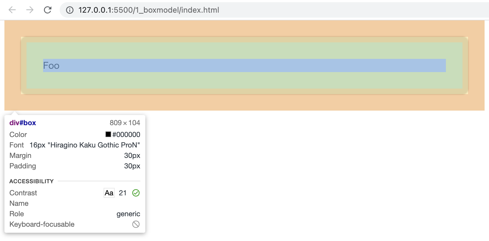

4 重に色分けされた構造が見えます。

`content` は主に `width` や `height` などのプロパティを、
`padding`, `border`, `margin` はそれぞれ主に `padding`, `border`, `margin` などのプロパティを操作することで制御できます。

`width`, `height`, `padding`, `border`, `margin`の値を変えると開発者ツールの表示がどう変わるか試してみましょう。

## ブロックレベル要素とインライン要素

HTML の要素は、ブロックレベル要素とインライン要素に分類されます。

**ブロックレベル要素**は見出しや段落、表など、文章を構成する基本単位となる要素です。

常に前後に改行が入り、可能なところまで（親要素いっぱいまで）左右に広がります。

そのため、ブロックレベル要素を複数並べて書くと、上から下へと配置されていきます。

ブロックレベル要素には `<div></div>` や `<p></p>`、 `<table></table>` 、`<ul></ul>` などがあります。

以下ではブロックレベル要素である `<div></div>` を 3 つ並べています。

```html title="index.html"
<body>
  <div class="box1">box1</div>
  <div class="box2">box2</div>
  <div class="box3">box3</div>
</body>
```

```css title="style.css"
.box1 {
  background-color: lightcoral;
}

.box2 {
  background-color: lightblue;
}

.box3 {
  background-color: lightgreen;
}
```

<ViewSource path="/docs/2-browser-apps/07-css-arrangement/_samples/three-div" />

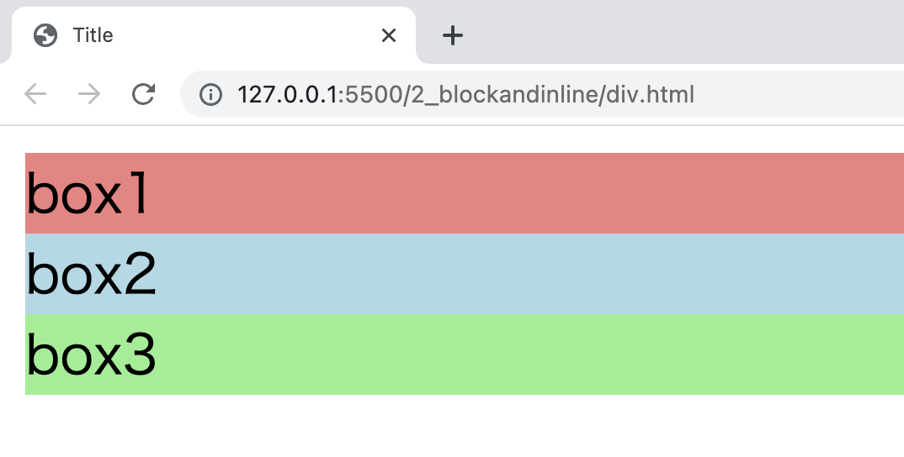

**インライン要素**は文章の一部や表の要素など、ブロックレベル要素の内容となる要素です。

前後に改行は伴わず、必要な幅だけを占有します。

そのため、インライン要素を複数並べて書くと、左から右へと配置されていきます。

インライン要素には `<span></span>` や `<a></a>` 、`` や `<input>` があります。

以下ではインライン要素である `<span></span>` を 3 つ並べています。

```html title="index.html"
<body>
  <span class="box1">box1</span>
  <span class="box2">box2</span>
  <span class="box3">box3</span>
</body>
```

<ViewSource path="/docs/2-browser-apps/07-css-arrangement/_samples/three-span" />

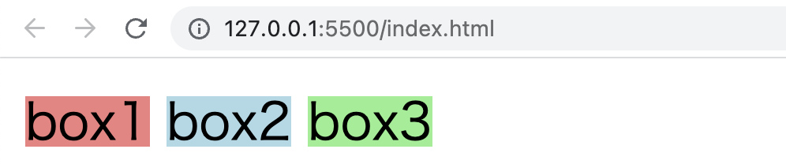

ブロックレベル要素の中にはブロックレベル要素もインライン要素も配置することができますが、インライン要素の中にブロックレベル要素を配置することはできません。

また、インライン要素の場合、`width` や `height` は適用されません。

### 課題

`display` 要素を操作することで要素の挙動を変更することができます。

上記のコードで、ブロックレベル要素である `<div></div>` に `display: inline` を、インライン要素である `<span></span>` に `display: block` を指定してみると表示はどう変わるか、試してみましょう。

<ViewSource path="/docs/2-browser-apps/07-css-arrangement/_samples/display" />

## フレックスボックス

フレックスボックスを利用すると、要素を横や縦に並べたり、間隔を均等に取って並べたり、順番を指定して並べたりといった柔軟な配置を簡単に行うことができます。

フレックスボックスを利用するには、配置したい要素の**親要素**に `display: flex` を適用します。

以下のように、`box1`, `box2`, `box3` という 3 つの `<div></div>` が `wrapper` という `<div></div>` の中に並んでいる状態を考えましょう。

```html title="index.html"
<body>
  <div class="wrapper">
    <div class="box1">box1</div>
    <div class="box2">box2</div>
    <div class="box3">box3</div>
  </div>
</body>
```

このままだとブロックレベル要素である `<div></div>` が並んでいるだけなので、`box1`, `box2`, `box3` は縦に並んで表示されます。

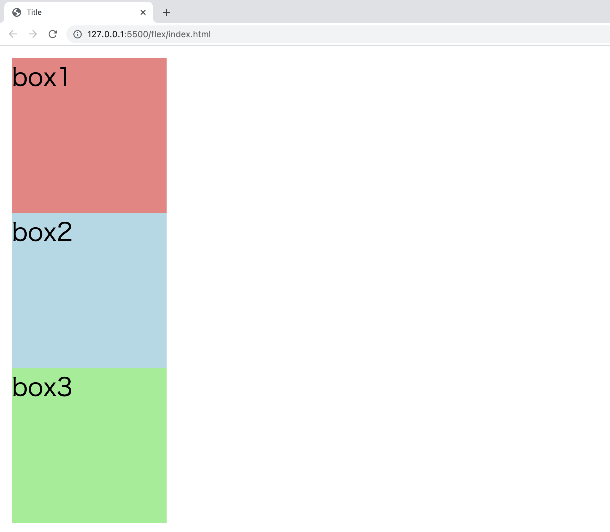

`box1`, `box2`, `box3` の親要素である `wrapper` に `display: flex` を指定すると、要素は横並びに表示されます。

```css title="style.css"
.wrapper {
  display: flex;
}
```

<ViewSource path="/docs/2-browser-apps/07-css-arrangement/_samples/flex" />


フレックスボックスを使用すると複雑な配置も簡単に実現できます。

一つの例として、`justify-content: space-around` を `wrapper` に指定してみると、要素の周囲に同じだけの間隔が空きます。

```css title="style.css"
.wrapper {
  display: flex;
  justify-content: space-around;
}
```

<ViewSource path="/docs/2-browser-apps/07-css-arrangement/_samples/space-around" />

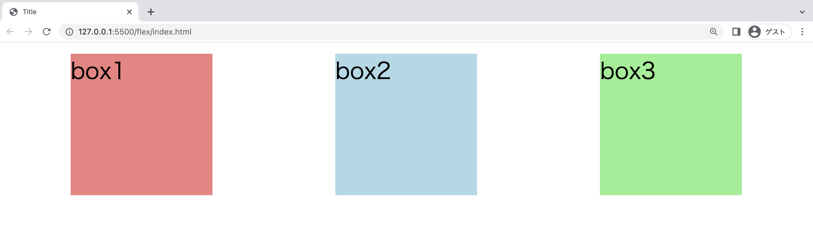

他にもたくさんの配置がフレックスボックスによって実現可能なので、調べてみましょう。

## グリッド

1 次元で要素をレイアウトしていくフレックスボックスに対して、グリッドには行と列の 2 次元で要素をレイアウトする発想があります。

グリッドを利用するには、配置したい要素の**親要素**に `display: grid` を適用し、`grid-template-columns` プロパティで列の幅を、`grid-template-rows` プロパティで行の幅を指定します。

`grid-column` や `grid-row` を使うと、開始ラインや終了ラインを指定して項目を配置することができます。

以下のコードを試してみましょう。

```html title="index.html"
<body>
  <div class="wrapper">
    <div class="box1">box1</div>
    <div class="box2">box2</div>
    <div class="box3">box3</div>
    <div class="box4">box4</div>
  </div>
</body>
```

```css title="style.css"
.wrapper {
  display: grid;
  grid-template-columns: 100px 100px 100px;
  grid-template-rows: 100px 100px;
}

.box1 {
  background-color: lightcoral;
}

.box2 {
  background-color: lightblue;
}

.box3 {
  grid-column: 3 / 4;
  grid-row: 1 / 3;
  background-color: lightgreen;
}

.box4 {
  grid-column: 1 / 3;
  grid-row: 2 / 3;
  background-color: lightseagreen;
}
```

<ViewSource path="/docs/2-browser-apps/07-css-arrangement/_samples/grid" />

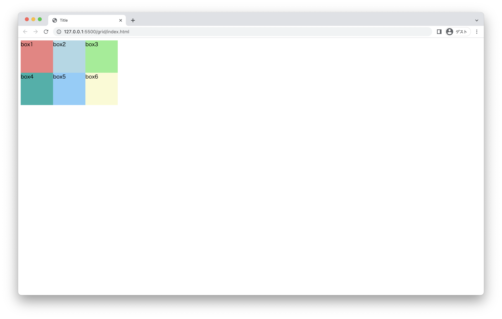

## position

`position` プロパティを操作すると、要素の位置指定の基準を変更することができます。

`position: static` : デフォルトの状態です。

`position: relative` : 要素の本来の位置から相対的にどれだけずらすかを指定することができます。

```html title="index.html"
<body>
  <div class="box1">box1</div>
  <div class="box2">box2</div>
  <div class="box3">box3</div>
  <div class="box4">box4</div>
  <div class="box5">box5</div>
  <div class="box6">box6</div>
</body>
```

```css title="style.css"
.box2 {
  position: relative;
  top: 50px;
  left: 50px;
  width: 200px;
  height: 200px;
  background-color: lightblue;
}
```

<ViewSource path="/docs/2-browser-apps/07-css-arrangement/_samples/relative" />

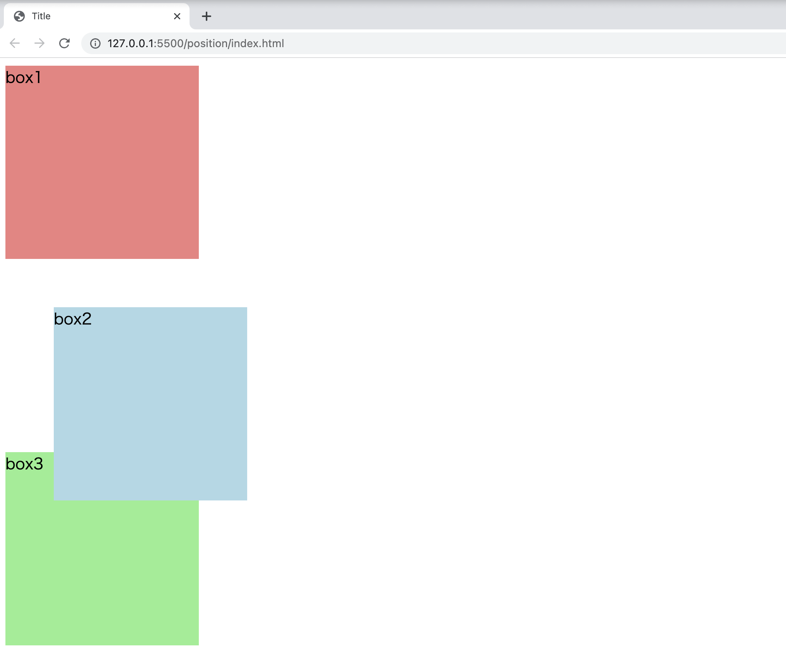

`position: absolute` : 周囲の要素を無視し、ページ内で絶対的にどの位置にあるかを指定することができます。

上のコードの `position: relative` を `position: absolute` に変えてみましょう。

```css title="style.css"
.box2 {
  position: absolute;
  top: 50px;
  left: 50px;
  width: 200px;
  height: 200px;
  background-color: lightblue;
}
```

<ViewSource path="/docs/2-browser-apps/07-css-arrangement/_samples/absolute" />

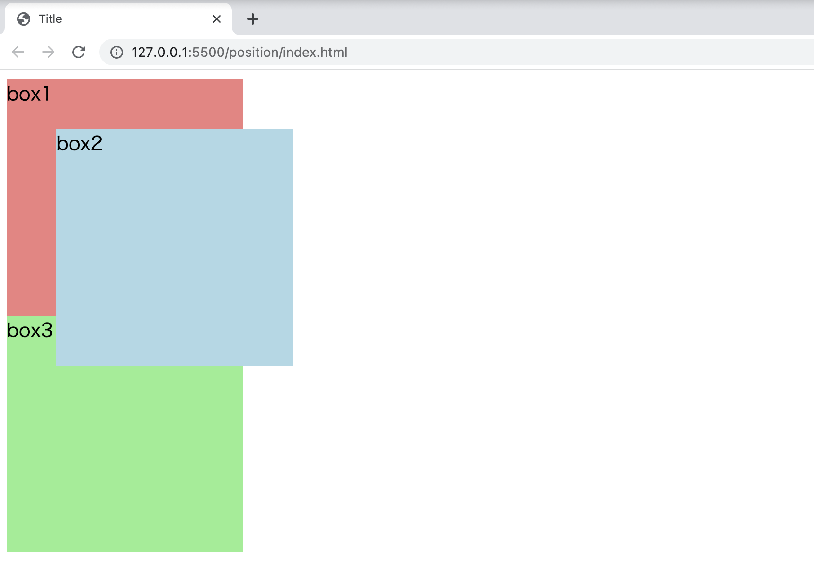

`position: fixed` : `absolute`に似ていますが、画面をスクロールしても要素は同じ場所に留まります。

上のコードの `position: relative` を `position: fixed` に変えてみましょう。

```css title="style.css"
.box2 {
  position: fixed;
  top: 50px;
  left: 50px;
  width: 200px;
  height: 200px;
  background-color: lightblue;
}
```

<ViewSource path="/docs/2-browser-apps/07-css-arrangement/_samples/fixed" />

以下のように、`absolute` の場合はスクロールすると `box2` も動いていきましたが、

<video src={absoluteScroll} controls />

`fixed` の場合はスクロールしても `box2`は同じ場所に留まっています。

<video src={fixedScroll} controls />

### 親要素を基準にして子要素の位置を指定する

`position` プロパティを使うと、親要素を基準にして子要素の位置を指定することができます。

そのような場合、親要素に `relative` を、子要素に `absolute` を指定します。

```html title="index.html"
<body>
  <div class="box1">
    box1
    <div class="box2">box2</div>
  </div>
</body>
```

```css title="style.css"
.box1 {
  position: relative;
  width: 400px;
  height: 400px;
  background-color: lightcoral;
}

.box2 {
  position: absolute;
  right: 50px;
  bottom: 50px;
  width: 200px;
  height: 200px;
  background-color: lightblue;
}
```

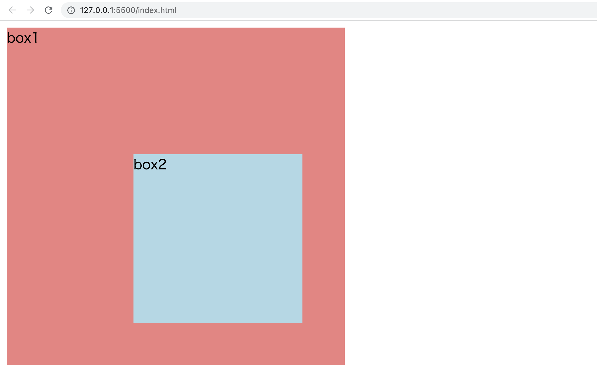

上のコードの `box1` に `margin-left: 200px` を指定して位置をずらしてみましょう。

```css title="style.css"
.box1 {
  position: relative;
  margin-left: 200px;
  width: 400px;
  height: 400px;
  background-color: lightcoral;
}
```

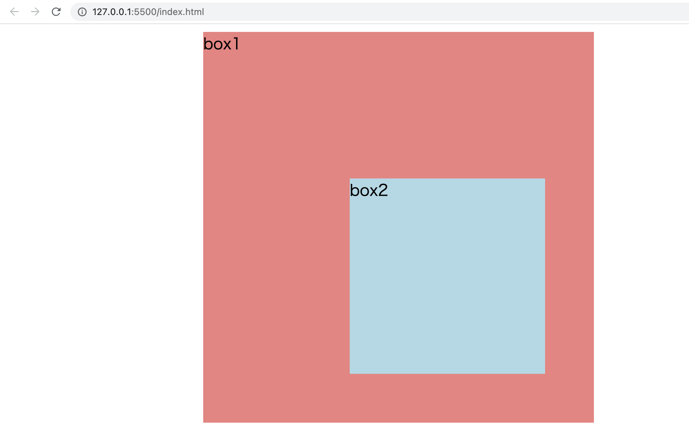

`box1` の位置が変わっても、`box2` の `box1` に対する位置は変化していません。

<ViewSource url={import.meta.url} path="_samples/relative-absolute" />

## レスポンシブデザイン

デバイスの画面サイズに応じて適切なレイアウトで表示を行うデザインをレスポンシブデザインと呼びます。

スマートフォン用、PC 用などと個別のサイトを作らずとも、同一の CSS であらゆるデバイスに対応することができます。

### メディアクエリ

画面サイズによって異なるスタイルを適用させたい際にはメディアクエリを使います。

スマートフォン等でもサイトをデバイス本来の画面サイズで表示するために、`head` タグの中に以下を記述しましょう。

```html title="index.html"
<meta name="viewport" content="width=device-width, initial-scale=1.0" />
```

メディアクエリの基本的な形は `@media (条件) {条件が真の場合に適用されるスタイル}` のようになります。

以下の例を試してみましょう。

```html title="index.html"
<body>
  <div class="box1">box1</div>
</body>
```

```css title="style.css"
.box1 {
  background-color: lightcoral;
}

@media (max-width: 800px) {
  .box1 {
    background-color: lightblue;
  }
}
```

<ViewSource path="/docs/2-browser-apps/07-css-arrangement/_samples/media-query" />

ウインドウの幅を変えてみると要素はどのようになるか、試してみましょう。

<video src={mediaQuery} controls />

### パーセント指定

長さの指定は、親要素に対する比率によって行うこともできます。

以下の例を試してみましょう。

```html title="index.html"
<body>
  <div class="box1">box1</div>
  <div class="box2">box2</div>
</body>
```

```css title="style.css"
.box1 {
  background-color: lightcoral;
  width: 50%;
}

.box2 {
  background-color: lightblue;
  width: 700px;
}
```

<ViewSource path="/docs/2-browser-apps/07-css-arrangement/_samples/percent" />

ウインドウの幅を変えてみると要素の幅はどのようになるか、試してみましょう。

<video src={percentCss} controls />

### `max-width` , `min-width`

`max-width` , `min-width` を使うと、要素の幅の上限と下限を指定することができます。

以下の例を試してみましょう。

```html title="index.html"
<body>
  <div class="box1">box1</div>
  <div class="box2">box2</div>
  <div class="box3">box3</div>
</body>
```

```css title="style.css"
.box1 {
  background-color: lightcoral;
  width: 80%;
  max-width: 800px;
}

.box2 {
  background-color: lightblue;
  width: 80%;
  min-width: 500px;
}

.box3 {
  background-color: lightgreen;
  width: 80%;
}
```

<ViewSource path="/docs/2-browser-apps/07-css-arrangement/_samples/max-min-width" />

ウインドウの幅を変えてみると要素の幅はどのようになるか、試してみましょう。

<video src={maxMinWidth} controls />

## 演習

これまでの知識を活用して、料金プランの説明をするページを作ってみましょう。
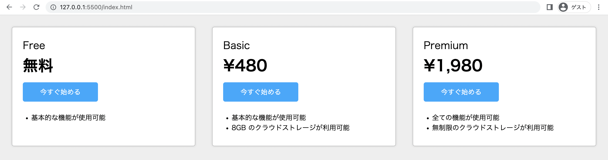

スマホ等でも見やすく表示されるようにしてみましょう。
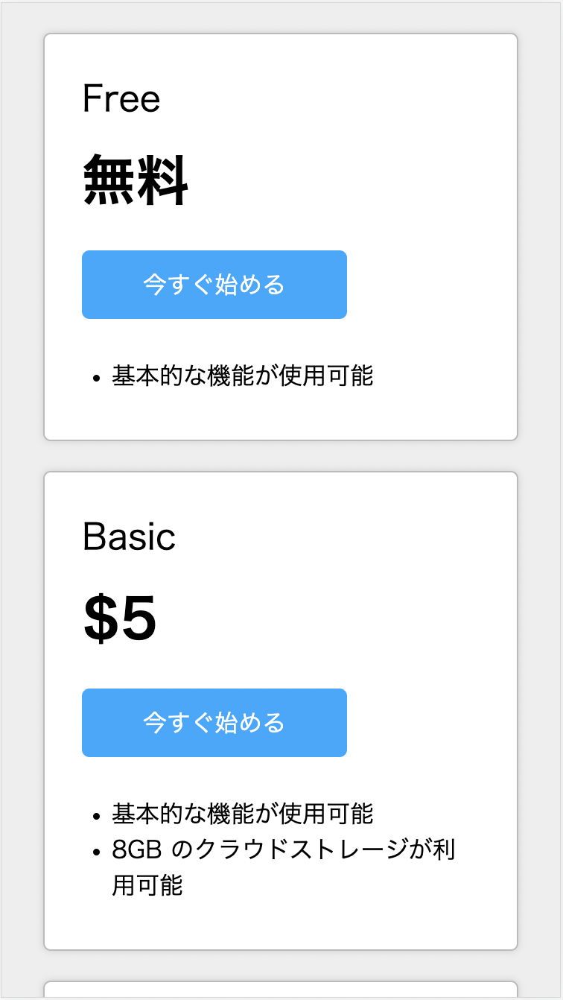

### 参考: サンプルで使われている CSS プロパティの一覧

- `display`
- `flex-grow`
- `flex-shrink`
- `flex-basis`
- `flex-direction`
- `justify-content`
- `align-self`
- `margin`
- `padding`
- `border`
- `border-radius`
- `box-shadow`
- `background-color`
- `color`
- `font-weight`

<ViewSource path="/docs/2-browser-apps/07-css-arrangement/_samples/exercise" />
