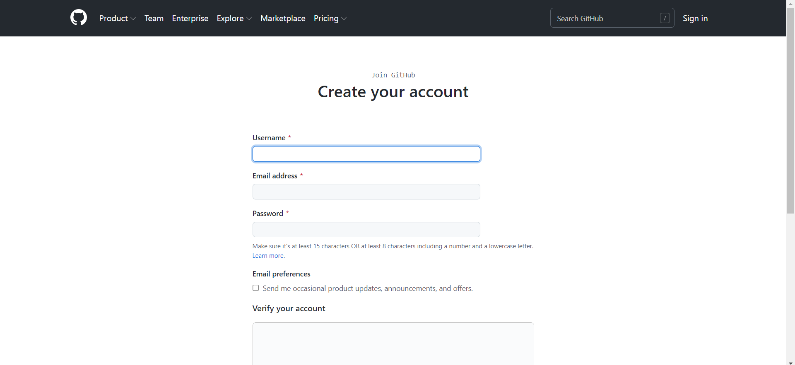
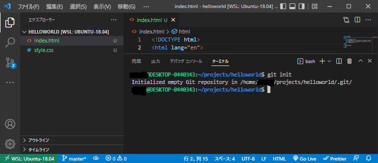
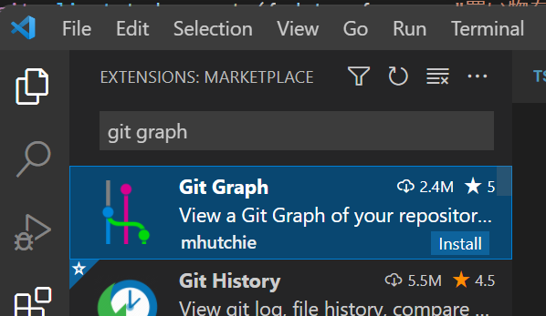
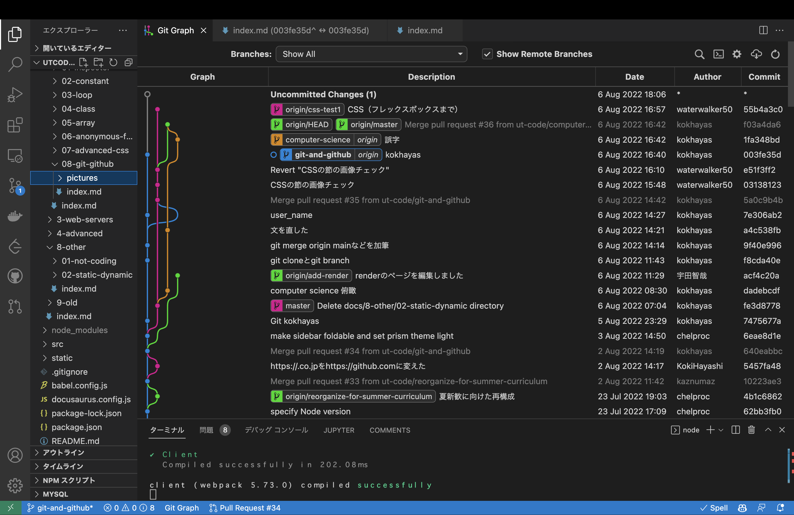

import CodeBlock from '@theme/CodeBlock';
import Term from "@site/src/components/Term";
import OpenInCodeSandbox from "@site/src/components/OpenInCodeSandbox";

:::info
macOS、WSLを利用する場合は Git は標準搭載なので追加インストールの必要なしです！
:::

## GitHub への登録

1. [GitHub](https://github.com)を開き、右上のサインアップをクリック。

   

2. 情報を入力する。

   
   :::caution
   Username は、一度付けると変更が面倒なためよく考えてつけましょう。
   :::

3. 公開鍵と秘密鍵の作成

   Terminal にて以下のコマンドを実行
   ```
   $ cd ~
   $ ssh-keygen -t ed25519
   ```
   途中でターミナルの表示画面が止まりますが、 `user@host:~$` が再度表示されるまでEnterキーで進みます。
   公開鍵が格納されたファイルの中身を表示させるため、以下のコマンドを入力します。

   ```
   $ cd ~/.ssh
   $ cat id_ed25519.pub
   ssh-ed25519 AAAAC3NzaC1lZDI1NTE5AAAAIFNwa2O/BIlw+WvisPCrSlM6IS2M2bbCRKNU9G8NYq2L [ユーザー名]@[コンピューター名]
   ```
   `ssh-ed25519 AA...2L` の部分をコピーしましょう。これが公開鍵です。

4. GitHub への公開鍵の登録

   登録ページへの移動方法は、`Setting` > `SSH and GPG keys` > `New SSH key`と順に移動すればたどり着けます。
   

   上記のようなページが表示されたら、Title に適切な名前、Key には先ほどTerminalで表示した公開鍵を入力して登録しましょう。

## Gitによるバージョン管理
### ローカルのリポジトリをGitで管理
Gitのリポジトリは、コミットと呼ばれるソースコードへの変更の塊の集合です。適当なプロジェクトを、Gitの管理下に置いてみましょう。
以下のコマンドをTerminalに入力してください(usernameやproject-nameは自分の環境に合わせたものを使用してください)
```
$ cd /Users/username/projects/project-name
$ git init
Initialized empty Git repository in /Users/username/projects/project-name/.git/
```

ファイルリスト中のファイルの色が変わり、`U` の文字が表示されたでしょうか。



`git init` は、ディレクトリをGitの支配下に置くことを宣言するためのコマンドです。このコマンドを実行することにより、プロジェクトディレクトリはまだコミットが存在しない空のリポジトリになりました。
`U` は `Untracked` の頭文字で、そのファイルが最後のコミット（といってもまだ作ったばかりのリポジトリなので空ですが）より後に新しく作成され、まだGitによって管理されていないことを表します。

```
$ git add -A
```

左側のパネルを `SOURCE CONTROL` にすると、すべてのファイルリストではなく、変更されたファイルのみのリストを表示させることができます。上のコマンドを実行すると、今まで`U`だった部分が`A (Added)`に変更されました。


`git add` コマンドは、変更を**ステージング**するためのコマンドです。ステージングとはコミットの直前の状態で、Gitに対して該当ファイルをコミットする意思があることを伝えるためのものです。
今回は `-A` オプションによりすべてのファイルをステージングしましたが、特定のファイルのみとすることもできます。

VSCodeは、GUIを利用したGitの操作に標準で対応しています。変更一覧に表示されるプラスボタンがステージング、マイナスボタンがその解除に当たります。

最後に、ステージングされたファイルをコミットしてみましょう。

```
$ git commit -m "init"
```

コミットが作成され、ファイルリストは白色に戻りました。なお、Gitではコミットを作成するとき、そのコミットによって行った変更を説明するための**コミットメッセージ**を付けることになっています。それを指定するためのオプションが `-m` です。


なお、これ以降は、最後のコミットと比較し、新しく追加されたファイルには `U` が、編集されたファイルには `M (Modified)` が付与されます。ある程度変更がまとまったら、ステージング（`git add`）、コミット（`git commit`）を繰り返してプログラムを書き進めていきましょう。


:::tip `.gitignore`
`.gitignore` ファイルで指定されたファイルはコミットされない。`npm install` で簡単にダウンロードできて容量が大きいのでバージョン管理するメリットのない `node_modules` や、機密情報や環境ごとに異なる情報を含む `.env` といったファイルが指定されます。
:::

### GitHubとの同期
ローカルで管理しているリポジトリをGitHub上のリポジトリに同期させてみましょう。


GitHubでは、Webインターフェースを使用してGitリポジトリの操作をすることができます。 `Repository name` に適当な名前を入力して、 `Create repository` を押しましょう。


`git@github.com:アカウント名/リポジトリ名.git` の部分は、GitHub上に新しく作ったリポジトリの場所を表すURLです。

ターミナルに戻り、以下のコマンドを実行します。

```
$ git remote add origin git@github.com:アカウント名/リポジトリ名.git
```

このコマンドを実行することで、ローカルリポジトリに対し、URLで指定したリポジトリを `origin` という名前で関連付けさせます。

:::note
`origin` という名前は慣習的に決まっているものです。別の名前で登録することもできますが、あまり一般的ではありません。
:::

`origin` に対し、ローカルリポジトリの変更を**プッシュ**しましょう。

```
$ git push -u origin master
```

:::info
この操作の際、初回は以下のような警告が出る場合があります。
```
The authenticity of host 'github.com (13.114.40.48)' can't be established.
RSA key fingerprint is SHA256:nThbg6kXUpJWGl7E1IGOCspRomTxdCARLviKw6E5SY8.
Are you sure you want to continue connecting (yes/no/[fingerprint])?
```
これは、接続先となっているGitHubが、なりすましではなく本物のGitHubであると信頼してもよいかを尋ねるメッセージです。家庭用のインターネット回線、UTokyo WiFi等、十分に信頼できるネットワークに接続している場合は問題ありませんので、 `yes` を入力して続行させてください。
:::

:::tip
`-u` オプションは、初回の `push` 時にその宛先を記憶し、次回以降自動的にその場所を指定するためのオプションです。2回目以降は

```
$ git push
```

だけで構いません。 `master` は、**ブランチ**と呼ばれるソースコードの編集の分岐の名前を表すものですが、この回ではまだ詳しく扱わないこととします。
:::

GitHubをリロードしてみてください。変更が反映されているのを確認できるはずです。


## おすすめ拡張機能

- GitLens

  コミットの差分などが見やすくなり便利
  

- Git Graph

  コマンドパレット(Cmd + Shift + P)に Git Graph: View Git Graph (git log)というメニューが出て見やすい

  

  

### 課題
GitHubを実際に使ってみましょう。
隣の人のレポジトリのURLを教えてもらい、そのレポジトリの `README.md` を編集し、pull requestを送りましょう。
最初に、GitHubに練習用のレポジトリを `README.md` 付きで作成してください。

```
$ git clone git@github.com:ut-code/readme_practice.git
$ cd readme_practice
$ ls
```

次に、branchを作成します。
branch名は、今回は `自分のGitHub上の名前+readme` にします。
一般的な場合では、branch名は、作業する内容を端的に表す名前にすることが推奨されます。

```
$ git branch username_readme
$ git branch
```
ブランチの一覧が閲覧できたでしょうか。
次に、今作成したブランチにHEADを移動します。
```
$ git checkout username_readme
$ git branch
```
 `*` が移動したことを確認してください。

続いて、 `README.md` に、 `Hello World` という文字を追加しましょう。 `README.md` に編集ができたら、ファイルを保存しましょう。
次に、変更をステージングしましょう。 `git add` コマンドは、作業ディレクトリ内の変更をステージングエリアに追加するコマンドです。

```
$ git add -A
```

次に、ステージングされたファイルをコミットしましょう。
 `git commit` コマンドは、追加・変更したファイルをGitに登録するためのコマンドです。
```
$ git commit -m "README.md に変更を加えました"
```

remoteレポジトリに `origin` として変更を登録しましょう。remoteレポジトリにlocalのbranchを反映します。

```
$ git push -u origin username_readme
```

ブラウザで、pushした隣の人のGitHubのレポジトリを開きましょう。
pull requestを出しましょう。

pull requestの申請を受け取った人は、確認しmergeしましょう。
mergeできたでしょうか。

通常の場合、branchは役目を終えたら削除するようにしてください。

<!-- remoteレポジトリの変更をlocalに反映させます。
```
$ git fetch origin main
```
最後にmergeします
```
$ git merge origin main
``` -->


## Gitの説明

1. Gitは、プログラムのソースコードなどの変更履歴を記録・追跡するための分散型バージョン管理システムです。

2. Gitの中身の話をする前に、Gitを構成する重要な技術の一つである[hash関数](https://www.wikiwand.com/ja/%E3%83%8F%E3%83%83%E3%82%B7%E3%83%A5%E9%96%A2%E6%95%B0)についての説明をします。hash関数は任意のデータを固定長の文字列に変換する非可逆な要約関数です。データが1文字でも違うとhash関数は全く異なる値を出力します。hash関数の出力の値を比べることで、データが編集されていないかを確かめることができます。(注 異なる入力に対してhash関数の出力が等しくなる場合(衝突)が稀にあります。)


3. Gitは、[有向非巡回グラフ(DAG)](https://www.wikiwand.com/ja/%E6%9C%89%E5%90%91%E9%9D%9E%E5%B7%A1%E5%9B%9E%E3%82%B0%E3%83%A9%E3%83%95)というグラフ構造を取っています。巡回がある場合、定義が無限ループに陥ってしまうため、Gitは必ず非巡回のグラフとなっています。

次に、Gitのグラフの中身を見てみましょう。

4. Gitはcommit objectの集合です。commitは、1つのtree objectへのリンク(参照)を持ちます。tree objectは1つ以上の、tree objectや[blob object](https://techacademy.jp/magazine/28210)へのリンク(参照)を持ちます。blobはbinary large objectの略で、ファイルのバイナリデータです。index.htmlやscript.jsなどのファイルをバイナリデータにしたものがblobです。具体的なcommitの構造を見てみましょう。
98ca9..や92ec2..はデータのhash値です。hash値は先頭からの一致を用いて比較されます。ここでは先頭の5桁が示されています。98ca9..という値は、該当するcommit objectをhash関数に入力した時に計算されたhash値です。commit objectには、commitの情報が含まれており、それらはhash関数に入力することで、98ca9..というhash値が計算されています。


6. commitを重ねると、編集の履歴がグラフとして表されます。tree objectはsnapshotとして表されています。98ca9..は最初のcommitです。34ac2..はparentの98ca9..のhash値を持っています。f30ab..はparentとして34ac2..のhash値を持っています。98ca9.., 34ac2.., f30ab..の順番でhashが計算されます。parentのcommit objectをhash関数の入力にしたときの出力値と、childが保有しているparentのhash値が一致するか確かめることで、正当な継承かどうか確かめることができます。


7. branchは、commit objectへのpointer(参照)です。branchは、commit objectのhash値を持っています。作業する内容に応じてbranchを用います。

HEADは現在の位置を指します。HEADは指しているbranchの名前を保有します。


8. 新たにtesingのbranchでの変更内容をcommitします。そのためには、まずHEADをtestingに移動します。

HEADがtestingを指している状態でcommitをします。新たなcommit objectが記録されました。testingのbranchが指しているhash値はf30ab..からc2b9e..へと更新されました。HEADの指しているbranch名はtestingのままで変化していません。c2b9e..は親commit objectのhash値であるf30ab..を保有しています。

再びmasterに作業場を移します。

masterをcommitします

新たなcommit objectが登録されました。
次に、枝分かれしたbranchを統合するmerge, rebaseについて説明します。

9. masterとexperimentの2つにbranchが分かれており、それぞれcommitが1つ進んでいる状態を考えます。

mergeする場合は、C3とC4の内容をもとにC5を作成します。C5のcommit objectは、C3とC4の2つのhash値を記録しています。

mergeの代わりにrebaseする場合は以下の通りとなります。新たにC3'が作られます。このcommit objectは、C4のhash値を記録しています。


Gitでコミットを積み重ねることで、レポジトリを作成することができました。レポジトリを管理するサービスとして、GitHubがあります。GitHubに関する説明に進んでいきます。

The images in this slide deck are from Pro Git under a Creative Common license (Attribution, Noncommercial, Share alike).


<!-- ### 課題 -->

<!-- ToDo アプリのソースコードを GitHub に保存してみましょう。
 -->
