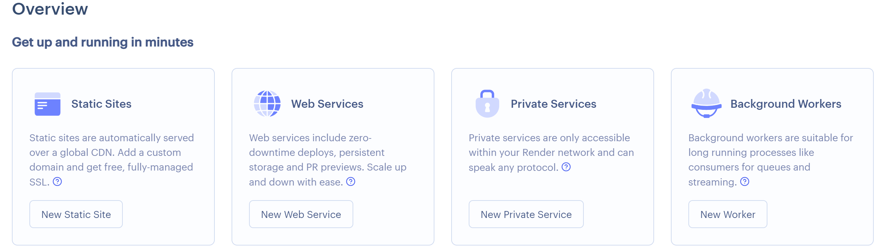
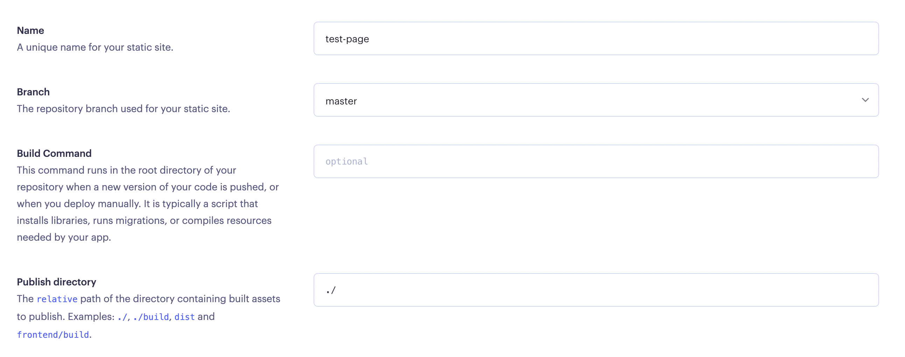
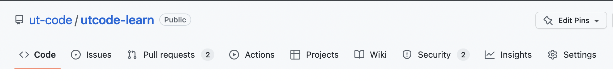
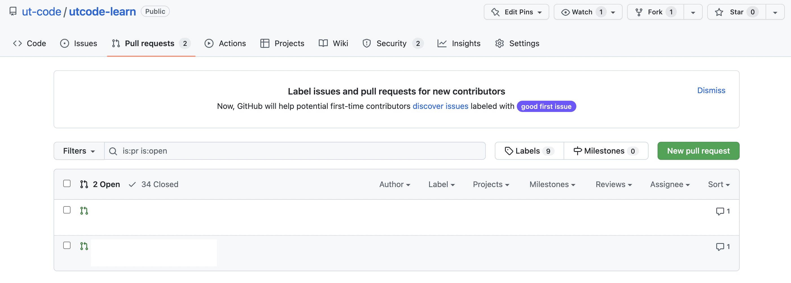

import CodeBlock from '@theme/CodeBlock';
import Term from "@site/src/components/Term";
import OpenInCodeSandbox from "@site/src/components/OpenInCodeSandbox";

## PaaS

**PaaS** (Platform as a Service)は、プログラムをアップロードすることで、そのプログラムを動作させることができるサービスです。[Render](https://render.com/) は最近登場した簡単に操作できる PaaS です。

Render などの PaaS を利用するにあたって、プログラムの改変が必要になる場合があります。ポート番号は、その一例です。 Render では、ポート番号が `PORT` という名前の環境変数によって指定される。 Node.js では、環境変数は `process.env` 変数を用いて取得できるので、このポート番号を指定しましょう。

```javascript
app.listen(process.env.PORT || 3000);
```

## 静的ページと動的ページ

[Render](https://render.com/) に登録すると、最初に次のような画面が現れます。



この画面の `Static Sites` と `Web Services` の違いを解説します。 

`Static Sites` は静的ページのことで、大まかに言えば「内容が変化しないWebページ」です。サーバーにアップロードされてから内容が変化せず、いつ閲覧しても同じページが表示されます。

一方、 Render における `Web Services` は静的ページの対義語にあたる動的ページに分類されます。これは大まかに言えば「内容が変化する Web ページ」で、先ほどやったようなデータベースやサーバーとの通信をすることで閲覧する端末や閲覧する時間によって内容が異なるページが表示されます。

動的ページは SNS やログイン機能のあるページなど、 Web サービスでは必要不可欠ですが、その都度サーバーとの通信をしなければならないため静的ページに比べてサーバー負荷が大きいというデメリットがあります。 Render でも `Static Sites` は無料ですが、 `Web Services` はサーバーの性能によって無料〜月 450 ドルのプランを選択することになります。

## Render へのデプロイ

Render を GitHub のレポジトリと接続することで、ファイルを編集するごとに手動でサーバーにアップロードする必要なく GitHub 上で `merge` するごとに Web ページを更新することができます。 事前にアプリケーション全体を GitHub に保存しておいてください。

静的サイトをデプロイするには、ホーム画面から `Static Sites` を選択しましょう。

続いて、GitHub アカウントを選択します。


接続が完了すると、リポジトリが選択できるようになります。


設定項目を入力します。



ステータスが `Live` になったら成功です！　表示されている `.onrender.com` のサイトでアプリケーションが公開されています！

## .onrender.com へのアクセス

先ほど発行した `.onrender.com` のサイトは、 Render だけでなく GitHub からもアクセスでき、pull request した内容を merge する前に実際に確認することができます。

GitHub でレポジトリのページに移動し、`Pull requests` を選択します。



一覧から開きたい pull request を選択します。



pull request の内容を反映したサイトのリンクが表示されているので、そこからアクセスできます！

