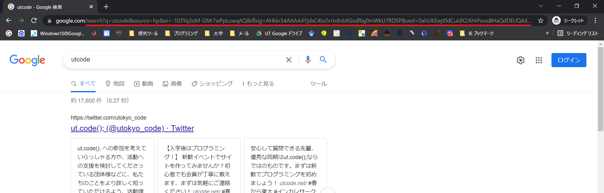
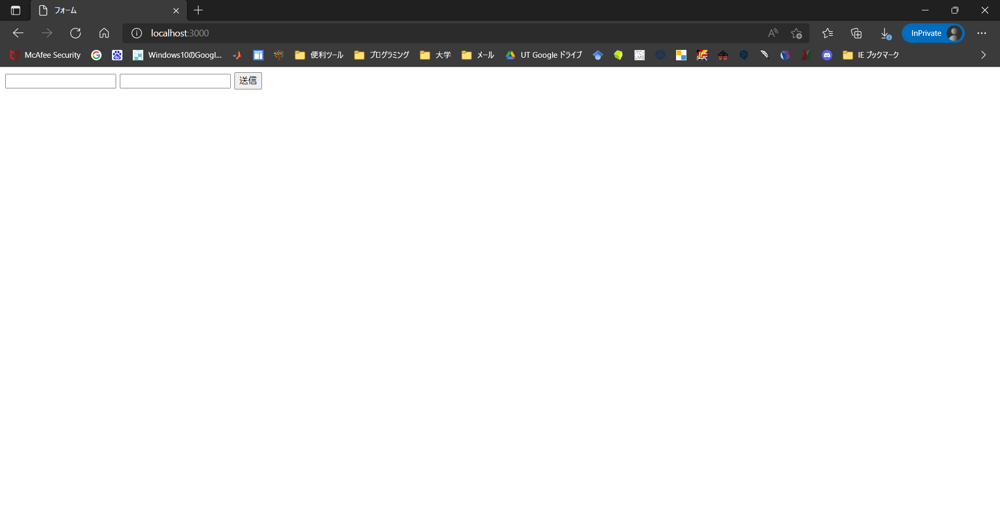
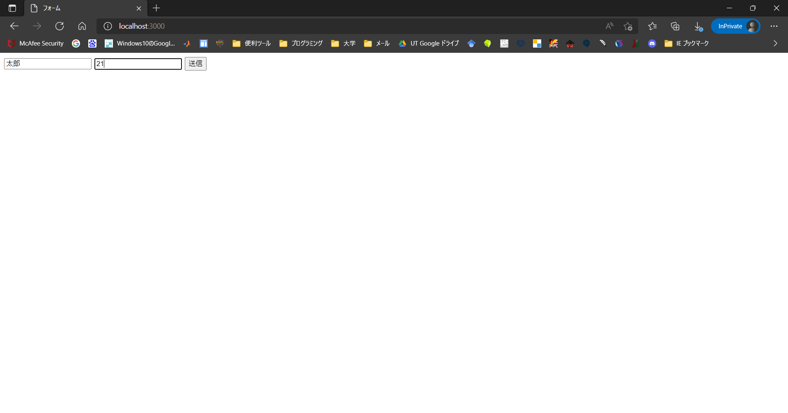
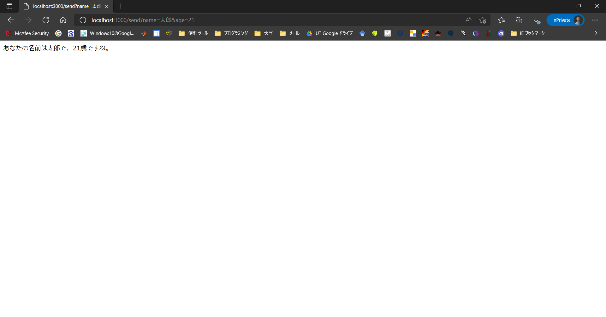

import CodeBlock from '@theme/CodeBlock';
import Term from "@site/src/components/Term";
import OpenInCodeSandbox from "@site/src/components/OpenInCodeSandbox";

## クエリパラメータの利用

クエリパラメータとは？

入力した内容によって、次に移る（表示される）ページが異なるウェブページがあります。このようなページでは、入力した内容によって異なるウェブページが表示されるよう、入力した内容が移った先のページのURLに反映されています。URLのうち、入力した内容が反映されている部分をクエリパラメータといいます。

例：google.comで、検索エンジンに何か入力して、検索すると、検索結果が表示されますが、そのページのURLに注目してみましょう。（下画像赤線がクエリパラメータ）  


以下が上記サイトのURL  
[https://www.google.com/search?q=utcode&sxsrf=APq-WBv6kgtDWiq8hT6wfFdMPw4M5qWnNQ%3A1647830270847&source=hp&ei=_uQ3YrnJMY-F0wTg65qgDg&iflsig=AHkkrS4AAAAAYjfzDslMMqbHckba3h4_maDN03TFTmoX&oq=&gs_lcp=Cgdnd3Mtd2l6EAMYATIHCCMQ6gIQJzIHCCMQ6gIQJzIHCCMQ6gIQJzIHCCMQ6gIQJzIHCCMQ6gIQJzIHCCMQ6gIQJzIHCCMQ6gIQJzIHCCMQ6gIQJzIHCCMQ6gIQJzIHCCMQ6gIQJ1AAWABg4wpoAXAAeACAAQCIAQCSAQCYAQCwAQo&sclient=gws-wiz](https://www.google.com/search?q=utcode&sxsrf=APq-WBv6kgtDWiq8hT6wfFdMPw4M5qWnNQ%3A1647830270847&source=hp&ei=_uQ3YrnJMY-F0wTg65qgDg&iflsig=AHkkrS4AAAAAYjfzDslMMqbHckba3h4_maDN03TFTmoX&oq=&gs_lcp=Cgdnd3Mtd2l6EAMYATIHCCMQ6gIQJzIHCCMQ6gIQJzIHCCMQ6gIQJzIHCCMQ6gIQJzIHCCMQ6gIQJzIHCCMQ6gIQJzIHCCMQ6gIQJzIHCCMQ6gIQJzIHCCMQ6gIQJzIHCCMQ6gIQJ1AAWABg4wpoAXAAeACAAQCIAQCSAQCYAQCwAQo&sclient=gws-wiz)

URLの末尾に `?key1=value1&key2=value2&...` の形式でクエリパラメータを記載できます。  
expressでは `request.query` オブジェクトに格納されています。

```javascript title="script.js"
const express = require("express");

const app = express();
app.get("/", (request, response) => {
  response.send(JSON.stringify(request.query));
});
app.listen(3000);
```

:::tip JSON.stringifyメソッド
`JSON.stringifyメソッド`はオブジェクトをJSON形式の文字列に変換するメソッドです。
:::

:::tip URLとして使用できない文字の対処方法
URLとして使用できない文字（日本語文字など）は[URLエンコード](https://ja.wikipedia.org/wiki/%E3%83%91%E3%83%BC%E3%82%BB%E3%83%B3%E3%83%88%E3%82%A8%E3%83%B3%E3%82%B3%E3%83%BC%E3%83%87%E3%82%A3%E3%83%B3%E3%82%B0)する必要があります。JavaScriptなら `encodeURIComponent` 関数で変換できます。

```javascript
encodeURIComponent("日本語") // "%E6%97%A5%E6%9C%AC%E8%AA%9E"
```
:::

## サーバーにデータを送信する
form要素を使うとユーザーの入力からクエリパラメータを生成してページ遷移できます。

- formのaction属性: フォーム送信時に移動し、データを送信するページ
- input要素: テキストボックス
- inputのname属性: クエリパラメータのキー
- button要素: form内のボタンをクリックするとformのactionに指定したページに遷移します（送信ボタンになります）

以下のコードの、htmlファイル（staticディレクトリ内に作ってください）と、jsファイルを作成し、実行してみましょう。
```html title="index.html"
<!DOCTYPE html>
<html lang="ja">
  <head>
    <meta charset="utf-8" />
    <title>フォーム</title>
  </head>
  <body>
    <form action="/send">
      <input name="name" />
      <input name="age" />
      <button>送信</button>
    </form>
  </body>
</html>
```  
```javascript title="sever.js"
const express = require("express");

const app = express();
app.use(express.static("static"));
app.get("/send", (request, response) => {
  response.send(
    `あなたの名前は${request.query.name}で、${request.query.age}歳ですね。`
  );
});
app.listen(3000);
```

上記コードを実行すると、以下のような画面がブラウザに表示されます。


以下のように入力して、送信ボタンをクリックすると、


[http://localhost/3000/send](http://localhost/3000/send)に移り、以下のような画面が表示されます。


このページのURLを見てみましょう。特に、クエリパラメータの部分に注目してみましょう。
