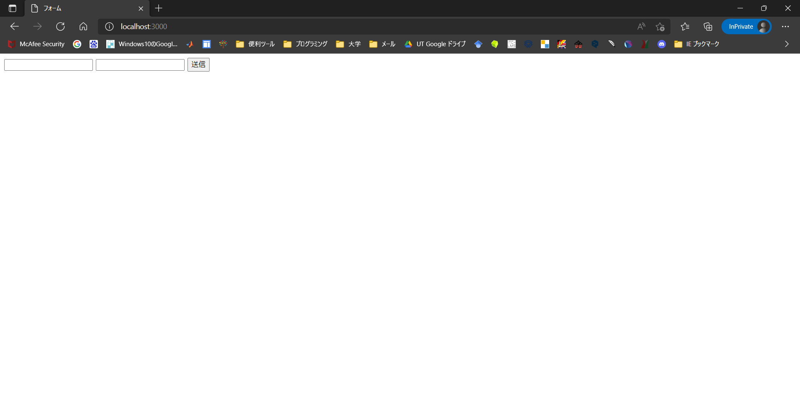
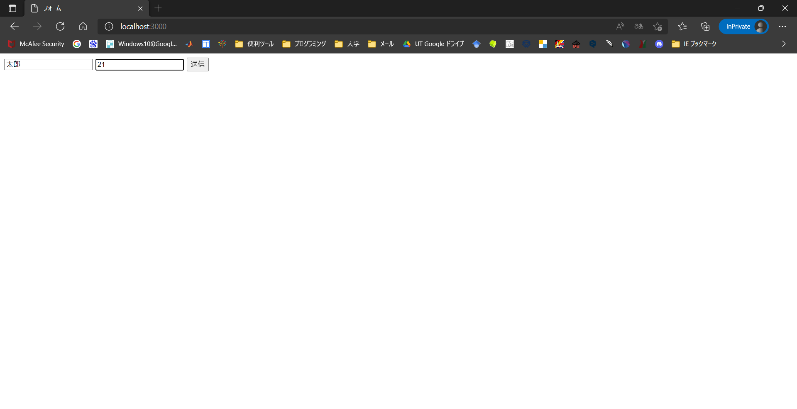
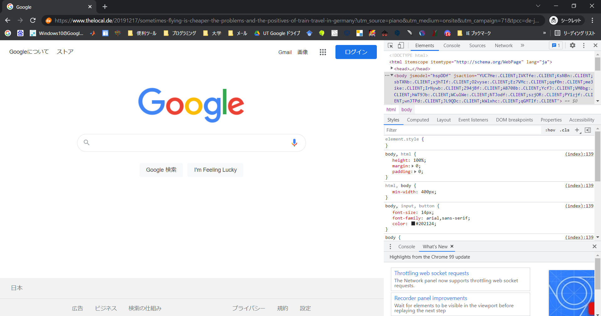

import CodeBlock from '@theme/CodeBlock';
import Term from "@site/src/components/Term";
import OpenInCodeSandbox from "@site/src/components/OpenInCodeSandbox";
import bodyParserVideo from "./body-parser.mp4";
import postInDevelopment1 from "./postInDevelopment1.mp4"
import postInDevelopment2 from "./postInDevelopment2.mp4"
import postInDevelopment3 from "./postInDevelopment3.mp4"

## GET リクエストと POST リクエスト

HTTP 上の通信においてクライアントからサーバーへの要求をリクエストと言いましたが、今まで扱ってきたのはその中でも**GET リクエスト**と呼ばれるものになります。

GET リクエストではリクエストに乗せられた情報がクエリパラメータとして URL の末尾につくことになりますが、この方式だと困ってしまうことがあります。例えばパスワードなどを入力したときに URL にパスワード情報が載ってしまい機密情報の漏洩につながります。また、web ページによっては URL の長さに制限があるため、大量の情報を送信できないことがあります。

<p>そこで用いるのが<strong>POST リクエスト</strong>です。POST リクエストは<Term type="html">HTML</Term>ファイル上の form 要素の method 属性を POST にすることで使用できます。POST リクエストを用いると GET リクエストよりも大容量のデータを送ることができます。このデータのことを<strong>リクエストボディ</strong>と呼びます。</p> 


リクエストボディは通常クエリパラメータと同じく `key1=value1&key2=value2` といった形のデータになりますが、これを JavaScript から扱いやすい形にする `body-parser` モジュールを使用します。

まず `body-parser` モジュールをインストールします。ターミナルで `npm install body-parser` と入力しましょう。すると `package.json` ファイルに `body-parser` が追加されます。

<video src={bodyParserVideo} controls />

これでインストール完了です。では実際に POST リクエストを扱ってみましょう。つぎのような HTML ファイルを static フォルダ内に作成してください。

```html title="index.html"
<!DOCTYPE html>
<html lang="ja">
  <head>
    <meta charset="utf-8" />
    <title>フォーム</title>
  </head>
  <body>
    <form method="post" action="/send">
      <input name="name" />
      <input name="age" />
      <button>送信</button>
    </form>
  </body>
</html>
```

作成できたら、次のような js ファイルを作成して実行してみましょう。

```javascript title="server.js"
const express = require("express");
const bodyParser = require("body-parser");

const app = express();

app.use(bodyParser.urlencoded({ extended: true }));
app.use(express.static("static"));

app.post("/send", (request, response) => {
  response.send(
    `あなたの名前は${request.body.name}で、${request.body.age}歳ですね。`
  );
});
app.listen(3000);
```

そうすると次のようなサイトがブラウザで実行されます。



以下のように入力して、送信ボタンをクリックすると

http://localhost/3000/send
に移り、以下のような画面が表示されます。GET リクエストの時と違い、クエリパラメータが URL に表示されていないことが分かります。


上記のコードを見てみるとわかるのですが、GETリクエストの際は `app.get` という風に `get` メソッドを利用していたのに対し、POSTリクエストの際は `app.post` という風に `post` メソッドが使用されているのがわかります。　

以上のようにして、POST リクエストを使用することができます。

:::info
いくつか見慣れないコードがあったと思うので補足を加えます。まず、GETリクエストを使ったときのリクエストの中身には `request.query` でアクセスができたと思いますが、`body-parser` を使用すると `request.body` にデータが格納されるようになっています。
また、６行目の `bodyParser.urlendoded` という部分ではリクエストボディの解釈方法を決めています。例えばリクエストボディがURLエンコードされている場合（name1=value1&name2=value2のような場合）に、そのデータをオブジェクト形式に直してrequestのbodyプロパティに入れています。 `extended:true` はあまり気にしなくていいです。（少なくともnode.jsを使っている場合 `extended:false` は非推奨なようです。）
:::

## POST リクエストを開発者ツールで覗いてみる

実際に POST リクエストの中身がどうなっているか覗いてみましょう。windows の場合、開発者ツールは Chrome,Edge であれば `Ctrl` + `shift` + `i`　もしくは `F12` で開くことができます。Mac の場合は `command` + `option` + `i` で開くことができます。


Chrome の開発者ツールでは Network というタブから POST リクエストの様子を伺うことができます。（Edgeでも大体同じです。）

まず開発者ツールを開き、文字を入力して送信してみます。
<video src={postInDevelopment1} controls />

そして `name` 欄の `send` をクリックし、 `Headers` を選択すると `general` 欄の `Requested method` が `POST` になっています。また、 `Headers` の横にある `Payload` を選択し `Form data` を見ると、 `name` と `age` の情報が載っています。 

<video src={postInDevelopment2} controls />

ここからさらに、`Form data` の横の `view source` や `view URL-encoded` も見てみましょう。するとURLエンコードされたリクエストボディの中身を見ることができます。

<video src={postInDevelopment3} controls />

以上のようにして、POSTリクエストの中身を覗くことができます。
