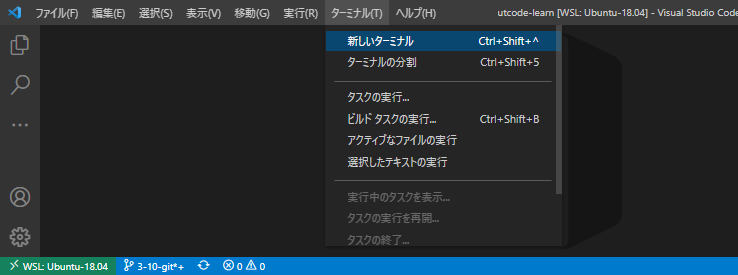
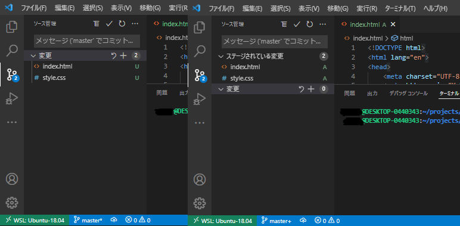
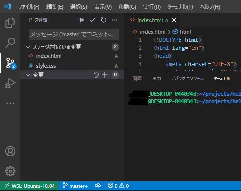
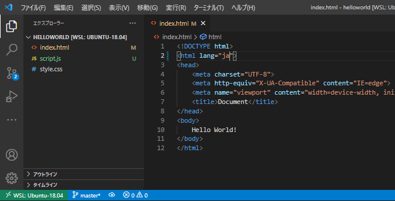
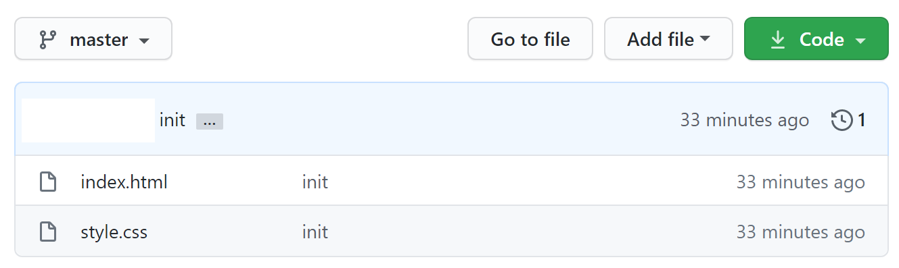

import CodeBlock from '@theme/CodeBlock';
import Term from "@site/src/components/Term";
import OpenInCodeSandbox from "@site/src/components/OpenInCodeSandbox";

:::info  
macOS、WSLを利用する場合は Git は標準搭載なので追加インストールの必要なしです！
:::

## GitHub への登録

1. [Github](https://github.co.jp)を開き、右上のサインアップをクリック。
   
   

2. 情報を入力する。
   
   
   :::caution
   Username は、一度付けると変更が面倒なためよく考えてつけましょう。
   :::

3. 公開鍵と秘密鍵の作成

   Terminal にて以下のコマンドを実行
   ```
   $ cd ~
   $ ssh-keygen -t ed25519
   ```
   途中でターミナルの表示画面が止まりますが、user@host:~$が再度表示されるまで enter で進みます。  
   公開鍵が格納されたファイルの中身を表示させるため、以下のコマンドを入力します。

   ```
   $ cd ~/.ssh
   $ cat id_ed25519.pub
   ssh-ed25519 AAAAC3NzaC1lZDI1NTE5AAAAIFNwa2O/BIlw+WvisPCrSlM6IS2M2bbCRKNU9G8NYq2L [ユーザー名]@[コンピューター名]
   ```
   `ssh-ed25519 AA...2L` の部分をコピーしましょう。これが公開鍵です。

4. Github への公開鍵の登録

   登録ページへの移動方法は、`Setting` > `SSH and GPG keys` > `New SSH key`と順に移動すればたどり着けます。
   

   上記のようなページが表示されたら、Title に適切な名前、Key には先ほどTerminalで表示した公開鍵を入力して登録しましょう。

## Gitによるバージョン管理
### ローカルのリポジトリをGitで管理
Gitのリポジトリは、コミットと呼ばれるソースコードへの変更の塊の集合です。適当なプロジェクトを、Gitの管理下に置いてみましょう。  
以下のコマンドをTerminalに入力してください(usernameやproject-nameは自分の環境に合わせたものを使用してください)
```
$ cd /Users/username/projects/project-name
$ git init
Initialized empty Git repository in /Users/username/projects/project-name/.git/
```

:::info VSCode上でのTerminalの開き方
   下の画像のようにタブバーから開くことができます。
   
:::

ファイルリスト中のファイルの色が変わり、`U` の文字が表示されたでしょうか。


`git init` は、ディレクトリをGitの支配下に置くことを宣言するためのコマンドです。このコマンドを実行することにより、プロジェクトディレクトリはまだコミットが存在しない空のリポジトリになりました。　　
`U` は `Untracked` の頭文字で、そのファイルが最後のコミット（といってもまだ作ったばかりのリポジトリなので空ですが）より後に新しく作成され、まだGitによって管理されていないことを表します。

```
$ git add -A
```

左側のパネルを `SOURCE CONTROL` にすると、すべてのファイルリストではなく、変更されたファイルのみのリストを表示させることができます。上のコマンドを実行すると、今まで`U`だった部分が`A (Added)`に変更されました。



`git add` コマンドは、変更を**ステージング**するためのコマンドです。ステージングとはコミットの直前の状態で、Gitに対して該当ファイルをコミットする意思があることを伝えるためのものです。  
今回は `-A` オプションによりすべてのファイルをステージングしましたが、特定のファイルのみとすることもできます。

VSCodeは、GUIを利用したGitの操作に標準で対応しています。変更一覧に表示されるプラスボタンがステージング、マイナスボタンがその解除に当たります。

最後に、ステージングされたファイルをコミットしてみましょう。

```
$ git commit -m "init"
```

コミットが作成され、ファイルリストは白色に戻りました。なお、gitではコミットを作成するとき、そのコミットによって行った変更を説明するための**コミットメッセージ**を付けることになっています。それを指定するためのオプションが `-m` です。



なお、これ以降は、最後のコミットと比較し、新しく追加されたファイルには `U` が、編集されたファイルには `M (Modified)` が付与されます。ある程度変更がまとまったら、ステージング（`git add`）、コミット（`git commit`）を繰り返してプログラムを書き進めていきましょう。



:::tip `.gitignore`
`.gitignore` ファイルで指定されたファイルはコミットされない。`npm install` で簡単にダウンロードできて容量が大きいのでバージョン管理するメリットのない `node_modules` や、機密情報や環境ごとに異なる情報を含む `.env` といったファイルが指定される。
:::

### GitHubとの同期
ローカルで管理しているリポジトリをGitHub上のリポジトリに同期させてみましょう。


GitHubでは、Webインターフェースを使用してGitリポジトリの操作をすることができます。 `Repository name` に適当な名前を入力して、 `Create repository` を押しましょう。


`git@github.com:アカウント名/リポジトリ名.git` の部分は、GitHub上に新しく作ったリポジトリの場所を表すURLです。

ターミナルに戻り、以下のコマンドを実行します。

```
$ git remote add origin git@github.com:アカウント名/リポジトリ名.git
```

このコマンドを実行することで、ローカルリポジトリに対し、URLで指定したリポジトリを `origin` という名前で関連付けさせます。

:::note
`origin` という名前は慣習的に決まっているものです。別の名前で登録することもできますが、あまり一般的ではありません。
:::

`origin` に対し、ローカルリポジトリの変更を**プッシュ**しましょう。

```
$ git push -u origin master
```

:::info
この操作の際、初回は以下のような警告が出る場合があります。
```
The authenticity of host 'github.com (13.114.40.48)' can't be established.
RSA key fingerprint is SHA256:nThbg6kXUpJWGl7E1IGOCspRomTxdCARLviKw6E5SY8.
Are you sure you want to continue connecting (yes/no/[fingerprint])?
```
これは、接続先となっているGitHubが、なりすましではなく本物のGitHubであると信頼してもよいかを尋ねるメッセージです。家庭用のインターネット回線、UTokyo WiFi等、十分に信頼できるネットワークに接続している場合は問題ありませんので、 `yes` を入力して続行させてください。
:::

:::tip
`-u` オプションは、初回の `push` 時にその宛先を記憶し、次回以降自動的にその場所を指定するためのオプションです。2回目以降は

```
$ git push
```

だけで構いません。 `master` は、**ブランチ**と呼ばれるソースコードの編集の分岐の名前を表すものですが、この回ではまだ詳しく扱わないこととします。
:::

GitHubをリロードしてみてください。変更が反映されているのを確認できるはずです。




## おすすめ拡張機能

- GitLens

  コミットの差分などが見やすくなり便利
  

- Git Graph

  コマンドパレット(Cmd + Shift + P)に Git Graph: View Git Graph (git log)というメニューが出て見やすい

  


### 課題

Todo アプリのソースコードを Github に保存してみましょう。
