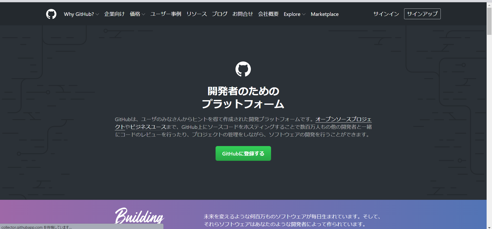

import CodeBlock from '@theme/CodeBlock';
import Term from "@site/src/components/Term";
import OpenInCodeSandbox from "@site/src/components/OpenInCodeSandbox";

:::caution
以下の文章は macOS か wsl を用いて開発している前提で記述されています。
:::

## GitHub への登録

1. [Github](https://github.co.jp)を開き、右上のサインアップをクリック。
   

2. 情報を入力する。
   
   :::caution
   Username は、登録後変更できるとはいえ手順が面倒なため、変更しないものとしてよく考えてつけましょう。
   :::

3. 公開鍵と秘密鍵の作成

   Terminal にて以下のコマンドを実行

   ```
   $ cd ~
   $ ssh-keygen -t ed25519
   ```
   途中でターミナルの表示画面が止まりますが、user@host:~$が再度表示されるまで enter で進みます。

   公開鍵が格納されたファイルの中身を表示させるため、以下のコマンドを入力します。

   ```
   $ cd ~/.ssh
   $ cat id_ed25519.pub
   ssh-ed25519 AAAAC3NzaC1lZDI1NTE5AAAAIFNwa2O/BIlw+WvisPCrSlM6IS2M2bbCRKNU9G8NYq2L [ユーザー名]@[コンピューター名]
   ```
   `ssh-ed25519 AA...`2Lの部分をコピーしましょう。これが公開鍵です。

4. Github への公開鍵の登録

   登録ページへの移動方法は、`Setting` > `SSH and GPG keys` > `New SSH key`と順に移動すればたどり着ける。
   

   上記のようなページが表示されたら、Title に適切な名前(自分のどの端末かわかるような情報)、Key には先ほどTerminalで表示した公開鍵を入力して登録しましょう。

## Gitによるファイルのバージョン管理
:::tip `.gitignore`
`.gitignore` ファイルで指定されたファイルはコミットされない。`npm install` で簡単にダウンロードできて容量が大きいのでバージョン管理するメリットのない `node_modules` や、機密情報や環境ごとに異なる情報を含む `.env` といったファイルが指定される。
:::

## おすすめ拡張機能

- Gitlens

  コミットの差分などが見やすくなり便利
  

- Gitglaph

  コマンドパレット(Cmd + Shift + P)に Git Graph: View Git Graph (git log)というメニューが出て見やすい

  


### 課題

Todo アプリのソースコードを Github に保存してみましょう。
