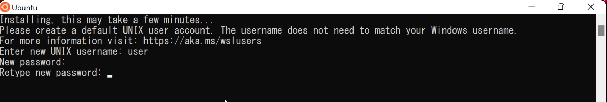
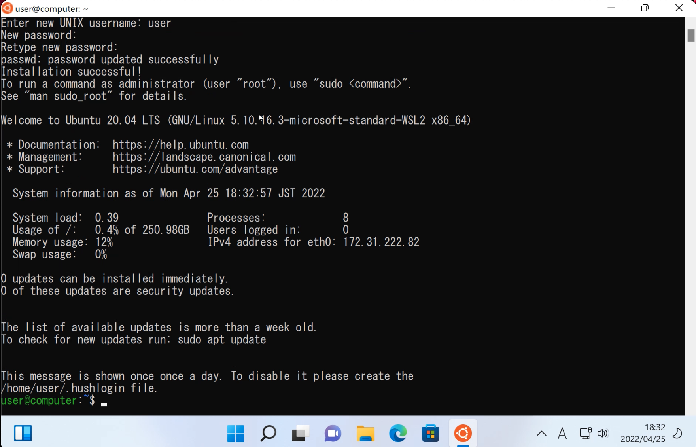
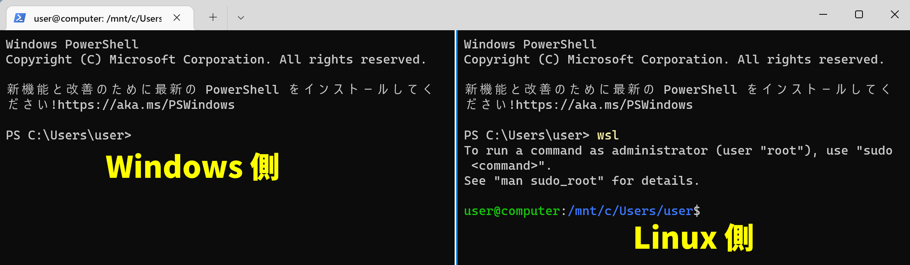
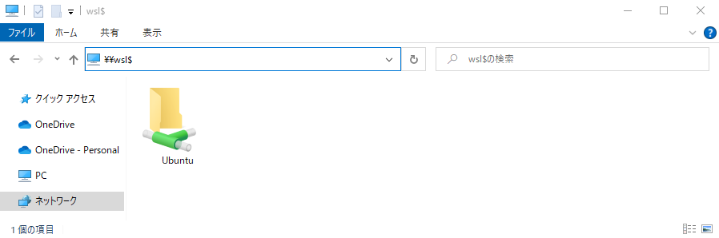

## Linux と WSL

現在、Web サービスを提供するコンピューターのほとんどに、**Linux** という名前の OS が搭載されています。
このため、Web サービスを開発するには、Linux を用いて開発することが理想です。
しかしながら、現在流通している一般的なコンピューターに搭載されている OS は、Windows または macOS です。

実は、macOS を使う場合はあまり問題になりません。
これは、macOS という OS が、Linux と源流を共にしているからです。
こういった理由から、macOS は Web 開発者から強く支持されています。

**WSL** は、こういった状況を覆すべく Microsoft 社によって開発された、**Windows 上で Linux を動かすための仕組み**です。
WSL を用いることで、Windows の利便性を享受しつつ、Linux のパワーを活用できます。

## Windows 環境に WSL をインストールする

WSL のインストールは、10 分程度で終わる簡単な作業です。
下の動画を参考に実施しましょう。

<ExternalVideoPlayer src="https://www.youtube.com/embed/aRf7NYZpUa0" />

まずは `ターミナル` アプリを管理者として実行します。

:::tip[管理者として実行]

`管理者として実行` メニューを使用してアプリを起動することで、アプリは強い権限を行使できるようになります。
WSL のインストールにはこのような強い権限が必要なので、起動時に特殊な操作が必要になります。

:::

続いて、`wsl --install` コマンドを実行します。
これにより、WSL が全自動でインストールされます。

インストールが完了すると、自動的にコンピューターが再起動します。
このとき、3 回質問を受けます。

- `Enter new UNIX username`: WSL は、普段使っている Windows とは別のコンピューターのように振る舞います。
ここで指定する名前は何でも構いませんが、**英語小文字、数字、またはアンダーバー (_) のみで構成された文字列**とすることを強く推奨します。
- `New password` と `Retype new password` では、上で指定したユーザーのパスワードを入力します。
**入力しても画面に変化はありません**が、入力自体は行われているので気にせず入力しましょう。

画面に `$` 記号が表示された状態で止まったら完了です。
ウィンドウを閉じても問題ありません。

## VS Code に `WSL` 拡張機能をインストールする

VS Code の `WSL` 拡張機能を用いると、VS Code を WSL 上で動かすことができ、Linux と同様の開発体験を得られます。
まずは、`WSL` 拡張機能をインストールしましょう。

拡張機能をインストールすると、左下に緑色のボタンが出現します。
クリックすると画面上部からメニューが出現するので、`Connect to WSL` を選択しましょう。

画面左下の緑色の部分に `WSL: Ubuntu` と表示されたら成功です。

## WSL の基本的な使い方

WSL を使用するには、ターミナルで `wsl` コマンドを実行します。
`PS` から始まる行に入力したコマンドは通常の Windows 環境で実行されますが、スクリーンショット右側のように、一度 `wsl` コマンドを実行すると、それ以降の入力は Linux 上で実行されます。

また、WSL で `exit` コマンドを実行すると、Windows 環境に戻ることができます。

WSL は、Windows から独立した別のコンピューターのように振舞います。
WSL 上にあるファイルを Windows 側から確認するには、エクスプローラーのサイドパネルに表示されている `Linux` をクリックします。

:::info[Windows 10 を使っている場合の注意]

Windows 10 では上記のようにしても WSL 上にあるファイルを確認することができません。
代わりに以下のようにします。

エクスプローラーのアドレスバーに `¥¥wsl$` と入力して、Enter キーを押します。

:::
