import commandsAnswerVideo from "./commands-answer.mp4";

## ターミナル

**ターミナル**は、文字を用いてコンピューターと会話するためのソフトウェアです。Windowsだと[Windows Terminalアプリ](https://apps.microsoft.com/store/detail/windows-terminal/9N0DX20HK701)が、macOSだと標準搭載のターミナルアプリが利用できますが、VS Code内蔵のターミナルもなかなか便利です。

VS Code内蔵のターミナルを起動させるには、メニューの`Terminal`から`New Terminal`をクリックします。


:::tip[コマンド パレット]

VS Codeの**コマンド パレット**は、現在VS Code上で使用できる全ての機能を一覧表示する機能です。

{/* prettier-ignore */}
<kbd>Ctrl</kbd> + <kbd>Shift</kbd> + <kbd>P</kbd> (Windows) / <kbd>command</kbd> + <kbd>shift</kbd> + <kbd>P</kbd> (macOS) キーを押すことにより起動できます。

次の画像は、コマンド パレットを用いて新しいターミナルを作成する例です。コマンド パレットを使用することで、ショートカットキーを知らなくても、キーボードのみでVS Codeが操作できるようになります。


:::

:::info[Windows環境でターミナルを使用する場合の注意]

WSL拡張機能を用いてWSLに接続されている場合、起動するターミナルは自動的にWSLのものになります。外部のターミナルアプリケーションを使用する場合は、明示的にWSLを起動させるようにしましょう。


:::

## パス

LinuxやmacOSのファイルシステムは、**ルートディレクトリ**と呼ばれる特殊なディレクトリを頂点とする木構造で表現され、この木構造の中の特定の要素を一意に表現するための表記を**パス**と呼びます。パスの区切り文字は`/`で、それが単体で利用された際はルートディレクトリを表します。例えば、ルートディレクトリの中の`home`ディレクトリの中の`sato`という名前のディレクトリは`/home/sato`という形で表現されます。



現在作業対象となっているディレクトリを**カレントディレクトリ**と呼びます。すべてのファイルやディレクトリは、ルートディレクトリを基準とした**絶対パス**で表される他、カレントディレクトリからの**相対パス**で表すこともできます。例えば、カレントディレクトリが`/home/tanaka`のとき、`/home/tanaka/Documents/xxx.txt`は相対パスで`Documents/xxx.txt`と表されます。

Ubuntuの場合は、標準状態でカレントディレクトリがターミナル上に表示される場合が多いです。以下の例の場合は`~/projects/sample`がカレントディレクトリです。


相対パスを表現するとき、カレントディレクトリは`.`、親ディレクトリは`..`という記号が利用できます。

次の表は、カレントディレクトリが`/home/tanaka`のとき、ファイルやディレクトリのパスをそれぞれ絶対パスと相対パスで表した例です。

| 絶対パス                         | 相対パス                                     |
| -------------------------------- | -------------------------------------------- |
| `/home/tanaka/Documents`         | `Documents`又は`./Documents`                 |
| `/home/tanaka/Documents/foo.txt` | `Documents/foo.txt`又は`./Documents/foo.txt` |
| `/home`                          | `..`又は`./..`                               |
| `/`                              | `../..`又は`./../..`                         |

## コマンド

ターミナルでは、**コマンド**と呼ばれる文字列を用いてコンピューターに指示を与えます。コマンドはスペース区切りで入力し、最初の部分がコマンド名、それ以降の部分はそのコマンドに与えられる引数です。

### 基本的なコマンドの例

| コマンド名                 | 機能                                     |
| -------------------------- | ---------------------------------------- |
| `pwd`                      | カレントディレクトリを表示               |
| `ls`                       | ディレクトリの中身を一覧表示             |
| `cd [移動先パス]`          | カレントディレクトリを移動               |
| `mkdir [名前]`             | 新しいディレクトリを作成                 |
| `touch [名前]`             | 新しいファイルを作成                     |
| `mv [移動前] [移動先]`     | ファイルやディレクトリの移動・名前の変更 |
| `cp [コピー元] [コピー先]` | ファイルのコピー                         |

他にも`curl`や`cat`などの便利なコマンドが多数あります。気になる方は調べてみましょう。

## 演習問題

現在VS Codeで開いているフォルダの中に、コマンドを用いて次のファイルとディレクトリの構造を作成してください。

```plain
secret
├── pictures
│   └── xxx.txt
└── videos
    ├── yyy.txt
    └── zzz.txt
```

<Answer>

カレントディレクトリを親ディレクトリに移動する場合には`cd ..`とするのがポイントです。

<video src={commandsAnswerVideo} controls />

</Answer>
