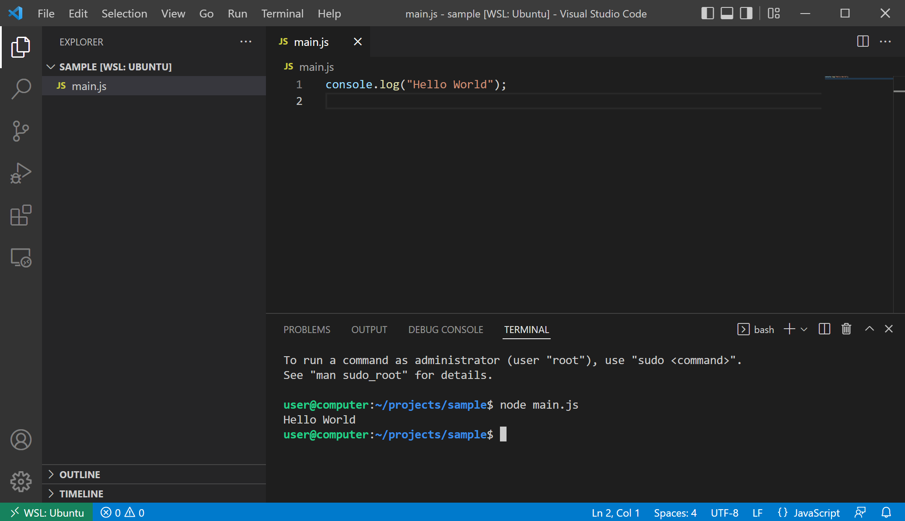

import CodeBlock from '@theme/CodeBlock';
import Tabs from '@theme/Tabs';
import TabItem from '@theme/TabItem';
import Term from "@site/src/components/Term";
import ViewSource from "@site/src/components/ViewSource";
import installNvmInWslVideo from "./install-nvm-in-wsl.mp4";
import installNvmInMacVideo from "./install-nvm-in-mac.mp4";
import openFolderInWslVideo from "./open-folder-in-wsl.mp4";
import debuggingVideo from "./debugging.mp4";

## ターミナル

**ターミナル** は、文字を用いてコンピュータと会話するためのソフトウェアです。Mac だと標準搭載の `terminal.app` が、Windows だと [`Windows Terminal` アプリ](https://apps.microsoft.com/store/detail/windows-terminal/9N0DX20HK701)が利用できますが、VSCode 内蔵のターミナルもなかなか便利です。

VSCode 内蔵のターミナルを起動させるには、メニューの `Terminal` から `New Terminal` をクリックします。


:::tip コマンド パレット

VSCode の**コマンド パレット**は、現在 VSCode 上で使用できる全ての機能を一覧表示する機能です。`Cmd / Ctrl + Shift + P` キーを押すことにより起動できます。

次の画像は、コマンド パレットを用いて新しいターミナルを作成する例です。コマンド パレットを使用することで、ショートカットキーを知らなくても、キーボードのみで VSCode が操作できるようになります。


:::

:::info Windows 環境でターミナルを使用する場合の注意

`WSL` 拡張機能を用いて WSL に接続されている場合、起動するターミナルは自動的に WSL のものになります。外部のターミナルアプリケーションを使用する場合は、明示的に WSL を起動させるようにしましょう。


:::

## ブラウザ外で動作する JavaScript

これまで、JavaScript といえば、ブラウザ上で動作するプログラミング言語でした。**Node.js** は、JavaScript をブラウザ外で動作させるための実行エンジンです。

Node.js をインストールする方法は様々ですが、現在は [nvm](https://github.com/nvm-sh/nvm) と呼ばれるツールが用いられることが多いようです。

まずは、[nvm のウェブサイトの `Install & Update Script` セクション](https://github.com/nvm-sh/nvm#install--update-script)に書かれているスクリプトを実行しましょう。2022 年 10 月現在では、次の通りです。

```shell
curl -o- https://raw.githubusercontent.com/nvm-sh/nvm/v0.39.2/install.sh | bash
```

続いて、ターミナルアプリケーションを再起動してから、nvm のインストールが成功していることを確認するため、次のコマンドを実行します。

```shell
nvm -v
```

次のように表示されたら成功です。

```shell
$ nvm -v
0.39.2
```

さらに、次のコマンドを実行して、Node.js をインストールします。

```shell
nvm install --lts
```

完了したら、Node.js のインストールが完了しているか確認するため、次のコマンドを実行します。

```shell
node -v
```

次のように表示されたら成功です。

```shell
$ node -v
v18.12.0
```

<Tabs groupId="os">
  <TabItem value="mac" label="macOS">

macOS の場合、インストールコマンドを実行してターミナルを再起動しても、`nvm` が使用できない場合があります。その場合、次のコマンドを実行してみてください。

```shell
touch ~/.zshrc
```

<video src={installNvmInMacVideo} controls />

  </TabItem>
  <TabItem value="win" label="Windows (WSL)">

Windows 上での作業は、WSL のターミナルを利用するようにしましょう。

<video src={installNvmInWslVideo} controls />

  </TabItem>
</Tabs>

## Node.js で Hello World

まずは、新しいフォルダを作成し、Visual Studio Code で開きます。Mac の場合は[はじめての Web 開発](../../1-trial-session/01-get-started/index.md)で作成した `Projects` フォルダの中に別のフォルダを作れば問題ありませんが、Windows の場合は WSL 上にフォルダを作成します。

:::info WSL 上にプロジェクトフォルダを作る

Windows の WSL では、エクスプローラーのサイドパネルから `Linux` を開いた後、`Ubuntu` → `home` → `[ユーザー名]` の順番でフォルダを開き、そこに `Projects` フォルダを作成します。

<video src={openFolderInWslVideo} controls muted />

:::

続いて、開いたフォルダに `main.js` ファイルを作成し、下のスクリプトを保存します。`console.log` 関数は、画面に文章を表示させるための関数です。

```javascript title=main.js
console.log("Hello World");
```

ターミナルを開き、`node main.js` コマンドを実行します。



ターミナルに `Hello World` が表示されれば成功です。

## Node.js のデバッグ

[ブラウザの開発者ツールを利用する](../../2-browser-apps/01-inspector/index.md) 節で JavaScript のデバッグを行ったのと同様に、Node.js では、VSCode 標準の機能を用いてデバッグを行えます。

Node.js のデバッグを開始するには、ブレークポイント等を設定したうえで、`F5` キーを押します。初回はデバッグ構成を選択するメニューが出現するので、`Node.js` を選択しましょう。デバッグが開始されると、VSCode 下部の青いバーが橙色に変化します。`console.log` は `DEBUG CONSOLE` タブに出力されるので注意しましょう。

ステップ実行、コールスタックなど、基本的な機能はブラウザに搭載されているものとほとんど同じです。

<video src={debuggingVideo} controls />

### 課題

Node.js のデバッガを用いて、`console` オブジェクトにどのようなプロパティがあるのか調べてみましょう。
