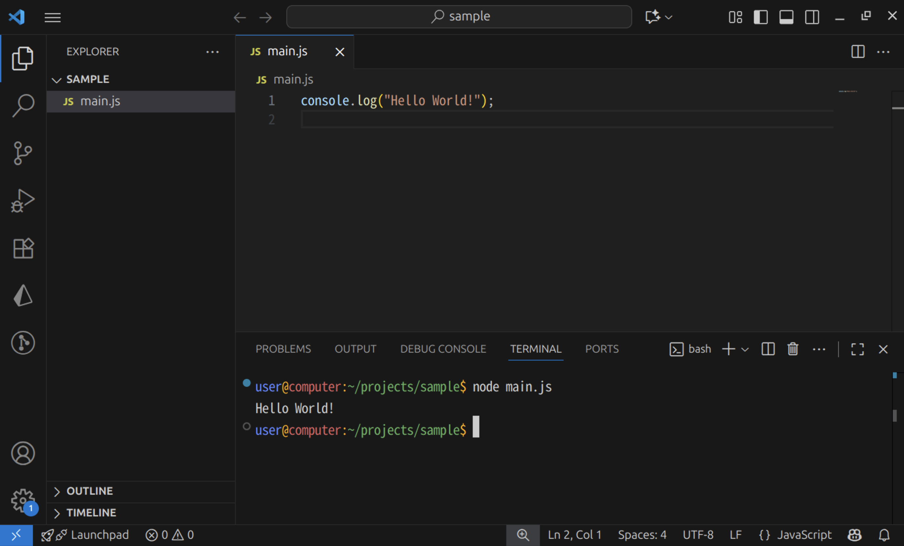

import installNvmInWslVideo from "./install-nvm-in-wsl.mp4";
import installNvmInMacVideo from "./install-nvm-in-mac.mp4";
import openFolderInWslVideo from "./open-folder-in-wsl.mp4";
import debuggingVideo from "./debugging.mp4";

## ブラウザ外で動作する JavaScript

これまで、JavaScript といえば、ブラウザ上で動作するプログラミング言語でした。**Node.js** は、JavaScript をブラウザ外で動作させるための実行エンジンです。

Node.js をインストールする方法は様々ですが、現在は [nvm](https://github.com/nvm-sh/nvm) と呼ばれるツールが用いられることが多いようです。

まずは、[nvm のウェブサイトの `Install & Update Script` セクション](https://github.com/nvm-sh/nvm#install--update-script)に書かれているスクリプトを実行しましょう。2023 年 11 月現在では、次の通りです。

```shell
curl -o- https://raw.githubusercontent.com/nvm-sh/nvm/v0.39.5/install.sh | bash
```

続いて、ターミナルアプリケーションを再起動してから、nvm のインストールが成功していることを確認するため、次のコマンドを実行します。

```shell
nvm -v
```

次のように表示されたら成功です。

```shell
$ nvm -v
0.39.5
```

さらに、次のコマンドを実行して、Node.js をインストールします。

```shell
nvm install --lts
```

完了したら、Node.js のインストールが完了しているか確認するため、次のコマンドを実行します。

```shell
node -v
```

次のように表示されたら成功です。

```shell
$ node -v
v20.10.0
```

<Tabs groupId="os">
  <TabItem value="mac" label="macOS">
    macOS の場合、インストールコマンドを実行してターミナルを再起動しても、`nvm` が使用できない場合があります。その場合、次のコマンドを実行してみてください。

    ```shell
    touch ~/.zshrc
    ```

    <video src={installNvmInMacVideo} controls />

  </TabItem>
  <TabItem value="win" label="Windows (WSL)">
    Windows 上での作業は、WSL のターミナルを利用するようにしましょう。

    <video src={installNvmInWslVideo} controls />

  </TabItem>
</Tabs>

## Node.js で Hello World

まずは、新しいフォルダを作成し、Visual Studio Code で開きます。macOS の場合は[はじめての Web 開発](/docs/trial-session/get-started/)で作成した `projects` フォルダの中に別のフォルダを作れば問題ありませんが、Windows の場合は WSL 上にフォルダを作成します。

:::info[WSL 上にプロジェクトフォルダを作る]

Windows の WSL では、エクスプローラーのサイドパネルから `Linux` を開いた後、`Ubuntu` → `home` → `[ユーザー名]` の順番でフォルダを開き、そこに `projects` フォルダを作成します。

<video src={openFolderInWslVideo} controls muted />

:::

続いて、開いたフォルダに `main.mjs` ファイルを作成し、下のスクリプトを保存します。拡張子が `.mjs` であることに気をつけてください。`console.log` 関数は、画面に文章を表示させるための関数です。

```javascript title="main.mjs"
console.log("Hello World!");
```

ターミナルを開き、`node main.mjs` コマンドを実行します。



ターミナルに `Hello World!` が表示されれば成功です。

## Node.js のデバッグ

[ブラウザの開発者ツールを利用する](/docs/browser-apps/inspector/) 節で JavaScript のデバッグを行ったのと同様に、Node.js では、VS Code 標準の機能を用いてデバッグを行えます。

Node.js のデバッグを開始するには、ブレークポイント等を設定したうえで、`F5` キーを押します。初回はデバッグ構成を選択するメニューが出現するので、`Node.js` を選択しましょう。デバッグが開始されると、VS Code 下部の青いバーが橙色に変化します。`console.log` は `DEBUG CONSOLE` タブに出力されるので注意しましょう。

ステップ実行、コールスタックなど、基本的な機能はブラウザに搭載されているものとほとんど同じです。

<video src={debuggingVideo} controls />

### 演習

Node.js のデバッガを用いて、`console` オブジェクトにどのようなプロパティがあるのか調べてみましょう。
