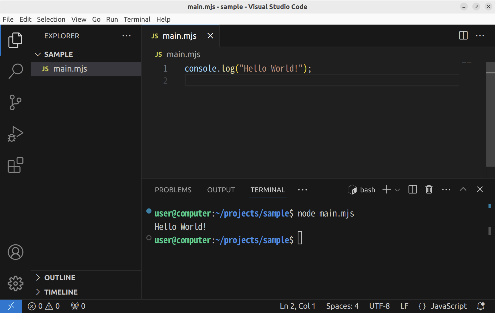

import installCommandLineDeveloperToolsVideo from "./install-command-line-developer-tools.mp4";
import installNvmInWslVideo from "./install-nvm-in-wsl.mp4";
import installNvmInMacVideo from "./install-nvm-in-mac.mp4";
import openFolderInWslVideo from "./open-folder-in-wsl.mp4";
import debuggingVideo from "./debugging.mp4";

## ブラウザ外で動作するJavaScript

これまで、JavaScriptといえば、ブラウザ上で動作するプログラミング言語でした。**Node.js**は、JavaScriptをブラウザ外で動作させるための実行エンジンです。

Node.jsをインストールする方法は様々ですが、現在は[nvm](https://github.com/nvm-sh/nvm)と呼ばれるツールが用いられることが多いようです。

macOSの場合は、先に次のコマンドを実行してコマンドラインデベロッパツールをインストールする必要があります。

```shell
xcode-select --install
```

<video src={installCommandLineDeveloperToolsVideo} controls />

まずは、[nvmのウェブサイトの`Install & Update Script`セクション](https://github.com/nvm-sh/nvm#install--update-script)に書かれているスクリプトを実行しましょう。2025年4月現在では、次の通りです。

```shell
curl -o- https://raw.githubusercontent.com/nvm-sh/nvm/v0.40.3/install.sh | bash
```

続いて、ターミナルアプリケーションを再起動してから、nvmのインストールが成功していることを確認するため、次のコマンドを実行します。

```shell
nvm -v
```

次のように表示されたら成功です。

```shell
$ nvm -v
0.40.3
```

さらに、次のコマンドを実行して、Node.jsをインストールします。

```shell
nvm install --lts
```

完了したら、Node.jsのインストールが完了しているか確認するため、次のコマンドを実行します。

```shell
node -v
```

次のように表示されたら成功です。

```shell
$ node -v
v22.15.0
```

<Tabs groupId="os">
  <TabItem value="mac" label="macOS">
    macOSの場合、インストールコマンドを実行してターミナルを再起動しても、`nvm`が使用できない場合があります。その場合、次のコマンドを実行してみてください。

    ```shell
    touch ~/.zshrc
    ```

    <video src={installNvmInMacVideo} controls />

  </TabItem>
  <TabItem value="win" label="Windows (WSL)">
    Windows上での作業は、WSLのターミナルを利用するようにしましょう。

    <video src={installNvmInWslVideo} controls />

  </TabItem>
</Tabs>

## Node.jsでHello World

まずは、新しいフォルダを作成し、Visual Studio Codeで開きます。macOSの場合は[はじめてのWeb開発](/docs/trial-session/get-started/)で作成した`projects`フォルダの中に別のフォルダを作れば問題ありませんが、Windowsの場合はWSL上にフォルダを作成します。

:::info[WSL上にプロジェクトフォルダを作る]

WindowsのWSLでは、エクスプローラーのサイドパネルから`Linux`を開いた後、`Ubuntu`→`home`→`[ユーザー名]`の順番でフォルダを開き、そこに`projects`フォルダを作成します。

<video src={openFolderInWslVideo} controls muted />

:::

続いて、開いたフォルダに`main.mjs`ファイルを作成し、下のスクリプトを保存します。拡張子が`.mjs`であることに気をつけてください。`console.log`関数は、画面に文章を表示させるための関数です。

```javascript title="main.mjs"
console.log("Hello World!");
```

ターミナルを開き、`node main.mjs`コマンドを実行します。



ターミナルに`Hello World!`が表示されれば成功です。

## Node.jsのデバッグ

[ブラウザの開発者ツールを利用する](/docs/browser-apps/inspector/)節でJavaScriptのデバッグを行ったのと同様に、Node.jsでは、VS Code標準の機能を用いてデバッグを行えます。

Node.jsのデバッグを開始するには、ブレークポイント等を設定したうえで、`F5`キーを押します。初回はデバッグ構成を選択するメニューが出現するので、`Node.js`を選択しましょう。デバッグが開始されると、VS Code下部の青いバーが橙色に変化します。`console.log`は`DEBUG CONSOLE`タブに出力されるので注意しましょう。

ステップ実行、コールスタックなど、基本的な機能はブラウザに搭載されているものとほとんど同じです。

<video src={debuggingVideo} controls />

### 確認問題

Node.jsのデバッガを用いて、`console`オブジェクトにどのようなプロパティがあるのか調べてみましょう。
