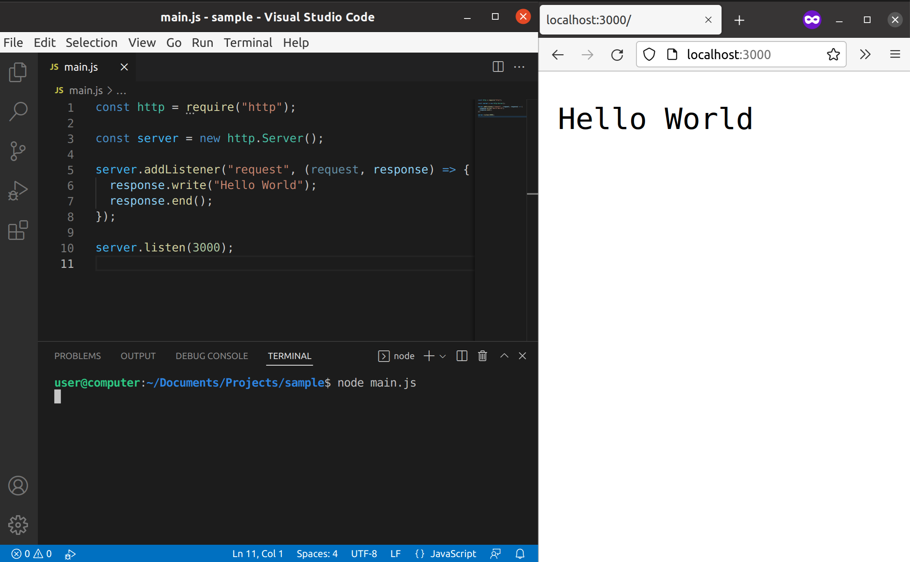

import CodeBlock from '@theme/CodeBlock';
import Term from "@site/src/components/Term";
import OpenInCodeSandbox from "@site/src/components/OpenInCodeSandbox";
import pathRoutingVideo from "./path-routing.mp4";

## ウェブサイトが動作する仕組み

[新歓体験会](../../1-trial-session/index.md) では、ウェブサイトを表示するために HTML ファイルと JavaScript ファイルを作成し、ブラウザから開きました。しかしながら、通常のウェブサイトではこのような手順は踏まず、URL をブラウザに入力することにより閲覧することができます。

Web では、通常インターネットを介してデータをやり取りします。インターネットを人間が直接利用することはできないので、何らかのコンピューターを使用しなければなりません。このとき、通常は

- **クライアント**: サービスを利用する側のコンピューターや、その上で直接通信を担うソフトウェア
- **サーバー**: サービスを提供する側のコンピューターや、その上で直接通信を担うソフトウェア

という二者の関係が発生します。また、その間で発生する通信を、その方向により

- **リクエスト**: クライアントからサーバーに対する要求
- **レスポンス**: リクエストに対する応答

のように区別して呼びます。それでは、Node.js で Web サーバーを作ってみましょう。

## Node.js で Web サーバーを作成する

Node.js で Web サーバーを作成するには、`http` 標準<Term type="javascriptModule">モジュール</Term>を使用します。

```javascript title=main.js
const http = require("http");

const server = new http.Server();

server.addListener("request", (request, response) => {
  response.write("Hello World");
  response.end();
});

server.listen(3000);
```

ファイルを保存したら、作成したファイルを実行し、ブラウザで `http://localhost:3000/` にアクセスしてみましょう。ブラウザに `Hello World` と表示されましたか？



:::caution Web サーバーの停止
このプログラムは、一度起動すると停止しません。サーバーにとって、クライアントからのリクエストはいつやってくるかわからないため、常に起動し続けている必要があるからです。Node.js プログラムを終了するには、ターミナル上で `Ctrl + C` を押します。
:::

[`http.Server` クラス](https://nodejs.org/api/http.html#class-httpserver) は、サーバーを作成するためのクラスです。このクラスの [`addListener` メソッド](https://nodejs.org/api/events.html#emitteraddlistenereventname-listener) は、イベントハンドラを追加するためのメソッドです。第 1 引数にイベントの名前、第 2 引数にイベントハンドラとなる関数オブジェクトを指定します。

[`request イベント`](https://nodejs.org/api/http.html#event-request) は、クライアントからリクエストが来るたびに発生するイベントです。イベントハンドラの第 1 引数に受け取ったリクエストを表す [`http.IncomingMessage` クラス](https://nodejs.org/api/http.html#class-httpincomingmessage) のインスタンスが、第 2 引数にこれから送るレスポンスを表す [`http.ServerResponse` クラス](https://nodejs.org/api/http.html#class-httpserverresponse) のインスタンスが渡されます。

### 課題

1. `Hello World` の `Hello` の部分を太字で表示されるようにしてみましょう。
2. `response.write` の前に `console.log` を実行するようプログラムを変更してみましょう。`console.log` はいつ実行されますか？
3. 作成した JavaScript ファイルを、デバッガを用いて実行し、`response.write` の行にブレークポイントを設置してみましょう。ブレークポイントでプログラムの実行が止まったら、`request` 引数と `response` 引数の内部がどうなっているか確認してみましょう。
4. `response.end` を実行しない場合、どのような挙動を示すでしょうか。

<details>
  <summary>解答</summary>
  <div>
    1.
    <CodeBlock language="javascript">{`
server.addListener("request", (request, response) => {
    response.write("<b>Hello</b> World");
    response.end();
});
    `.trim()}</CodeBlock>
    <OpenInCodeSandbox path="/docs/3-web-servers/04-http-server/samples/bold" />
  </div>
  <div>
    2. ブラウザ読み込み時に実行されます。
  </div>
  <div>
    3. ブラウザでの読み込みが終わらなくなります。
  </div>
</details>

## HTTP

インターネット上には、さまざまなデータが流れています。インターネットに接続しているコンピューターが好き勝手にデータを送受信しても、意味のあるやり取りは成立しません。このため、通信を行うための手順を標準化しておく必要があります。こうしてできた手順のことを、**プロトコル**と呼びます。

Web の世界で用いられるプロトコルは、通常 **HTTP** と呼ばれるものです。ブラウザに `http://example.com/path/to/index.html` が入力された場合、ブラウザとサーバーの間で次の図のような通信が行われます。


### 課題

Web サーバーにアクセスするために用いた `http://localhost:3000/` のうち、`http` はプロトコルを、`localhost:3000` はサーバーの所在地を表します (`localhost` は自分のコンピューターを指します)。

実は、HTTP において、**それ以降の部分はただの文字列としてサーバーに送信されることになっています**。例えば `http://localhost:3000/path/to/somewhere` といった URL が入力されれば、ブラウザは `/path/to/somewhere` という文字列を、リクエストの際にサーバーに送信します。

コールバック関数の `request` 引数の [`http.IncomingMessage#url` プロパティ](https://nodejs.org/api/http.html#messageurl) には、この `/path/to/somewhere` にあたる文字列が入っています。この事実を利用して、次のような Web サービスを作成してみましょう。

- `http://localhost:3000/` にアクセスすると `Click me!` と書かれた `/secret` へのリンクが表示される
- リンクがクリックされると `http://localhost:3000/secret` にページが移動し、`Secret` と表示される。

<video src={pathRoutingVideo} controls autoPlay muted loop />

<OpenInCodeSandbox path="/docs/3-web-servers/04-http-server/samples/secret" />
