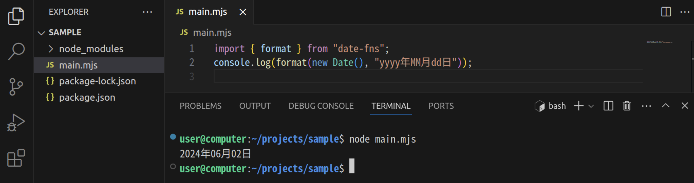

import npmInitVideo from "./npm-init.mp4";
import npmInstallVideo from "./npm-install.mp4";

## 別のファイルに書かれたプログラム

Node.js では、あるファイルに書かれたプログラムは、別のプログラムからは読み込めません。よって、次の `main.mjs` はエラーになります。

```javascript title="sub.mjs"
function add(a, b) {
  return a + b;
}
```

```javascript title="main.mjs"
console.log(add(3, 4)); // Uncaught ReferenceError: add is not defined
```

別のファイルに書かれたプログラムを読み込むための手段として、Node.js では<Term>**モジュール**</Term>という仕組みが用意されています。JavaScript では、すべてのファイルが<Term>モジュール</Term>として扱われます。

Node.js では、ファイルの拡張子が `.mjs` の場合、`export` 文や `import` 文を用いて他の<Term>モジュール</Term>とのやりとりを行います。

```javascript title="sub.mjs"
export default function add(a, b) {
  return a + b;
}
```

```javascript title="main.mjs"
import add from "./sub.mjs";
console.log(add(3, 4));
```

<ViewSource url={import.meta.url} path="_samples/default-export" />

:::tip[名前付きエクスポート]

上のように**デフォルトエクスポート**を使うと各モジュールで複数の関数をエクスポートすることができません。その場合は、**名前付きエクスポート**を用いることができます。

```javascript title="sub.mjs"
export function add(a, b) {
  return a + b;
}

export function subtract(a, b) {
  return a - b;
}
```

```javascript title="main.mjs"
import { add, subtract } from "./sub.mjs";
console.log(add(3, 4));
console.log(subtract(4, 3));
```

<ViewSource url={import.meta.url} path="_samples/named-export" />

:::

:::tip[CommonJS モジュール]

さきほどのように `export` 文と `import` 文を用いて他の<Term>モジュール</Term>とのやり取りを行う JavaScript 標準の<Term>モジュール</Term>システムを、[**ECMAScript モジュール**](https://developer.mozilla.org/ja/docs/Web/JavaScript/Guide/Modules)と呼ぶ場合があります。Node.jsでは、拡張子を `.mjs` にすることで、ECMAScript <Term>モジュール</Term>を用いてプログラムを記述できます。

ECMAScript モジュールの他に [CommonJS モジュール](https://nodejs.org/api/modules.html)と呼ばれるものもあります。CommonJS モジュールでは、`exports` オブジェクトや `require` 関数を用いて他の<Term>モジュール</Term>とのやり取りを行うことができます。Node.js では、拡張子を `.js` にすることで、CommonJS <Term>モジュール</Term>を用いてプログラムを記述できます。

`exports` オブジェクトは標準では空のオブジェクトですが、プログラム中から書き換えることができます。

`require` 関数に別のファイルへの相対パスを指定すると、そのファイルを実行した後にできる `exports` オブジェクトを取得できます。

```javascript title="sub.js"
exports.add = (a, b) => {
  return a + b;
};
```

```javascript title="main.js"
const sub = require("./sub"); // sub = { add: (a, b) => { return a + b; } }
const add = sub.add;
console.log(add(3, 4));
```

<ViewSource url={import.meta.url} path="_samples/commonjs-module" />

:::

## 標準<Term>モジュール</Term>

Node.js の [`fs` 標準モジュール](https://nodejs.org/api/fs.html) を用いると、Node.js からファイルの読み書きを行うことができます。`fs` モジュールの [`readFileSync` 関数](https://nodejs.org/api/fs.html#fsreadfilesyncpath-options)は、ファイルの読み込みを行う関数で、第 1 引数にファイルへのパスを指定し、第 2 引数には文字コードを指定します。

```javascript title="main.mjs"
import { readFileSync } from "node:fs";
console.log(readFileSync("sample.txt", "utf-8"));
```

```plain title="sample.txt"
Hello World
```

<ViewSource
  url={import.meta.url}
  path="_samples/read-file-sync"
  noCodeSandbox
/>

:::tip[文字コード]

**文字コード**とは、文字のコンピューターによる表現です。`UTF-8` や `Shift_JIS` などさまざまな方式が定義されていますが、現在では通常 `UTF-8` を選んでおけば問題ありません。間違った方式を選んでしまうと、意図と異なる文字として解釈されてしまう現象 (**文字化け**)が起こります。

:::

### 演習

`fs` モジュールの [`writeFileSync` 関数](https://nodejs.org/api/fs.html#fswritefilesyncfile-data-options)を用いて、ファイルに文字列を書き出してみましょう。

<Answer>

第一引数にファイルへのパス、第二引数に書き込む文字列を指定します。

```javascript title="main.mjs"
import { writeFileSync } from "node:fs";
writeFileSync("./sample.txt", "Hello World");
```

<ViewSource
  url={import.meta.url}
  path="_samples/write-file-sync"
  noCodeSandbox
/>

</Answer>

## npm

Node.js における**パッケージ**とは、主に JavaScript ファイルをまとめていろいろな場所で利用可能にしたものです。[npm](https://docs.npmjs.com/about-npm) (Node Package Manager) は、Node.js の**パッケージマネージャー**で、このソフトウェアを通してパッケージを管理できます。

また、npm から利用されるパッケージを集積したサービス [npmjs.com](https://www.npmjs.com/) もまた、npm と呼ばれます。例として、日付や時刻の操作のために用いられる<Term>ライブラリ</Term>である、[date-fns](https://www.npmjs.com/package/date-fns) パッケージを利用してみましょう。

npm を用いて開発を行うには、まず `npm init` コマンドを実行します。いくつか質問をされるので、Enter キーを押し続けて質問をスキップしましょう。完了すると、フォルダの中に `package.json` という名前のファイルが作成されます。このファイルは、npm によって管理されるフォルダに必ず 1 つ必要になるものです。

<video src={npmInitVideo} controls muted />

続いて、npm のパッケージをインストールします。`npm install` に続けて、インストールしたいパッケージの名前を入力します。

```shell
npm install date-fns
```

これにより、フォルダの中に `package-lock.json` ファイルと、`node_modules` フォルダが作成され、内部にパッケージ本体がダウンロードされます。

<video src={npmInstallVideo} controls muted />

:::tip[JSON]

npm によって作成された `package.json` とは何者でしょうか。拡張子が `.json` のファイルには、**JSON** が記述されています。JSON は、 JavaScript Object Notation の略で、複雑なデータ構造を単一の文字列として表現する際に、JavaScript オブジェクトに似た記法を用いるための仕様です。JavaScript との相性が非常に良いだけでなく、文法が単純で明快であることから、JavaScript を用いないプロジェクトでも頻繁に用いられます。

JSON は、JavaScript のオブジェクト記法よりも制限が厳しくなっています。例えば、

```js
{
  name: "田中",
  age: 18,
}
```

は、JavaScript の文法では有効ですが、JSON としては誤りです。JSON には、

- キーには必ずダブルクォーテーションをつける
- 最後のプロパティの後にはコンマをつけてはならない

という制約があります。このため、上のオブジェクトを JSON で記述するためには、

```json
{
  "name": "田中",
  "age": 18
}
```

のようにしなければなりません。

:::

## npm のパッケージを Node.js から利用する

npm でダウンロードしたパッケージは、<Term>モジュール</Term>として `import` 宣言に指定できます。

```javascript
import { format } from "date-fns";
console.log(format(new Date(), "yyyy年MM月dd日"));
```

<ViewSource url={import.meta.url} path="_samples/date-fns" noCodeSandbox />



## 初級演習

### `node-emoji` パッケージ

[`node-emoji` パッケージ](https://www.npmjs.com/package/node-emoji)は、Node.js で絵文字を扱うことができるパッケージです。このパッケージを用いて、`I ❤️ ☕!` と出力してください。

<Answer title="node-emoji パッケージ">
   
[`emojify` 関数](https://www.npmjs.com/package/node-emoji#emojiemojifyinput-options)を用いると、文字列中の絵文字を表す部分を絵文字に変換することができます。
   
```javascript
import { emojify } from "node-emoji";
console.log(emojify("I :heart: :coffee:!"));
```
   
<ViewSource url={import.meta.url} path="_samples/node-emoji" noCodeSandbox />

</Answer>

## 中級演習

### `mathjs` パッケージ

[`mathjs` パッケージ](https://www.npmjs.com/package/mathjs)は、JavaScript で複雑な計算を行うためのライブラリです。このライブラリを用いて、$\log(x)$ を $x$ について微分した式を求めてください。

<Answer title="mathjs パッケージ">

[`mathjs.derivative` 関数](https://mathjs.org/docs/reference/functions/derivative.html)を用いると、微分した式を求めることができます。

```javascript
import { derivative } from "mathjs";
console.log(derivative("log(x, e)", "x").toString());
```

<ViewSource url={import.meta.url} path="_samples/mathjs" noCodeSandbox />

</Answer>
