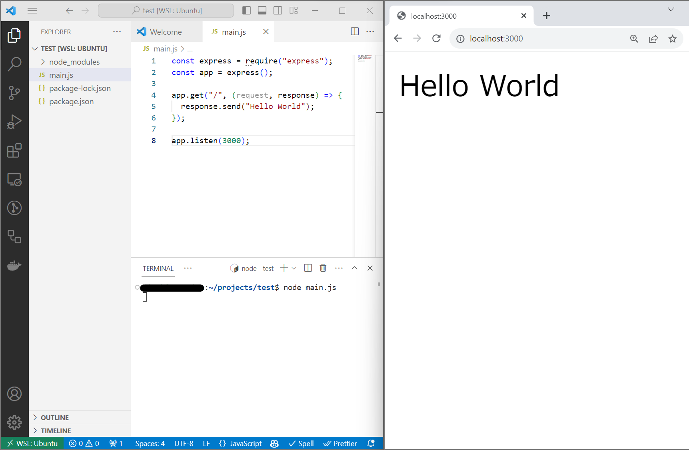
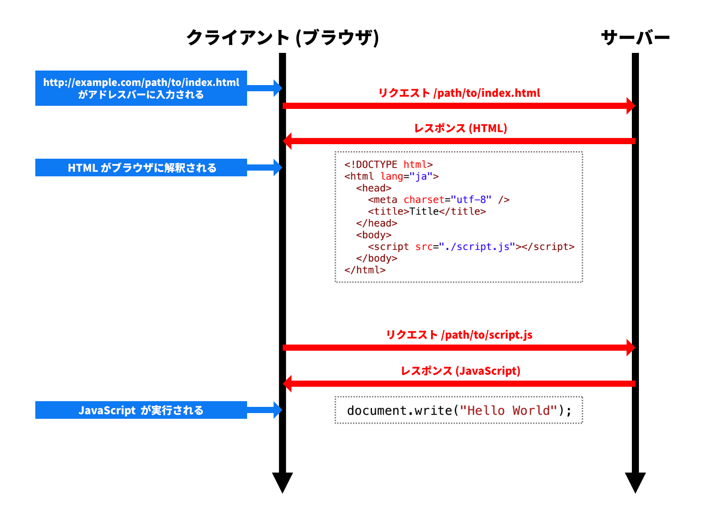

import CodeBlock from '@theme/CodeBlock';
import Term from "@site/src/components/Term";
import ViewSource from "@site/src/components/ViewSource";

## ウェブサイトが動作する仕組み

[「Web プログラミングの基礎を学ぼう」](../../1-trial-session/index.md) の章では、ウェブサイトを表示するために HTML ファイルと JavaScript ファイルを作成し、ブラウザから開きました。しかしながら、通常のウェブサイトではこのような手順は踏まず、URL をブラウザに入力することにより閲覧することができます。

Web では、通常インターネットを介してデータをやり取りします。インターネットを人間が直接利用することはできないので、何らかのコンピューターを使用しなければなりません。このとき、通常は

- **クライアント**: サービスを利用する側のコンピューターや、その上で直接通信を担うソフトウェア
- **サーバー**: サービスを提供する側のコンピューターや、その上で直接通信を担うソフトウェア

という二者の関係が発生します。また、その間で発生する通信を、その方向により

- **リクエスト**: クライアントからサーバーに対する要求
- **レスポンス**: リクエストに対するサーバーからクライアントへの応答

のように区別して呼びます。それでは、Node.js で Web サーバーを作ってみましょう。

## Express パッケージを用いて Web サーバーを構築する

[Express パッケージ](https://www.npmjs.com/package/express) を用いると、簡単に Web サーバーを構築できます。

まずは `express` パッケージを npm でインストールします。

```shell
npm install express
```

続いて、次のような `main.mjs` を作成しましょう。

```javascript title=main.js
import express from "express";
const app = express();

app.get("/", (request, response) => {
  response.send("Hello World");
});

app.listen(3000);
```

<ViewSource url={import.meta.url} path="_samples/express-server" />

ファイルを保存したら、作成したファイルを実行しましょう。

```shell
node main.mjs
```

ブラウザで `http://localhost:3000/` にアクセスしてみましょう。ブラウザに `Hello World` と表示されましたか？



:::caution Web サーバーの停止

このプログラムは、一度起動すると停止しません。サーバーにとって、クライアントからのリクエストはいつやってくるかわからないため、常に起動し続けている必要があるからです。Node.js プログラムを終了するには、ターミナル上で `Ctrl + C` を押します。

:::

書いたコードを詳しく見てみましょう。

`express` 関数を呼び出すことにより、[`express.Application`](https://expressjs.com/ja/api.html#app) クラスのインスタンスが作成されます。

[`express.Application#get` メソッド](https://expressjs.com/ja/api.html#app.get.method)は、クライアントから特定のパスに対してリクエストが来た時に実行される関数を追加するメソッドです。第 1 引数にはパスの文字列を、第 2 引数には実行される関数を指定します。

例えば今回であれば第 1 引数に `"/path"` を渡すと `http://localhost:3000/path` にリクエストが来たときに関数が実行されることになります。

第 2 引数の関数を詳しく見てみましょう。この関数は 2 つの引数をとります。具体的には第 1 引数に受け取ったリクエストを表す [`express.Request` クラス](https://expressjs.com/ja/api.html#req) のインスタンスが、第 2 引数にこれから送るレスポンスを表す [`express.Response` クラス](https://expressjs.com/ja/api.html#res) のインスタンスが渡されます。

そして [`express.Response#send` メソッド](https://expressjs.com/ja/api.html#res.send)により、クライアントが必要なデータを送信することができます。

:::tip `http`標準<Term type="javascriptModule">モジュール</Term>
`express` を使わずに Node.js 単体 で Web サーバーを作成するには、`http` 標準<Term type="javascriptModule">モジュール</Term>を使用します。

`http` 標準モジュールを使って 簡単な Web サーバーを構築すると以下のようなコードになります。

```javascript title=main.mjs
import { Server } from "http";

const server = new Server();

server.addListener("request", (request, response) => {
  response.write("Hello World");
  response.end();
});

server.listen(3000);
```

<ViewSource url={import.meta.url} path="_samples/http-server" />

:::

## HTTP

インターネット上には、さまざまなデータが流れています。インターネットに接続しているコンピューターが好き勝手にデータを送受信しても、意味のあるやり取りは成立しません。このため、通信を行うための手順を標準化しておく必要があります。こうしてできた手順のことを、**プロトコル**と呼びます。

Web の世界で用いられるプロトコルは、通常 **HTTP** と呼ばれるものです。ブラウザに `http://example.com/path/to/index.html` が入力された場合、ブラウザとサーバーの間で次の図のような通信が行われます。



Web サーバーにアクセスするために用いた `http://localhost:3000/` のうち、http はプロトコルを、localhost:3000 はサーバーの所在地を表しています (localhost は自分のコンピューターを指します)。

## 静的ホスティング

次の例では、`/`、`/script.js`、`/sub/`、`/sub/script.js` へのリクエストについて、それぞれファイルから読み込んでレスポンスを送信しています。

```javascript
import express from "express";
import { readFileSync } from "fs";
const app = express();

app.get("/", (request, response) => {
  response.send(readFileSync("static/index.html", "utf-8"));
});
app.get("/script.js", (request, response) => {
  response.send(readFileSync("static/script.js", "utf-8"));
});
app.get("/sub/", (request, response) => {
  response.send(readFileSync("static/sub/index.html", "utf-8"));
});
app.get("/sub/script.js", (request, response) => {
  response.send(readFileSync("static/sub/script.js", "utf-8"));
});

app.listen(3000);
```

<ViewSource url={import.meta.url} path="_samples/static-hosting-naive" />

`express.static` 関数を用いると、このような「リクエストを受け取ったら、そのパスに応じて適切なファイルを読み込んでレスポンスとして返す」という一連の動作を簡単に記述できます。

```javascript
import express from "express";

const app = express();
app.use(express.static("static"));
app.listen(3000);
```

<ViewSource url={import.meta.url} path="_samples/static-hosting-smart" />

これにより、リクエストのパスをもとに、`static` フォルダ内の適切なファイルが自動的に配信されます。

:::tip `index.html` の省略

`express.static` を用いる場合、`index.html` は省略可能になります。つまり、`/` へのリクエストで `static/index.html` が、`/sub` へのリクエストで `static/sub/index.html` にアクセスできるようになります。これは、Express や JavaScript に限ったことではなく、多くの Web サーバーの実装において、こういったルールが成り立ちます。

:::

## 複雑なウェブページ

前項のプログラムを書き換えて、複雑な HTML を出力できるようにしてみましょう。

```javascript
import express from "express";
const app = express();

const names = ["田中", "鈴木", "佐藤"];
app.get("/", (request, response) => {
  response.send(`
    <!DOCTYPE html>
      <html lang="ja">
      <head>
        <meta charset="utf-8" />
        <title>Title</title>
      </head>
      <body>
        <ul>
          ${names.map((name) => `<li>${name}</li>`).join("")}
        </ul>
      </body>
    </html>
  `);
});

app.listen(3000);
```

<ViewSource url={import.meta.url} path="_samples/complex-html" />

:::note `Array#join`

[`Array#join` メソッド](https://developer.mozilla.org/ja/docs/Web/JavaScript/Reference/Global_Objects/Array/join)は、配列を指定した区切り文字で結合した文字列を返すメソッドです。

```javascript
console.log(["Apple", "Banana", "Orange"].join("/")); // Apple/Banana/Orange
```

:::

このようにテンプレートリテラルを用いることで、複雑なウェブページの内容を表すことができます。

:::tip テンプレートエンジン
上記のようにテンプレートリテラルを使って HTML を作成することもできますが、HTML がもっと長くなったり、さらに複雑なプログラムが必要になってきたらこのまま続けていくのは難しそうです。  
[EJS](https://ejs.co/) をはじめとした**テンプレートエンジン**は、プログラミング言語から HTML などを作成する作業を簡単にしてくれます。先ほどのプログラムを、EJS を用いて書き換えると、次のようになります。(手元で試したい場合は `ejs` をインストールしてください)

```javascript title=main.mjs
import { readFileSync } from "fs";
import express from "express";
import { render } from "ejs";

const app = express();

const names = ["田中", "鈴木", "佐藤"];
app.get("/", (request, response) => {
  const template = readFileSync("template.ejs", "utf-8");
  const html = render(template, {
    listItems: names,
  });
  response.send(html);
});

app.listen(3000);
```

```html title=template.ejs
<!DOCTYPE html>
<html lang="ja">
  <head>
    <meta charset="utf-8" />
    <title>Title</title>
  </head>
  <body>
    <ul>
      <% for (const listItem of listItems) { %>
      <li><%= listItem %></li>
      <% } %>
    </ul>
  </body>
</html>
```

<ViewSource url={import.meta.url} path="_samples/ejs-template-engine" />

イベントハンドラの中で、プログラムではまず `fs.readFileSync` 関数を用いて `template.ejs` ファイルの内容を読み込んでいます。その次の行の [`ejs.render` 関数](https://ejs.co/#docs) がポイントです。この関数は、第 1 引数にテンプレートを文字列として受け取り、諸々の変換を行った後の文字列を返します。第 2 引数には、変換の際に埋め込みたいデータをオブジェクトの形式で指定します。

このオブジェクトのキーと同じ名前の変数が、テンプレート内で利用できます。上の例の `template.ejs` における `listItems` は、`main.mjs` で指定した `{ listItems: names }` により `["田中", "鈴木", "佐藤"]` になります。

テンプレート内の `<%` から `%>` で囲まれた部分は、JavaScript のプログラムとして実行されます。また、`<%=` から `%>` で囲まれた部分は JavaScript の式として評価され、最終的な結果に埋め込まれます。
:::

## 課題

- Express を用いて、`あなたは n 人目のお客様です。` とレスポンスする Web サーバーを作成してください。`n` はアクセスされるたびに 1 ずつ増えるようにしてください。
- (重要) アクセスされた時刻をウェブサーバー側で求めて表示するウェブサーバーと、ブラウザに求めさせるウェブサーバーをそれぞれ作成してください。
  - この 2 つの違いは何でしょうか。どういった場合にどちらの手法を使うのが適切でしょうか。

解答例 1:

<ViewSource url={import.meta.url} path="_samples/nth" />

解答例 2:

<ViewSource url={import.meta.url} path="_samples/server-or-client" />
