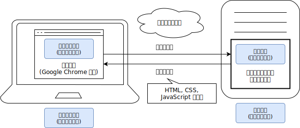

import expressSetupVideo from "./express-setup.mp4";
import UrlStructureExplanation from "./url-structure-explanation.tsx";
import RequestResponseSlideShow from "./request-response-slide-show";

## ウェブサイトが動作する仕組み

[「Webプログラミングの基礎を学ぼう」](/docs/trial-session/)の章では、ウェブサイトを表示するためにHTMLファイルとJavaScriptファイルを作成し、ブラウザから開きました。
しかし、一般的なウェブサイトを閲覧する際は、HTMLファイルやJavaScriptファイルの存在を意識することはありません。
これは、Webでは、通常インターネットを介してデータをやり取りするためです。

インターネットを人間が直接利用することはできないので、何らかのコンピューターを使用しなければなりません。
このとき、

- **クライアント**: サービスを利用する側のコンピューターや、その上で直接通信を担うソフトウェア
- **サーバー**: サービスを提供する側のコンピューターや、その上で直接通信を担うソフトウェア

という二者の関係が発生します。また、その間で発生する通信を、その方向により

- **リクエスト**: クライアントからサーバーに対する要求
- **レスポンス**: リクエストに対するサーバーからクライアントへの応答

のように区別して呼びます。

Google ChromeやSafariに代表される**ブラウザ**は、Webにおけるクライアントソフトウェアの呼称です。
Webにおいて、HTML、CSS、JavaScriptは、サーバーがクライアントに対してレスポンスとして送信するデータの一部で、ブラウザによって解釈されて表示されます。

ここからは、Node.jsを用いて、Webサーバーとして動作するソフトウェアを作成していきます。



:::tip[ここまででの教材とのつながり]

ブラウザは、サーバーと通信して取得したHTML、CSS、JavaScriptデータを解釈して表示するだけでなく、コンピューター上にファイルの形式で存在しているHTML、CSS、JavaScriptを表示することもできます。
ここまでの教材では、サーバーという概念の導入による複雑さを避けるため、この機能を用いて各言語の文法を学んできました。

:::

## Expressパッケージを用いてWebサーバーを構築する

[Expressパッケージ](https://www.npmjs.com/package/express)を用いると、簡単にWebサーバーを構築できます。

まずは`express`パッケージをnpmでインストールします。

```shell
npm install express
```

続いて、次のような`main.mjs`を作成しましょう。

```javascript title="main.mjs" showLineNumbers
import express from "express";
const app = express();

app.get("/", (request, response) => {
  response.send(`Hello World! <a href="./lang/ja">日本語</a>`);
});
app.get("/lang/ja", (request, response) => {
  response.send("こんにちは、世界！");
});

app.listen(3000);
```

<ViewSource url={import.meta.url} path="_samples/express-server" />

ファイルを保存したら、作成したファイルを実行しましょう。

```shell
node main.mjs
```

ブラウザで<a href="http://localhost:3000/" target="_blank">`http://localhost:3000/`</a>にアクセスし、次の動作を確認してください。

- `Hello World！ 日本語`が表示されること
- `日本語`をクリックするとアドレスバーが<a href="http://localhost:3000/lang/ja" target="_blank">`http://localhost:3000/lang/ja`</a>に変化し`こんにちは、世界！`が表示されること

<video src={expressSetupVideo} muted controls />

:::warning[Webサーバーの停止]

サーバーは、クライアントからのリクエストを待ち受けるため、管理者により指示されない限り終了しないソフトウェアとして動作します。
Expressで構築したサーバーは、ターミナル上で<kbd>control</kbd> + <kbd>C</kbd> (macOS) / <kbd>Ctrl</kbd> + <kbd>C</kbd> (Windows) を押すことで停止することができます。

:::

## HTTPとURL

前項のプログラムが動作する仕組みを理解するためには、ブラウザとサーバーの間で行われるやり取りについて知る必要があります。
互いが好き勝手にデータを送受信しても、意味のあるやり取りは成立しません。
そこで、ブラウザとサーバーの間でデータを送受信する際には、一定の手順に従う必要があります。
この手順のことを**プロトコル**と呼び、Webの世界では、**HTTP**と呼ばれるプロトコルが用いられます。

ブラウザは、アドレスバーに**URL**が入力されると、その情報をもとにHTTPを用いてサーバーと通信します。
例えば、先ほどの例で使用した`http://localhost:3000/lang/ja`というURLは、次のように解釈されます。

<p>
  <UrlStructureExplanation />
</p>

- **プロトコル**:
  `http`または`https`のいずれかです。
  いずれを指定しても使用されるプロトコルはHTTPですが、`https`を指定した場合は通信内容が暗号化されます。
  この例では`http`を用いていますが、インターネット上に公開するウェブサイトでは`https`を用いることが推奨されます。
- **ドメイン**:
  通信先のコンピューターを特定するための識別子です。
  この例ではサーバーを自分のコンピューター上に構築しているため、自分自身を表す特殊なドメイン`localhost`を用いています。
  `example.com`や`foo.example.net`は、実際のインターネット上で使われるドメイン名の例です。
- **ポート**:
  通信先のコンピューター上で、どのプログラムと通信するかを特定するための整数です。
  ポートを変えることで、同じコンピューター上で複数のサーバーが通信を待ち受けることができます。
  省略すると、プロトコル部分が`http`の場合は80番ポートが、`https`の場合は443番ポートが用いられます。
- **パス**:
  クライアントがサーバーに対し、何を要求するかを指定するための文字列です。
  Linuxのファイルシステムで用いられるパスと同様に、意味的には`/`記号によって階層化されますが、クライアントはサーバーに対してパスを文字列として送信するだけで、その内容はサーバーによって自由に解釈されます。

`http://localhost:3000/lang/ja`というURLは、HTTPプロトコルを暗号化せずに用いて、`localhost`というドメインの3000番ポートで待ち受けているサーバーに対して`/lang/ja`というパスを要求することを意味します。

このように、URLに含まれる情報のうち、プロトコル、ドメイン、ポートはネットワーク上で通信を行うために用いられる情報です。
残りのパス部分をどのように扱うかが、サーバー側のプログラムにおける主な関心事になります。

## Hello Worldサーバーの動作

`main.mjs`のプログラムを参照しながら、ブラウザとサーバーの間でどのようなやり取りが行われているのかを確認しましょう。

```javascript title="main.mjs (再掲)" showLineNumbers
import express from "express";
const app = express();

app.get("/", (request, response) => {
  response.send(`Hello World! <a href="./lang/ja">日本語</a>`);
});
app.get("/lang/ja", (request, response) => {
  response.send("こんにちは、世界！");
});

app.listen(3000);
```

### `node main.mjs`を実行したとき

1. **[2行目]** `const app = express();`により、Expressの[`Application`](https://expressjs.com/ja/api.html#app)クラスのインスタンスが作成されます。
2. **[4行目]** `app.get("/", (request, response) => { ... });`で呼び出された[`get`](https://expressjs.com/ja/api.html#app.get.method)メソッドにより、`/`というパスに対するリクエストを受けたときに実行される関数として、第2引数に指定された関数が登録されます。この時点では関数は`Application`インスタンスに登録されるのみで、実行はされません。
3. **[7行目]** 4行目と同様に、`/lang/ja`というパスに対するリクエストを受けたときに実行される関数が登録されます。
4. **[11行目]** `app.listen(3000);`により、Expressはリクエストを待ち受けるHTTPサーバーとして動作を開始します。

### ブラウザの操作を行ったとき

1. 利用者が、ブラウザのアドレスバーに`http://localhost:3000/`というURLを入力します。
2. ブラウザは、`localhost:3000`で起動しているExpressのサーバーに対して、`/`というパスに対するHTTPリクエストを送信します。
3. Expressは`/`に対するHTTPリクエストを受け取り、**[4行目]** の関数を実行します。引数として、Expressは次に示す2つのオブジェクトを生成して渡します。
   - 第1引数 (`request`): 受け取ったHTTPリクエストに関する情報をExpressが開発者にとって扱いやすい形にまとめた[`Request`](https://expressjs.com/ja/api.html#req)クラスのインスタンス。
   - 第2引数 (`response`): Expressがクライアントに返すHTTPレスポンスを開発者が制御するための[`Response`](https://expressjs.com/ja/api.html#res)クラスのインスタンス。
4. **[5行目]** の <code>{'response.send(`...`);'}</code>により、Expressは<code>{'`Hello World! <a href="./lang/ja">日本語</a>`'}</code>という文字列をレスポンスとして送信します。
5. ブラウザは、受け取ったレスポンスをHTMLとして解釈し、`Hello World!`という文字列と、`日本語`というリンクを表示します。
6. 利用者が、`日本語`というリンクをクリックします。
7. ブラウザは、クリックされたリンクの`href`属性をもとに、アドレスバーのURLを更新し、ページ遷移を起こします。
   - `href`属性にプロトコルを含むURLが指定されていれば、そのURLに遷移します。
   - `href`属性が相対パスの形式で指定されていれば、現在のパスを基準に[Linuxにおける相対パス](/docs/web-servers/linux-commands/#パス)と同様の方法でURLを更新します。この例では、更新前のパスが`/`で、`href`属性には`./lang/ja`が指定されているため、更新後のパスは`/lang/ja`になり、URLは`http://localhost:3000/lang/ja`に変化します。
8. 2から5までの手順が、`/lang/ja`というパスに対して行われます。

<p>
  <RequestResponseSlideShow />
</p>

## HTMLに指定された外部リソースの取得

サーバーから返されたレスポンスがHTMLである場合、ブラウザによってさらに別のリクエストが送信される場合があります。
例えば、HTMLにはCSSやJavaScriptなどの外部リソースを読み込むためのタグが存在します。
これらの外部リソースは、ブラウザがHTMLを解釈する際に、それぞれに対するリクエストを送信して取得します。

次の例では、ブラウザは2つのHTTPリクエストを送信します。

1. 利用者が、ブラウザのアドレスバーに`http://localhost:3000/`というURLを入力します。
2. ブラウザは、`/`というパスに対するHTTPリクエストを送信します。
3. サーバーは、`<script src="./script.js"></script>`という文字列をレスポンスとして送信します。
4. ブラウザは、受け取ったレスポンスをHTMLとして解釈し、`script`タグを発見します。
5. ブラウザは、`src`属性を相対パスとして解釈し、`/script.js`というパスに対してHTTPリクエストを送信します。
6. サーバーは、`document.write("Hello World!");`という文字列をレスポンスとして送信します。
7. ブラウザは、受け取ったレスポンスをJavaScriptとして解釈し、`Hello World!`という文字列を表示します。

```javascript title="main.mjs"
import express from "express";
const app = express();

app.get("/", (request, response) => {
  response.send(`<script src="./script.js"></script>`);
});
app.get("/script.js", (request, response) => {
  response.send(`document.write("Hello World!");`);
});

app.listen(3000);
```

<ViewSource url={import.meta.url} path="_samples/html-external-resources" />

## 静的ウェブサーバー

次の例では、`/`、`/script.js`、`/sub/`、`/sub/script.js`へのリクエストについて、それぞれファイルから読み込んでレスポンスを送信しています。

```javascript title="main.mjs"
import express from "express";
import { readFileSync } from "node:fs";
const app = express();

app.get("/", (request, response) => {
  response.send(readFileSync("./static/index.html", "utf-8"));
});
app.get("/script.js", (request, response) => {
  response.send(readFileSync("./static/script.js", "utf-8"));
});
app.get("/sub/", (request, response) => {
  response.send(readFileSync("./static/sub/index.html", "utf-8"));
});
app.get("/sub/script.js", (request, response) => {
  response.send(readFileSync("./static/sub/script.js", "utf-8"));
});

app.listen(3000);
```

<ViewSource url={import.meta.url} path="_samples/static-hosting-naive" />

[`express.static`関数](https://expressjs.com/ja/api.html#express.static)を用いると、このような「リクエストを受け取ったら、そのパスに応じて適切なファイルを読み込んでレスポンスとして返す」という一連の動作を簡単に記述できます。

```javascript title="main.mjs"
import express from "express";

const app = express();
app.use(express.static("static"));
app.listen(3000);
```

<ViewSource url={import.meta.url} path="_samples/static-hosting-smart" />

これにより、リクエストのパスをもとに、`static`フォルダ内の適切なファイルが自動的に配信されます。

:::tip[`index.html`の省略]

`express.static`を用いる場合、`index.html`は省略可能になります。つまり、`/`へのリクエストで`static/index.html`が、`/sub`へのリクエストで`static/sub/index.html`にアクセスできるようになります。これは、ExpressやJavaScriptに限ったことではなく、多くのWebサーバーの実装において、こういったルールが成り立ちます。

:::

:::tip[`app.use`と`express.static`の実装]

Expressの [`use`メソッド](https://expressjs.com/ja/api.html#app.use) は、`get`メソッドと同様に、リクエストを受け取ったときに実行される関数を登録するためのメソッドです。
しかし、`use`メソッドは、登録された関数が全てのリクエストに対して実行される点が異なります。
`express.static`関数は、関数を返す関数となっており、`use`メソッドに渡すことで、リクエストのパスに応じて適切なファイルを読み込んでレスポンスとして返す関数を登録することができます。

Expressの [`Request`](https://expressjs.com/ja/api.html#req) オブジェクトの[`path`プロパティ](https://expressjs.com/ja/api.html#req.path)には、リクエストのパスが文字列として格納されています。
この値を用いて、`express.static`は適切なファイルを読み込みます。
次の例は、`express.static`関数の簡易な実装例です。
このプログラムは動作はしますが、セキュリティ上の問題があるため、実際のExpressの実装はもっと複雑になっています。

```javascript
const app = express();
app.use((request, response) => {
  response.send(readFileSync("./static" + request.path, "utf-8"));
});
app.listen(3000);
```

<ViewSource url={import.meta.url} path="_samples/app-use" />

:::

## 複雑なウェブページ

前項のプログラムを書き換えて、複雑なHTMLを出力できるようにしてみましょう。

```javascript title="main.mjs"
import express from "express";
const app = express();

const names = ["田中", "鈴木", "佐藤"];
app.get("/", (request, response) => {
  response.send(`
    <!doctype html>
      <html lang="ja">
      <head>
        <meta charset="utf-8" />
        <title>Title</title>
      </head>
      <body>
        <ul>
          ${names.map((name) => `<li>${name}</li>`).join("")}
        </ul>
      </body>
    </html>
  `);
});

app.listen(3000);
```

<ViewSource url={import.meta.url} path="_samples/complex-html" />

:::note[`Array#join`]

[`Array#join`メソッド](https://developer.mozilla.org/ja/docs/Web/JavaScript/Reference/Global_Objects/Array/join)は、配列を指定した区切り文字で結合した文字列を返すメソッドです。

```javascript
console.log(["Apple", "Banana", "Orange"].join("/")); // Apple/Banana/Orange
```

:::

このようにテンプレートリテラルを用いることで、複雑なウェブページの内容を表すことができます。

## 演習

### 訪問者カウンター

Expressを用いて、`あなたはn人目のお客様です。`とレスポンスするWebサーバーを作成してください。`n`はアクセスされるたびに1ずつ増えるようにしてください。

<Answer title="訪問者カウンター">

```javascript title="main.mjs"
import express from "express";
const app = express();

let count = 0;
app.get("/", (request, response) => {
  count += 1;
  response.send(`あなたは${count}人目のお客様です。`);
});

app.listen(3000);
```

<ViewSource url={import.meta.url} path="_samples/nth" />

</Answer>

### サーバー側とクライアント側

(重要) アクセスされた時刻をウェブサーバー側で求めて表示するウェブサーバーと、ブラウザに求めさせるウェブサーバーをそれぞれ作成してください。また、この2つの違いは何でしょうか。どういった場合にどちらの手法を使うのが適切でしょうか。

<Answer title="サーバー側とクライアント側">

```javascript
app.get("/", (request, response) => {
  response.send(`
    <!doctype html>
      <html lang="ja">
      <head>
        <meta charset="utf-8" />
        <title>Title</title>
      </head>
      <body>
        ${
          // この部分はサーバーサイドで実行されます
          new Date().toString()
        }
        <script>
          // この部分はクライアントサイドで実行されます
          document.write(new Date().toString());
        </script>
      </body>
    </html>
  `);
});
```

<ViewSource url={import.meta.url} path="_samples/server-or-client" />

</Answer>
