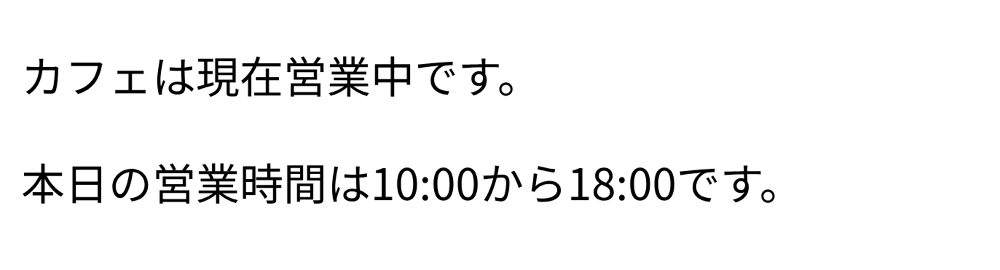

import exchangeRatesAppVideo from "./exchange-rates-app.mp4";
import currencyConverterAppVideo from "./currency-converter-app.mp4";

前頁では、Webサーバーが動作する仕組みと、ブラウザとWebサーバーの間で行われる基本的な通信の手順について学びました。この流れの中では、ブラウザは、次のような場合に<Term>HTTPリクエスト</Term>をWebサーバーに対して送信するのでした。

1. アドレスバーにURLを入力したとき
2. リンクをクリックしたとき
3. 取得したHTMLに外部リソースを読み込むタグが含まれていたとき

しかし、この方法では、新しい情報を取得する度にブラウザのページ遷移が必要になるため、複雑なアプリケーションを構築するには不便です。**Fetch API**を用いると、ブラウザ上で動作するJavaScriptから、Webサーバーに対して直接HTTPリクエストを発行し、レスポンスを受け取ることができます。これにより、Webアプリケーションはページ遷移を伴わずにサーバーと通信することが可能になります。

## Fetch APIを使用する

Fetch APIは、`fetch`関数を呼び出すことで実行できます。`fetch`関数にリクエストを発行したいURLを指定することで、HTTPリクエストを発行し、[`Response`](https://developer.mozilla.org/ja/docs/Web/API/Response)オブジェクトを取得できます。`Response`オブジェクトの[`text`メソッド](https://developer.mozilla.org/ja/docs/Web/API/Response/text)を呼び出すことで、<Term>レスポンス</Term>を文字列として取得できます。

次の例では、ブラウザは`script.js`の中で`fetch("/weather")`が呼び出されたときに、Webサーバーに対して`/weather`というパスに対する<Term>リクエスト</Term>を発行します。Webサーバーは、`/weather`に対するリクエストを受け取ると、レスポンスとして「晴れ」という文字列を返します。ブラウザは、このレスポンスを受け取り、HTMLの中の`span`要素に「晴れ」という文字列を表示します。

`fetch`関数や`Response#text`メソッドは、時間のかかる処理を行うため、<Term>**非同期処理**</Term>としてバックグラウンドで実行されます。戻り値に対して`await`演算子を適用することで、HTTPリクエストが完了するまで待機し、実際のレスポンスを取得できます。なお、`await`演算子を使用するためには、演算子が使用されている関数に`async`キーワードを付与する必要があります。

```javascript title="main.js (サーバーとして動作するJavaScript)"
import express from "express";

const app = express();
app.use(express.static("./public"));

app.get("/weather", (request, response) => {
  response.send("晴れ");
});

app.listen(3000);
```

```html title="public/index.html (抜粋)"
<p>本日の天気は<span id="weather"></span>です。</p>
<script src="./script.js"></script>
```

```javascript title="public/script.js (ブラウザ上で動作するJavaScript)"
// await演算子を使用するため、asyncキーワードが必要
async function fetchWeather() {
  // http://localhost:3000/weather にHTTPリクエストを送信
  // fetch関数は非同期処理を行うため、await演算子を適用して完了を待機する
  const response = await fetch("/weather");
  const weather = await response.text();
  document.getElementById("weather").textContent = weather;
}

fetchWeather();
```

<ViewSource url={import.meta.url} path="_samples/fetch-weather" />

:::tip[非同期処理]

JavaScriptにおける<Term>**非同期処理**</Term>とは、ファイルの入出力やネットワーク通信など、JavaScriptの外側の時間のかかる処理の完了を待つ間、ほかの処理を実行できるようにする仕組みです。非同期処理を行う関数を使用するためには、次の2つのルールを守る必要があります。

- 非同期処理を行う関数を呼び出す関数を定義する際、`async`キーワードをつけること
- 非同期処理を行う関数の戻り値に対し、`await`演算子を適用すること

非同期処理を行う関数の戻り値の実態は、`Promise`と呼ばれるオブジェクトです。`await`演算子は、`Promise`オブジェクトに作用し、その処理が完了するまで待機します。詳細は、[MDNの記事](https://developer.mozilla.org/ja/docs/Learn/JavaScript/Asynchronous)を参照してください。

:::

### 確認問題

あるカフェでは、現在「営業中」か「営業時間外」かを表示するWebアプリケーションを作成しています。

サーバー側では、`/open-status`というパスに対するリクエストを受けたとき、`営業中`という文字列をレスポンスとして返すようにしてください。ブラウザ側では、`fetch`関数を用いて`/open-status`にリクエストを発行し、レスポンスを受け取って、`カフェは現在営業中です。`と表示するようにしてください。


<Answer title="カフェ営業状況表示プログラム">

```javascript title="main.js (サーバーとして動作するJavaScript)"
import express from "express";

const app = express();
app.use(express.static("./public"));

app.get("/open-status", (request, response) => {
  response.send("営業中");
});

app.listen(3000);
```

```html title="public/index.htmlの抜粋"
<p>カフェは現在<span id="open-status"></span>です。</p>
<script src="./script.js"></script>
```

```javascript title="public/script.js (ブラウザ上で動作するJavaScript)"
async function fetchOpenStatus() {
  const response = await fetch("/open-status");
  const openStatus = await response.text();
  document.getElementById("open-status").textContent = openStatus;
}

fetchOpenStatus();
```

<ViewSource url={import.meta.url} path="_samples/fetch-open-status" />

</Answer>

## Fetch APIでJSONデータを取得する

前項では、Fetch APIを用いてサーバーから文字列を取得しました。しかし、実際のアプリケーションでは、単純な文字列ではなく、複雑な構造を持つデータを扱うことになります。ネットワークを経由してデータをやり取りする際には、データを事前に決めた形式に整形しておくことが重要です。コンマや改行区切りの文字列を用いることもできますが、より一般的な方法として、<Term>**JSON**</Term>という形式が広く使用されています。<Term>JSON</Term>は、データを文字列として表現するためのフォーマットで、JavaScriptのオブジェクト記法に基づいています。

次の例では、Fetch APIを用いて、サーバーから現在の天気と気温を取得しています。前項のサンプルアプリケーションとは、次の点が異なっています。

- サーバー側は、Expressが提供する[`Response#json`メソッド](https://expressjs.com/ja/api.html#res.json)を用いてレスポンスを送信しています。このメソッドは、引数として渡されたオブジェクトを<Term>JSON</Term>に変換してレスポンスとして返します。
- クライアント側は、ブラウザが提供する[`Response#json`メソッド](https://developer.mozilla.org/ja/docs/Web/API/Response/json)を用いて、<Term>JSON</Term>形式のレスポンスをJavaScriptオブジェクトとして取得します。

```javascript title="main.js (サーバーとして動作するJavaScript)"
import express from "express";

const app = express();
app.use(express.static("./public"));

app.get("/weather", (request, response) => {
  response.json({
    condition: "晴れ",
    temperature: 25,
  });
});

app.listen(3000);
```

```html title="public/index.html (抜粋)"
<p>本日の天気は<span id="condition"></span>です。</p>
<p>現在の気温は<span id="temperature"></span>度です。</p>
<script src="./script.js"></script>
```

```javascript title="public/script.js (ブラウザ上で動作するJavaScript)"
async function fetchWeather() {
  const response = await fetch("/weather");
  const weather = await response.json();
  document.getElementById("condition").textContent = weather.condition;
  document.getElementById("temperature").textContent = weather.temperature;
}

fetchWeather();
```

:::tip[JSONの構文]

JSONは、JavaScriptのオブジェクト記法よりも制限が厳しくなっています。例えば、次の式の右辺は、JavaScriptとしては正しいですが、JSONとしては誤りです。

```js
const person = { name: "田中", age: 18 };
```

JSONでは、次のように、全てのキーをダブルクォーテーションで囲って記述する必要があります。

```json
{ "name": "田中", "age": 18 }
```

:::

### 確認問題

あるカフェでは、現在「営業中」か「営業時間外」かだけではなく、営業時間も表示するWebアプリケーションを作成することにしました。

サーバー側では、`/open-status`に対するリクエストを受けたとき、次のようなJSON形式のレスポンスを返すようにしてください。ブラウザ側では、`/open-status`にリクエストを発行し、レスポンスを受け取って、カフェが営業中であれば`カフェは現在営業中です。本日の営業時間は10:00から18:00です。`と表示し、カフェが営業時間外であれば`カフェは現在営業時間外です。本日の営業時間は10:00から18:00です。`と表示するようにしてください。

```json
{
  "isOpen": true,
  "openTime": "10:00",
  "closeTime": "18:00"
}
```



<Answer title="カフェ営業状況表示プログラム">

```javascript title="main.js (サーバーとして動作するJavaScript)"
import express from "express";

const app = express();
app.use(express.static("./public"));

app.get("/open-status", (request, response) => {
  response.json({
    isOpen: true,
    openTime: "10:00",
    closeTime: "18:00",
  });
});

app.listen(3000);
```

{/* prettier-ignore */}
```html title="public/index.htmlの抜粋"
<p>カフェは現在<span id="open-status"></span>です。</p>
<p>本日の営業時間は<span id="open-time"></span>から<span id="close-time"></span>です。</p>
<script src="./script.js"></script>
```

```javascript title="public/script.js (ブラウザ上で動作するJavaScript)"
async function fetchOpenStatus() {
  const response = await fetch("/open-status");
  const openStatus = await response.json();
  if (openStatus.isOpen) {
    document.getElementById("open-status").textContent = "営業中";
  } else {
    document.getElementById("open-status").textContent = "営業時間外";
  }
  document.getElementById("open-time").textContent = openStatus.openTime;
  document.getElementById("close-time").textContent = openStatus.closeTime;
}

fetchOpenStatus();
```

<ViewSource url={import.meta.url} path="_samples/fetch-open-status-json" />

</Answer>

## 演習問題1

次のように、定期的にサーバーから現在の為替レートを取得して表示するWebアプリケーションを作成してください。ただし、為替レートは、サーバー側で乱数を用いて生成してください。

<video src={exchangeRatesAppVideo} controls muted />

サーバー側では、`/exchange-rates`に対するリクエストを受けたとき、次のように作成されたオブジェクトをJSON形式のレスポンスとして返すようにしてください。

```javascript
const rates = {
  usdJpy: 140 + Math.random() * 20,
  eurJpy: 150 + Math.random() * 20,
};
```

ブラウザ側では、`/exchange-rates`に定期的にリクエストを発行し、レスポンスを受け取って表示しましょう。

定期的にリクエストを発行するには、次のように`setInterval`関数が利用できます。

```javascript
setInterval(async () => {
  const response = await fetch("/exchange-rates");
  // レスポンスを処理する
}, 1000);
```

<Answer title="為替レート取得プログラム">

```javascript title="main.js (サーバーとして動作するJavaScript)"
import express from "express";

const app = express();
app.use(express.static("./public"));

app.get("/exchange-rates", (request, response) => {
  const rates = {
    usdJpy: 140 + Math.random() * 20,
    eurJpy: 150 + Math.random() * 20,
  };
  response.json(rates);
});

app.listen(3000);
```

```html title="public/index.html (抜粋)"
<div><span id="usd-jpy"></span>円/ドル</div>
<div><span id="eur-jpy"></span>円/ユーロ</div>
<script src="./script.js"></script>
```

```javascript title="public/script.js (ブラウザ上で動作するJavaScript)"
setInterval(async () => {
  const response = await fetch("/exchange-rates");
  const rates = await response.json();

  document.getElementById("usd-jpy").textContent = rates.usdJpy;
  document.getElementById("eur-jpy").textContent = rates.eurJpy;
}, 1000);
```

<ViewSource url={import.meta.url} path="_samples/exchange-rates" />

</Answer>

## 演習問題2

次のように、円の金額を入力してボタンをクリックすると、その時の為替レートで換算して表示する、通貨換算アプリケーションを作成してください。

<video src={currencyConverterAppVideo} controls muted />

サーバー側は、演習問題1と同様です。

ブラウザ側では、円の金額を入力し、計算ボタンを押すと、演習問題1と同様に為替レートを取得し、その為替レートをもとにドルとユーロに換算して表示します。

`input`要素の値を取得するためには、次のようにします。また、[`parseFloat`](https://developer.mozilla.org/ja/docs/Web/JavaScript/Reference/Global_Objects/parseFloat)関数を用いて文字列を数値に変換してから計算を行う必要があります。

```html title="public/index.htmlの抜粋"
<input type="number" id="jpy-input" placeholder="円" />
<button id="convert-button" type="button">計算</button>
```

```javascript title="public/script.js (ブラウザ上で動作するJavaScript)"
document.getElementById("convert-button").onclick = async () => {
  const jpyInput = document.getElementById("jpy-input");
  const jpy = parseFloat(jpyInput.value);

  // 為替レートを取得し、ドルとユーロに換算
};
```

<Answer title="通貨換算アプリケーション">

```javascript title="main.js (サーバーとして動作するJavaScript)"
import express from "express";

const app = express();
app.use(express.static("./public"));

app.get("/exchange-rates", (request, response) => {
  const rates = {
    usdJpy: 140 + Math.random() * 20,
    eurJpy: 150 + Math.random() * 20,
  };
  response.json(rates);
});

app.listen(3000);
```

```html title="public/index.html (抜粋)"
<input type="number" id="jpy-input" placeholder="円" />
<button id="convert-button" type="button">計算</button>
<div><span id="usd-result"></span>ドル</div>
<div><span id="eur-result"></span>ユーロ</div>
<script src="./script.js"></script>
```

```javascript title="public/script.js"
// await演算子を使用するため、asyncキーワードが必要
document.getElementById("convert-button").onclick = async () => {
  // 入力された円の金額を取得
  const jpyInput = document.getElementById("jpy-input");
  const jpy = parseFloat(jpyInput.value);

  // 為替レートを取得
  const response = await fetch("/exchange-rates");
  const rates = await response.json();

  // ドルに換算
  const usd = jpy / rates.usdJpy;

  // ユーロに換算
  const eur = jpy / rates.eurJpy;

  // 結果を表示
  document.getElementById("usd-result").textContent = usd;
  document.getElementById("eur-result").textContent = eur;
};
```

<ViewSource url={import.meta.url} path="_samples/currency-converter" />

</Answer>
