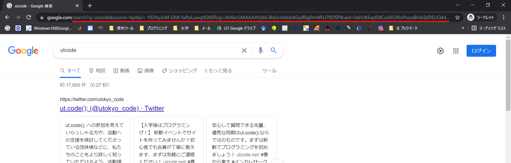
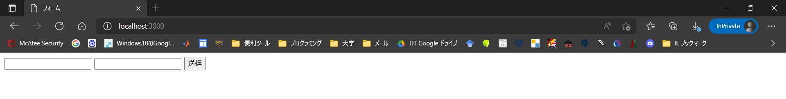
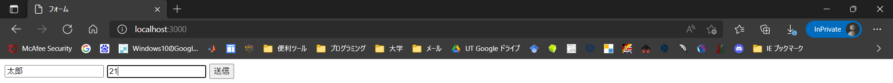
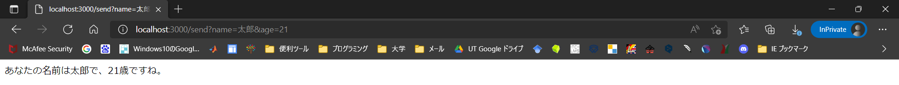
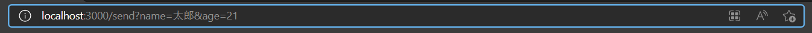

## クエリパラメータの利用

入力した内容によって、次に移る（表示される）ページが異なるウェブページがあります。例として、Google で `utcode` と検索した際に表示される検索結果のページを考えてみましょう。



このページの URL は、次のようになっています。

```
https://www.google.com/search?q=utcode&sourceid=chrome&ie=UTF-8
```

このようなページでは、入力した内容によって異なるウェブページが表示されるよう、入力した内容が移った先のページの URL に反映されています。この例では、URL の末尾に `?q=utcode&sourceid=chrome&ie=UTF-8` というデータが付加されています。これが**クエリパラメータ**です。

クエリパラメータは、キーと値の組み合わせにより表現されます。先ほどの Google の検索結果であれば、次のような 3 つのパラメータが存在することになります。

| キー       | 値       |
| ---------- | -------- |
| `q`        | `utcode` |
| `sourceid` | `chrome` |
| `ie`       | `UTF-8`  |

Express からクエリパラメータを利用する場合、`request.query` ([`express.Request#query` プロパティ](https://expressjs.com/ja/api.html#req.query)) にこれらの値が格納されています。

```javascript title="main.mjs"
import express from "express";

const app = express();
app.get("/", (request, response) => {
  response.send(JSON.stringify(request.query));
});
app.listen(3000);
```

<ViewSource url={import.meta.url} path="_samples/query-parameter" />

:::tip[JSON とは何か]

JSON は「JavaScript Object Notation」の略で JavaScript のオブジェクト表記法を倣ったデータ記述方法のことです。つまりデータの保存は<Term>オブジェクト</Term>の形式で行うという決まり事です。表記法の名前なので臆する必要はありません。

:::

:::tip[JSON.stringify メソッド]

`JSON.stringify` メソッドはオブジェクトを JSON 形式の文字列に変換するメソッドです。

:::

:::tip[URL として使用できない文字の対処方法]

URL として使用できない文字（日本語文字など）は[URL エンコード](https://ja.wikipedia.org/wiki/%E3%83%91%E3%83%BC%E3%82%BB%E3%83%B3%E3%83%88%E3%82%A8%E3%83%B3%E3%82%B3%E3%83%BC%E3%83%87%E3%82%A3%E3%83%B3%E3%82%B0)する必要があります。JavaScript なら `encodeURIComponent` 関数で変換できます。

```javascript
encodeURIComponent("日本語"); // "%E6%97%A5%E6%9C%AC%E8%AA%9E"
```

:::

## サーバーにデータを送信する

`form` 要素を使うとユーザーの入力からクエリパラメータを生成してページ遷移できます。

- `form` の `action` 属性: フォーム送信時に移動し、データを送信するページ
- `input` 要素: テキストボックス
- `input` の `name` 属性: クエリパラメータのキー
- `button` 要素: `form` 内のボタンをクリックすると `form` の `action` に指定したページに遷移します（送信ボタンになります）

以下のコードの、HTML ファイルと、JavaScript ファイルを作成して実行してみましょう。

```html title="static/index.html"
<!doctype html>
<html lang="ja">
  <head>
    <meta charset="utf-8" />
    <title>フォーム</title>
  </head>
  <body>
    <form action="/send">
      <input name="name" />
      <input name="age" />
      <button>送信</button>
    </form>
  </body>
</html>
```

```javascript title="main.mjs"
import express from "express";

const app = express();
app.use(express.static("static"));
app.get("/send", (request, response) => {
  response.send(
    `あなたの名前は${request.query.name}で、${request.query.age}歳ですね。`,
  );
});
app.listen(3000);
```

<ViewSource url={import.meta.url} path="_samples/send-data-to-server" />

上記コードを実行すると、以下のような画面がブラウザに表示されます。



以下のように入力して、送信ボタンをクリックすると、


`http://localhost:3000/send` に移り、以下のような画面が表示されます。



このページの URL を見てみましょう。特に、クエリパラメータの部分に注目してみましょう。


## 初級演習

### node-emoji

[npm の章](/docs/web-servers/module/#node-emoji-%E3%83%91%E3%83%83%E3%82%B1%E3%83%BC%E3%82%B8)で扱った `node-emoji` パッケージの `emojify` 関数を使って、送られた文字列に `emojify` 関数を適用するサーバーを作ってみましょう。

また、文字列を簡単にサーバーに送れるようにフォームも作りましょう。

たとえば、フォームで「`I :heart: :coffee:`」と送信したときに、「I ❤️ ☕」とブラウザに表示されれば成功です。

<Answer title="node-emoji">

`node-emoji` と `express` をインストールするのを忘れないようにしましょう。

```html title="static/index.html"
<!doctype html>
<html>
  <head>
    <meta charset="utf-8" />
    <title>node-emoji (フォーム) の解答例</title>
  </head>
  <body>
    <form action="/emojify">
      <input name="text" />
      <button type="submit">送信</button>
    </form>
  </body>
</html>
```

```js title="main.mjs"
import express from "express";
import { emojify } from "node-emoji";

const app = express();
app.use(express.static("static"));

app.get("/emojify", (request, response) => {
  const text = request.query.text;
  const emojifiedText = emojify(text);
  response.send(emojifiedText);
});

app.listen(3000);
```

</Answer>

## 中級演習

書籍検索システムを作ってみましょう。まずは、配列に本のデータを登録します。

```javascript
const books = [
  { title: "吾輩は猫である", author: "夏目漱石" },
  { title: "こころ", author: "夏目漱石" },
  { title: "坊つちやん", author: "夏目漱石" },
  { title: "舞姫", author: "森鴎外" },
  { title: "高瀬舟", author: "森鴎外" },
];
```

著者名を入力して送信すると、その著者の出版物が一覧表示されるシステムを作ってみましょう。

:::tip[`Array#filter` メソッド]

[`Array#filter` メソッド](https://developer.mozilla.org/ja/docs/Web/JavaScript/Reference/Global_Objects/Array/filter)は、関数オブジェクトを引数としてとり、その関数が `true` となる要素だけからなる新しい配列を返すメソッドです。

```javascript
const numbers = [1, 2, 3, 4, 5, 6, 7, 8];

/// [2, 4, 6, 8]
const evenNumbers = numbers.filter((number) => number % 2 === 0);
```

:::

<Answer>

```html title="static/index.html"
<form action="/send">
  <input name="author" />
  <button>送信</button>
</form>
```

```javascript title="main.mjs"
import express from "express";
import { readFileSync } from "node:fs";

const app = express();

const books = [
  { title: "吾輩は猫である", author: "夏目漱石" },
  { title: "こころ", author: "夏目漱石" },
  { title: "坊つちやん", author: "夏目漱石" },
  { title: "舞姫", author: "森鴎外" },
  { title: "高瀬舟", author: "森鴎外" },
];

app.use(express.static("static"));

app.get("/send", (request, response) => {
  const selectedBooks = books.filter(
    (book) => book.author === request.query.author,
  );
  const template = readFileSync("./send.html", "utf-8");
  const html = template.replace(
    "<!-- books -->",
    selectedBooks.map((book) => `<li>${book.title}</li>`).join(""),
  );
  response.send(html);
});

app.listen(3000);
```

<ViewSource url={import.meta.url} path="_samples/book-search-system" />

</Answer>
