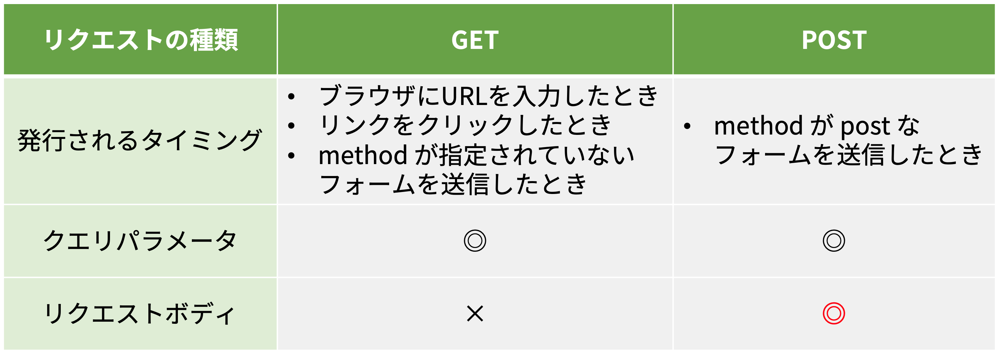
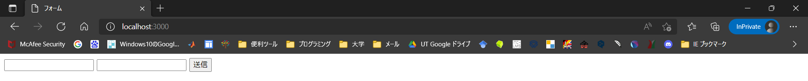
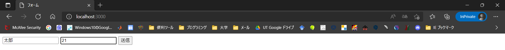
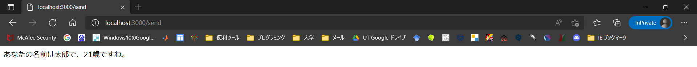
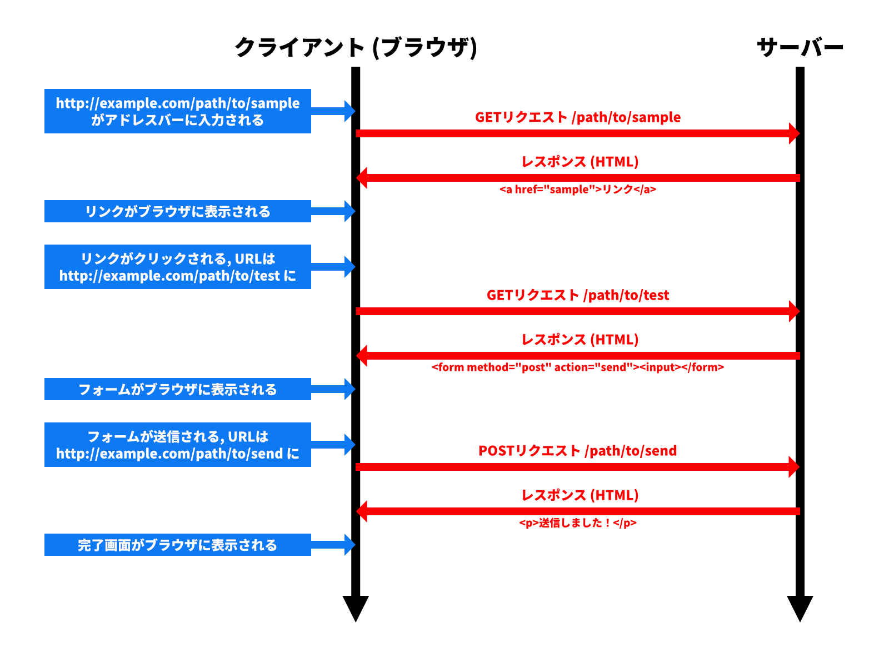

import postInDevelopment1 from "./postInDevelopment1.mp4";
import postInDevelopment2 from "./postInDevelopment2.mp4";
import postInDevelopment3 from "./postInDevelopment3.mp4";

## GET リクエストと POST リクエスト

HTTP 上の通信において<Term>クライアント</Term>から<Term>サーバー</Term>への要求を<Term>リクエスト</Term>と言いましたが、今まで扱ってきたのはその中でも **GET リクエスト**と呼ばれるものになります。

GET リクエストで<Term>サーバー</Term>にデータを送信する場合、前頁で扱ったように、<Term>クエリパラメータ</Term>として URL の末尾に付加するしかありませんが、この方式だと困ってしまうことがあります。例えばパスワードなどを入力したときに URL にパスワード情報が載ってしまい機密情報の漏洩につながります。また、URL の長さの制限のため、大量の情報は送信できません。

そこで用いるのが **POST リクエスト**です。POST リクエストでは、<Term>クエリパラメータ</Term>とは別に、<Term>リクエストボディ</Term>と呼ばれる領域を使って大容量のデータを送信できます。

HTTP リクエストのこのような区分を、<Term>**HTTP メソッド**</Term>と呼びます。



前頁の例を、POST リクエストを用いて書き直してみましょう。`form` 要素の `method` 属性に `post` を指定することで、ブラウザは送信ボタンが押されたときに `POST` メソッドの<Term>リクエスト</Term>を発行します。

```html title="static/index.html"
<!doctype html>
<html lang="ja">
  <head>
    <meta charset="utf-8" />
    <title>フォーム</title>
  </head>
  <body>
    <form method="post" action="/send">
      <input name="name" />
      <input name="age" />
      <button>送信</button>
    </form>
  </body>
</html>
```

```javascript title="main.mjs"
import express from "express";

const app = express();

app.use(express.urlencoded({ extended: true }));
app.use(express.static("static"));

app.post("/send", (request, response) => {
  response.send(
    `あなたの名前は${request.body.name}で、${request.body.age}歳ですね。`,
  );
});
app.listen(3000);
```

<ViewSource url={import.meta.url} path="_samples/post-request" />

これまで利用していた `app.get` ([`express.Application#get` メソッド](https://expressjs.com/ja/api.html#app.get.method)) では、GET メソッドの<Term>リクエスト</Term>しか受け付けられないため、`/send` への POST リクエストを受け付けるために `app.post` ([`express.Application#post` メソッド](https://expressjs.com/ja/api.html#app.post.method)) を利用しています。

{/* prettier-ignore */}
<Term>クエリパラメータ</Term>にアクセスするには、`request.query` (<a href="https://expressjs.com/ja/api.html#req.query">`express.Request#query` プロパティ</a>)を使用しましたが、<Term>リクエストボディ</Term>を使用するには、`request.body` (<a href="https://expressjs.com/ja/api.html#req.body">`express.Request#body` プロパティ</a>)を使用します。

`app.use(express.urlencoded({ extended: true }));` は、<Term>リクエストボディ</Term>の解釈方法を定めています。HTML のフォームが送信されたとき、ブラウザが発行する POST リクエストの<Term>リクエストボディ</Term>は、<Term>クエリパラメータ</Term>と同じく URL エンコードされた形式で記述されます。[`express.urlencoded` 関数](https://expressjs.com/ja/api.html#express.urlencoded)は、URL エンコードされた<Term>リクエストボディ</Term>を読み取り、`request.body` にオブジェクトの形式でデータを保存する役割を担っています。

このシステムでは、まず次のような画面が表示されます。



以下のように入力して、送信ボタンをクリックすると



`http://localhost:3000/send` に移り、以下のような画面が表示されます。GET リクエストの時と違い、<Term>クエリパラメータ</Term>が URL に表示されていないことが分かります。



## POST リクエストを開発者ツールで覗いてみる

実際に POST リクエストの中身がどうなっているか覗いてみましょう。まず開発者ツールを開き、文字を入力して送信してみます。

<video src={postInDevelopment1} controls />

そして `name` 欄の `send` をクリックし、 `Headers` を選択すると `general` 欄の `Requested method` が `POST` になっています。また、 `Headers` の横にある `Payload` を選択し `Form data` を見ると、 `name` と `age` の情報が載っています。

<video src={postInDevelopment2} controls />

ここからさらに、`Form data` の横の `view source` や `view URL-encoded` も見てみましょう。すると URL エンコードされた<Term>リクエストボディ</Term>の中身を見ることができます。

<video src={postInDevelopment3} controls />

以上のようにして、POST リクエストの中身を覗くことができます。



## 課題

古き良き掲示板システムを作ってみましょう。次のようなページを作成してください。

- `GET /`: 現在の投稿されているすべての記事を表示します。`/send` へ POST するためのフォームも同時に表示します。
- `POST /send`: リクエストボディに含まれている記事の内容を記録します。

:::tip[ヒント]

- イベントハンドラの外側に現在投稿されたデータを記録するための配列を用意しましょう。
- `GET /` では 配列の中身を一覧表示しましょう。フォームも忘れずに表示しましょう。
- `POST /send` に新しい投稿が来たら `Array#push` メソッドで配列に要素を追加しましょう。

:::

### 解答例

解答例は以下を参照してください。

<ViewSource url={import.meta.url} path="_samples/forum" />
