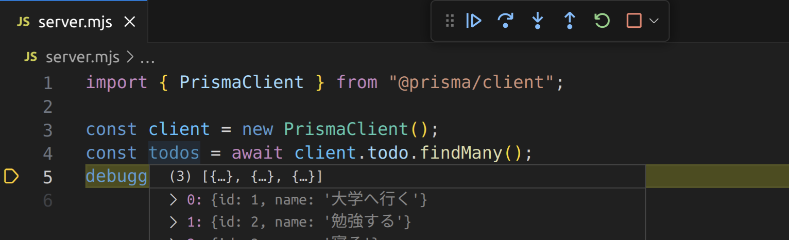

import newPostgresqlInstanceVideo from "./new-postgresql-instance.mp4";
import connectDbeaverToDatabaseVideo from "./connect-dbeaver-to-database.mp4";
import prismaInitVideo from "./prisma-init.mp4";
import copySecretValuesVideo from "./copy-secret-values.mp4";
import prismaDbPushVideo from "./prisma-db-push.mp4";
import createRecordInDatabaseVideo from "./create-record-in-database.mp4";

これまでの演習では、アプリケーションで扱うデータは全て変数の中に記録してきました。
例えば、前頁で作った掲示板アプリケーションでは、クライアントから送られてきた投稿の内容を配列に記録していました。
しかし、これではサーバーが終了してしまうと、データがすべて消えてしまいます。

それでは、送られてきたデータをファイルに記録すれば大丈夫でしょうか。
確かに、サーバーが終了してもデータは残りそうです。
ところが、もし皆さんが作ったサービスが大きく成長し、一つのサーバーではリクエストを捌ききれなくなったとしましょう。
すると、ファイルに保存したデータは複数のサーバーで共有できないことが問題になります。
また、記録されているデータが膨大になってくると、ファイルの内容を読み書きするだけでも大変そうです。

**データベース**は、このようなデータに関する諸問題を解決するためのシステムです。
データベースは、通常サーバーとして動作します。
つまり、**データベースサーバー**は、保持しているデータに対する参照や更新のためのリクエスト (**クエリ**) を受け、その結果をレスポンスとしてクライアントに返します。

データベースサーバーのクライアントは、通常 Web サービスの使用者ではなく、皆さんが Node.js などで開発するサーバーです。
これまで開発してきたようなサーバーを、データベースサーバーと対比して**アプリケーションサーバー**と呼びます。


データベースの中でも、**リレーショナルデータベース**は、データベースの中でも最も多く使われる種類のもので、データを Excel のような表形式でとらえます。
次の図は、リレーショナルデータベースの基本的な概念である、**テーブル**、**カラム**、**レコード**について整理した図です。
リレーショナルデータベースを用いる一般的なアプリケーションでは、アプリケーション開発時にテーブルとカラムを作成しておき、ユーザーの操作に応じてレコードを追加・編集・削除していきます。


リレーショナルデータベースに対するクエリは、通常 **SQL** と呼ばれる言語を用いて記述します。
データベースクライアントとして用いるライブラリによっては、SQL を直接用いることなく、そのライブラリが提供する専用の関数等を用いてデータベースに対してクエリを発行できることがあります。

## 演習

この演習では、Node.js のアプリケーションサーバーで、Prisma と呼ばれるライブラリを用い、リレーショナルデータベースの一つである PostgreSQL サーバーに保存されているデータを取得します。

### 使用する技術・サービス

#### [PostgreSQL](https://www.postgresql.org/)

現在最もよく用いられるリレーショナルデータベースのひとつです。
豊富な機能を持ちます。

#### [DBeaver](https://dbeaver.io/)

多くのデータベースをグラフィカルに操作できるソフトウェアです。
PostgreSQL にも対応しています。

#### [Prisma](https://www.prisma.io/)

主にリレーショナルデータベースを操作するための Node.js の<Term>ライブラリ</Term>です。
複数の構成要素からなります。

- [**`@prisma/client` パッケージ**](https://www.npmjs.com/package/@prisma/client): 実行時に用いる npm のパッケージ。
  JavaScript プログラムから使用する。
- [**`prisma` パッケージ**](https://www.npmjs.com/package/prisma): 開発時にのみ用いる npm のパッケージ。`npx` コマンドを通して実行する。
- [**`Prisma` 拡張機能**](https://marketplace.visualstudio.com/items?itemName=Prisma.prisma): VS Code の拡張機能。`.prisma` ファイルに対する補完やフォーマットの機能を提供する。
- [**`.prisma` ファイル**](https://www.prisma.io/docs/concepts/components/prisma-schema): データベースのテーブル構造を記述するファイル。`prisma` パッケージのコマンドを用いて実際のデータベースサーバーに反映させる。

#### [ElephantSQL](https://www.elephantsql.com/)

PostgreSQL サーバーを提供するサービスです。
PostgreSQL サーバーは皆さんのコンピューター上にも構築できますが、この演習ではその手間を省くため外部のサービスを利用します。

### ElephantSQL で PostgreSQL サーバーを構築する

[ElephantSQL](https://www.elephantsql.com) のアカウントを作成しましょう。`Create New Instance` ボタンを押して必要な情報を入力し、新しい PostgreSQL サーバーを起動させてください。
入力が必要な情報は次の通りです。

- **Name**: 起動するサーバーにつける名前です。
  適当に設定して構いません。
- **Plan**: 起動するサーバーの性能です。
  最も低い `Tiny Turtle (Free)` を選択すれば無料で使用できます。
- **Data center**: 起動するサーバーの地理的な場所です。
  ここでは `AP-NorthEast-1 (Tokyo)` を選択しています。

<video src={newPostgresqlInstanceVideo} controls />

### DBeaver で PostgreSQL サーバーに接続する

[DBeaver](https://dbeaver.io) をインストールしましょう。
続いて、ElephantSQL の管理画面で接続情報を表示し、その情報を DBeaver に入力して前項で起動した PostgreSQL サーバーに接続しましょう。

<video src={connectDbeaverToDatabaseVideo} controls />

この時点では、まだデータベース上にテーブルが作成されていません。
DBeaver 上で作成することもできますが、今回は Prisma を使用して作成することにします。

### Prisma でテーブル構造を作成する

VS Code 向けの Prisma 拡張機能をインストールしましょう。


新しいフォルダを VS Code で開き、`npm init` コマンドを使用して `package.json` ファイルを作成した後、

```shell
npx prisma init
```

コマンドを実行します。
パッケージを実行しても良いか尋ねられる場合は、`y` を入力して許可しましょう。

<video src={prismaInitVideo} controls muted autoPlay loop />

:::tip[<Term>`npx` コマンド</Term>]

<Term>`npx` コマンド</Term>は、npm
のパッケージを、プログラムからではなく直接実行するためのコマンドです。 npm には
`prisma` パッケージのように、直接実行専用のパッケージも存在します。

:::

続いて、ElephantSQL からデータベースへの接続情報を `.env` ファイルにコピーします。
これにより、Prisma は ElephantSQL 上の PostgreSQL サーバーと接続できるようになります。

<video src={copySecretValuesVideo} controls muted autoPlay loop />

`prisma/schema.prisma` ファイルを、次のように編集し、データベースのテーブルとカラムを定義します。

```javascript
// This is your Prisma schema file,
// learn more about it in the docs: https://pris.ly/d/prisma-schema

generator client {
  provider = "prisma-client-js"
}

datasource db {
  provider = "postgresql"
  url      = env("DATABASE_URL")
}

model Todo {
  id   Int    @id @default(autoincrement())
  name String
}
```

完了したら、

```shell
npx prisma db push
```

コマンドを実行しましょう。
すると、データベースに `schema.prisma` に書かれた通りのテーブルとカラムが作成されるので、DBeaver で確認してみてください。
接続を一旦切断し、再接続する必要があります。
また、このとき、後述する `@prisma/client` パッケージが自動的にインストールされます。

<video src={prismaDbPushVideo} controls />

### DBeaver で Prisma が作成したテーブルにレコードを追加する

Prisma が作成したテーブルに、DBeaver を用いてレコードを追加しましょう。

<video src={createRecordInDatabaseVideo} controls />

### Prisma でデータベースのデータを読み書きする

Node.js から Prisma を利用してデータベースのデータを操作するためには、`@prisma/client` パッケージの [`PrismaClient` クラス](https://www.prisma.io/docs/reference/api-reference/prisma-client-reference#prismaclient)を用います。

- [`PrismaClient#[テーブル名].findMany` メソッド](https://www.prisma.io/docs/reference/api-reference/prisma-client-reference#findmany): 条件を満たすレコードを全て取得
- [`PrismaClient#[テーブル名].findFirst` メソッド](https://www.prisma.io/docs/reference/api-reference/prisma-client-reference#findfirst): 条件を満たす最初のレコードを取得
- [`PrismaClient#[テーブル名].findUnique` メソッド](https://www.prisma.io/docs/reference/api-reference/prisma-client-reference#findunique): レコードを一意に識別できる条件を使用してレコードを 1 つだけ取得

:::warning[非同期処理]

上記の 3 つのメソッドは、<Term>**非同期処理**</Term>を行います。
JavaScript における非同期処理とは、ファイルの入出力やネットワーク通信など、JavaScript の外側の時間のかかる処理の完了を待つ間、ほかの処理を実行できるようにする仕組みです。
非同期処理を行う関数を使用するためには、次の 2 つを行います。

- 非同期処理を行う関数を呼び出す関数を定義する際、`async` キーワードをつけること
- 非同期処理を行う関数の戻り値に対し、`await` 演算子を適用すること

非同期処理に関する詳細は、[MDN の記事](https://developer.mozilla.org/ja/docs/Learn/JavaScript/Asynchronous)を参照してください。

:::

まずは、`findMany` メソッドの戻り値を、デバッガを用いて確認してみましょう。

```javascript
import { PrismaClient } from "@prisma/client";
const client = new PrismaClient();

async function main() {
  const todos = await client.todo.findMany();
  debugger;
}
main();
```



続いて、[`PrismaClient#[テーブル名].create` メソッド](https://www.prisma.io/docs/reference/api-reference/prisma-client-reference#create)を用いて、テーブルにレコードを作成してみましょう。

```javascript
import { PrismaClient } from "@prisma/client";
const client = new PrismaClient();

async function main() {
  const todos = await client.todo.create({ data: { name: "買い物をする" } });
  debugger;
}
main();
```


## 課題

PostgreSQL にデータを保存する掲示板サービスを作ってみましょう。

### 手順 1

ElephantSQL で新しいデータベースを作成しましょう。
演習の手順と同じ方法で、作成したデータベースに DBeaver から接続できることを確認しましょう。

### 手順 2

新しいプロジェクト用のディレクトリを作成し、演習の手順と同じ方法で、`npx prisma init` コマンドを実行し、Prisma のセットアップをしましょう。`.env` ファイルを編集し、Prisma がデータベースに接続できるようにしましょう。

### 手順 3

作成された `.prisma` ファイルを編集し、掲示板に投稿されたメッセージを保存するためのテーブルと、そのテーブルのカラムの定義を記述しましょう。`npx prisma db push` コマンドでテーブルとカラムの定義をデータベースに反映させましょう。

### 手順 4

DBeaver を用いて掲示板の投稿のサンプルデータをデータベースに登録しましょう。

### 手順 5

演習と同じ方法で Node.js のデバッガを用い、データベースのデータが Prisma で取得できることを確認しましょう。

### 手順 6

Express をインストールし、`/` への GET リクエストに対してデータベースのデータを HTML に整形してレスポンスとして返せるようにしましょう。

### 手順 7

掲示板を投稿するための HTML のフォームを表示できるようにしましょう。

### 手順 8

前の手順で作成した HTML のフォームの送信先を作成しましょう。
データは POST リクエストとして送信するようにしましょう。
送られてきたデータが正しいか Node.js のデバッガを用いて確認してみましょう。

### 手順 9

送られてきたデータをデータベースに登録できるようにしましょう。
DBeaver を用いて、データが実際にデータベースに登録されていることを確認しましょう。

### 手順 10

Node.js のサーバーを再起動し、データが残っていることを確認しましょう。

<ViewSource url={import.meta.url} path="_samples/forum" noCodeSandbox />
