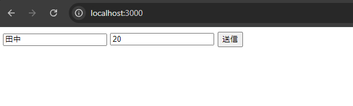
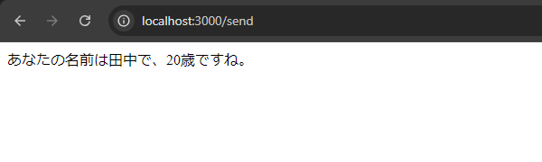

import networkDevTool from "./network-dev-tool.mp4";
import viewSourceAndURLEncoded from "./network-dev-tool.mp4";

## リクエストの種類

HTTP上の通信において<Term>クライアント</Term>から<Term>サーバー</Term>への要求を<Term>リクエスト</Term>と言いました。HTTPリクエストには、<Term type="httpMethod">**メソッド**</Term>と呼ばれる区分があります。

今まで扱ってきたのはその中でも<Term type="httpMethod">メソッド</Term>がGETである**GETリクエスト**と呼ばれるものになります。

GETリクエストで<Term>サーバー</Term>にデータを送信する場合、前頁で扱ったように、<Term>クエリパラメータ</Term>としてURLの末尾に付加するしかありませんが、この方式だと困ってしまうことがあります。例えばパスワードなどを入力したときにURLにパスワード情報が載ってしまい機密情報の漏洩につながります。また、URLの長さの制限のため、大量の情報は送信できません。

そこで用いるのが<Term type="httpMethod">メソッド</Term>がPOSTである**POSTリクエスト**です。POSTリクエストでは、<Term>クエリパラメータ</Term>とは別に、<Term>リクエストボディ</Term>と呼ばれる領域を使って大容量のデータを送信できます。



前頁の例を、POSTリクエストを用いて書き直してみましょう。`form`要素の`method`属性に`post`を指定することで、ブラウザは送信ボタンが押されたときに`POST`<Term>リクエスト</Term>を発行します。

```html title="static/index.html"
<!doctype html>
<html lang="ja">
  <head>
    <meta charset="utf-8" />
    <title>フォーム</title>
  </head>
  <body>
    <form method="post" action="/send">
      <input name="name" />
      <input name="age" />
      <button>送信</button>
    </form>
  </body>
</html>
```

```javascript title="main.mjs"
import express from "express";

const app = express();

app.use(express.urlencoded({ extended: true }));
app.use(express.static("static"));

app.post("/send", (request, response) => {
  response.send(
    `あなたの名前は${request.body.name}で、${request.body.age}歳ですね。`,
  );
});
app.listen(3000);
```

<ViewSource url={import.meta.url} path="_samples/post-request" />

これまで利用していたExpressの[`get`メソッド](https://expressjs.com/ja/api.html#app.get.method)では、GET<Term>リクエスト</Term>しか受け付けられないため、`/send`へのPOSTリクエストを受け付けるために[`post`メソッド](https://expressjs.com/ja/api.html#app.post.method)を利用します。

{/* prettier-ignore */}
<Term>クエリパラメータ</Term>には、`request.query` (<a href="https://expressjs.com/ja/api.html#req.query">`express.Request#query`プロパティ</a>)からアクセスできましたが、<Term>リクエストボディ</Term>には、`request.body` (<a href="https://expressjs.com/ja/api.html#req.body">`express.Request#body`プロパティ</a>)からアクセスできます。

`app.use(express.urlencoded({ extended: true }));`は、<Term>リクエストボディ</Term>の解釈方法を定めています。HTMLのフォームが送信されたとき、ブラウザが発行するPOSTリクエストの<Term>リクエストボディ</Term>は、<Term>クエリパラメータ</Term>と同じくURLエンコードされた形式で記述されます。[`express.urlencoded`関数](https://expressjs.com/ja/api.html#express.urlencoded)は、URLエンコードされた<Term>リクエストボディ</Term>を読み取り、`request.body`にオブジェクトの形式でデータを保存する役割を担っています。

このシステムにアクセスし、以下のように入力します。



送信ボタンをクリックすると`http://localhost:3000/send`に移り、以下のような画面が表示されます。GETリクエストの時と違い、<Term>クエリパラメータ</Term>がURLに表示されていないことが分かります。



## ブラウザの通信を覗いてみる

ブラウザの開発者ツールには、ブラウザの行うネットワーク通信を監視するツールが搭載されています。これを使い、実際にPOSTリクエストの中身がどうなっているか覗いてみましょう。

開発者ツールの`Network`タブを開き、フォームに文字を入力して送信してみます。

そして`Name`欄の`send`をクリックし、`Headers`を選択すると`general`欄の`Requested method`が`POST`になっています。また、`Headers`の横にある`Payload`を選択し`Form data`を見ると、`name`と`age`の情報が載っています。

<video src={networkDevTool} controls />

ここからさらに、`Form data`の横の`view source`や`view URL-encoded`も見てみましょう。するとURLエンコードされた<Term>リクエストボディ</Term>の中身を見ることができます。

<video src={viewSourceAndURLEncoded} controls />

以上のようにして、POSTリクエストの中身を覗くことができます。

## 演習

古き良き掲示板システムを作ってみましょう。次のようなページを作成してください。

- `GET /`: 現在の投稿されているすべての記事を表示します。`/send`へPOSTするためのフォームも同時に表示します。
- `POST /send`: リクエストボディに含まれている記事の内容を記録します。

:::tip[ヒント]

- イベントハンドラの外側に現在投稿されたデータを記録するための配列を用意しましょう。
- `GET /`では 配列の中身を一覧表示しましょう。フォームも忘れずに表示しましょう。
- `POST /send`に新しい投稿が来たら`Array#push`メソッドで配列に要素を追加しましょう。

:::

:::tip[豆知識: リダイレクト]

サーバー側からブラウザに対してページ遷移を指示するためには、ブラウザからのリクエストに対して、特殊なレスポンスを返します。
Expressを用いてこのようなレスポンスを生成するためには、[`express.Response#send`メソッド](https://expressjs.com/ja/api.html#res.send)の代わりに、[`express.Response#redirect`メソッド](https://expressjs.com/ja/api.html#res.redirect)を用います。

```javascript
app.post("/send", (request, response) => {
  // 省略
  response.redirect("/");
});
```

:::

### 解答例

解答例は以下を参照してください。

<ViewSource url={import.meta.url} path="_samples/forum" />
