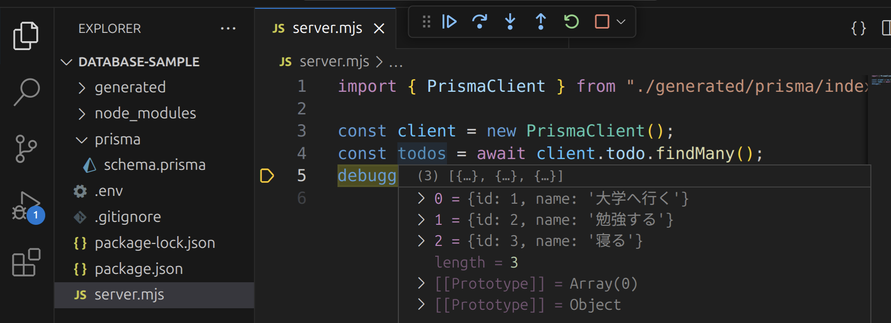

import newPostgresqlInstanceVideo from "./new-postgresql-instance.mp4";
import dbeaverVideo from "./dbeaver.mp4";
import prismaInitVideo from "./prisma-init.mp4";
import copySecretValuesVideo from "./copy-secret-values.mp4";
import prismaDbPushVideo from "./prisma-db-push.mp4";
import createRecordInDatabaseVideo from "./create-record-in-database.mp4";
import forumVideo from "./forum.mp4";

## データ管理の限界

これまで作成してきたアプリケーションでは、次のように、データを全てNode.jsアプリケーション上の変数に記録していました。しかし、このような方法では、<Term>サーバー</Term>が終了するたびにデータが消えてしまいます。

```javascript
const messages = [];
app.post((request, response) => {
  messages.push(request.body.message);
  // 省略
});
```

データをファイルに記録することはできますが、後述するような複数の問題があります。

```javascript
import { writeFileSync } from "node:fs";
app.post((request, response) => {
  writeFileSync("./messages.txt", request.body.message);
  // 省略
});
```

ひとつは、複数の<Term>サーバー</Term>間でデータの共有ができないことです。Webアプリケーションの利用者が増えてくると、1台の<Term>サーバー</Term>では<Term>リクエスト</Term>を処理しきれなくなります。このような場合、<Term>リクエスト</Term>を複数のサーバーに分散させます。このとき、<Term>サーバー</Term>内に保存されているファイルは共有されないため、データに不整合が生じてしまいます。


また、データのサイズが大きくなってくると、データをファイルに保存することが難しくなってきます。これは、ファイルの読み書きは、変数の読み書きと比べ大幅に時間がかかるためです。高速なデータの読み書きを実現するためには、ファイルの読み書きが最小限になるよう、データの配置を工夫する必要があります。

**データベース**は、このようなデータに関する諸問題を解決するためのシステムです。

## データベースが動作する仕組み

データベースは、通常<Term>サーバー</Term>として動作します。つまり、**データベースサーバー**は、保持しているデータに対する参照や更新のための<Term>リクエスト</Term> (**クエリ**) を受け、その結果を<Term>レスポンス</Term>として<Term>クライアント</Term>に返します。

データベースサーバーの<Term>クライアント</Term>は、通常Webサービスの使用者ではなく、皆さんがNode.jsなどで開発する<Term>サーバー</Term>です。これまで開発してきたような<Term>サーバー</Term>を、データベースサーバーと対比して**アプリケーションサーバー**と呼びます。


データベースの中でも、**リレーショナルデータベース**は、最も多く使われる種類のもので、データをExcelのような表形式でとらえます。次の図は、リレーショナルデータベースの基本的な概念である、**テーブル**、**カラム**、**レコード**について整理した図です。リレーショナルデータベースを用いる一般的なアプリケーションでは、アプリケーション開発時にテーブルとカラムを作成しておき、ユーザーの操作に応じてレコードを追加・編集・削除していきます。


リレーショナルデータベースに対するクエリは、通常**SQL**と呼ばれる言語を用いて記述します。データベース<Term>クライアント</Term>として用いるライブラリによっては、SQLを直接用いることなく、そのライブラリが提供する専用の関数等を用いてデータベースに対してクエリを発行できることがあります。

## データベースを用いるアプリケーション

ここでは、Node.jsのアプリケーションサーバーで、Prismaと呼ばれる<Term>ライブラリ</Term>を用い、リレーショナルデータベースの一つであるPostgreSQL<Term>サーバー</Term>に保存されているデータを取得します。

### 使用する技術・サービス

#### [PostgreSQL](https://www.postgresql.org/)

現在最もよく用いられるリレーショナルデータベースのひとつです。豊富な機能を持ちます。

#### [Prisma](https://www.prisma.io/)

主にリレーショナルデータベースを操作するためのNode.jsの<Term>ライブラリ</Term>です。複数の構成要素からなります。

- [**`@prisma/client`パッケージ**](https://www.npmjs.com/package/@prisma/client): アプリケーションサーバーから用いるnpmのパッケージです。JavaScriptプログラムから使用します。
- [**`prisma`パッケージ**](https://www.npmjs.com/package/prisma): 開発時にコマンドとして用いるnpmのパッケージです。`npx`コマンドを通して実行します。
- [**`.prisma`ファイル**](https://www.prisma.io/docs/concepts/components/prisma-schema): データベースのテーブル構造を記述するファイルです。`prisma`パッケージのコマンドを用いて実際のデータベースサーバーに反映させます。
- [**`Prisma`拡張機能**](https://marketplace.visualstudio.com/items?itemName=Prisma.prisma): VS Codeの拡張機能です。`.prisma`ファイルに対する補完やフォーマットの機能を提供します。

#### [Supabase](https://supabase.com/)

PostgreSQLサーバーを提供するサービスです。その他にデータベースを直感的に操作できる機能なども提供しています。PostgreSQLサーバーは皆さんのコンピューター上にも構築できますが、ここではその手間を省くため、外部のサービスを利用します。

### Supabase で PostgreSQL サーバーを構築する

[Supabase](https://supabase.com/)のアカウントを作成しましょう。`New Project`ボタンを押して必要な情報を入力し、新しいPostgreSQLサーバーを起動させてください。入力が必要な情報は次の通りです。

- **Project name**: 起動するサーバーにつける名前です。適当に設定して構いません。
- **Database Password**: 起動するサーバーのパスワードです。`Generate a password`ボタンを押して生成するのが良いでしょう。また、後でこのパスワードは使用することになるため覚えておきましょう。
- **Region**: 起動するサーバーの地理的な場所です。ここでは`Northeast Asia (Tokyo)`を選択しています。

<video src={newPostgresqlInstanceVideo} controls />

この時点では、まだデータベース上にテーブルが作成されていません。Supabase上で作成することもできますが、今回はPrismaを使用して作成することにします。

### Prismaでテーブル構造を作成する

VS Code向けのPrisma拡張機能をインストールしましょう。


新しいフォルダをVS Codeで開き、`npm init`コマンドを使用して`package.json`ファイルを作成した後、

```shell
npx prisma init
```

コマンドを実行します。パッケージをインストールしても良いか尋ねられる場合は、`y`を入力して許可しましょう。

<video src={prismaInitVideo} controls muted />

:::tip[`npx`コマンド]

{/* prettier-ignore */}
<Term>`npx`コマンド</Term>は、npmのパッケージを、プログラムからではなく直接実行するためのコマンドです。npmには`prisma`パッケージのように、直接実行専用のパッケージも存在します。

:::

続いて、Supabaseからデータベースへの接続情報を`.env`ファイルにコピーします。これにより、PrismaはSupabase上のPostgreSQLサーバーと接続できるようになります。

<video src={copySecretValuesVideo} controls muted />

`prisma/schema.prisma`ファイルを、次のように編集し、データベースのテーブルとカラムを定義します。

```javascript
// This is your Prisma schema file,
// learn more about it in the docs: https://pris.ly/d/prisma-schema

generator client {
  provider = "prisma-client-js"
}

datasource db {
  provider = "postgresql"
  url      = env("DATABASE_URL")
}

model Todo {
  id   Int    @id @default(autoincrement())
  name String
}
```

完了したら、

```shell
npx prisma db push
```

コマンドを実行しましょう。すると、データベースに`schema.prisma`に書かれた通りのテーブルとカラムが作成されるので、DBeaverで確認してみてください。接続を一旦切断し、再接続する必要があります。また、このとき、後述する`@prisma/client`パッケージが自動的にインストールされます。

<video src={prismaDbPushVideo} controls />

### Prismaが作成したテーブルにレコードを追加する

Prismaが作成したテーブルに、レコードを追加しましょう。

<video src={createRecordInDatabaseVideo} controls />

:::tip[DBeaverでPostgreSQLサーバーに接続する]

今回はSupabaseを利用してPostgreSQLサーバーを構築したため、Supabaseの機能を使用してデータベースを操作しましたが、[DBeaver](https://dbeaver.io)も便利です。DBeaverは、多くのデータベースを直感的に操作できるソフトウェアで、PostgreSQLにも対応しています。

DBeaverをインストールした後、次のようにすることでDBeaverを利用してデータベースを操作することができます。

<video src={dbeaverVideo} controls />

:::

### Prismaでデータベースのデータを読み書きする

Node.jsからPrismaを利用してデータベースのデータを操作するためには、`@prisma/client`パッケージの[`PrismaClient`クラス](https://www.prisma.io/docs/reference/api-reference/prisma-client-reference#prismaclient)を用います。

- [`PrismaClient#[テーブル名].findMany`メソッド](https://www.prisma.io/docs/reference/api-reference/prisma-client-reference#findmany): 条件を満たすレコードを全て取得
- [`PrismaClient#[テーブル名].findFirst`メソッド](https://www.prisma.io/docs/reference/api-reference/prisma-client-reference#findfirst): 条件を満たす最初のレコードを取得
- [`PrismaClient#[テーブル名].findUnique`メソッド](https://www.prisma.io/docs/reference/api-reference/prisma-client-reference#findunique): レコードを一意に識別できる条件を使用してレコードを1つだけ取得

:::tip[非同期処理]

上記の3つのメソッドは、<Term>**非同期処理**</Term>を行います。JavaScriptにおける非同期処理とは、ファイルの入出力やネットワーク通信など、JavaScriptの外側の時間のかかる処理の完了を待つ間、ほかの処理を実行できるようにする仕組みです。非同期処理を行う関数を使用するためには、次の2つを行います。

- 非同期処理を行う関数を呼び出す関数を定義する際、`async`キーワードをつけること
- 非同期処理を行う関数の戻り値に対し、`await`演算子を適用すること

非同期処理に関する詳細は、[MDNの記事](https://developer.mozilla.org/ja/docs/Learn/JavaScript/Asynchronous)を参照してください。

:::

まずは、`findMany`メソッドの戻り値を、デバッガを用いて確認してみましょう。

```javascript
import { PrismaClient } from "@prisma/client";

const client = new PrismaClient();
const todos = await client.todo.findMany();
debugger;
```



続いて、[`PrismaClient#[テーブル名].create`メソッド](https://www.prisma.io/docs/reference/api-reference/prisma-client-reference#create)を用いて、テーブルにレコードを作成してみましょう。

```javascript
import { PrismaClient } from "@prisma/client";

const client = new PrismaClient();
const todos = await client.todo.create({ data: { name: "買い物をする" } });
debugger;
```


## 演習

PostgreSQLにデータを保存する掲示板サービスを作ってみましょう。

<video src={forumVideo} muted controls />

### 手順1

Supabaseで新しいデータベースを作成しましょう。

### 手順2

新しいプロジェクト用のディレクトリを作成し、`npx prisma init`コマンドを実行して、Prismaのセットアップをしましょう。`.env`ファイルを編集し、Prismaがデータベースに接続できるようにしましょう。

### 手順3

作成された`.prisma`ファイルを編集し、掲示板に投稿されたメッセージを保存するためのテーブルと、そのテーブルのカラムの定義を記述しましょう。`npx prisma db push`コマンドでテーブルとカラムの定義をデータベースに反映させましょう。

:::info[テーブルの定義]
掲示板サービスに必要なテーブルの構造を考えてみましょう。例えば、次の例では、掲示板の投稿を保存するための`Post`テーブルを定義しており、このテーブルには`id`と`message`の2つのカラムが存在しています。他にも、投稿のタイトルを保存するための`title`カラムや、投稿者名を保存するための`author`カラムなどを定義するなどの工夫が考えられます。

```javascript title="prisma/schema.prisma の抜粋"
model Post {
  id      Int    @id @default(autoincrement())
  message String
}
```

:::

### 手順4

掲示板の投稿のサンプルデータをデータベースに登録しましょう。

### 手順5

Node.jsのデバッガを用いて、データベースのデータがPrismaで取得できることを確認しましょう。

### 手順6

Expressをインストールし、`/`へのGETリクエストに対して、データベースのデータをHTMLに整形したレスポンスを返せるようにしましょう。

:::info[ヒント]
Prismaの`findMany`メソッドを用いて、テーブル内にある全てのレコードを取得できます。

```javascript
const posts = await client.post.findMany();
// [
//   { id: 1, message: "おはようございます" },
//   { id: 2, message: "こんにちは" },
// ]
```

このメソッドの戻り値は、各カラムの値をプロパティとして持つオブジェクトの配列です。`Array#map`メソッドや`Array#join`メソッドを用い、適切なHTMLに変換してレスポンスを生成しましょう。
:::

<Answer title="手順6まで">

```javascript title="main.mjsの抜粋"
app.get("/", async (request, response) => {
  const posts = await client.post.findMany();
  response.send(`
    <!doctype html>
    <html lang="ja">
      <head>
        <meta charset="utf-8" />
        <title>掲示板</title>
      </head>
      <body>
        <ul>
          ${posts.map((post) => `<li>${post.message}</li>`).join("")}
        </ul>
      </body>
    </html>
  `);
});
```

</Answer>

### 手順7

掲示板を投稿するためのHTMLのフォームを表示できるようにしましょう。入力されたデータは`/send`へのPOSTリクエストとして送信されるようにしてみましょう。

:::info[ヒント]
手順6で作成したテンプレートとなるHTMLファイルを編集し、フォームを追加しましょう。
:::

<Answer title="手順7まで">

```javascript title="main.mjsの抜粋"
app.get("/", async (request, response) => {
  const posts = await client.post.findMany();
  response.send(`
    <!doctype html>
    <html lang="ja">
      <head>
        <meta charset="utf-8" />
        <title>掲示板</title>
      </head>
      <body>
        <ul>
          ${posts.map((post) => `<li>${post.message}</li>`).join("")}
        </ul>
        <form method="post" action="/send">
          <input placeholder="メッセージ" name="message" />
          <button type="submit">送信</button>
        </form>
      </body>
    </html>
  `);
});
```

</Answer>

### 手順8

前の手順で作成したHTMLのフォームの送信先 (`/send`へのPOSTリクエスト) を作成しましょう。送られてきたデータが正しいか、Node.jsのデバッガを用いて確認してみましょう。

<Answer title="手順8まで">

```javascript title="main.mjsの抜粋"
app.use(express.urlencoded({ extended: true }));
app.post("/send", async (request, response) => {
  debugger; // ここでrequestオブジェクトの中身を確認
});
```

</Answer>

### 手順9

送られてきたデータをデータベースに保存できるようにしましょう。データベースに投稿が保存された後、ブラウザは自動的に`/`に戻るようにしてみましょう。

:::info[ヒント]
[GETリクエストとPOSTリクエストの章](/docs/web-servers/get-post/)で扱った`express.Response#redirect`メソッドが使えます。

:::

<Answer title="手順9まで">

```javascript title="main.mjsの抜粋"
app.use(express.urlencoded({ extended: true }));
app.post("/send", async (request, response) => {
  await client.post.create({ data: { message: request.body.message } });
  response.redirect("/");
});
```

</Answer>

### 手順10

掲示板への投稿がデータベースに保存されていることを確認しましょう。また、Node.jsのサーバーを再起動しても、データが残っていることを確認しましょう。

<ViewSource url={import.meta.url} path="_samples/forum" noCodeSandbox />
