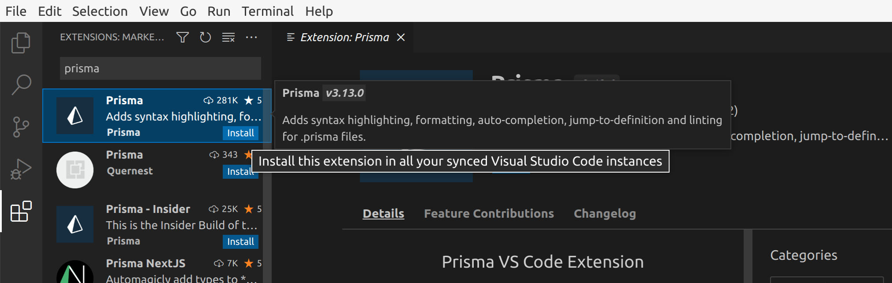

import newPostgresqlInstanceVideo from "./new-postgresql-instance.mp4";
import connectDbeaverToDatabaseVideo from "./connect-dbeaver-to-database.mp4";
import prismaInitVideo from "./prisma-init.mp4";
import copySecretValuesVideo from "./copy-secret-values.mp4";
import prismaDbPushVideo from "./prisma-db-push.mp4";
import createRecordInDatabaseVideo from "./create-record-in-database.mp4";
import forumVideo from "./forum.mp4";

## データ管理の限界

これまで作成してきたアプリケーションでは、次のように、データを全て Node.js アプリケーション上の変数に記録していました。しかし、このような方法では、<Term>サーバー</Term>が終了するたびにデータが消えてしまいます。

```javascript
const messages = [];
app.post((request, response) => {
  messages.push(request.body.message);
  // 省略
});
```

データをファイルに記録することはできますが、後述するような複数の問題があります。

```javascript
import { writeFileSync } from "node:fs";
app.post((request, response) => {
  writeFileSync("./messages.txt", request.body.message);
  // 省略
});
```

ひとつは、複数の<Term>サーバー</Term>間でデータの共有ができないことです。Web アプリケーションの利用者が増えてくると、1 台の<Term>サーバー</Term>では<Term>リクエスト</Term>を処理しきれなくなります。このような場合、<Term>リクエスト</Term>を複数のサーバーに分散させます。このとき、<Term>サーバー</Term>内に保存されているファイルは共有されないため、データに不整合が生じてしまいます。


また、データのサイズが大きくなってくると、データをファイルに保存することが難しくなってきます。これは、ファイルの読み書きは、変数の読み書きと比べ大幅に時間がかかるためです。高速なデータの読み書きを実現するためには、ファイルの読み書きが最小限になるよう、データの配置を工夫する必要があります。

**データベース**は、このようなデータに関する諸問題を解決するためのシステムです。

## データベースが動作する仕組み

データベースは、通常<Term>サーバー</Term>として動作します。つまり、**データベースサーバー**は、保持しているデータに対する参照や更新のための<Term>リクエスト</Term> (**クエリ**) を受け、その結果を<Term>レスポンス</Term>として<Term>クライアント</Term>に返します。

データベースサーバーの<Term>クライアント</Term>は、通常 Web サービスの使用者ではなく、皆さんが Node.js などで開発する<Term>サーバー</Term>です。これまで開発してきたような<Term>サーバー</Term>を、データベースサーバーと対比して**アプリケーションサーバー**と呼びます。



データベースの中でも、**リレーショナルデータベース**は、最も多く使われる種類のもので、データを Excel のような表形式でとらえます。次の図は、リレーショナルデータベースの基本的な概念である、**テーブル**、**カラム**、**レコード**について整理した図です。リレーショナルデータベースを用いる一般的なアプリケーションでは、アプリケーション開発時にテーブルとカラムを作成しておき、ユーザーの操作に応じてレコードを追加・編集・削除していきます。


リレーショナルデータベースに対するクエリは、通常 **SQL** と呼ばれる言語を用いて記述します。データベース<Term>クライアント</Term>として用いるライブラリによっては、SQL を直接用いることなく、そのライブラリが提供する専用の関数等を用いてデータベースに対してクエリを発行できることがあります。

## データベースを用いるアプリケーション

ここでは、Node.js のアプリケーションサーバーで、Prisma と呼ばれる<Term>ライブラリ</Term>を用い、リレーショナルデータベースの一つである PostgreSQL <Term>サーバー</Term>に保存されているデータを取得します。

### 使用する技術・サービス

#### [PostgreSQL](https://www.postgresql.org/)

現在最もよく用いられるリレーショナルデータベースのひとつです。豊富な機能を持ちます。

#### [DBeaver](https://dbeaver.io/)

多くのデータベースを直感的に操作できるソフトウェアです。PostgreSQL にも対応しています。

#### [Prisma](https://www.prisma.io/)

主にリレーショナルデータベースを操作するための Node.js の<Term>ライブラリ</Term>です。複数の構成要素からなります。

- [**`@prisma/client` パッケージ**](https://www.npmjs.com/package/@prisma/client): アプリケーションサーバーから用いる npm のパッケージです。JavaScript プログラムから使用します。
- [**`prisma` パッケージ**](https://www.npmjs.com/package/prisma): 開発時にコマンドとして用いる npm のパッケージです。`npx` コマンドを通して実行します。
- [**`.prisma` ファイル**](https://www.prisma.io/docs/concepts/components/prisma-schema): データベースのテーブル構造を記述するファイルです。`prisma` パッケージのコマンドを用いて実際のデータベースサーバーに反映させます。
- [**`Prisma` 拡張機能**](https://marketplace.visualstudio.com/items?itemName=Prisma.prisma): VS Code の拡張機能です。`.prisma` ファイルに対する補完やフォーマットの機能を提供します。

#### [ElephantSQL](https://www.elephantsql.com/)

PostgreSQL サーバーを提供するサービスです。PostgreSQL サーバーは皆さんのコンピューター上にも構築できますが、ここではその手間を省くため、外部のサービスを利用します。

### ElephantSQL で PostgreSQL サーバーを構築する

[ElephantSQL](https://www.elephantsql.com) のアカウントを作成しましょう。`Create New Instance` ボタンを押して必要な情報を入力し、新しい PostgreSQL サーバーを起動させてください。入力が必要な情報は次の通りです。

- **Name**: 起動するサーバーにつける名前です。適当に設定して構いません。
- **Plan**: 起動するサーバーの性能です。最も低い `Tiny Turtle (Free)` を選択すれば無料で使用できます。
- **Data center**: 起動するサーバーの地理的な場所です。ここでは `AP-NorthEast-1 (Tokyo)` を選択しています。

<video src={newPostgresqlInstanceVideo} controls />

### DBeaver で PostgreSQL サーバーに接続する

[DBeaver](https://dbeaver.io) をインストールしましょう。続いて、ElephantSQL の管理画面で接続情報を表示し、その情報を DBeaver に入力して前項で起動した PostgreSQL サーバーに接続しましょう。

<video src={connectDbeaverToDatabaseVideo} controls />

この時点では、まだデータベース上にテーブルが作成されていません。DBeaver 上で作成することもできますが、今回は Prisma を使用して作成することにします。

### Prisma でテーブル構造を作成する

VS Code 向けの Prisma 拡張機能をインストールしましょう。



新しいフォルダを VS Code で開き、`npm init` コマンドを使用して `package.json` ファイルを作成した後、

```shell
npx prisma init
```

コマンドを実行します。パッケージを実行しても良いか尋ねられる場合は、`y` を入力して許可しましょう。

<video src={prismaInitVideo} controls muted />

:::tip[`npx` コマンド]

<Term>`npx` コマンド</Term>は、npm
のパッケージを、プログラムからではなく直接実行するためのコマンドです。npm には
`prisma` パッケージのように、直接実行専用のパッケージも存在します。

:::

続いて、ElephantSQL からデータベースへの接続情報を `.env` ファイルにコピーします。これにより、Prisma は ElephantSQL 上の PostgreSQL サーバーと接続できるようになります。

<video src={copySecretValuesVideo} controls muted />

`prisma/schema.prisma` ファイルを、次のように編集し、データベースのテーブルとカラムを定義します。

```javascript
// This is your Prisma schema file,
// learn more about it in the docs: https://pris.ly/d/prisma-schema

generator client {
  provider = "prisma-client-js"
}

datasource db {
  provider = "postgresql"
  url      = env("DATABASE_URL")
}

model Todo {
  id   Int    @id @default(autoincrement())
  name String
}
```

完了したら、

```shell
npx prisma db push
```

コマンドを実行しましょう。すると、データベースに `schema.prisma` に書かれた通りのテーブルとカラムが作成されるので、DBeaver で確認してみてください。接続を一旦切断し、再接続する必要があります。また、このとき、後述する `@prisma/client` パッケージが自動的にインストールされます。

<video src={prismaDbPushVideo} controls />

### DBeaver で Prisma が作成したテーブルにレコードを追加する

Prisma が作成したテーブルに、DBeaver を用いてレコードを追加しましょう。

<video src={createRecordInDatabaseVideo} controls />

### Prisma でデータベースのデータを読み書きする

Node.js から Prisma を利用してデータベースのデータを操作するためには、`@prisma/client` パッケージの [`PrismaClient` クラス](https://www.prisma.io/docs/reference/api-reference/prisma-client-reference#prismaclient)を用います。

- [`PrismaClient#[テーブル名].findMany` メソッド](https://www.prisma.io/docs/reference/api-reference/prisma-client-reference#findmany): 条件を満たすレコードを全て取得
- [`PrismaClient#[テーブル名].findFirst` メソッド](https://www.prisma.io/docs/reference/api-reference/prisma-client-reference#findfirst): 条件を満たす最初のレコードを取得
- [`PrismaClient#[テーブル名].findUnique` メソッド](https://www.prisma.io/docs/reference/api-reference/prisma-client-reference#findunique): レコードを一意に識別できる条件を使用してレコードを 1 つだけ取得

:::tip[非同期処理]

上記の 3 つのメソッドは、<Term>**非同期処理**</Term>を行います。JavaScript における非同期処理とは、ファイルの入出力やネットワーク通信など、JavaScript の外側の時間のかかる処理の完了を待つ間、ほかの処理を実行できるようにする仕組みです。非同期処理を行う関数を使用するためには、次の 2 つを行います。

- 非同期処理を行う関数を呼び出す関数を定義する際、`async` キーワードをつけること
- 非同期処理を行う関数の戻り値に対し、`await` 演算子を適用すること

非同期処理に関する詳細は、[MDN の記事](https://developer.mozilla.org/ja/docs/Learn/JavaScript/Asynchronous)を参照してください。

:::

まずは、`findMany` メソッドの戻り値を、デバッガを用いて確認してみましょう。

```javascript
import { PrismaClient } from "@prisma/client";

const client = new PrismaClient();
const todos = await client.todo.findMany();
debugger;
```


続いて、[`PrismaClient#[テーブル名].create` メソッド](https://www.prisma.io/docs/reference/api-reference/prisma-client-reference#create)を用いて、テーブルにレコードを作成してみましょう。

```javascript
import { PrismaClient } from "@prisma/client";

const client = new PrismaClient();
const todos = await client.todo.create({ data: { name: "買い物をする" } });
debugger;
```


## 演習

PostgreSQL にデータを保存する掲示板サービスを作ってみましょう。

<video src={forumVideo} muted controls />

### 手順 1

ElephantSQL で新しいデータベースを作成しましょう。作成したデータベースに DBeaver から接続できることを確認しましょう。

### 手順 2

新しいプロジェクト用のディレクトリを作成し、`npx prisma init` コマンドを実行して、Prisma のセットアップをしましょう。`.env` ファイルを編集し、Prisma がデータベースに接続できるようにしましょう。

### 手順 3

作成された `.prisma` ファイルを編集し、掲示板に投稿されたメッセージを保存するためのテーブルと、そのテーブルのカラムの定義を記述しましょう。`npx prisma db push` コマンドでテーブルとカラムの定義をデータベースに反映させましょう。

:::info[テーブルの定義]
掲示板サービスに必要なテーブルの構造を考えてみましょう。例えば、次の例では、掲示板の投稿を保存するための `Post` テーブルを定義しており、このテーブルには `id` と `message` の 2 つのカラムが存在しています。他にも、投稿のタイトルを保存するための `title` カラムや、投稿者名を保存するための `author` カラムなどを定義するなどの工夫が考えられます。

```javascript title="prisma/schema.prisma の抜粋"
model Post {
  id      Int    @id @default(autoincrement())
  message String
}
```

:::

### 手順 4

DBeaver を用いて掲示板の投稿のサンプルデータをデータベースに登録しましょう。

### 手順 5

Node.js のデバッガを用いて、データベースのデータが Prisma で取得できることを確認しましょう。

### 手順 6

Express をインストールし、`/` への GET リクエストに対して、データベースのデータを HTML に整形したレスポンスを返せるようにしましょう。

:::info[ヒント]
Prisma の `findMany` メソッドを用いて、テーブル内にある全てのレコードを取得できます。

```javascript
const posts = await client.post.findMany();
// [
//   { id: 1, message: "おはようございます" },
//   { id: 2, message: "こんにちは" },
// ]
```

このメソッドの戻り値は、各カラムの値をプロパティとして持つオブジェクトの配列です。`Array#map` メソッドや `Array#join` メソッドを用い、適切な HTML に変換してレスポンスを生成しましょう。
:::

<Answer title="手順 6 まで">

```javascript title="main.mjs の抜粋"
const template = readFileSync("./index.html", "utf-8");
app.get("/", async (request, response) => {
  const posts = await client.post.findMany();
  const html = template.replace(
    "<!-- messages -->",
    posts.map((post) => `<li>${post.message}</li>`).join(""),
  );
  response.send(html);
});
```

```html title="index.html"
<!doctype html>
<html lang="ja">
  <head>
    <meta charset="utf-8" />
    <title>掲示板</title>
  </head>
  <body>
    <ul>
      <!-- messages -->
    </ul>
  </body>
</html>
```

</Answer>

### 手順 7

掲示板を投稿するための HTML のフォームを表示できるようにしましょう。入力されたデータは `/send` への POST リクエストとして送信されるようにしてみましょう。

:::info[ヒント]
手順 6 で作成したテンプレートとなる HTML ファイルを編集し、フォームを追加しましょう。
:::

<Answer title="手順 7 まで">

```html title="index.html"
<!doctype html>
<html lang="ja">
  <head>
    <meta charset="utf-8" />
    <title>掲示板</title>
  </head>
  <body>
    <ul>
      <!-- messages -->
    </ul>
    <form method="post" action="/send">
      <input placeholder="メッセージ" name="message" />
      <button type="submit">送信</button>
    </form>
  </body>
</html>
```

</Answer>

### 手順 8

前の手順で作成した HTML のフォームの送信先 (`/send` への POST リクエスト) を作成しましょう。送られてきたデータが正しいか、Node.js のデバッガを用いて確認してみましょう。

<Answer title="手順 8 まで">

```javascript title="main.mjs の抜粋"
app.use(express.urlencoded({ extended: true }));
app.post("/send", async (request, response) => {
  debugger; // ここで request オブジェクトの中身を確認
});
```

</Answer>

### 手順 9

送られてきたデータをデータベースに保存できるようにしましょう。データベースに投稿が保存された後、ブラウザは自動的に `/` に戻るようにしてみましょう。

:::info[ヒント]
[GET/POST の章](/docs/web-servers/get-post/)で扱った `express.Response#redirect` メソッドが使えます。

:::

<Answer title="手順 9 まで">

```javascript title="main.mjs の抜粋"
app.use(express.urlencoded({ extended: true }));
app.post("/send", async (request, response) => {
  await client.post.create({ data: { message: request.body.message } });
  response.redirect("/");
});
```

</Answer>

### 手順 10

DBeaver を用いて、掲示板への投稿がデータベースに保存されていることを確認しましょう。また、Node.js のサーバーを再起動しても、データが残っていることを確認しましょう。

<ViewSource url={import.meta.url} path="_samples/forum" noCodeSandbox />
