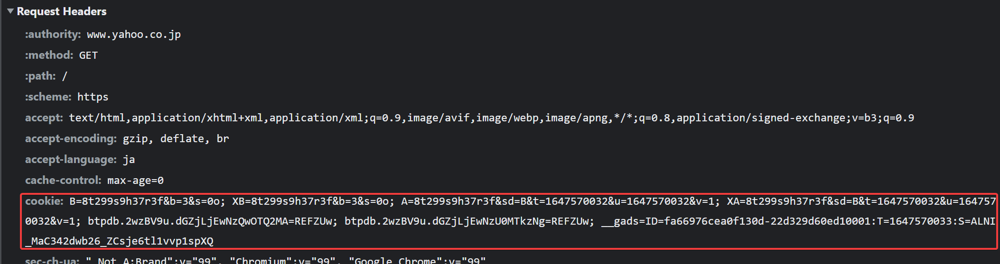

import cookieCounterVideo from "./cookie-counter.mp4";

## HTTPヘッダ

HTTPにおけるリクエストとレスポンスには、**ヘッダ**と呼ばれるKey-Value型のデータ構造が毎回付加されています。Chromeの開発者ツールでの`Network`タブで確認できるので、確認してみましょう。


## Cookie

レスポンスヘッダに`Set-Cookie`ヘッダを含めることにより、次回以降のリクエストで、クライアントはそのデータをリクエストヘッダの`Cookie`ヘッダに入れて毎回送信します。この性質を利用することで、HTTPサーバーはクライアント毎に異なるサービスを提供できるようになります。

Cookie自体もKey-Valueのデータ構造となっているので、`Set-Cookie`ヘッダを複数回送信することにより、複数のcookieを1つのレスポンスで送信することができます。例として、[Yahoo! Japanのウェブサイト](https://www.yahoo.co.jp/)にアクセスした際に、Yahoo! Japanが送信するCookieの中身を覗いてみましょう。


このレスポンスヘッダを受けて、ブラウザは次のようなCookieを保存します。


ブラウザを更新することで、設定されたCookieが確かにリクエストヘッダの中に含まれて送信されていることがわかります。



## ExpressでCookieを利用する

Expressを用いてレスポンスヘッダにCookieを付加するには、[`express.Response#cookie`メソッド](https://expressjs.com/ja/api.html#res.cookie)を利用します。また、クライアントからのリクエストの`Cookie`ヘッダを解析するためには、[cookie-parser](https://www.npmjs.com/package/cookie-parser)パッケージを利用します。

```shell
npm install cookie-parser
```

を実行して、パッケージをインストールしましょう。Webサーバーのプログラムは次のようになります。

```javascript title="main.mjs"
import express from "express";
import cookieParser from "cookie-parser";

const app = express();
app.use(cookieParser());

app.get("/", (request, response) => {
  // Cookieの値は文字列なので数値に変換が必要
  const count = parseInt(request.cookies.count) || 0;
  const newCount = count + 1;
  // 変更後の値をレスポンスヘッダに乗せる
  response.cookie("count", newCount.toString());
  response.send(`${newCount}回目のアクセスですね。`);
});

app.listen(3000);
```

[`express.Request#cookies`プロパティ](https://expressjs.com/ja/api.html#req.cookies)には、ブラウザから送信されていたCookieがオブジェクト形式で保存されています。ブラウザで表示させると、更新ボタンが押されるたびに数値が増えていることがわかります。

<video src={cookieCounterVideo} controls muted />

プログラムの流れを整理すると、次の図のようになります。


### 演習

- Chromeの開発者ツールを用いて、リクエストヘッダとレスポンスヘッダの内容を確認してみましょう。
- シークレットモードでページを開くと値はどうなるでしょうか。

## Cookieを用いた認証

ユーザー名とパスワードを用いて認証するタイプのアプリケーションを考えてみましょう。ユーザー名とパスワードを、そのままCookieに入れてしまうと、データが悪意のある第三者に奪われてしまうリスクが高まります。

このため、ログインが成功したタイミングで、クライアントに対してランダムなIDを発行し、Cookieに保存させておくことが一般的です（**セッションID**と呼ばれる）。次回以降のアクセスでは、このセッションIDを用いて認証を行います。このフローを図にすると、次のようになります。


### 演習

ユーザーが自分のユーザー名とパスワードでログインし、プロフィールを表示できるウェブアプリケーションを作成してみましょう。

`schema.prisma`は次の通りとします。

```javascript title="schema.prisma"
model User {
  id       Int    @id @default(autoincrement())
  username String @unique
  password String
}

model Session {
  id     String @id // 一意でランダムなID
  userId Int // UserのID
}
```
