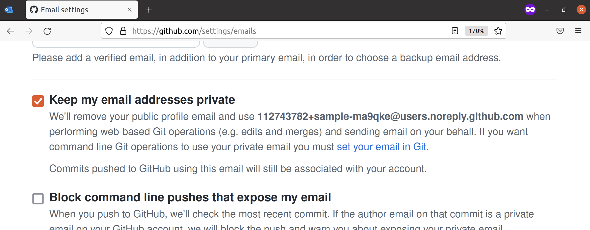
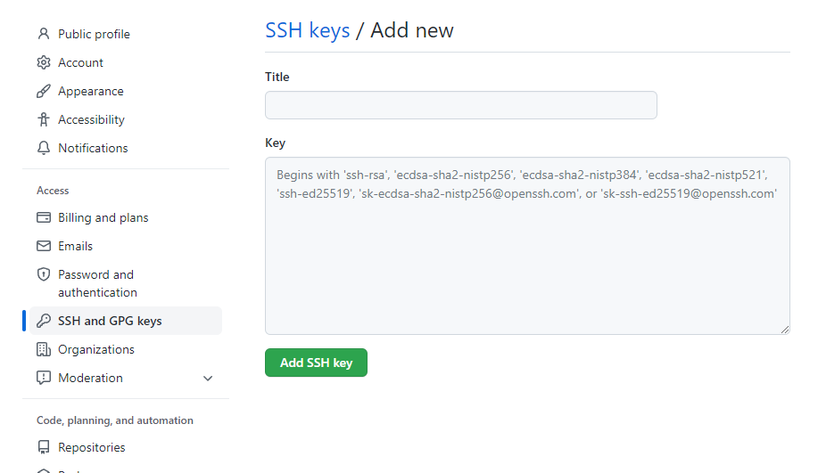
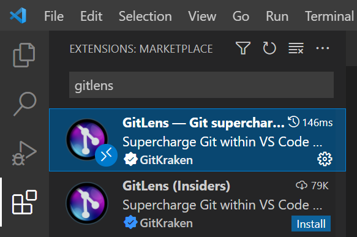
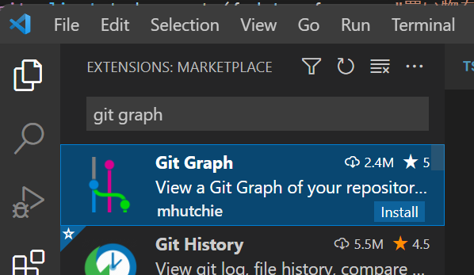
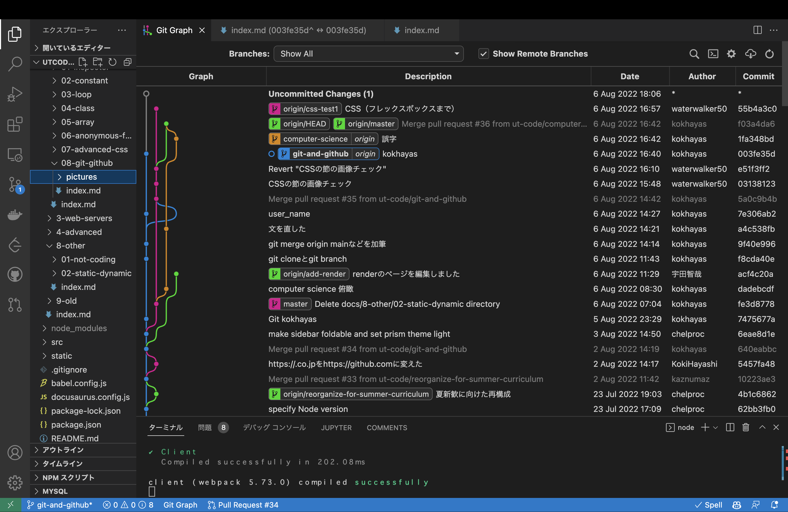

import Tabs from '@theme/Tabs';
import TabItem from '@theme/TabItem';
import Term from "@site/src/components/Term";
import ViewSource from "@site/src/components/ViewSource";
import installCommandLineDeveloperToolsVideo from "./install-command-line-developer-tools.mp4";
import registerGitHubVideo from "./register-github.mp4";
import setupGitVideo from "./setup-git.mp4";
import addSshKeyVideo from "./add-ssh-key.mp4";

## バージョン管理システム

**バージョン管理システム**を用いると、プログラムへの変更の履歴を追跡できます。これにより、大規模なプログラムや、複数人で開発されたプログラムを効率的に操作できます。

**Git** は、現在最もよく使われるバージョン管理システムです。軽量ながらも多機能であり、周辺のエコシステムも非常に充実しています。

## Git をインストールする

<Tabs groupId="os">
  <TabItem value="mac" label="macOS">

macOS の場合は、コマンドラインデベロッパツールが必要です。

<video src={installCommandLineDeveloperToolsVideo} controls muted />

  </TabItem>
  <TabItem value="win" label="Windows (WSL)">

WSL を利用する場合は Git は標準搭載なので追加でインストールする必要はありません。

  </TabItem>
</Tabs>

## GitHub への登録

[GitHub](https://github.com/) は、Git で管理されたソースコードを共有することができるサービスです。Git を使ううえで GitHub への登録は必須ではありませんが、Git を用いた共同開発では通常 GitHub が使用されます。

[GitHub に登録](https://github.com/signup)しましょう。

:::caution 登録する上での注意

GitHub のアカウント名は、開発者コミュニティにおける自分のアイデンティティになります。他の開発者とやり取りする際に表示される名前になるので、慎重に決めてください。

:::

<video src={registerGitHubVideo} controls muted />

## Git の初期設定

Git では、ファイルの変更だけでなく、その変更を行ったのが誰なのかも記録します。Git に対して自分の情報を登録しておきます。必要な情報は名前とメールアドレスです。

:::warning プライバシーの注意

自分が書いたプログラムを GitHub を用いて公開する場合、ここで設定した名前とメールアドレスが公開されます。

:::

名前は必ず GitHub のアカウント名と一致させるようにしてください。メールアドレスは GitHub の登録の際に設定したメールアドレスが推奨されますが、メールアドレスを公開したくない場合は、[GitHub のメール設定](https://github.com/settings/emails)から

- `Keep my email addresses private`
- `Block command line pushes that expose my email`

を必要に応じて有効化し、表示されているダミーのメールアドレス (スクリーンショットの例では `112743782+sample-ma9qke@users.noreply.github.com`) を Git に指定してください。



名前とメールアドレスを登録するために、次の 2 つのコマンドを実行しましょう。

```shell
$ git config --global user.name 名前
$ git config --global user.email メールアドレス
```

<video src={setupGitVideo} controls muted />

現在 WSL 上の Ubuntu の Git では、デフォルトブランチというものが `master` に設定されていますが、macOS では `main` になっています。また、GitHub ではデフォルトブランチが `main` になっています。これらを統一するために、次のコマンドを実行してください。

```shell
git config --global init.defaultBranch main
```

## 公開鍵・秘密鍵ペアの作成と GitHub への登録

GitHub にブラウザからログインする際にはメールアドレスとパスワードを用いますが、Git のコマンドを用いて GitHub を使用する場合には、公開鍵・秘密鍵のペアを使用します。

:::tip 公開鍵暗号と GitHub

公開鍵暗号では、「公開鍵」「秘密鍵」の 2 つの鍵が登場します。この 2 つの鍵は、「公開鍵で暗号化されたデータは秘密鍵を持っていないと復号できない」という特徴を持っています。

自分の PC で生成した公開鍵と秘密鍵のペアのうち、公開鍵のみをブラウザから事前に GitHub に登録しておくことで、自分の PC に保存されている秘密鍵を用いて認証できるようになります。

:::

GitHub に公開鍵を登録しましょう。

<video src={addSshKeyVideo} controls muted />

詳細な手順は、次の通りです。

公開鍵と秘密鍵のペアを生成するには、`ssh-keygen` コマンドを使用します。次のコマンドを実行することで、`Ed25519` というアルゴリズムの実装を用いて鍵を生成できます。
途中でターミナルの表示画面が止まりますが、`user@host:~$` が再度表示されるまで Enter キーで進みます。

```shell
$ cd ~
$ ssh-keygen -t ed25519
```

デフォルトでは公開鍵が `~/.ssh/id_ed25519.pub`、秘密鍵が `~/.ssh/id_ed25519` に格納されます。公開鍵のファイルを `cat` コマンドを用いて出力しましょう。

```shell
$ cat ~/.ssh/id_ed25519.pub
ssh-ed25519 AAAAC3NzaC1lZDI1NTE5AAAAIGz9wBSTWY0W4yJXPGQ/XsaffDTdvGOKg3mtR9pP3D6i [ユーザー名]@[コンピューター名]
```

`ssh-ed25519 AA...6i` の部分をコピーしましょう。これが公開鍵です。

:::tip ホームディレクトリのパスを表す記号

パスの中に現れる `~` は、**ホームディレクトリ**を表します。ホームディレクトリとは、ユーザー毎に割り当てられたディレクトリで、macOS では `/Users/ユーザー名`、Ubuntu では `/home/ユーザー名` になります。デスクトップやドキュメントディレクトリも通常ユーザーディレクトリの下に配置されています。

:::

:::tip 公開鍵のフォーマット

`ssh-keygen` が生成する標準の公開鍵は、スペースを区切り文字として 3 つのパートに分かれています。鍵の種類、鍵の中身、コメントです。コメントの部分はなくても構いません。

```plain
ssh-ed25519 AAAAC3...P3D6i user@computer
```

:::

これを GitHub の [SSH 鍵の設定](https://github.com/settings/keys)から登録します。

登録ページへの移動方法は、`Settings` > `SSH and GPG keys` > `New SSH key`と順に移動すればたどり着けます。



上記のようなページが表示されたら、`Title` に適切な名前、`Key` には先ほどターミナルで表示した公開鍵を入力して登録しましょう。

## Git の拡張機能をインストールする

VS Code 標準の機能だけでも多くのことができますが、より便利に利用するために拡張機能を併用していきます。次の拡張機能をインストールしておきましょう。

### [GitLens](https://marketplace.visualstudio.com/items?itemName=eamodio.gitlens)

コミットの差分などが見やすくなり便利



### [Git Graph](https://marketplace.visualstudio.com/items?itemName=mhutchie.git-graph)

コマンドパレット(`command / Ctrl + Shift + P`)に `Git Graph: View Git Graph (git log)` というメニューが出て見やすい




