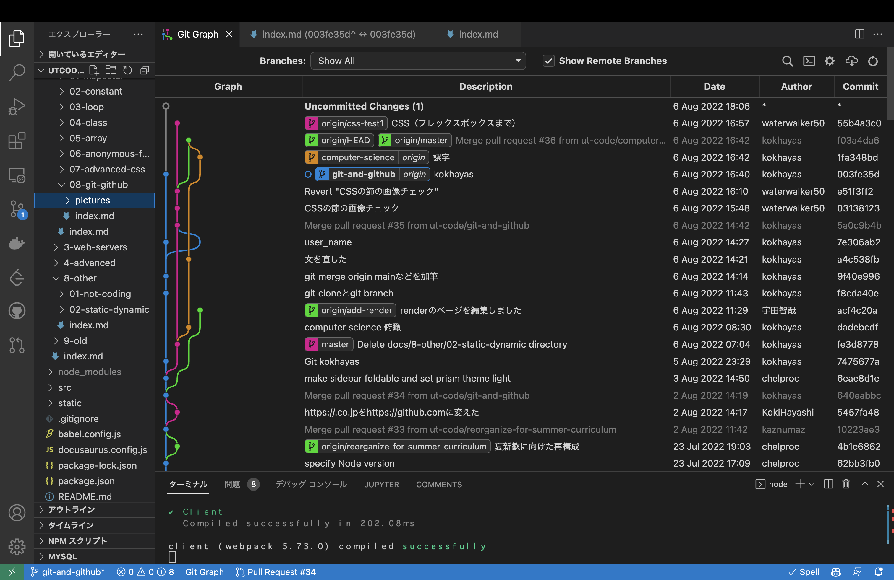
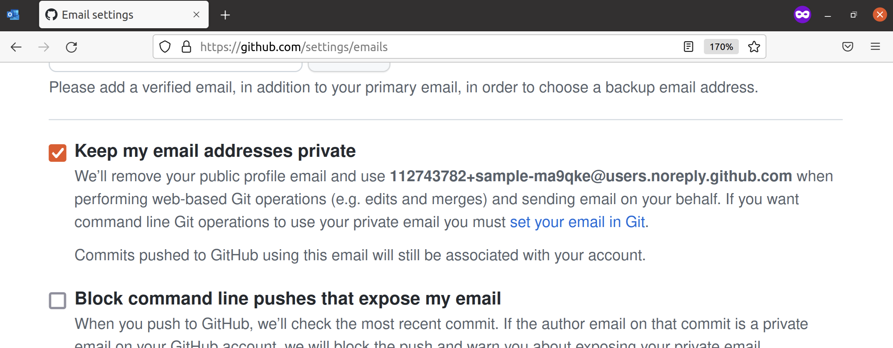
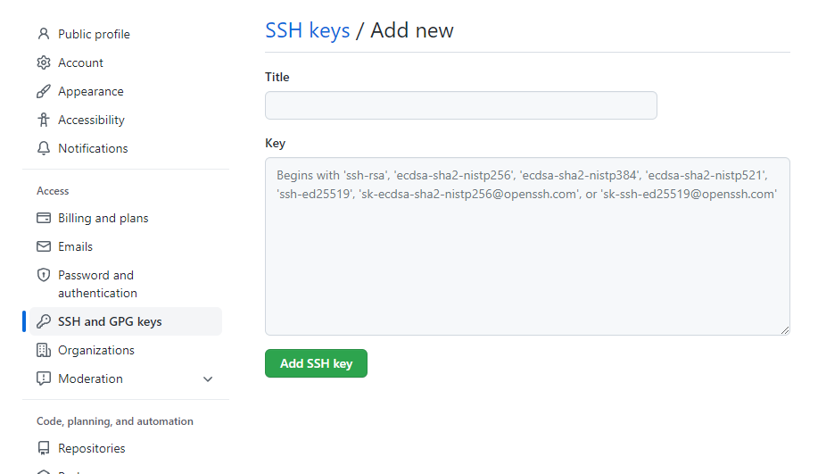

import registerGitHubVideo from "./register-github.mp4";
import setupGitVideo from "./setup-git.mp4";
import addSshKeyVideo from "./add-ssh-key.mp4";
import testSshConnectionVideo from "./test-ssh-connection.mp4";

## バージョン管理システム

**バージョン管理システム**を用いると、プログラムへの変更の履歴を追跡できます。これにより、大規模なプログラムや、複数人で開発されたプログラムを効率的に操作できます。

**Git**は、現在最もよく使われるバージョン管理システムです。軽量ながらも多機能であり、周辺のエコシステムも非常に充実しています。

## Gitのインストール

macOSとWSLのいずれも、Gitは標準搭載なので追加でインストールする必要はありません。

## Gitの拡張機能のインストール

VS Code標準の機能だけでも多くのことができますが、より便利に利用するために拡張機能を併用していきます。次の拡張機能をインストールしておきましょう。

### [GitLens](https://marketplace.visualstudio.com/items?itemName=eamodio.gitlens)

コミットの差分などが見やすくなり便利


### [Git Graph](https://marketplace.visualstudio.com/items?itemName=mhutchie.git-graph)

コマンドパレット (<kbd>Ctrl</kbd> + <kbd>Shift</kbd> + <kbd>P</kbd> (Windows) / <kbd>command</kbd> + <kbd>shift</kbd> + <kbd>P</kbd> (macOS) ) に`Git Graph: View Git Graph (git log)`というメニューが出て見やすい




## GitHubへの登録

[GitHub](https://github.com/)は、Gitで管理されたソースコードを共有することができるサービスです。Gitを使ううえでGitHubへの登録は必須ではありませんが、Gitを用いた共同開発では通常GitHubが使用されます。

[GitHubに登録](https://github.com/signup)しましょう。

:::warning[登録する上での注意]

GitHubのアカウント名は、開発者コミュニティにおける自分のアイデンティティになります。他の開発者とやり取りする際に表示される名前になるので、慎重に決めてください。

:::

<video src={registerGitHubVideo} controls muted />

## GitとGitHubの初期設定

### ユーザー情報の登録

Gitでは、ファイルの変更だけでなく、その変更を行ったのが誰なのかも記録します。Gitに対して名前とメールアドレスを登録しましょう。

- 名前: 必ずGitHubのアカウント名と一致させるようにしてください。

- メールアドレス: GitHubの登録の際に設定したメールアドレスが推奨されますが、メールアドレスを公開したくない場合は、次のようにダミーのメールアドレスを取得することもできます。

  [GitHubのメール設定](https://github.com/settings/emails)から`Keep my email addresses private`を有効化し、表示されているダミーのメールアドレス (スクリーンショットの例では`112743782+sample-ma9qke@users.noreply.github.com`) をGitに指定してください。

  

名前とメールアドレスを登録するために、次の2つのコマンドを実行しましょう。

```shell
git config --global user.name 名前
```

```shell
git config --global user.email メールアドレス
```

:::danger[プライバシーの注意]

自分が書いたプログラムをGitHubを用いて公開する場合、ここで設定した名前とメールアドレスが公開されます。メールアドレスを公開したくない場合は、上記で取得したダミーのメールアドレスを設定してください。

:::

<video src={setupGitVideo} controls muted />

### デフォルトブランチの設定

現在WSL上のUbuntuのGitでは、デフォルトブランチというものが`master`に設定されていますが、macOSでは`main`になっています。また、GitHubではデフォルトブランチが`main`になっています。これらを統一するために、次のコマンドを実行してください。

```shell
git config --global init.defaultBranch main
```

### 公開鍵・秘密鍵ペアの作成とGitHubへの登録

GitHubにブラウザからログインする際にはメールアドレスとパスワードを用いますが、Gitのコマンドを用いてGitHubを使用する場合には、公開鍵・秘密鍵のペアを使用します。

:::tip[公開鍵暗号とGitHub]

公開鍵暗号では、「公開鍵」「秘密鍵」の2つの鍵が登場します。この2つの鍵は、「公開鍵で暗号化されたデータは秘密鍵を持っていないと復号できない」という特徴を持っています。

自分のPCで生成した公開鍵と秘密鍵のペアのうち、公開鍵のみをブラウザから事前にGitHubに登録しておくことで、自分のPCに保存されている秘密鍵を用いて認証できるようになります。

:::

GitHubに公開鍵を登録しましょう。

<video src={addSshKeyVideo} controls muted />

詳細な手順は、次の通りです。

公開鍵と秘密鍵のペアを生成するには、`ssh-keygen`コマンドを使用します。次のコマンドを実行することで、`Ed25519`というアルゴリズムの実装を用いて鍵を生成できます。途中でターミナルの表示画面が止まりますが、`user@host:~$`が再度表示されるまでEnterキーで進みます。

```shell
$ cd ~
$ ssh-keygen -t ed25519
```

デフォルトでは公開鍵が`~/.ssh/id_ed25519.pub`、秘密鍵が`~/.ssh/id_ed25519`に格納されます。公開鍵のファイルを`cat`コマンドを用いて出力しましょう。

```shell
$ cat ~/.ssh/id_ed25519.pub
ssh-ed25519 AAAAC3NzaC1lZDI1NTE5AAAAIEqE0cyVkFSFD/BlAwvJ9QejXwgyFppn5JDQc8iGW/Gp [ユーザー名]@[コンピューター名]
```

`ssh-ed25519 AA...Gp`の部分をコピーしましょう。これが公開鍵です。

:::tip[ホームディレクトリのパスを表す記号]

パスの中に現れる`~`は、**ホームディレクトリ**を表します。ホームディレクトリとは、ユーザー毎に割り当てられたディレクトリで、macOSでは`/Users/ユーザー名`、Ubuntuでは`/home/ユーザー名`になります。デスクトップやドキュメントディレクトリも通常ユーザーディレクトリの下に配置されています。

:::

:::tip[公開鍵のフォーマット]

`ssh-keygen`が生成する標準の公開鍵は、スペースを区切り文字として3つのパートに分かれています。鍵の種類、鍵の中身、コメントです。コメントの部分はなくても構いません。

```plain
ssh-ed25519 AAAAC3...GW/Gp user@computer
```

:::

これをGitHubの[SSH鍵の設定](https://github.com/settings/keys)から登録します。

登録ページへの移動方法は、`Settings`>`SSH and GPG keys`>`New SSH key`と順に移動すればたどり着けます。



上記のようなページが表示されたら、`Title`に適切な名前、`Key`には先ほどターミナルで表示した公開鍵を入力して登録しましょう。

## 確認

ここまででGitとGitHubのセットアップが完了しました。この章で行ってきたセットアップが正しくできているのかは次のようにして確認することができます。

### Gitの初期設定の確認

次のコマンドを実行することでGitの設定を確認することができます。

```shell
git config --global --list
```

次のように表示されていれば正しく設定できています。

```shell
$ git config --global --list
user.name=名前
user.email=メールアドレス
init.defaultBranch=main
```

### SSH接続のテスト

次のコマンドを実行することでSSH接続が正常につながっているかをテストすることができます。

```shell
ssh -T git@github.com
```

:::info

この操作の際、初回は以下のような警告が出る場合があります。

```plain
The authenticity of host 'github.com (20.27.177.113)' can't be established.
ED25519 key fingerprint is SHA256:+DiY3wvvV6TuJJhbpZisF/zLDA0zPMSvHdkr4UvCOqU.
This key is not known by any other names
Are you sure you want to continue connecting (yes/no/[fingerprint])?
```

これは、接続先となっているGitHubが、なりすましではなく本物のGitHubであると信頼してもよいかを尋ねるメッセージです。家庭用のインターネット回線、UTokyo Wi-Fi等、十分に信頼できるネットワークに接続している場合は問題ありませんので、`yes`と入力して続行させてください。

:::

次のように表示されたら成功です。

```shell
Hi 名前! You've successfully authenticated, but GitHub does not provide shell access.
```

<video src={testSshConnectionVideo} controls />
