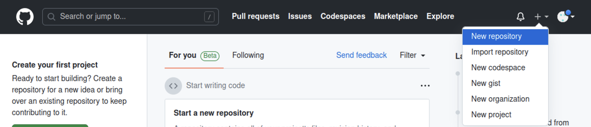
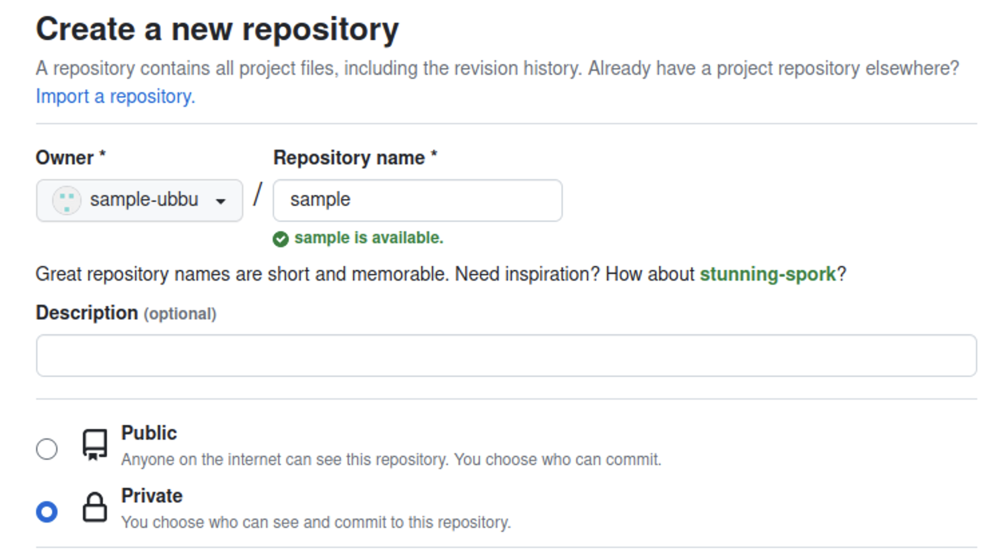

import gitInitVideo from "./git-init.mp4";
import gitInitWithCliVideo from "./git-init-with-cli.mp4";
import stageChangesVideo from "./stage-changes.mp4";
import stageChangesWithCliVideo from "./stage-changes-with-cli.mp4";
import commitChangesVideo from "./commit-changes.mp4";
import commitChangesWithCliVideo from "./commit-changes-with-cli.mp4";
import secondCommitVideo from "./second-commit.mp4";
import showGitHistoryVideo from "./show-git-history.mp4";
import showGitHistoryWithCliVideo from "./show-git-history-with-cli.mp4";
import showGitDiffWithCliVideo from "./show-git-diff-with-cli.mp4";
import addRemoteRepositoryVideo from "./add-remote-repository.mp4";
import pushChangesVideo from "./push-changes.mp4";
import pushChangesWithCliVideo from "./push-changes-with-cli.mp4";

## Git リポジトリを作成する

Git では、**リポジトリ**と呼ばれる単位でソースコードを管理します。リポジトリはひとつのディレクトリに相当し、そのディレクトリ以下の全てのファイルが Git による追跡対象となります。

まずは Git で管理するためのディレクトリを作成し、VS Code で開きます。左側のアクティビティバーの `Source Control` パネル内の `Initialize Repository` ボタンを押してください。これで、カレントディレクトリを Git の管理下に置く (カレントディレクトリを Git リポジトリにする) ことができます。

<video src={gitInitVideo} controls autoPlay muted loop />

:::info `git init` コマンド

Git の操作は、コマンドからも行うことが出来ます。カレントディレクトリを Git の管理下に置くには、次のコマンドを実行してください。

```shell
git init
```

<video src={gitInitWithCliVideo} controls autoPlay muted loop />

:::

:::tip `.git` ディレクトリ

Git の管理下に置かれたディレクトリには `.git` という名前のディレクトリが生成されます。このディレクトリには過去のコミットの履歴など、Git が内部的に使用するファイルが格納されます。誤ったディレクトリで `git init` コマンドを実行してしまった場合、このディレクトリを削除しましょう。なお、ピリオドから始まるディレクトリやファイルは `ls` コマンドに `-a` というオプションをつけないといけないので注意が必要です。

```shell
$ ls
$ ls -a
.  ..  .git
$ ls .git
branches  config  description  HEAD  hooks  info  objects  refs
```

:::

## 最初のコミットを作成する

**コミット**は、リポジトリのある時点での状態です。ここでいう状態とは、リポジトリ内のすべてのディレクトリやファイルの名前、その内容、変更日時などです。Git では、コミットを作成することにより、リポジトリへの変更内容を記録します。

それでは、前項で作成したリポジトリで最初のコミットを作成してみましょう。まずはファイルを作成し、適当な内容で保存します。

コミットを作成する前に、変更を**ステージ**する必要があります。ステージとはコミットの直前の状態で、Git に対して該当ファイルをコミットする意思があることを伝えるためのものです。`Source Control` パネル内の変更したファイルの横の `+` ボタンを押します。ファイルが `Changes` から `Staged Changes` に移ったら成功です。

<video src={stageChangesVideo} loop muted autoPlay controls />

:::info `git status` コマンド

現在の状況を確認するには、`git status` コマンドを使います。

ステージされていない場合は、次のように表示されます。


ステージされた後では、次のように表示されます。


:::

:::info `git add` コマンド

コマンドラインから変更をステージする場合には、`git add` コマンドを実行します。

```shell
$ git add ステージするファイルへのパス
$ git add -A # リポジトリ内部のすべてのファイルをステージする場合
```

`git add` コマンドを使う前後で `git status` コマンドの結果が変化していることを確認しましょう。

<video src={stageChangesWithCliVideo} loop muted autoPlay controls />

:::

ステージされた変更からコミットを作成するには、**コミットメッセージ**を入力して `Commit` ボタンを押します。コミットメッセージには、そのコミットで行われた変更を説明する簡潔なメッセージを入力してください。(日本語も使うことが出来ます。)

<video src={commitChangesVideo} muted autoPlay loop controls />

変更がコミットとして記録されました。

:::info `git commit` コマンド

コマンドラインで実行するには、`git commit` コマンドを使用します。

```shell
git commit -m "コミットメッセージ"
```

<video src={commitChangesWithCliVideo} muted autoPlay loop controls />

:::

ある程度変更がまとまったら、ステージ、コミットを繰り返してプログラムを書き進めていきましょう。

:::tip `.gitignore`

`.gitignore` ファイルで指定されたファイルは Git の管理下に置かれません。`npm install` で簡単にダウンロードできて容量が大きいのでバージョン管理するメリットのない `node_modules` や、機密情報や環境ごとに異なる情報を含む `.env` といったファイルが指定されます。

:::

## 変更履歴を表示する

先ほど作成したファイルを変更し、ステージした後、もう一度コミットを作ってみましょう。

<video src={secondCommitVideo} muted autoPlay loop controls />

これにより、2 つ目のコミットが作成されました。コミットの履歴を確認するために、先ほどインストールした `Git Graph` 拡張機能を起動してみましょう。`command / Ctrl + Shift + P` キーを押してコマンドパレットを開き、`Git Graph: View Git Graph (git log)` を選択します。

<video src={showGitHistoryVideo} muted autoPlay loop controls />

:::info `git log` コマンド

コマンドを用いて変更を表示するには、`git log` コマンドを使用します。

<video src={showGitHistoryWithCliVideo} muted autoPlay loop controls />

:::

:::info `git diff` コマンド

コミットには一意の ID が割り当てられており、この ID を `git diff` コマンドに与えることで、コミット同士を比較することができます。

下の動画の最後で実行されている `git diff @ @~` は、最新のコミットとそのひとつ前のコミットを比較するためのコマンドです。`@` が最新のコミットを、`~` が「そのひとつ前」を表します。

<video src={showGitDiffWithCliVideo} muted autoPlay loop controls />

:::

## 変更を GitHub に保存する

自分のコンピューター上に作成したリポジトリと同期させるため、GitHub 上にもリポジトリを作成します。GitHub 上部のメニューから `New repository` を選択してください。



必要な設定はリポジトリの名前と公開範囲です。公開するつもりがない場合は公開範囲は `Private` に設定するようにしましょう。



続いて、作成したリポジトリと自分の PC 上にあるリポジトリを紐づけます。GitHub 上に表示されている **SSH** の URL をコピーします。(**SSH** にするのを忘れないでください。) これが GitHub 上に作成したリポジトリを表す URL (リモートリポジトリの URL) になります。次のコマンドを実行して、このリモートリポジトリを `origin` (慣習的にリモートリポジトリが一つだけの場合はこの名前が用いられます) という名前で登録します。

```shell
git remote add origin git@github.com:アカウント名/リポジトリ名.git
```

<video src={addRemoteRepositoryVideo} muted controls />

追加が完了したら、`origin` として登録したリモートリポジトリにコミットを送信します。この操作を**プッシュ**と呼びます。プッシュをするには、`Publish Branch` を押します。

<video src={pushChangesVideo} muted autoPlay loop controls />

:::info

この操作の際、初回は以下のような警告が出る場合があります。

```plain
"github.com" has fingerprint "SHA256:+DiY3wvvV6TuJJhbpZisF/zLDA0zPMSvHdk4UvCOqU."
Are you sure you want to continue connecting?
```

これは、接続先となっている GitHub が、なりすましではなく本物の GitHub であると信頼してもよいかを尋ねるメッセージです。家庭用のインターネット回線、UTokyo Wi-Fi 等、十分に信頼できるネットワークに接続している場合は問題ありませんので、 `yes` を押して続行させてください。

:::

:::info `git push` コマンド

コマンドラインから実行するには、`git push` コマンドを使います。

```shell
git push origin main
```

このコマンドの `main` は**ブランチ**と呼ばれるソースコードの変更の分岐を表す名前で、何も指定しなければ `main` という名前になります。

<video src={pushChangesWithCliVideo} muted controls />

:::

GitHub を開いているブラウザを更新して、プログラムが反映されていることを確認したら完了です。
