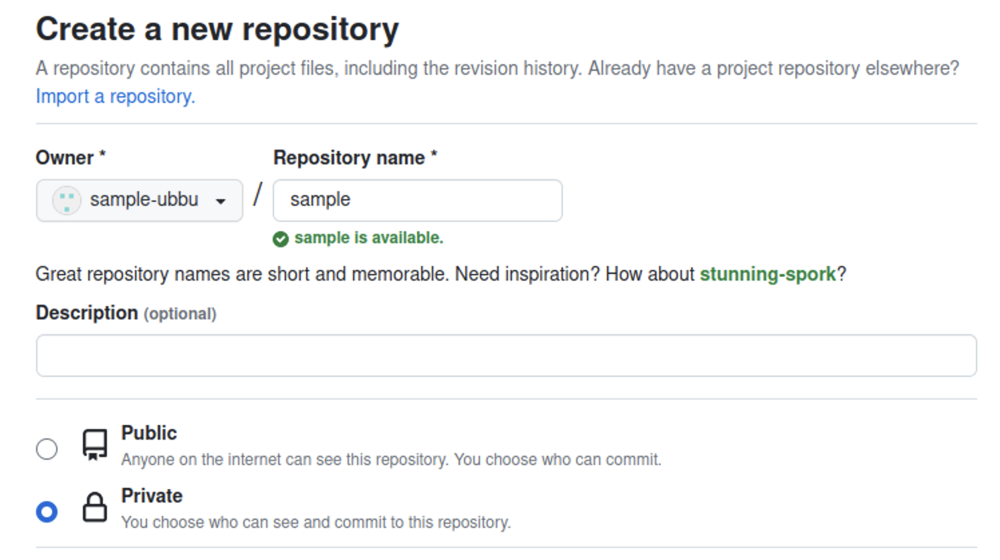
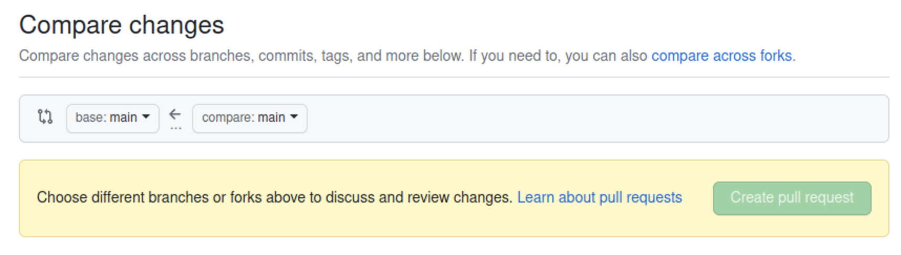
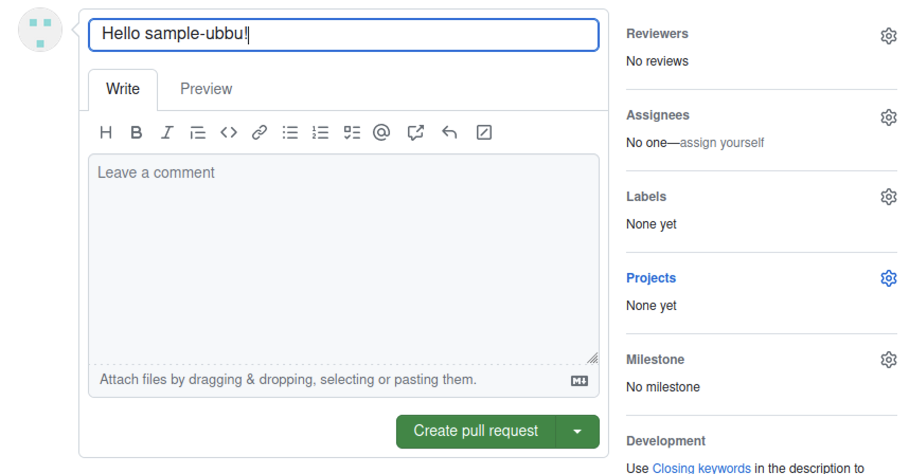
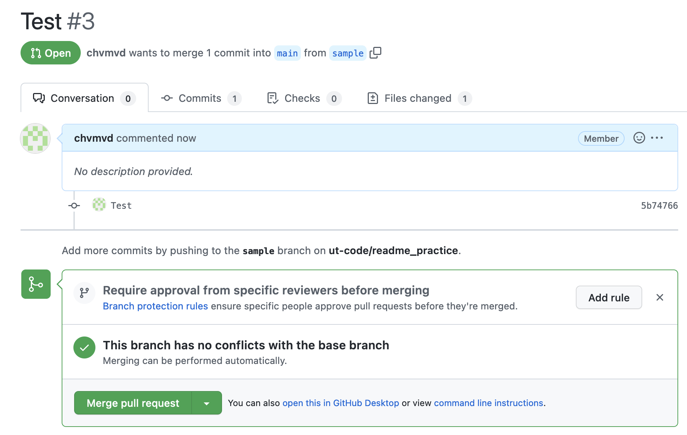

import Tabs from '@theme/Tabs';
import TabItem from '@theme/TabItem';
import Term from "@site/src/components/Term";
import ViewSource from "@site/src/components/ViewSource";
import gitInitVideo from "./git-init.mp4";
import stageChangesVideo from "./stage-changes.mp4";
import commitChangesVideo from "./commit-changes.mp4";
import secondCommitVideo from "./second-commit.mp4";
import showGitHistoryVideo from "./show-git-history.mp4";
import showGitHistoryWithCliVideo from "./show-git-history-with-cli.mp4";
import addRemoteRepositoryVideo from "./add-remote-repository.mp4";
import prPracticeVideo from "./pr-practice.mp4";

## Git リポジトリを作成する

Git では、**リポジトリ**と呼ばれる単位でソースコードを管理します。リポジトリはひとつのディレクトリに相当し、そのディレクトリ以下の全てのファイルが Git による追跡対象となります。

まずは Git で管理するためのディレクトリを作成し、VS Code で開きます。左側のアクティビティバーの `Source Control` パネル内の `Initialize Repository` ボタンを押してください。これで、カレントディレクトリを Git の管理下に置く (カレントディレクトリを Git リポジトリにする) ことができます。

<video src={gitInitVideo} controls autoPlay muted loop />

:::info `git init` コマンド

Git の操作は、コマンドからも行うことが出来ます。次のコマンドを実行してください。

```shell
git init
```

`git init` コマンドは、カレントディレクトリを Git の管理下に置くためのコマンドです。

:::

:::tip `.git` ディレクトリ

Git の管理下に置かれたディレクトリには `.git` という名前のディレクトリが生成されます。このディレクトリには過去のコミットの履歴など、Git が内部的に使用するファイルが格納されます。誤ったディレクトリで `git init` コマンドを実行してしまった場合、このディレクトリを削除しましょう。なお、ピリオドから始まるディレクトリやファイルは `ls` コマンドに `-a` というオプションをつけないといけないので注意が必要です。

```shell
$ ls
$ ls -a
.  ..  .git
$ ls .git
branches  config  description  HEAD  hooks  info  objects  refs
```

:::

## 最初のコミットを作成する

**コミット**は、リポジトリのある時点での状態です。ここでいう状態とは、リポジトリ内のすべてのディレクトリやファイルの名前、その内容、変更日時などです。Git では、コミットを作成することにより、リポジトリへの変更内容を記録します。

それでは、前項で作成したリポジトリで最初のコミットを作成してみましょう。まずはファイルを作成し、適当な内容で保存します。

コミットを作成する前に、変更を**ステージ**する必要があります。ステージとはコミットの直前の状態で、Git に対して該当ファイルをコミットする意思があることを伝えるためのものです。`Source Control` パネル内の変更したファイルの横の `+` ボタンを押します。ファイルが `Changes` から `Staged Changes` に移ったら成功です。

<video src={stageChangesVideo} loop muted autoPlay controls />

:::info `git add` コマンド

コマンドラインから変更をステージする場合には、`git add` コマンドを実行します。

```shell
$ git add ステージするファイルへのパス
$ git add -A # リポジトリ内部のすべてのファイルをステージする場合
```

:::

ステージされた変更からコミットを作成するには、**コミットメッセージ**を入力して `Commit` ボタンを押します。コミットメッセージには、そのコミットで行われた変更を説明する簡潔なメッセージを入力してください。(日本語も使うことが出来ます。)

<video src={commitChangesVideo} muted autoPlay loop controls />

変更がコミットとして記録されました。

:::info `git commit` コマンド

コマンドラインで実行するには、`git commit` コマンドを使用します。

```shell
git commit -m "コミットメッセージ"
```

:::

ある程度変更がまとまったら、ステージ、コミットを繰り返してプログラムを書き進めていきましょう。

:::tip `.gitignore`

`.gitignore` ファイルで指定されたファイルは Git の管理下に置かれません。`npm install` で簡単にダウンロードできて容量が大きいのでバージョン管理するメリットのない `node_modules` や、機密情報や環境ごとに異なる情報を含む `.env` といったファイルが指定されます。

:::

## 変更履歴を表示する

先ほど作成したファイルを変更し、ステージした後、もう一度コミットを作ってみましょう。

<video src={secondCommitVideo} muted autoPlay loop controls />

これにより、2 つ目のコミットが作成されました。コミットの履歴を確認するために、先ほどインストールした `Git Graph` 拡張機能を起動してみましょう。`Cmd / Ctrl + Shift + P` キーを押してコマンドパレットを開き、`Git Graph: View Git Graph (git log)` を選択します。

<video src={showGitHistoryVideo} muted autoPlay loop controls />

コマンドを用いて変更を表示するには、`git log` コマンドを使用します。コミットには一意の ID が割り当てられており、この ID を `git diff` コマンドに与えることで、コミット同士を比較することができます。下の動画の最後で実行されている `git diff @ @~` は、最新のコミットとそのひとつ前のコミットを比較するためのコマンドです。`@` が最新のコミットを、`~` が「そのひとつ前」を表します。

<video src={showGitHistoryWithCliVideo} muted autoPlay loop controls />

## 変更を GitHub に保存する

自分のコンピューター上に作成したリポジトリと同期させるため、GitHub 上にもリポジトリを作成します。GitHub 上部のメニューから `New repository` を選択してください。


必要な設定はリポジトリの名前と公開範囲です。公開するつもりがない場合は公開範囲は `Private` に設定するようにしましょう。



続いて、作成したリポジトリと自分の PC 上にあるリポジトリを紐づけます。GitHub 上に表示されている **SSH** の URL をコピーします。(**SSH** にするのを忘れないでください。) これが GitHub 上に作成したリポジトリを表す URL (リモートリポジトリの URL) になります。次のコマンドを実行して、このリモートリポジトリを `origin` (慣習的にリモートリポジトリが一つだけの場合はこの名前が用いられます) という名前で登録します。

```shell
git remote add origin git@github.com:アカウント名/リポジトリ名.git
```

追加が完了したら、次のコマンドを実行して `origin` として登録したリモートリポジトリにコミットを送信します。この操作を**プッシュ**と呼びます。`-u` オプションを指定することで、次回から `origin` や `master` の指定を省略し、`git push` のみで実行できるようになります。このコマンドの `master` は**ブランチ**と呼ばれるソースコードの変更の分岐を表す名前で、何も指定しなければ `master` という名前になります。(macOS では `main` になります。)

```shell
git push -u origin master
```

:::info

この操作の際、初回は以下のような警告が出る場合があります。

```plain
The authenticity of host 'github.com (20.27.177.113)' can't be established.
ECDSA key fingerprint is SHA256:p2QAMXNIC1TJYWeIOttrVc98/R1BUFWu3/LiyKgUfQM.
Are you sure you want to continue connecting (yes/no/[fingerprint])?
```

これは、接続先となっている GitHub が、なりすましではなく本物の GitHub であると信頼してもよいかを尋ねるメッセージです。家庭用のインターネット回線、UTokyo WiFi 等、十分に信頼できるネットワークに接続している場合は問題ありませんので、 `yes` を入力して続行させてください。

:::

<video src={addRemoteRepositoryVideo} muted controls />

GitHub を開いているブラウザを更新して、プログラムが反映されていることを確認したら完了です。

## GitHub を用いた共同開発をする

GitHub を用いると簡単に共同開発ができます。ここでは、[練習用のリポジトリ](https://github.com/ut-code/readme_practice)に変更を加えてみましょう。変更を加えるのにはリポジトリの編集権限が必要なので、権限をもらっておきましょう。

まずは、共同開発をするリポジトリをローカルにクローンし、VS Code で開きます。

```shell
git clone git@github.com:ut-code/readme_practice.git
```

次にブランチを作成します。ブランチは、ソースコードへの変更を分岐して行うための仕組みです。ブランチを作成することで、複数の変更を同時に進めていくことができます。

まずは、ブランチの一覧を確認してみましょう。ターミナルで `git branch` コマンドを実行してください。

```shell
$ git branch
* main
```

ここで、`*` から始まっているのが、現在いるブランチです。`main` となっているはずです。

次に、変更を行うために新しいブランチを作成して、移動します。ブランチ名は作業する内容が端的にわかるような名前にしてください。

```shell
git checkout -b 新しいブランチ名
```

現在いるブランチを確認すると、`*` が移動しているはずです。

```shell
$ git branch
  main
* 新しいブランチ名
```

この状態で、ファイルに必要な変更を行います。
練習用のリポジトリに自分だけの新しいファイルを作ってみましょう。
変更ができたらその都度、変更をステージし、コミットします。
必要に応じて、コミットの履歴やコミットの差分を確認してください。

変更が終わったら、変更を加えたブランチをリモートリポジトリにプッシュして、プルリクエストをします。

```shell
git push origin ブランチ名
```

とすると、変更を加えたブランチをリモートリポジトリにプッシュできます。

プッシュができたら、GitHub を開き `Pull requests` を開いてください。


`New pull request` を押してください。

次のような画面が現れるので、



`compare` と書いてある方のブランチを変更して、変更を加えたブランチを選択してください。


`Create pull request` を押してください。



確認画面が出るので、コメントを書いて `Create pull request` を押してください。これで、プルリクエストを作成することができました。



変更が良さそうだったら、`Merge pull request` を押してください。これで、変更を反映できます。

マージしたら、不要になったブランチは削除しておきましょう。

<video src={prPracticeVideo} muted controls />
