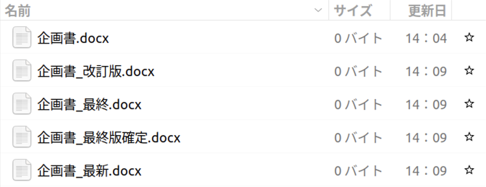
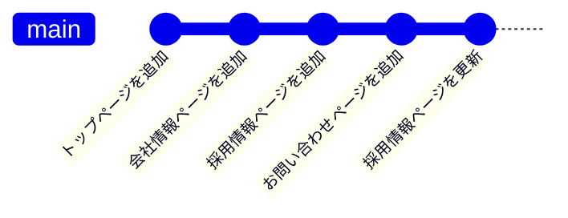
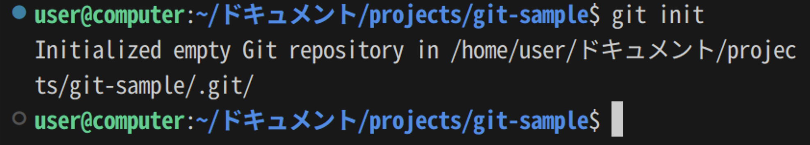
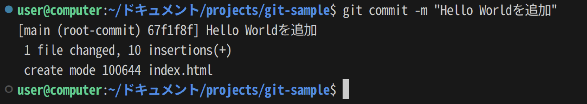
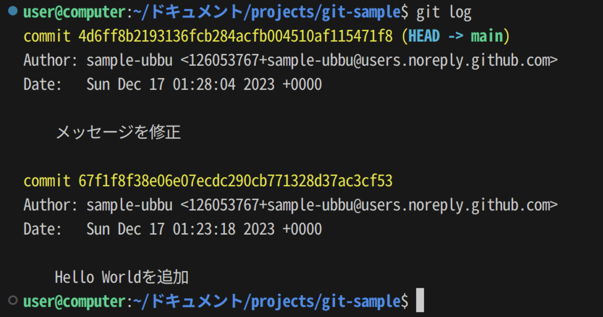

import gitInitVideo from "./git-init.mp4";
import stageChangesVideo from "./stage-changes.mp4";
import stageChangesWithCliVideo from "./stage-changes-with-cli.mp4";
import commitChangesVideo from "./commit-changes.mp4";
import secondCommitVideo from "./second-commit.mp4";
import showGitHistoryVideo from "./show-git-history.mp4";
import showGitDiffWithCliVideo from "./show-git-diff-with-cli.mp4";
import step1Video from "./step1.mp4";
import step3Video from "./step3.mp4";
import step4Video from "./step4.mp4";
import step6Video from "./step6.mp4";
import step7Video from "./step7.mp4";

## なぜバージョン管理システムが必要なのか

企画書を作成することを考えてみてください。
企画書を修正する時に、最初の企画書を保存しておきたいと思うことがあるでしょう。
ファイル名を工夫することによりそれらのファイルを区別することが考えられます。
しかし、次の画像のようになってしまいます。
これだと、どのファイルが本当に最新であるのかがわかりません。



## Gitによるバージョン管理の仕組み

バージョン管理システムを使うことでこのような問題を解決することができます。
Gitは、代表的なバージョン管理システムのひとつです。

Gitでは、**コミット**を作成することで、その時点での状態を記録することができます。
ここでいう状態とは、Gitで管理されているすべてのディレクトリやファイルの名前、その内容などです。
次の図のようにプロジェクトのある一定のまとまりごとにその時点での状態をコミットとして記録します。
こうすることで、どのファイルが最新であるのかがわかりやすくなり、また、過去の状態に戻すことも簡単になります。



## Gitを使ったバージョン管理をする

では、実際にGitを使ってバージョン管理をしてみましょう。

Gitを使ったバージョン管理は大きく次のような流れで行います。

1. Gitリポジトリを作成する。
1. ファイルに変更を加える。
1. 必要な変更のみをステージする。
1. コミットを作成する。

2回目からは、2.以降の手順を繰り返すことで、新たなコミットを作成していきます。

では、それぞれについて見ていきましょう。

### Gitリポジトリを作成する

Gitでは、**リポジトリ**と呼ばれる単位でソースコードを管理します。
リポジトリはひとつのディレクトリに相当し、そのディレクトリ以下の全てのファイルがGitによる追跡対象となります。

まずはGitで管理するためのディレクトリを作成し、VS Codeで開きます。
左側のアクティビティバーの`Source Control`パネル内の`Initialize Repository`ボタンを押してください。
これで、カレントディレクトリをGitの管理下に置く (カレントディレクトリをGitリポジトリにする) ことができます。

<video src={gitInitVideo} controls muted />

:::info[`git init`コマンド]

Gitの操作は、コマンドラインからも行うことができます。
次のコマンドを実行することで、カレントディレクトリをGitの管理下に置くこともできます。

```shell
git init
```



:::

:::tip[`.git`ディレクトリ]

Gitの管理下に置かれたディレクトリには`.git`という名前のディレクトリが生成されます。
このディレクトリには過去のコミットの履歴など、Gitが内部的に使用するファイルが格納されます。
誤ったディレクトリで`git init`コマンドを実行してしまった場合、このディレクトリを削除しましょう。
なお、ピリオドから始まるディレクトリやファイルは`ls`コマンドに`-a`というオプションをつけないと表示できないので注意が必要です。
また、VS Code上でも`.git`ディレクトリはデフォルトでは表示されません。

```shell
$ ls
$ ls -a
.  ..  .git
$ ls .git
branches  config  description  HEAD  hooks  info  objects  refs
```

:::

### 変更をステージする

コミットを作るためには、まず変更を**ステージ**する必要があります。
ステージすることで、Gitに対して該当ファイルをコミットする意思があることを伝えることができます。
`Source Control`パネル内に表示されているファイルを押すとそのファイルにどのような変更が加えられたかを確認できます。
ステージするには、コミットしたいファイルの横の`+`ボタンを押します。
ファイルが`Changes`から`Staged Changes`に移ったら成功です。

<video src={stageChangesVideo} muted controls />

:::info[`git add`コマンド]

`git add`コマンドを使うことで、コマンドラインから、変更をステージすることもできます。

```shell
git add ステージするファイルへのパス
```

`git add`コマンドを使う前後で、現在のリポジトリの状態を確認することができる`git status`コマンドを使うことで、ステージされたファイルとステージされていないファイルを確認することができます。

<video src={stageChangesWithCliVideo} muted controls />

:::

### 最初のコミットを作成する

それでは、最初のコミットを作成してみましょう。

ステージされた変更からコミットを作成するには、**コミットメッセージ**を入力して`Commit`ボタンを押します。
コミットメッセージには、そのコミットで行われた変更を説明する適切なメッセージを入力してください。

変更がコミットとして記録されました。

<video src={commitChangesVideo} muted controls />

:::info[`git commit`コマンド]

`git commit`コマンドを使うことで、コマンドラインから、コミットを作成することもできます。

```shell
git commit -m "コミットメッセージ"
```



:::

:::tip[`.gitignore`]

`.gitignore`ファイルで指定されたファイルはGitの管理下に置かれません。
`package.json`と`package-lock.json`の情報から全く同じものをダウンロードできてバージョン管理するメリットのない`node_modules`や、機密情報や環境ごとに異なる情報を含む`.env`といったファイルが指定されます。

:::

### 変更履歴を表示する

先ほど作成したファイルを変更し、もう一つコミットを作ってみましょう。

<video src={secondCommitVideo} muted controls />

これにより、2つ目のコミットが作成されました。
それぞれのコミットでどのような変更がなされたのかを確認するために、先ほどインストールした`Git Graph`拡張機能を使ってコミット履歴を確認しましょう。<kbd>command</kbd> + <kbd>shift</kbd> + <kbd>P</kbd> (macOS) / <kbd>Ctrl</kbd> + <kbd>Shift</kbd> + <kbd>P</kbd> (Windows) キーを押してコマンドパレットを開き、`Git Graph: View Git Graph (git log)`を選択します。
それぞれのコミットでどのような変更がなされたのかを確認することができます。

<video src={showGitHistoryVideo} muted controls />

:::info[`git log`コマンド]

`git log`コマンドを使うことで、コマンドラインから、コミット履歴を確認することもできます。



:::

:::info[`git diff`コマンド]

`git diff`コマンドを使うことで、コマンドラインから、コミット同士の差分を確認することもできます。

コミットには一意のIDが割り当てられており、このIDを`git diff`コマンドに与えることで、コミット同士を比較することができます。

下の動画の最後で実行されている`git diff @ @~`は、最新のコミットとそのひとつ前のコミットを比較するためのコマンドです。
`@`が最新のコミットを、`~`が「そのひとつ前」を表します。

<video src={showGitDiffWithCliVideo} muted controls />

:::

## 演習問題

大学の学部一覧ページを作成することで、Gitの基本的な操作を学びましょう。
まずは、法学部、医学部、工学部、文学部、理学部、農学部、経済学部を含めた学部一覧を作成しましょう。
次に、教養学部、教育学部、薬学部を一覧に追加しましょう。


### 手順1

Gitリポジトリを作成しましょう。

<Answer>

<video src={step1Video} muted controls />

</Answer>

### 手順2

`index.html`を作成し、学部一覧ページを作成しましょう。

<Answer>

```html
<!doctype html>
<html lang="ja">
  <head>
    <meta charset="utf-8" />
    <title>学部一覧</title>
  </head>
  <body>
    <h1>学部一覧</h1>
    <ul>
      <li>法学部</li>
      <li>医学部</li>
      <li>工学部</li>
      <li>文学部</li>
      <li>理学部</li>
      <li>農学部</li>
      <li>経済学部</li>
    </ul>
  </body>
</html>
```

</Answer>

### 手順3

差分を確認して、`index.html`をステージしましょう。

<Answer>

<video src={step3Video} muted controls />

</Answer>

### 手順4

コミットを作成しましょう。

<Answer>

<video src={step4Video} muted controls />

</Answer>

### 手順5

`index.html`を編集し、教養学部、教育学部、薬学部を追加しましょう。

<Answer>

```html
<!doctype html>
<html lang="ja">
  <head>
    <meta charset="utf-8" />
    <title>学部一覧</title>
  </head>
  <body>
    <h1>学部一覧</h1>
    <ul>
      <li>法学部</li>
      <li>医学部</li>
      <li>工学部</li>
      <li>文学部</li>
      <li>理学部</li>
      <li>農学部</li>
      <li>経済学部</li>
      <li>教養学部</li>
      <li>教育学部</li>
      <li>薬学部</li>
    </ul>
  </body>
</html>
```

</Answer>

### 手順6

差分を確認して、`index.html`をステージし、コミットを作成しましょう。

<Answer>

<video src={step6Video} muted controls />

</Answer>

### 手順7

コミットの履歴を確認して、変更が正しく記録されていることを確認しましょう。

<Answer>

<video src={step7Video} muted controls />

</Answer>
