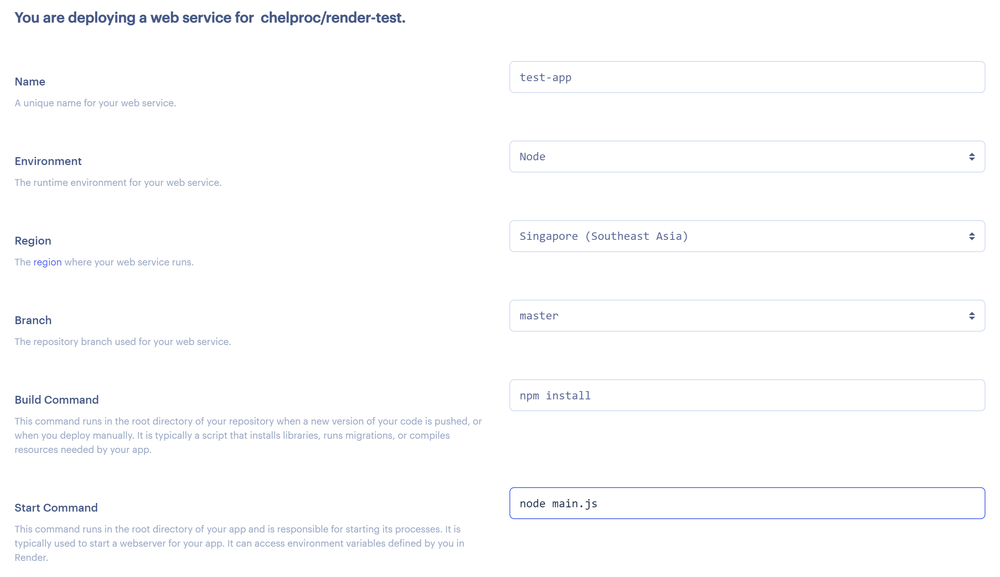

import CodeBlock from '@theme/CodeBlock';
import Term from "@site/src/components/Term";
import OpenInCodeSandbox from "@site/src/components/OpenInCodeSandbox";

## Render へのデプロイ

Render で動的サイトをデプロイするには、ホーム画面から `Web Services` を選択しましょう。

静的サイトのときと同様にGitHubアカウントとレポジトリを選択します。

設定項目を入力します。ここではnode.jsの設定を行っています。

ステータスが `Live` になったら成功です！　この画面の `.onrender.com` のアドレスのサイトでアプリケーションが公開されています！静的サイトのときと同様にGirHubからも見ることができます！

